# Control-Bereich Review: Offene Punkte und Empfehlungen

## Übersicht
Der Control-Bereich der MASCHINE MK3 bietet Zugriff auf alle Parameter des gewählten Modus und enthält fest zugeordnete Buttons für Browser, Arranger, Mixer, Sample-Editor, File, Settings, Auto, Macro sowie dynamische Softbuttons und Drehregler. Die Hardware-Logik und UI-Struktur sind in der Codebasis teilweise abgebildet, jedoch fehlen noch einige zentrale Funktionen und UI-Elemente.

---

## Fehlende Implementierungen & offene Punkte

### 1. Modus- und Control-Buttons
- **CHANNEL, PLUG-IN, ARRANGER, MIXER, BROWSER, SAMPLING, FILE, SETTINGS, AUTO, MACRO:**
  - Es fehlen dedizierte Komponenten/Buttons für diese Funktionen im Control-Bereich.
  - SHIFT-Funktionen (z.B. SHIFT+CHANNEL für MIDI, SHIFT+PLUG-IN für Instance) sind nicht als UI-Elemente oder Logik abgebildet.
  - Die Zuordnung und das visuelle Layout dieser Buttons gemäß Hardware-Referenz sind nicht vollständig umgesetzt.

### 2. Softbuttons & Displays
- **Softbuttons 1-8 über den Displays:**
  - Die dynamische Anpassung der Softbutton-Funktionen je nach Modus ist nicht vollständig implementiert.
  - Die Anzeige der jeweiligen Aktion unter jedem Button im Display fehlt.
  - Die Verbindung zwischen Softbuttons und den Displays (z.B. Anzeige der Parameter, dynamische Labels) ist nicht klar dokumentiert und technisch nicht vollständig umgesetzt.

### 3. Drehregler
- **Drehregler 1-8:**
  - Die Steuerung der im Display angezeigten Parameter über die Drehregler ist nicht als UI/Logik vorhanden.
  - Die Verbindung zwischen Regler und Parameter (z.B. Mapping, Value-Feedback) fehlt.

### 4. Page-Buttons
- **Page-Buttons:**
  - Die Funktion zum Wechseln von Parameter-Pages ist nicht als UI-Element oder Logik abgebildet.
  - Die Anzeige und Navigation zwischen Pages fehlt.

### 5. File- und Settings-Buttons
- **FILE, SETTINGS:**
  - Schnellzugriff auf Dateioperationen und Einstellungen (Metronom, Count-in) ist nicht als Button oder Panel vorhanden.
  - SHIFT-Funktionen (z.B. Save) fehlen.

### 6. Auto- und Macro-Buttons
- **AUTO, MACRO:**
  - Modulations- und Macro-Funktionen sind nicht als UI-Elemente oder Logik abgebildet.
  - SHIFT-Funktionen (z.B. Festsetzen, Macro-Set) fehlen.

### 7. Sampling-Button
- **SAMPLING:**
  - Der direkte Zugriff auf den Sample-Editor ist nicht als Button oder Panel vorhanden.

### 8. Browser-Button
- **BROWSER:**
  - Der Browser-Zugriff ist nicht als Button oder Panel implementiert.
  - SHIFT-Funktion für Plug-in-Menü fehlt.

### 9. Arranger- und Mixer-Button
- **ARRANGER, MIXER:**
  - Zugriff auf Arranger- und Mixer-Views ist nicht als Button oder Panel vorhanden.

### 10. Accessibility & Dokumentation
- **ARIA, Tabindex, Fokussteuerung:**
  - Für die neuen Control-Buttons und Panels müssen Accessibility-Attribute ergänzt werden.
- **Dokumentation:**
  - Die Zuordnung und Logik der Control-Buttons, Softbuttons und Drehregler muss in README.md und als Diagramm dokumentiert werden.

---

## Empfehlungen zur Fertigstellung der Control-Sektion
1. **Komponenten für alle Control-Buttons und deren SHIFT-Funktionen erstellen** (CHANNEL, PLUG-IN, ARRANGER, MIXER, BROWSER, SAMPLING, FILE, SETTINGS, AUTO, MACRO).
2. **Softbutton-Logik dynamisch an Modus koppeln** und Anzeige der jeweiligen Aktion im Display ergänzen.
3. **Drehregler-UI und Parameter-Mapping implementieren** (inkl. Value-Feedback im Display).
4. **Page-Button-Komponente und Page-Navigation ergänzen**.
5. **Panels für File, Settings, Sampling, Browser, Arranger, Mixer erstellen** und Buttons verknüpfen.
6. **Accessibility für alle neuen UI-Elemente sicherstellen**.
7. **README.md und Diagramm im diagrams-Ordner aktualisieren**: Hardware-Referenz, UI-Logik, Button-Zuordnung, Regler-Mapping.

---

## Schnellreferenz: MASCHINE MK3 Control-Bereich
- **Buttons:** CHANNEL, PLUG-IN, ARRANGER, MIXER, BROWSER, SAMPLING, FILE, SETTINGS, AUTO, MACRO, Softbuttons 1-8
- **Displays:** Anzeige von Parametern, dynamischen Labels, Value-Feedback
- **Drehregler:** Steuerung der Parameter im Display
- **Page-Buttons:** Navigation zwischen Parameter-Pages

---

**Fazit:**
Die Control-Sektion ist in der Codebasis noch nicht vollständig umgesetzt. Es fehlen zentrale UI-Komponenten, Logik für dynamische Softbuttons, Regler-Mapping, Page-Navigation und Panels für die wichtigsten Control-Funktionen. Die Hardware-Referenz und UI-Logik müssen in README.md und als Diagramm dokumentiert werden.

---

**Siehe MASCHINE MK3 Benutzerhandbuch S. 51–53 für vollständige Hardware-Referenz.**


Project Code Export
Date: Mon Jan 05 2026 22:32:12 GMT+0100 (Mitteleuropäische Normalzeit)
Exported Folder: Drumcomputer

Project Structure:
📁 Drumcomputer/
  📄 .DS_Store
  📄 .eslintignore
  📄 .eslintrc.cjs
  📁 .git/ (14 items)
    📄 ...
  📁 .github/
    📄 copilot-instructions.md
  📄 .gitignore
  📄 .gitignore 2
  📄 .mocharc.json
  📁 .nuxt/ (20 items)
    📄 ...
  📁 .output/
    📄 nitro.json
    📁 public/
      📄 .DS_Store
      📄 200.html
      📄 404.html
      📁 _nuxt/
        📄 8lhYhilz.js
        📄 BcY0Gv0j.js
        📄 COoUNM8i.js
        📄 DIH0URZr.js
        📁 builds/
          📄 latest.json
          📁 meta/
            📄 629ec0ae-23ae-4fb0-8373-e872df67a147.json
        📄 cGd0K_ah.js
        📄 default.BPHV4dOG.css
        📄 entry.CYGvhC7V.css
        📄 error-404.2GhCpCfF.css
        📄 error-500.DqdIhFrl.css
        📄 index.CPPe_DuI.css
        📄 ukUhDa61.js
      📄 index.html
      📁 samples/
        📄 clap.wav
        📄 hihat.wav
        📄 kick.wav
        📄 snare.wav
  📁 .vscode/ (1 items)
    📄 ...
  📄 Components.md
  📄 Composables.md
  📄 Domain.md
  📁 Flashpost-tests/
    📄 flashpost.db
    📄 flashpostCollections.db
    📄 flashpostCookies.db
    📄 flashpostHistory.db
    📄 flashpostUserPreference.db
    📄 flashpostVariable.db
  📄 LICENSE
  📄 README 2.md
  📄 README.md
  📄 ROADMAP.md
  📄 StepCell.md
  📄 StepGrid.md
  📄 alleDateien.md
  📄 app.vue
  📁 assets/ (2 items)
    📄 ...
  📁 audio/
    📁 engine/
      📁 play/
        📄 playStep.ts
      📄 stepResolver.ts
      📄 transportAudioHooks.ts
    📄 fxGraph.ts
  📁 components/
    📄 .DS_Store
    📄 DrumMachine.vue
    📄 FxPopup.vue
    📄 MidiPanel.vue
    📄 PadCell.vue
    📄 PadGrid 2.vue
    📄 PadGrid.vue
    📄 PlayheadOverlay.vue
    📄 SampleBrowser.vue
    📄 SoundbankManager.vue
    📄 StepCell.vue
    📄 StepGrid 2.vue
    📄 StepGrid.vue
    📄 SyncPanel.vue
    📄 TabPanel.vue
    📄 TransportBar 2.vue
    📄 TransportBar.vue
    📁 control/
      📄 DualDisplay.vue
      📄 SoftButtonStrip.vue
    📁 panels/
      📄 ChannelPanel.vue
      📄 ExportPanel.vue
      📄 FxPanel.vue
      📄 PatternsPanel.vue
      📄 SoundPanel.vue
    📁 placeholders/
      📄 DualDisplayPlaceholder.vue
      📄 FourDEncoderPlaceholder.vue
      📄 ModeColumnPlaceholder.vue
      📄 ScreenKnobRingPlaceholder.vue
      📄 SoftButtonStripPlaceholder.vue
      📄 TouchStripPlaceholder.vue
  📁 composables/
    📄 useAudioEngine.client 2.ts
    📄 useAudioEngine.client.ts
    📄 useAudioInput.client.ts
    📄 useCapabilities.client.ts
    📄 useImportExport.client 2.ts
    📄 useImportExport.client.ts
    📄 useMidi.client 2.ts
    📄 useMidi.client.ts
    📄 useMidiLearn.ts
    📄 usePatternStorage.client.ts
    📄 useScheduler.ts
    📄 useSequencer 2.ts
    📄 useSequencer.ts
    📄 useSoundbankStorage.client.ts
    📄 useSync.client 2.ts
    📄 useSync.client.ts
  📁 config/
    📄 pwa.ts
  📄 control-review.md
  📁 diagrams/
    📄 class-diagram.md
    📄 control-area-mapping.md
    📄 padgrid-modus-layout.md
    📄 persistence-and-audio.md
    📄 transport-engine.md
    📄 ui-sequencer.md
    📄 use-cases.md
  📁 dist/ (6 items)
    📄 ...
  📁 domain/
    📄 .DS_Store
    📁 clock/
      📄 renderClock.ts
      📄 scheduler.ts
    📄 midiMapping.ts
    📄 quantize.ts
    📄 timing.ts
    📁 transport/
      📄 audioHooks.ts
      📄 transportEngine.ts
      📄 types.ts
    📄 validators.ts
    📁 velocity/
      📄 velocityToGain.ts
    📄 velocity.ts
  📄 eslint.config.cjs
  📄 eslint.config.js
  📄 functionsList.json
  📁 iMac/
    📁 Repositories/
      📁 FullStackDeveloperCourse/
        📁 JavaScriptAdvanced/
          📁 CertificationProjects/
            📁 Drumcomputer/
              📁 node_modules/ (1 items)
                📄 ...
  📄 implementationPlan.json
  📁 layouts/
    📄 default.vue
  📄 maschinemk3.jpg
  📄 nimamk3.json
  📁 node_modules/ (754 items)
    📄 ...
  📄 nuxt.config.ts
  📄 package-lock.json
  📄 package.json
  📁 pages/
    📄 index.vue
  📁 plugins/
    📄 vuetify.client.ts
    📄 vuetify.ts
  📄 promptingAgentInstructions.json
  📁 public/
    📄 .DS_Store
    📁 samples/
      📄 clap.wav
      📄 hihat.wav
      📄 kick.wav
      📄 snare.wav
  📁 scripts/
    📄 dev.mjs
  📁 stores/
    📄 control.ts
    📄 patterns.ts
    📄 session.ts
    📄 soundbanks.ts
    📄 transport.ts
  📁 styles/
    📄 drum-machine.less
    📄 globals.less
    📄 variables.less
    📄 vuetify-overrides.less
  📁 tests/
    📁 componentTests/
      📄 PadCell.component.spec.ts
      📄 PadGrid.component.spec.ts
    📁 unitTests/
      📄 transportEngine.spec.ts
  📄 tsconfig.json
  📄 tsconfig.test.json
  📁 types/
    📄 audio.ts
    📄 drums.ts
    📄 file-saver.d.ts
    📄 midi.ts
    📄 persistence.ts
    📄 process.d.ts
    📄 render.ts
    📄 shims-vue.d.ts
    📄 sync.ts
    📄 time.ts
  📄 uiList.json
  📁 utils/
    📄 seededRandom.ts
    📄 zip.ts


=========================================
File: .eslintignore
=========================================

.nuxt
node_modules
.output
.dist
coverage


=========================================
File: .eslintrc.cjs
=========================================

module.exports = {
  root: true,
  env: {
    browser: true,
    es2021: true
  },
  extends: ['eslint:recommended', 'plugin:vue/vue3-recommended', 'plugin:@typescript-eslint/recommended'],
  parser: 'vue-eslint-parser',
  parserOptions: {
    parser: '@typescript-eslint/parser',
    ecmaVersion: 'latest',
    sourceType: 'module'
  },
  rules: {
    '@typescript-eslint/no-explicit-any': 'error'
  }
}


=========================================
File: .github/copilot-instructions.md
=========================================

# Copilot Instructions for Drumcomputer

## Projektüberblick
- Nuxt 4 Drumcomputer mit Vue 3 Options API, TypeScript (strict), Vuetify 3 (Pug + Less), Web Audio, Web MIDI und IndexedDB.
- Hauptkomponenten: PadGrid, PadCell, DrumMachine, TransportBar, FxPopup, Panels (Sound, FX, Patterns, Export).
- Audio-Engine: Lookahead-Scheduler, quantisierte Aufnahme, 16-Pad-Sequencer, FX-Chain (Filter/Drive/Reverb), deterministische Exporte mit Seed.
- Persistenz: Soundbanks, Patterns und Samples werden in IndexedDB gespeichert und beim Laden rehydriert.
- MIDI: Mapping, Clock (Master/Slave), WebMIDI-Capabilities, Sync-Panel.

## Wichtige Workflows
- **Entwicklung:**
  - `npm install` – Abhängigkeiten installieren
  - `npm run dev` – Entwicklungsserver starten
  - `npm run lint` – Linting
  - `npm run typecheck` – TypeScript-Checks
- **Port/HMR anpassen:**
  - Beispiel: `PORT=3001 HMR_PORT=24679 npm run dev`
- **Tests:**
  - Komponententests: `tests/componentTests/`
  - Unittests: `tests/unitTests/`
- **Export:**
  - Audio-Export via ExportPanel, deterministisch mit Seed und Metadaten (siehe `useImportExport` und `exportAudio`).

## Architektur & Patterns
- **Stores:** Pinia für Transport, Patterns, Session, Soundbanks (`stores/`)
- **Composables:** Audio, Scheduler, Sequencer, MIDI, Sync, Import/Export, Soundbank-Storage (`composables/`)
- **Domain-Logik:** Timing, Quantisierung, Velocity, Transport, Clock, FX (`domain/`)
- **Diagrams:** Architektur, Transport, UI, Persistenz (`diagrams/`)
- **Persistenz:** IndexedDB für Soundbanks/Samples/Patterns, LocalStorage für Patterns/Scenes (v2 Schema)
- **UI:** Responsive, 16-Pad-Grid, Transport, FX, Panels (Pattern, Export, Sound, FX)
- **Export:** Mixdown + Stems, Metadaten-Blob, deterministische Reproduktion via Seed

## Konventionen & Besonderheiten
- **AudioContext** ist die einzige Zeitquelle (auch für MIDI-Clock).
- **Undo/Redo:** 50 Schritte für Pattern/Scene-Edits, persistiert mit Auswahl.
- **Capability Gates:** UI zeigt WebMIDI/Audio-In-Support an.
- **Import/Export:** JSON/MIDI für Patterns, Soundbank-Manifest + Blobs, WAV-Export mit Metadaten.
- **Fehlende Komponenten:** StepGrid/StepCell sind nur als Markdown-Doku vorhanden, nicht im Build.
- **Panels:** Viele Panels existieren im Code, sind aber nicht immer im UI gemountet (siehe `pages/index.vue`).
- **Focus/Accessibility:** PadGrid/PadCell benötigen explizite Refs für Fokussteuerung.

## Beispiele & Referenzen
- **Audio-Engine:** `audio/engine/`, `audio/fxGraph.ts`, `audio/stepResolver.ts`
- **Stores:** `stores/`
- **Composables:** `composables/`
- **Panels:** `components/panels/`
- **Export:** `useImportExport`, `exportAudio`, ExportPanel
- **Diagrams:** `diagrams/`

## Hinweise für KI-Agenten
- Halte dich an die bestehenden Patterns und Strukturen.
- Prüfe, ob Komponenten im UI gemountet sind, bevor du UI-Änderungen vorschlägst.
- Beachte deterministische Exporte (Seed, Metadaten) und die zentrale Rolle von AudioContext.
- Dokumentiere neue Patterns/Workflows in der README oder als Kommentar im Code.


=========================================
File: .gitignore
=========================================

node_modules
.nitro
.nuxt
.env
.DS_Store
npm-debug.log*
pnpm-lock.yaml
yarn.lock
Components.md
Composables.md
Domain.md
alleDateien.md
StepCell.md
StepGrid.md
dist
ROADMAP.md
nimamk3.json
uiList.json
functionsList.json
maschinemk3.jpg


=========================================
File: .gitignore 2
=========================================

# Logs
logs
*.log
npm-debug.log*
yarn-debug.log*
yarn-error.log*
lerna-debug.log*

# Diagnostic reports (https://nodejs.org/api/report.html)
report.[0-9]*.[0-9]*.[0-9]*.[0-9]*.json

# Runtime data
pids
*.pid
*.seed
*.pid.lock

# Directory for instrumented libs generated by jscoverage/JSCover
lib-cov

# Coverage directory used by tools like istanbul
coverage
*.lcov

# nyc test coverage
.nyc_output

# Grunt intermediate storage (https://gruntjs.com/creating-plugins#storing-task-files)
.grunt

# Bower dependency directory (https://bower.io/)
bower_components

# node-waf configuration
.lock-wscript

# Compiled binary addons (https://nodejs.org/api/addons.html)
build/Release

# Dependency directories
node_modules/
jspm_packages/

# Snowpack dependency directory (https://snowpack.dev/)
web_modules/

# TypeScript cache
*.tsbuildinfo

# Optional npm cache directory
.npm

# Optional eslint cache
.eslintcache

# Optional stylelint cache
.stylelintcache

# Optional REPL history
.node_repl_history

# Output of 'npm pack'
*.tgz

# Yarn Integrity file
.yarn-integrity

# dotenv environment variable files
.env
.env.*
!.env.example

# parcel-bundler cache (https://parceljs.org/)
.cache
.parcel-cache

# Next.js build output
.next
out

# Nuxt.js build / generate output
.nuxt
dist

# Gatsby files
.cache/
# Comment in the public line in if your project uses Gatsby and not Next.js
# https://nextjs.org/blog/next-9-1#public-directory-support
# public

# vuepress build output
.vuepress/dist

# vuepress v2.x temp and cache directory
.temp
.cache

# Sveltekit cache directory
.svelte-kit/

# vitepress build output
**/.vitepress/dist

# vitepress cache directory
**/.vitepress/cache

# Docusaurus cache and generated files
.docusaurus

# Serverless directories
.serverless/

# FuseBox cache
.fusebox/

# DynamoDB Local files
.dynamodb/

# Firebase cache directory
.firebase/

# TernJS port file
.tern-port

# Stores VSCode versions used for testing VSCode extensions
.vscode-test

# yarn v3
.pnp.*
.yarn/*
!.yarn/patches
!.yarn/plugins
!.yarn/releases
!.yarn/sdks
!.yarn/versions

# Vite logs files
vite.config.js.timestamp-*
vite.config.ts.timestamp-*


=========================================
File: .mocharc.json
=========================================

{
  "timeout": 5000,
  "color": true,
  "extension": [
    "js"
  ]
}


=========================================
File: Components.md
=========================================

## SoundPanel.vue
```vue
<template>
  <div class="sound-panel">
    <slot />
  </div>
</template>

<script lang="ts">
import { defineComponent } from 'vue'

export default defineComponent({
  name: 'SoundPanel'
})
</script>

<style scoped>
.sound-panel {
  background: #222;
  padding: 16px;
  border-radius: 8px;
  min-height: 100px;
}
</style>
```
## PatternsPanel.vue
```vue
<template>
  <div class="patterns-panel">
    <slot />
  </div>
</template>

<script lang="ts">
import { defineComponent } from 'vue'

export default defineComponent({
  name: 'PatternsPanel'
})
</script>

<style scoped>
.patterns-panel {
  background: #222;
  padding: 16px;
  border-radius: 8px;
  min-height: 100px;
}
</style>
```
## FxPanel.vue
```vue
<template>
  <div class="fx-panel">
    <slot />
  </div>
</template>

<script lang="ts">
import { defineComponent } from 'vue'

export default defineComponent({
  name: 'FxPanel'
})
</script>

<style scoped>
.fx-panel {
  background: #222;
  padding: 16px;
  border-radius: 8px;
  min-height: 100px;
}
</style>
```
## ExportPanel.vue
```vue
<template>
  <div class="export-panel">
    <button @click="$emit('export')">Exportieren</button>
    <slot />
  </div>
</template>

<script lang="ts">
import { defineComponent } from 'vue'

export default defineComponent({
  name: 'ExportPanel',
  emits: ['export']
})
</script>

<style scoped>
.export-panel {
  display: flex;
  flex-direction: column;
  align-items: flex-start;
  gap: 8px;
  background: #222;
  padding: 16px;
  border-radius: 8px;
}
.export-panel button {
  background: #444;
  color: #fff;
  border: none;
  border-radius: 4px;
  padding: 8px 12px;
  cursor: pointer;
  font-size: 1em;
  transition: background 0.1s;
}
.export-panel button:hover {
  background: #ff9800;
}
</style>
```
## TransportBar.vue
```vue
<template>
  <div class="transport-bar">
    <button @click="$emit('play')">Play</button>
    <button @click="$emit('stop')">Stop</button>
    <button @click="$emit('record')">Record</button>
    <slot />
  </div>
</template>

<script lang="ts">
import { defineComponent } from 'vue'

export default defineComponent({
  name: 'TransportBar',
  emits: ['play', 'stop', 'record']
})
</script>

<style scoped>
.transport-bar {
  display: flex;
  align-items: center;
  gap: 8px;
  background: #222;
  padding: 8px 16px;
  border-radius: 8px;
}
.transport-bar button {
  background: #444;
  color: #fff;
  border: none;
  border-radius: 4px;
  padding: 8px 12px;
  cursor: pointer;
  font-size: 1em;
  transition: background 0.1s;
}
.transport-bar button:hover {
  background: #ff9800;
}
</style>
```
## TabPanel.vue
```vue
<template>
  <div class="tab-panel">
    <div class="tab-bar">
      <button
        v-for="(tab, idx) in tabs"
        :key="tab.key"
        :class="{ active: tab.key === activeTab }"
        @click="$emit('update:activeTab', tab.key)"
      >
        {{ tab.label }}
      </button>
    </div>
    <div class="tab-content">
      <slot :name="activeTab" />
    </div>
  </div>
</template>

<script lang="ts">
import { defineComponent } from 'vue'

export default defineComponent({
  name: 'TabPanel',
  props: {
    tabs: {
      type: Array,
      required: true
    },
    activeTab: {
      type: String,
      required: true
    }
  },
  emits: ['update:activeTab']
})
</script>

<style scoped>
.tab-panel {
  display: flex;
  flex-direction: column;
  width: 100%;
  height: 100%;
}
.tab-bar {
  display: flex;
  border-bottom: 1px solid #444;
}
.tab-bar button {
  background: none;
  border: none;
  color: #fff;
  padding: 8px 16px;
  cursor: pointer;
  font-size: 1em;
  outline: none;
  transition: background 0.1s;
}
.tab-bar button.active {
  background: #222;
  border-bottom: 2px solid #ff9800;
}
.tab-content {
  flex: 1;
  padding: 16px;
  background: #222;
}
</style>
```
## StepGrid.vue
```vue
<template>
  <div class="step-grid">
    <StepCell
      v-for="(step, idx) in steps"
      :key="idx"
      :active="step.active"
      :selected="step.selected"
      :playing="step.playing"
      :label="step.label"
      @click="$emit('stepClick', idx)"
      @mousedown="$emit('stepMousedown', idx)"
      @mouseup="$emit('stepMouseup', idx)"
      @mouseenter="$emit('stepMouseenter', idx)"
      @mouseleave="$emit('stepMouseleave', idx)"
    >
      {{ step.label }}
    </StepCell>
  </div>
</template>

<script lang="ts">
import { defineComponent } from 'vue'
import StepCell from './StepCell.vue'

export default defineComponent({
  name: 'StepGrid',
  components: { StepCell },
  props: {
    steps: {
      type: Array,
      required: true
    }
  },
  emits: [
    'stepClick',
    'stepMousedown',
    'stepMouseup',
    'stepMouseenter',
    'stepMouseleave'
  ]
})
</script>

<style scoped>
.step-grid {
  display: grid;
  grid-template-columns: repeat(16, 1fr);
  gap: 2px;
  width: 100%;
  height: 100%;
}
</style>
```
## StepCell.vue
```vue
<template>
  <div
    class="step-cell"
    :class="{ active, selected, playing }"
    @click="$emit('click')"
    @mousedown="$emit('mousedown')"
    @mouseup="$emit('mouseup')"
    @mouseenter="$emit('mouseenter')"
    @mouseleave="$emit('mouseleave')"
    tabindex="0"
    :aria-label="label"
  >
    <slot />
  </div>
</template>

<script lang="ts">
import { defineComponent } from 'vue'

export default defineComponent({
  name: 'StepCell',
  props: {
    active: Boolean,
    selected: Boolean,
    playing: Boolean,
    label: String
  },
  emits: ['click', 'mousedown', 'mouseup', 'mouseenter', 'mouseleave']
})
</script>

<style scoped>
.step-cell {
  width: 100%;
  height: 100%;
  display: flex;
  align-items: center;
  justify-content: center;
  border-radius: 4px;
  background: #333;
  color: #fff;
  cursor: pointer;
  user-select: none;
  outline: none;
  transition: background 0.1s;
}
.step-cell.active {
  background: #ff9800;
}
.step-cell.selected {
  border: 2px solid #fff;
}
.step-cell.playing {
  background: #4caf50;
}
</style>
```
## PlayheadOverlay.vue
```vue
<template>
  <div class="playhead-overlay" :style="overlayStyle">
    <div class="playhead" :style="playheadStyle"></div>
  </div>
</template>

<script lang="ts">
import { defineComponent } from 'vue'

export default defineComponent({
  name: 'PlayheadOverlay',
  props: {
    position: {
      type: Number,
      required: true
    },
    total: {
      type: Number,
      required: true
    }
  },
  computed: {
    overlayStyle(): Record<string, string> {
      return {
        position: 'absolute',
        top: '0',
        left: '0',
        width: '100%',
        height: '100%',
        pointerEvents: 'none'
      }
    },
    playheadStyle(): Record<string, string> {
      const percent = (this.position / this.total) * 100
      return {
        position: 'absolute',
        top: '0',
        left: percent + '%',
        width: '2px',
        height: '100%',
        background: '#ff9800',
        zIndex: '2'
      }
    }
  }
})
</script>

<style scoped>
.playhead-overlay {
  position: absolute;
  top: 0;
  left: 0;
  width: 100%;
  height: 100%;
  pointer-events: none;
}
.playhead {
  position: absolute;
  top: 0;
  width: 2px;
  height: 100%;
  background: #ff9800;
  z-index: 2;
}
</style>
```
## PadGrid.vue
```vue
<template>
  <div class="pad-grid">
    <PadCell
      v-for="(pad, idx) in pads"
      :key="pad.id"
      :active="pad.active"
      :triggered="pad.triggered"
      :playing="pad.playing"
      :label="pad.label"
      @padDown="$emit('padDown', pad.id)"
      @padUp="$emit('padUp', pad.id)"
    >
      {{ pad.label }}
    </PadCell>
  </div>
</template>

<script lang="ts">
import { defineComponent } from 'vue'
import PadCell from './PadCell.vue'

export default defineComponent({
  name: 'PadGrid',
  components: { PadCell },
  props: {
    pads: {
      type: Array,
      required: true
    }
  },
  emits: ['padDown', 'padUp']
})
</script>

<style scoped>
.pad-grid {
  display: grid;
  grid-template-columns: repeat(4, 1fr);
  grid-template-rows: repeat(4, 1fr);
  gap: 8px;
  width: 100%;
  height: 100%;
}
</style>
```
## PadCell.vue
```vue
<template>
  <div
    class="pad-cell"
    :class="{ active, triggered, playing }"
    @mousedown="onPadDown"
    @mouseup="onPadUp"
    @mouseleave="onPadUp"
    @touchstart.prevent="onPadDown"
    @touchend.prevent="onPadUp"
    @keydown.space.prevent="onPadDown"
    @keyup.space.prevent="onPadUp"
    tabindex="0"
    :aria-label="label"
  >
    <slot />
  </div>
</template>

<script lang="ts">
import { defineComponent } from 'vue'

export default defineComponent({
  name: 'PadCell',
  props: {
    active: Boolean,
    triggered: Boolean,
    playing: Boolean,
    label: String
  },
  emits: ['padDown', 'padUp'],
  methods: {
    onPadDown() {
      this.$emit('padDown')
    },
    onPadUp() {
      this.$emit('padUp')
    }
  }
})
</script>

<style scoped>
.pad-cell {
  width: 100%;
  height: 100%;
  display: flex;
  align-items: center;
  justify-content: center;
  border-radius: 8px;
  background: #222;
  color: #fff;
  cursor: pointer;
  user-select: none;
  outline: none;
  transition: background 0.1s;
}
.pad-cell.active {
  background: #444;
}
.pad-cell.triggered {
  background: #ff9800;
}
.pad-cell.playing {
  background: #4caf50;
}
</style>
```
## FxPopup.vue
```vue
<template>
  <div class="fx-popup" v-if="visible">
    <slot />
  </div>
</template>

<script lang="ts">
import { defineComponent } from 'vue'

export default defineComponent({
  name: 'FxPopup',
  props: {
    visible: {
      type: Boolean,
      required: true
    }
  }
})
</script>

<style scoped>
.fx-popup {
  position: absolute;
  top: 0;
  left: 0;
  width: 100vw;
  height: 100vh;
  background: rgba(0, 0, 0, 0.5);
  display: flex;
  align-items: center;
  justify-content: center;
  z-index: 1000;
}
</style>
```
# Komponenten

## DrumMachine.vue
```vue
<template>
  <slot
    name="main"
    :props="mainSlotProps"
  />
  <slot
    name="transport"
    :props="transportSlotProps"
  />
  <slot
    name="pads"
    :props="padsSlotProps"
  />
  <slot
    name="drawer"
    :props="drawerSlotProps"
  />
</template>

<script lang="ts">
import { defineComponent } from 'vue'
import { saveAs } from 'file-saver'
import { DEFAULT_GRID_SPEC, GRID_DIVISIONS, normalizeGridSpec } from '@/domain/timing'
import { useTransportStore } from '@/stores/transport'
import { usePatternsStore } from '@/stores/patterns'
import { useSoundbanksStore } from '@/stores/soundbanks'
import { useSessionStore } from '@/stores/session'
import { useSequencer } from '@/composables/useSequencer'
import { useSync } from '@/composables/useSync.client'
import { useMidi } from '@/composables/useMidi.client'
import { usePatternStorage } from '@/composables/usePatternStorage.client'
import { useSoundbankStorage } from '@/composables/useSoundbankStorage.client'
import { useImportExport } from '@/composables/useImportExport.client'
import { useCapabilities } from '@/composables/useCapabilities.client'
import { useMidiLearn } from '@/composables/useMidiLearn'
import TransportBar from './TransportBar.vue'
import PadGrid from './PadGrid.vue'
import StepGridComponent from './StepGrid.vue'
import TabPanel from './TabPanel.vue'
import SoundPanel from './panels/SoundPanel.vue'
import FxPanel from './panels/FxPanel.vue'
import PatternsPanel from './panels/PatternsPanel.vue'
import ExportPanel from './panels/ExportPanel.vue'
import { createZip, type ZipEntry } from '@/utils/zip'
import type { DrumPadId, Scene } from '@/types/drums'
import type { TimeDivision, GridSpec } from '@/types/time'
import type { FxSettings, SampleRef, Soundbank } from '@/types/audio'
import type { RenderEvent, RenderMetadata } from '@/types/render'
import type { StepGrid } from '@/types/drums'

const slugify = (value: string): string => {
  const cleaned = value
    .trim()
    .toLowerCase()
    .replace(/[^a-z0-9]+/g, '_')
    .replace(/^_+|_+$/g, '')
  return cleaned || 'drum-session'
}

type StemFiles = Partial<
  Record<
    DrumPadId,
    {
      fileName: string
      blob: Blob
    }
  >
>

type StemEntry = {
  padId: DrumPadId
  label: string
  fileName: string
}

type PadState = {
  label: string
  isTriggered: boolean
  isPlaying: boolean
}

const VISIBLE_DIVISIONS: TimeDivision[] = GRID_DIVISIONS.filter((value) => value <= 16)

const collectPlayingPads = (steps: StepGrid): Set<DrumPadId> => {
  const set = new Set<DrumPadId>()

  Object.values(steps).forEach((bar) => {
    Object.values(bar).forEach((step) => {
      Object.keys(step).forEach((padId) => {
        set.add(padId as DrumPadId)
      })
    })
  })

  return set
}

export default defineComponent({
  name: 'DrumMachine',
  components: {
    TransportBar,
    PadGrid,
    StepGrid: StepGridComponent,
    TabPanel,
    SoundPanel,
    FxPanel,
    PatternsPanel,
    ExportPanel
  },
  data() {
    const transport = useTransportStore()
    const patterns = usePatternsStore()
    const soundbanks = useSoundbanksStore()
    const session = useSessionStore()
    const capabilitiesProbe = useCapabilities()
    session.setCapabilities(capabilitiesProbe.capabilities.value)

    const importExport = useImportExport()
    const midi = useMidi()
    const midiLearn = useMidiLearn(midi)
    const sequencer = useSequencer({
      getPattern: () => patterns.currentPattern,
      onPatternBoundary: () => patterns.advanceScenePlayback()
    })
    const handleExternalStart = () => {
      if (!transport.isPlaying) {
        patterns.prepareScenePlayback()
        void sequencer.start().catch((error) => {
          console.error('Failed to start sequencer from external sync', error)
        })
      }
    }
    const handleExternalStop = () => {
      if (transport.isPlaying) {
        sequencer.stop()
      }
    }
    const sync = useSync('internal', {
      midi,
      getAudioTime: () => sequencer.getAudioTime(),
      onExternalStart: handleExternalStart,
      onExternalStop: handleExternalStop
    })
    const patternStorage = usePatternStorage()
    const soundbankStorage = useSoundbankStorage()

    const pads: DrumPadId[] = [
      'pad1',
      'pad2',
      'pad3',
      'pad4',
      'pad5',
      'pad6',
      'pad7',
      'pad8',
      'pad9',
      'pad10',
      'pad11',
      'pad12',
      'pad13',
      'pad14',
      'pad15',
      'pad16'
    ]
    const divisions: TimeDivision[] = [...VISIBLE_DIVISIONS]
    const defaultBank: Soundbank = {
      id: 'default-kit',
      name: 'Default Kit',
      createdAt: Date.now(),
      updatedAt: Date.now(),
      pads: {
        pad1: { id: 'kick', name: 'Kick', url: '/samples/kick.wav', format: 'wav' },
        pad5: { id: 'kick-2', name: 'Kick 2', url: '/samples/kick.wav', format: 'wav' },
        pad9: { id: 'kick-3', name: 'Kick 3', url: '/samples/kick.wav', format: 'wav' },
        pad13: { id: 'kick-4', name: 'Kick 4', url: '/samples/kick.wav', format: 'wav' },
        pad2: { id: 'snare', name: 'Snare', url: '/samples/snare.wav', format: 'wav' },
        pad6: { id: 'snare-2', name: 'Snare 2', url: '/samples/snare.wav', format: 'wav' },
        pad10: { id: 'snare-3', name: 'Snare 3', url: '/samples/snare.wav', format: 'wav' },
        pad14: { id: 'snare-4', name: 'Snare 4', url: '/samples/snare.wav', format: 'wav' },
        pad3: { id: 'hihat', name: 'Hi-Hat', url: '/samples/hihat.wav', format: 'wav' },
        pad7: { id: 'hihat-2', name: 'Hi-Hat 2', url: '/samples/hihat.wav', format: 'wav' },
        pad11: { id: 'hihat-3', name: 'Hi-Hat 3', url: '/samples/hihat.wav', format: 'wav' },
        pad15: { id: 'hihat-4', name: 'Hi-Hat 4', url: '/samples/hihat.wav', format: 'wav' },
        pad4: { id: 'clap', name: 'Clap', url: '/samples/clap.wav', format: 'wav' },
        pad8: { id: 'clap-2', name: 'Clap 2', url: '/samples/clap.wav', format: 'wav' },
        pad12: { id: 'clap-3', name: 'Clap 3', url: '/samples/clap.wav', format: 'wav' },
        pad16: { id: 'clap-4', name: 'Clap 4', url: '/samples/clap.wav', format: 'wav' }
      }
    }

    if (soundbanks.banks.length === 0) {
      soundbanks.setBanks([defaultBank])
    }

    return {
      transport,
      patterns,
      soundbanks,
      session,
      sequencer,
      sync,
      midi,
      midiLearn,
      patternStorage,
      soundbankStorage,
      pads,
      divisions,
      defaultBank,
      unwatchers: [] as Array<() => void>,
      stepGridRef: null as (InstanceType<typeof StepGridComponent> & { focusGrid?: () => void }) | null,
      exportMetadata: null as RenderMetadata | null,
      exportAudioBlob: null as Blob | null,
      exportTimeline: undefined as RenderEvent[] | undefined,
      exportStems: null as StemFiles | null,
      isExporting: false,
      exportError: null as string | null,
      exportAudioFn: importExport.exportAudio,
      selectedPadId: 'pad1' as DrumPadId,
      drawerTab: 'sound'
    }
  },
  // ...restlicher Code siehe Datei DrumMachine.vue ...
</script>
```

## DrumMachineSlots.vue
```vue
<template>
  <div class="drum-machine-slots">
    <slot name="transport" />
    <slot name="pads" />
    <slot name="drawer" />
  </div>
</template>

<script lang="ts">
import { defineComponent } from 'vue'

export default defineComponent({
  name: 'DrumMachineSlots'
})
</script>

<style scoped>
.drum-machine-slots {
  display: flex;
  flex-direction: column;
  height: 100%;
}
</style>
```


=========================================
File: Composables.md
=========================================

# Composables

## useAudioEngine.client.ts
```typescript
import { onBeforeUnmount, ref } from 'vue'
import type { DrumPadId } from '@/types/drums'
import type { FxSettings, SampleRef, Soundbank } from '@/types/audio'
import { createSeededRandom, type RandomSource } from '@/utils/seededRandom'
import { createFxGraph, connectFxGraph, updateFxGraph, type FxGraphNodes } from '@/audio/fxGraph'

interface TriggerRequest {
	padId: DrumPadId
	when: number
	velocity?: number
}

const cloneFxSettings = (settings: FxSettings): FxSettings => ({
	filter: { ...settings.filter },
	drive: { ...settings.drive },
	reverb: { ...settings.reverb }
})

const createAudioEngineInstance = () => {
	const audioContext = ref<AudioContext | null>(null)
	const masterGain = ref<GainNode | null>(null)
	const sampleCache = ref<Map<DrumPadId, AudioBuffer>>(new Map())
	const fxSettings = ref<FxSettings>({
		filter: { enabled: true, frequency: 12000, q: 0.7 },
		drive: { enabled: false, amount: 0.25 },
		reverb: { enabled: false, mix: 0.15 }
	})
	const fxSnapshot = ref<FxSettings>(cloneFxSettings(fxSettings.value))
	const fxGraph = ref<FxGraphNodes | null>(null)
	let randomSource: RandomSource = createSeededRandom(0)
	let wasRunningOnHide = false
	let handlePageHide: (() => void) | null = null
	let handlePageShow: (() => void) | null = null

	const syncFxSnapshot = () => {
		fxSnapshot.value = cloneFxSettings(fxSettings.value)
		return fxSnapshot.value
	}

	const ensureFxGraph = (ctx: BaseAudioContext, snapshot: FxSettings) => {
		if (!masterGain.value) {
			return
		}
		if (!fxGraph.value) {
			fxGraph.value = createFxGraph(ctx)
			connectFxGraph(fxGraph.value, masterGain.value)
		}
		updateFxGraph(ctx, fxGraph.value, snapshot, randomSource)
	}

	const ensureContext = () => {
		if (!audioContext.value) {
			const context = new AudioContext()
			const gain = context.createGain()
			gain.gain.value = 0.8
			gain.connect(context.destination)
			audioContext.value = context
			masterGain.value = gain
		}
		ensureFxGraph(audioContext.value as BaseAudioContext, fxSnapshot.value)
		return audioContext.value as AudioContext
	}

	const resumeContext = async () => {
		const ctx = ensureContext()
		if (ctx.state === 'suspended') {
			await ctx.resume()
		}
		return ctx
	}

	const getFxSnapshot = () => cloneFxSettings(fxSnapshot.value)

	const setFxRandomSource = (source: RandomSource) => {
		randomSource = source
		if (fxGraph.value?.reverbNode) {
			fxGraph.value.reverbNode.buffer = null
		}
		if (audioContext.value) {
			ensureFxGraph(audioContext.value, fxSnapshot.value)
		}
	}

	const decodeSample = async (sample: SampleRef): Promise<AudioBuffer | null> => {
		const ctx = ensureContext()
		if (sample.buffer) {
			return sample.buffer
		}
		if (sample.blob) {
			const arrayBuffer = await sample.blob.arrayBuffer()
			return ctx.decodeAudioData(arrayBuffer.slice(0))
		}
		if (sample.url) {
			const response = await fetch(sample.url)
			const arrayBuffer = await response.arrayBuffer()
			return ctx.decodeAudioData(arrayBuffer)
		}
		return null
	}

	const setSampleForPad = async (padId: DrumPadId, sample: SampleRef) => {
		const buffer = sample.buffer ?? (await decodeSample(sample))
		if (buffer) {
			sampleCache.value.set(padId, buffer)
		}
	}

	const applySoundbank = async (bank: Soundbank) => {
		const entries = Object.entries(bank.pads)
		await Promise.all(
			entries.map(async ([padId, sample]) => {
				if (sample) {
					await setSampleForPad(padId as DrumPadId, sample)
				}
			})
		)
	}

	const setFx = (partial: Partial<FxSettings>) => {
		fxSettings.value = {
			filter: { ...fxSettings.value.filter, ...(partial.filter ?? {}) },
			drive: { ...fxSettings.value.drive, ...(partial.drive ?? {}) },
			reverb: { ...fxSettings.value.reverb, ...(partial.reverb ?? {}) }
		}
		const snapshot = syncFxSnapshot()
		const ctx = ensureContext()
		ensureFxGraph(ctx, snapshot)
	}

	const trigger = async ({ padId, when, velocity = 1 }: TriggerRequest) => {
		const ctx = ensureContext()
		const buffer = sampleCache.value.get(padId) ?? null
		if (!buffer) {
			return
		}
		const source = ctx.createBufferSource()
		source.buffer = buffer
		const gain = ctx.createGain()
		gain.gain.value = velocity
		source.connect(gain)
		if (fxGraph.value) {
			gain.connect(fxGraph.value.fxInput)
		} else {
			gain.connect(masterGain.value ?? ctx.destination)
		}
		source.start(when)
	}

	if (typeof window !== 'undefined') {
		handlePageHide = () => {
			if (audioContext.value) {
				wasRunningOnHide = audioContext.value.state === 'running'
				void audioContext.value.suspend().catch(() => undefined)
			}
		}

		handlePageShow = () => {
			if (wasRunningOnHide && audioContext.value) {
				void audioContext.value.resume().catch(() => undefined)
			}
			wasRunningOnHide = false
		}

		window.addEventListener('pagehide', handlePageHide)
		window.addEventListener('pageshow', handlePageShow)
	}

	onBeforeUnmount(() => {
		if (handlePageHide) {
			window.removeEventListener('pagehide', handlePageHide)
		}
		if (handlePageShow) {
			window.removeEventListener('pageshow', handlePageShow)
		}
		audioContext.value?.close()
		sampleCache.value.clear()
	})

	return {
		audioContext,
		masterGain,
		sampleCache,
		fxSettings,
		ensureContext,
		resumeContext,
		decodeSample,
		applySoundbank,
		setFx,
		setSampleForPad,
		trigger,
		getFxSnapshot,
		setFxRandomSource
	}
}

let audioEngineInstance: ReturnType<typeof createAudioEngineInstance> | null = null

export function useAudioEngine() {
	if (!audioEngineInstance) {
		audioEngineInstance = createAudioEngineInstance()
	}
	return audioEngineInstance
}

```

## useAudioInput.client.ts
```typescript
import { onBeforeUnmount, ref } from 'vue'

export interface AudioInputState {
	stream?: MediaStream
	error?: string
}

export function useAudioInput() {
	const state = ref<AudioInputState>({})
	const sourceNode = ref<MediaStreamAudioSourceNode | null>(null)
	const audioContext = ref<AudioContext | null>(null)
	let handlePageHide: (() => void) | null = null

	const requestMic = async () => {
		try {
			const stream = await navigator.mediaDevices.getUserMedia({ audio: true })
			const context = new AudioContext()
			sourceNode.value = context.createMediaStreamSource(stream)
			audioContext.value = context
			state.value = { stream }
		} catch (error) {
			const message = error instanceof Error ? error.message : 'microphone request failed'
			state.value = { error: message }
		}
	}

	const stop = () => {
		state.value.stream?.getTracks().forEach((track) => track.stop())
		void audioContext.value?.close()
		audioContext.value = null
		state.value = {}
	}

	if (typeof window !== 'undefined') {
		handlePageHide = () => {
			stop()
			sourceNode.value = null
		}
		window.addEventListener('pagehide', handlePageHide)
	}

	onBeforeUnmount(() => {
		if (handlePageHide) {
			window.removeEventListener('pagehide', handlePageHide)
		}
		stop()
		sourceNode.value = null
	})

	return {
		state,
		sourceNode,
		requestMic,
		stop
	}
}
```

## useCapabilities.client.ts
```typescript
import { ref } from 'vue'

export interface Capabilities {
	supportsWebMIDI: boolean
	supportsAudioInput: boolean
}

export function useCapabilities() {
	const capabilities = ref<Capabilities>({ supportsWebMIDI: false, supportsAudioInput: false })

	const evaluate = () => {
		capabilities.value = {
			supportsWebMIDI: typeof navigator !== 'undefined' && 'requestMIDIAccess' in navigator,
			supportsAudioInput: typeof navigator !== 'undefined' && Boolean(navigator.mediaDevices?.getUserMedia)
		}
	}

	evaluate()

	return {
		capabilities,
		evaluate
	}
}
```

## useImportExport.client.ts
```typescript
import { ref } from 'vue'
import { saveAs } from 'file-saver'
import { Midi as MidiType } from '@tonejs/midi'
import { defaultMidiMapping } from '@/domain/midiMapping'
import { DEFAULT_GRID_SPEC, normalizeGridSpec } from '@/domain/timing'
import { clampVelocity, DEFAULT_STEP_VELOCITY } from '@/domain/velocity'
import { createRenderClock } from '@/domain/clock/renderClock'
import { createFxGraph, connectFxGraph, updateFxGraph } from '@/audio/fxGraph'
import { useAudioEngine } from './useAudioEngine.client'
import { usePatternsStore } from '@/stores/patterns'
import { useTransportStore } from '@/stores/transport'
import { createSeededRandom } from '@/utils/seededRandom'
import type { ScheduledTask } from './useScheduler'
import { scheduleStep } from './useSequencer'
import type { ScheduleStepOptions, ScheduledStep } from './useSequencer'
import type { GridSpec } from '@/types/time'
import type { MidiFileData, MidiMapping } from '@/types/midi'
import type { SampleRef, Soundbank } from '@/types/audio'
import type { RenderMetadata, RenderEvent } from '@/types/render'
import type { DrumPadId, Pattern } from '@/types/drums'

// ...existing code...
```

## useMidi.client.ts
```typescript
import { onBeforeUnmount, ref } from 'vue'
import type { MidiDeviceInfo, MidiMapping, MidiMessage } from '@/types/midi'
import { defaultMidiMapping } from '@/domain/midiMapping'

// ...existing code...
```

## useMidiLearn.ts
```typescript
import { computed, onBeforeUnmount, ref } from 'vue'
import { defaultMidiMapping } from '@/domain/midiMapping'
import type { MidiMessage, MidiMapping } from '@/types/midi'
import type { DrumPadId } from '@/types/drums'

// ...existing code...
```

## usePatternStorage.client.ts
```typescript
import { ref } from 'vue'
import { DEFAULT_GRID_SPEC, normalizeGridSpec } from '@/domain/timing'
import type { Pattern, Scene } from '@/types/drums'

// ...existing code...
```

## useScheduler.ts
```typescript
import { onBeforeUnmount, ref } from 'vue'

// ...existing code...
```

## useSequencer.ts
```typescript
import { ref, type Ref } from 'vue'
import { quantizeToStep } from '@/domain/quantize'
import { normalizeGridSpec, secondsPerStep } from '@/domain/timing'
import type { DrumPadId, Pattern } from '@/types/drums'
import type { SampleRef, Soundbank } from '@/types/audio'
import type { GridSpec, StepAddress } from '@/types/time'
import { useTransportStore } from '@/stores/transport'
import { useScheduler, type ScheduledTask } from './useScheduler'
import { useAudioEngine } from './useAudioEngine.client'
import { clampVelocity, cycleVelocity, DEFAULT_STEP_VELOCITY } from '@/domain/velocity'
import { createRenderClock, type RenderClock } from '@/domain/clock/renderClock'

// ...existing code...
```

## useSoundbankStorage.client.ts
```typescript
import { ref } from 'vue'
import type { DrumPadId, Pattern } from '@/types/drums'
import type { Soundbank, SampleRef } from '@/types/audio'

// ...existing code...
```

## useSync.client.ts
```typescript
import { onBeforeUnmount, ref } from 'vue'
import { useScheduler } from './useScheduler'
import type { ClockAuthority, SyncMode, SyncRole, SyncState } from '@/types/sync'
import type { MidiMessage } from '@/types/midi'

// ...existing code...
```


=========================================
File: Domain.md
=========================================

# Domain

## midiMapping.ts
```typescript
import type { MidiMapping } from '@/types/midi'
import type { DrumPadId } from '@/types/drums'

const defaultPads: DrumPadId[] = [
	'pad1',
	'pad2',
	'pad3',
	'pad4',
	'pad5',
	'pad6',
	'pad7',
	'pad8',
	'pad9',
	'pad10',
	'pad11',
	'pad12',
	'pad13',
	'pad14',
	'pad15',
	'pad16'
]

export function defaultMidiMapping(): MidiMapping {
	const noteMap: Partial<Record<number, DrumPadId>> = {}
	const noteMapInverse: Partial<Record<DrumPadId, number>> = {}
	defaultPads.forEach((padId, index) => {
		const note = 36 + index
		noteMap[note] = padId
		noteMapInverse[padId] = note
	})
	return { noteMap, noteMapInverse, transportMap: {} }
}

```

## quantize.ts
```typescript
import type { StepAddress } from '@/types/time'

export function quantizeToStep(time: number, secondsPerStep: number, bars: number, division: number): StepAddress {
	const totalSteps = bars * division
	const stepIndex = Math.max(0, Math.min(totalSteps - 1, Math.round(time / secondsPerStep)))
	return {
		barIndex: Math.floor(stepIndex / division),
		stepInBar: stepIndex % division
	}
}

```

## timing.ts
```typescript
import type { GridSpec, TimeDivision } from '@/types/time'

export const GRID_DIVISIONS: readonly TimeDivision[] = [1, 2, 4, 8, 16, 32, 64] as const
export const DEFAULT_GRID_SPEC: GridSpec = { bars: 1, division: 16 }

export function secondsPerStep(bpm: number, division: number): number {
	return (60 / bpm) * (4 / division)
}

export function stepsPerBar(gridSpec: GridSpec): number {
	return gridSpec.division
}

export function normalizeGridSpec(gridSpec?: Partial<GridSpec>): GridSpec {
	const division = GRID_DIVISIONS.includes((gridSpec?.division ?? DEFAULT_GRID_SPEC.division) as TimeDivision)
		? (gridSpec?.division as TimeDivision)
		: DEFAULT_GRID_SPEC.division
	const bars: GridSpec['bars'] =
		gridSpec?.bars === 1 || gridSpec?.bars === 2 || gridSpec?.bars === 4 || gridSpec?.bars === 8
			? gridSpec.bars
			: DEFAULT_GRID_SPEC.bars

	return { bars, division }
}

```

## validators.ts
```typescript
import { GRID_DIVISIONS } from './timing'
import type { GridSpec } from '../types/time'

export function isValidGridSpec(gridSpec: GridSpec): boolean {
	return gridSpec.bars >= 1 && gridSpec.bars <= 8 && GRID_DIVISIONS.includes(gridSpec.division)
}

```

## velocity.ts
```typescript
export const STEP_VELOCITY_LEVELS = [0.7, 1, 1.25] as const
export const DEFAULT_STEP_VELOCITY = STEP_VELOCITY_LEVELS[0]
export const ACCENT_STEP_VELOCITY = STEP_VELOCITY_LEVELS[STEP_VELOCITY_LEVELS.length - 1]!

const EPSILON = 0.001

const matchesLevel = (value: number, level: number) => Math.abs(value - level) < EPSILON

export function clampVelocity(value?: number): number {
	const resolved = typeof value === 'number' ? value : DEFAULT_STEP_VELOCITY
	const clamped = Math.max(STEP_VELOCITY_LEVELS[0], Math.min(ACCENT_STEP_VELOCITY, resolved))
	const closest = STEP_VELOCITY_LEVELS.find((level) => matchesLevel(clamped, level))
	return closest ?? clamped
}

export function cycleVelocity(current?: number): number | null {
	if (typeof current !== 'number') {
		return DEFAULT_STEP_VELOCITY
	}
	const index = STEP_VELOCITY_LEVELS.findIndex((level) => matchesLevel(current, level))
	if (index === -1) {
		return DEFAULT_STEP_VELOCITY
	}
	const nextIndex = index + 1
	if (nextIndex >= STEP_VELOCITY_LEVELS.length) {
		return null
	}
	const nextValue = STEP_VELOCITY_LEVELS[nextIndex]
	if (typeof nextValue !== 'number') {
		return null
	}
	return nextValue
}

export function velocityToIntensity(value?: number): number {
	if (!value) return 0
	return Math.min(1, value / ACCENT_STEP_VELOCITY)
}

```

### clock/renderClock.ts
```typescript
export interface RenderClock {
	readonly ctx: BaseAudioContext

	/**
	 * Indicates whether the clock is used for offline rendering.
	 * Offline clocks must not rely on real-time scheduling.
	 */
	readonly isOffline: boolean

	/**
	 * Current audio time in seconds.
	 * This is always based on the underlying AudioContext.
	 */
	audioTime(): number

	/**
	 * Alias for audioTime(), for compatibility.
	 */
	now(): number
}

export function createRenderClock(


	ctx: BaseAudioContext,
	isOffline = false
): RenderClock {
	return {
		ctx,
		isOffline,
		audioTime: () => ctx.currentTime,
		now: () => ctx.currentTime
	}
}

```

### clock/scheduler.ts
```typescript
import type { RenderClock } from './renderClock'

export type ScheduledFn = (audioTime: number) => void

export interface SchedulerOptions {
	readonly lookaheadSec: number
	readonly intervalMs: number
}

export interface Scheduler {
	start(): void
	stop(): void
	schedule(atTimeSec: number, fn: ScheduledFn): void
	clear(): void
}

interface ScheduledItem {
	at: number
	fn: ScheduledFn
}

const DEFAULT_OPTIONS: SchedulerOptions = {
	lookaheadSec: 0.1,
	intervalMs: 25
}

export function createScheduler(clock: RenderClock, options: Partial<SchedulerOptions> = {}): Scheduler {
	const cfg: SchedulerOptions = { ...DEFAULT_OPTIONS, ...options }

	let timerId: ReturnType<typeof setInterval> | null = null
	let wasRunningOnHide = false
	let queue: ScheduledItem[] = []

	const flush = (): void => {
		const now = clock.audioTime()
		const horizon = now + cfg.lookaheadSec

		// Keep queue sorted to guarantee deterministic execution order
		queue.sort((a, b) => a.at - b.at)

		const due: ScheduledItem[] = []
		const pending: ScheduledItem[] = []

		for (const item of queue) {
			if (item.at <= horizon) {
				due.push(item)
			} else {
				pending.push(item)
			}
		}

		queue = pending

		// Execute all due items in order
		for (const item of due) {
			item.fn(item.at)
		}
	}

	const startTimer = (): void => {
		if (clock.isOffline) {
			// Offline rendering should call flush manually from the renderer/engine
			return
		}
		if (timerId) {
			return
		}
		timerId = setInterval(flush, cfg.intervalMs)
	}

	const stopTimer = (): void => {
		if (!timerId) {
			return
		}
		clearInterval(timerId)
		timerId = null
	}

	if (typeof window !== 'undefined') {
		const handlePageHide = () => {
			if (timerId) {
				wasRunningOnHide = true
				stopTimer()
			} else {
				wasRunningOnHide = false
			}
		}

		const handlePageShow = () => {
			if (wasRunningOnHide) {
				startTimer()
				flush()
			}
		}

		window.addEventListener('pagehide', handlePageHide)
		window.addEventListener('pageshow', handlePageShow)
	}

	return {
		start(): void {
			startTimer()
		},

		stop(): void {
			stopTimer()
		},

		schedule(atTimeSec: number, fn: ScheduledFn): void {
			queue.push({ at: atTimeSec, fn })
		},

		clear(): void {
			queue = []
		}
	}
}

```

### transport/audioHooks.ts
```typescript
export interface TransportAudioHooks {
	onStep(stepIndex: number, audioTime: number): void
}

```

### transport/transportEngine.ts
```typescript
import type { RenderClock } from '../clock/renderClock'
import type { Scheduler } from '../clock/scheduler'
import type { TransportConfig, TransportState } from './types'
import type { TransportAudioHooks } from './audioHooks'
export type TransportListener = (state: TransportState) => void

export interface TransportEngine {
	start(): void
	stop(): void
	setConfig(next: TransportConfig): void
	subscribe(listener: TransportListener): () => void
	tick(): void
}

const clampInt = (value: number): number => {
	if (!Number.isFinite(value)) {
		return 0
	}
	return Math.floor(value)
}


export function createTransportEngine(
	clock: RenderClock,
	scheduler: Scheduler,
	initial: TransportConfig,
	audioHooks?: TransportAudioHooks
	): TransportEngine {
		let cfg: TransportConfig = initial

		let isPlaying = false
		let startTimeSec = 0
		let lastStep = -1
		let lastAbsoluteStep = -1

		const listeners = new Set<TransportListener>()
		const stepDurationSec = (): number => {
		const stepsPerBar = Math.max(1, cfg.gridSpec.division)
		const beatsPerBar = 4
		const beatsPerStep = beatsPerBar / stepsPerBar
		const secPerBeat = 60 / Math.max(1, cfg.bpm)
		return beatsPerStep * secPerBeat
		}
  
		const totalSteps = (): number => {
			const steps = cfg.gridSpec.bars * cfg.gridSpec.division
			return Math.max(0, clampInt(steps))
		}

		const normalizeStep = (step: number): number => {
			const steps = Math.max(totalSteps(), 1)
			return ((step % steps) + steps) % steps
		}

		const swingOffsetSec = (stepIndex: number): number => {
		const swing = cfg.swing ?? 0
		if (swing <= 0) {
			return 0
		}

		// apply swing to off-beats only
		const isOffBeat = stepIndex % 2 === 1
		if (!isOffBeat) {
			return 0
		}

		return stepDurationSec() * swing * 0.5
	}

	const emit = (): void => {
		const steps = Math.max(totalSteps(), 1)
		const normalized = ((lastStep % steps) + steps) % steps

		const state: TransportState = {
			isPlaying,
			currentStep: normalized
		}

		for (const listener of listeners) {
			listener(state)
			}
		}
    
		const computeAbsoluteStepAt = (timeSec: number): number => {
			const dur = stepDurationSec()
			const raw = (timeSec - startTimeSec) / dur
			return clampInt(raw)
		}

		let lastScheduledStep = -1

		const scheduleStepBoundary = (stepIndexAbsolute: number): void => {
			if (stepIndexAbsolute === lastScheduledStep) {
				return
			}

			const normalizedStep = normalizeStep(stepIndexAbsolute)
			lastScheduledStep = stepIndexAbsolute

			const stepTimeSec =
				startTimeSec +
				stepIndexAbsolute * stepDurationSec() +
				swingOffsetSec(normalizedStep)

			scheduler.schedule(stepTimeSec, (audioTime) => {
				audioHooks?.onStep(normalizedStep, audioTime)
			})
		}


		const advance = (): void => {
			const now = clock.audioTime()
			const currentAbsolute = computeAbsoluteStepAt(now)
			const current = normalizeStep(currentAbsolute)

			if (current !== lastStep) {
				lastStep = current
				lastAbsoluteStep = currentAbsolute
				scheduleStepBoundary(lastAbsoluteStep + 1)
				emit()
			}
		}

	return {
		start(): void {
			if (isPlaying) {
				return
			}
			isPlaying = true
			startTimeSec = clock.audioTime()
			lastStep = -1
			lastAbsoluteStep = -1
			lastScheduledStep = -1
			scheduler.clear()
			scheduler.start()
			lastAbsoluteStep = computeAbsoluteStepAt(startTimeSec)
			lastStep = normalizeStep(lastAbsoluteStep)
			emit()
			scheduleStepBoundary(lastAbsoluteStep + 1)
		},

		stop(): void {
			if (!isPlaying) {
				return
			}
			isPlaying = false
			scheduler.stop()
			scheduler.clear()
			lastStep = -1
			lastScheduledStep = -1
			emit()
		},

		setConfig(next: TransportConfig): void {
			cfg = next
			// Re-normalize immediately
			if (isPlaying) {
				// Keep phase consistent by resetting start time to "now - currentStep * dur"
				const now = clock.audioTime()
				const dur = stepDurationSec()
				const steps = Math.max(totalSteps(), 1)
				const current = ((lastStep % steps) + steps) % steps
				startTimeSec = now - lastAbsoluteStep * dur - swingOffsetSec(current)
				scheduler.clear()
				lastScheduledStep = -1
				lastAbsoluteStep = computeAbsoluteStepAt(now)
				lastStep = normalizeStep(lastAbsoluteStep)
				scheduleStepBoundary(lastAbsoluteStep + 1)
			} else {
				lastScheduledStep = -1
			}
			emit()
		},

		subscribe(listener: TransportListener): () => void {
			listeners.add(listener)
			// emit current snapshot immediately
			listener({
				isPlaying,
				currentStep: Math.max(0, lastStep)
			})
			return (): void => {
				listeners.delete(listener)
			}
		},

		tick(): void {
			if (!isPlaying) {
				return
			}
			advance()
		}
	}
}

```

### transport/types.ts
```typescript
import type { DrumPadId } from '@/types/drums'
// Update the import path below to the correct relative path where GridSpec is defined
import type { GridSpec } from '@/types/time'
// Or adjust the path as needed based on your project structure

export interface TransportState {
	readonly isPlaying: boolean
	readonly currentStep: number
}

export type StepTogglePayload = {
	barIndex: number
	stepInBar: number
	padId: DrumPadId
}

export interface TransportConfig {
	readonly bpm: number
	readonly gridSpec: GridSpec
	swing?: number
}

```

### velocity/velocityToGain.ts
```typescript
export function velocityToGain(
	velocity: number,
	minGain = 0.15
): number {
	// velocity expected in [0, 1]
	const v = Math.max(0, Math.min(1, velocity))

	// psychoacoustic-friendly curve
	const curved = v * v

	return minGain + (1 - minGain) * curved
}

```


=========================================
File: LICENSE
=========================================

MIT License

Copyright (c) 2025 Markus Tratschitt

Permission is hereby granted, free of charge, to any person obtaining a copy
of this software and associated documentation files (the "Software"), to deal
in the Software without restriction, including without limitation the rights
to use, copy, modify, merge, publish, distribute, sublicense, and/or sell
copies of the Software, and to permit persons to whom the Software is
furnished to do so, subject to the following conditions:

The above copyright notice and this permission notice shall be included in all
copies or substantial portions of the Software.

THE SOFTWARE IS PROVIDED "AS IS", WITHOUT WARRANTY OF ANY KIND, EXPRESS OR
IMPLIED, INCLUDING BUT NOT LIMITED TO THE WARRANTIES OF MERCHANTABILITY,
FITNESS FOR A PARTICULAR PURPOSE AND NONINFRINGEMENT. IN NO EVENT SHALL THE
AUTHORS OR COPYRIGHT HOLDERS BE LIABLE FOR ANY CLAIM, DAMAGES OR OTHER
LIABILITY, WHETHER IN AN ACTION OF CONTRACT, TORT OR OTHERWISE, ARISING FROM,
OUT OF OR IN CONNECTION WITH THE SOFTWARE OR THE USE OR OTHER DEALINGS IN THE
SOFTWARE.


=========================================
File: README 2.md
=========================================

# Drumcomputer


=========================================
File: README.md
=========================================

# Drumcomputer

Nuxt 4 drum machine using Vue 3 Options API + TypeScript strict, Vuetify 3 (Pug + Less), Web Audio lookahead scheduling, Web MIDI capability checks, and IndexedDB stubs for soundbanks.


## Maschine MK3 UI Parity Plan (2026-01-04)

- **No-scroll full-screen shell**: Lock the hardware wrapper to `100vh` with inner flex grids only; push any overflow (sound/FX/pattern drawers) into internal scroll areas and clamp paddings/margins so a 1080p viewport fits without page scroll.
- **Layout map (placeholders first)**: Dual displays with 8 soft buttons on top, 8 screen knobs below, 4D encoder + master/volume knob cluster and nav buttons between displays, transport cluster bottom-left, left column for mode buttons (Scene/Pattern/Events/Variation/Duplicate/Select/Mute/Solo) plus Shift, right column for touch strip + pad mode buttons (Keyboard/Chord/Step/Note Repeat), 4×4 pads on the right, performance LEDs, and a small meter/pad bank indicator row.
- **Button symbols + hover hints**: Use consistent symbols and `title`/tooltip hints on every control. Proposed symbols: Play ▶, Stop ■, Rec ●, Restart ↻, Loop ⟳, Count-In ♩, Tap Tempo ☼, Metronome ♬, Follow ⇥, Pad Bank ◪, Duplicate ⧉, Select ☐, Mute 🔇, Solo ⚡, Scene ▤, Pattern ▦, Events ✱, Variation ≈, Keyboard ⌨, Chords ♫, Step ◫, Note Repeat ✺, Shift ⇧, 4D encoder arrows ↕↔, Touch Strip ≡.
- **Placeholder components to scaffold**: `DualDisplayPlaceholder` (dual LCD mock with soft-label text), `SoftButtonStripPlaceholder`, `ScreenKnobRingPlaceholder` (shows detents + hover hint), `FourDEncoderPlaceholder`, `TransportClusterPlaceholder`, `ModeColumnPlaceholder`, `TouchStripPlaceholder`, `PadBankIndicator`, `PerformanceMeterPlaceholder`, `OverlayHint` (hover helper for any element), and `DrawerPanelFrame` with fixed height for scroll containment.
- **Interaction & hover behavior**: Every element should expose a hover hint describing primary + shift-layer functions; knobs/buttons trigger placeholder overlays that can later be wired to real handlers. Touching/hovering a screen knob opens a selector overlay mock; encoder hover shows navigation arrows + confirm hint; transport buttons expose play/stop/reset semantics.
- **Sizing refactor plan**: Reduce outer gutters, use CSS `clamp()` for hardware widths/heights, pin pad square to max 640px with responsive shrink, align display + knob rows to match MK3 proportions, and keep drawers at a fixed height (e.g., 360px) with internal scroll so the main stage never scrolls.

## Setup

```bash
npm install
npm run dev
# QA
npm run lint
npm run typecheck
```

To override the dev or HMR port, prefix the command with the env vars you need:
```bash
PORT=3001 HMR_PORT=24679 npm run dev
```

## Use Cases

- Build and rehearse drum patterns live: tap pads, quantized record hits, and loop transport with velocity cycling and pad focus for performance.
- Arrange song ideas with scenes and pattern chains: switch patterns at bar boundaries and normalize grid specs when divisions change.
- Customize soundbanks: swap pad samples from local files, persist banks/patterns in IndexedDB/LocalStorage, and rehydrate blobs on load.
- Connect hardware: map pads and transport to MIDI notes, follow or drive MIDI clock, and probe WebMIDI/Audio input capabilities in the UI.
- Export mixes or stems: bounce the current scene chain to WAV/ZIP with deterministic FX seeds and optional per-pad stems for downstream DAWs.
- Normalize/import assets: round-trip patterns via JSON/MIDI, import/export soundbank manifests + blobs, and clamp malformed payloads.

## Features

- Lookahead Web Audio scheduler with AudioContext time, quantized live recording, and 16-pad grid sequencing.
- Default kit served from `public/samples` and auto-loaded into the audio engine; patterns persist via LocalStorage (v1 schema with normalization).
- Pinia stores for transport, patterns/scenes, session caps, and soundbanks; composables for audio, scheduler, sequencer, MIDI, sync, import/export, audio input, and IndexedDB soundbank storage (banks, samples, patterns).
- Client-only MIDI hooks with device selection, pad mapping, and MIDI clock support (master/slave) plus Ableton Link stub exposure via sync panel.
- Soundbank manager can select banks and replace pad samples (stored as blobs in IndexedDB) with lazy decoding; patterns also persisted per-bank in IDB.
- Configurable step grid divisions (1/2/4/8/16/32/64) with responsive layout for larger sequences and stable transport start/stop handling.
- Import/Export helpers for patterns, MIDI (@tonejs/midi), soundbank manifests + sample blobs, and WAV bounce via OfflineAudioContext.
- Scene chains with bar-boundary pattern switching, per-step velocity/accent cycling, and an FX chain (filter/drive/reverb) routed through the WebAudio graph.

## Control Area (MK3)

- Pinia store `stores/control.ts` owns modes, per-mode pages, soft buttons, encoder parameters, and display models; DrumMachine wires it without changing layout.
- Mode buttons fire primary and SHIFT secondary actions (e.g., CHANNEL→MIDI, PLUGIN→Instance, BROWSER→Plug-in menu, FILE→Save As, MACRO→Set). Page ◀/▶ steps through pages within the active mode.
- SoftButtonStrip renders 8 dynamic labels/tooltips per page and emits press events; display soft labels mirror the current soft buttons.
- DualDisplay renders contextual panels for Browser, File, Settings, Sampling, Mixer, Arranger, and info views; header shows mode + page.
- Encoders react to mousewheel on hover and arrow keys; SHIFT enables fine step. SHIFT hold is de-latched via global pointer/key listeners; knobs expose tabindex + aria-label.

## Analysis & Plan

- **Current gaps**: Pattern/scene editing UIs are not mounted on `pages/index.vue`; transport lacks full MK3 semantics; placeholder overlays for soft buttons/encoders/4D are not wired; accessibility coverage is partial.
- **To close parity**: Restore sequencer UI (StepGrid/StepCell) and mount Patterns/Export/TabPanel; bring transport to MK3 semantics (play/stop toggle, stop-reset, restart, count-in, tap tempo, follow/metronome controls, loop range adjust); add grid/loop UX and erase panels; surface channel/plug-in/macro/midi control modes with soft labels; wire selector overlays to 4D/soft buttons; ensure a11y labels and focus flows.

## Timing & Sync

- AudioContext is the sole clock authority; the lookahead scheduler, sequencer, and MIDI clock master all derive their timings from `AudioContext.currentTime`.
- A small `RenderClock` wrapper now feeds every scheduler/step planner from the shared `scheduleStep` helper so live playback and future offline renders can work off the same time basis.
- MIDI clock output follows the audio clock (scheduled via the lookahead worker); incoming MIDI clock only drives phase counters/start-stop follow and never retimes audio events.
- BPM updates are clamped and restored on sync mode/role changes to prevent drift when switching between internal and MIDI clock roles; transport BPM remains the master source.

## Workflow & UX

- Undo/redo history for pattern + scene edits (50 steps), persisted alongside scenes/pattern selection.
- Capability gates surface WebMIDI/Audio In support status directly in the UI.
- Importers normalize grid specs/velocities and soundbank manifests to handle malformed payloads more gracefully.

## Layout Notes

- Viewport locked, drawer scrolls internally.

## Browser support / limitations

- Web MIDI only over HTTPS/localhost after user permission; device lists stay empty when unsupported.
- Audio input uses `getUserMedia`; user denial disables monitoring/capture.
- AudioContext needs a user gesture before it can play in some browsers; first pad tap will resume the context.
- Background throttling can delay scheduled steps despite lookahead; keep tab focused for tight timing.

## BFCache Compatibility

- Web Audio: AudioContext is suspended on `pagehide` and resumed on `pageshow` to avoid active audio blocking BFCache restores.
- Media Input: Microphone streams and their AudioContext are stopped/closed on `pagehide`.
- MIDI: Device listeners detach on `pagehide` and reattach/refresh on `pageshow` when access is available.
- Scheduling: Lookahead intervals for sequencer/sync pause on `pagehide` and restart on `pageshow` when they were running.

## Deterministic FX & Export

- The FX chain now derives from a serializable `FxSettings` snapshot and only applies filter/drive/reverb updates via `setValueAtTime`, making the graph stable for live and rendered sessions alike.
- The convolution impulse uses the new seeded RNG helper, and the audio engine exposes `getFxSnapshot`/`setFxRandomSource` so exports can rebuild identical FX + randomness when supplied with the same seed.
- The offline WAV export now runs through the same `RenderClock` + `scheduleStep` loop as live playback, rebuilds the FX graph from the current `FxSnapshot`, and seeds the impulse response via `createSeededRandom`. `exportAudio` returns a `RenderMetadata` payload (seed, bpm, grid spec, scene/pattern chain, duration) and—when `import.meta.env.DEV`—an optional debug timeline so the UI can attach a JSON blob alongside the WAV.
- To reproduce a bounce, pass the recorded `seed` back into `exportAudio` (or rehydrate the FX snapshot that produced it) so the same impulse response + scheduling is rebuilt; the metadata blob makes pairing the WAV with its deterministic context easy for debugging or downstream tooling.

### Export metadata UI
The Export audio card sits under the soundbank/Fx controls and invokes `exportAudio` for the current scene chain. Once the bounce finishes, the metadata panel appears below the export button and exposes the seed, BPM, grid spec, scene/pattern chain, event count, and rendered duration. Use the panel buttons to download the WAV/JSON, inspect the dev timeline (visible only in `process.dev`), or copy the seed for later replays.

### Reproducing exports with the seed
Copy the exported seed from the metadata panel (or the JSON blob) and supply it to `exportAudio(renderDuration, sampleRate, { seed: Number(seedValue) })` together with the scene's FX snapshot/grid spec, and the offline render will replay the exact same randomness, FX response, and scheduling that produced the mixdown.

## Recent Fixes / Stability & Diagrams

- PadGrid: Removed stray `button.pad-cell`; focus restore now uses stable PadCell refs to avoid runtime errors.
- TransportEngine: Scheduler is cleared/reseeded on config changes; step boundaries use absolute steps with wrap guards so tempo/division changes do not produce double/missed triggers.
- Docs: Mermaid diagrams fixed (valid IDs/arrows, GitHub-compatible).

## Feature Branch Changes (fix/padgrid-transport-scheduler-and-diagrams)

- Slot-based DrumMachine hardware with separate slots for transport, pads, and drawer; index layout slimmed down to `v-app` + slots.
- PadGrid refactor: per-cell pad refs, new keyboard navigation, and key labels introduced (currently not rendered).
- Drawer/panel stack re-ordered (Sound/FX/Patterns/Export), TransportBar styled with BPM/Division/Loop controls, global color/spacing variables and Nuxt global styles added.
- MIDI layer streamlined: mapping/learn persisted, simpler MIDI status access, layout metadata cleaned up.
- Sequencer components (`StepGrid.vue`, `StepCell.vue`) removed from the build; only Markdown stubs remain, so the UI currently renders pads/transport/FX only.

## Diagrams

- Transport timing: `diagrams/transport-engine.md`
- UI sequencer flow: `diagrams/ui-sequencer.md`
- Persistence + audio pipeline: `diagrams/persistence-and-audio.md`
- Control area mapping: `diagrams/control-area-mapping.md`

## Current UI / Editing State

- 16-pad surface shows three states (selected, currently triggered at the playhead, or playing anywhere in the pattern) and derives pad labels from the active soundbank.
- Step toggles cycle velocity levels 0.7 → 1.0 → 1.25 → off; accents (>=1.25) are tinted in the grid, and the playhead overlay tracks the normalized step even when looping.
- Patterns + scenes are stored in LocalStorage (v2 schema with selected/active ids) and a 50-step undo/redo history guards edits; scene playback always prepares the first scene pattern before transport start or external sync start.
- Scene chains advance at pattern boundaries and honor normalized grid specs when divisions change, so transport + sequencer stay aligned.

## Soundbanks & Persistence

- A default kit seeds four kicks/snares/hihats/claps across 16 pads; if no banks exist on load the bank is saved to IndexedDB and selected automatically.
- Soundbanks, samples (blobs), and per-bank pattern copies are persisted to IndexedDB (v2 database with soundbanks/samples/patterns stores); samples are rehydrated from blobs on load.
- Replacing a pad sample infers the format from the filename, revokes old blob URLs, updates the sequencer in place, and writes both the bank metadata and the blob to IDB.
- Soundbank import/export supports manifest JSON + sample files; pad assignments are hydrated against the manifest ids so banks can round-trip with external files.

## Import/Export Surface

- Pattern JSON import/export + MIDI import/export (tonejs/midi) are wired through `useImportExport`; MIDI uses the current mapping and pulls velocity into step velocities.
- Offline export now optionally renders per-pad stems (only for pads that have a sample in the current cache) alongside the mixdown; stem file names are slugged from the scene/bank name.
- `exportAudio` auto-downloads the mixdown WAV, returns metadata + optional debug timeline, and the Export panel exposes buttons for WAV, ZIP bundle (mixdown + render-meta + stems), or individual/all stems.
- Export duration is derived from the active scene's pattern chain (bars × division) so renders match the current arrangement at the time you press Export.

## Roadmap

- Stabilize transport scheduling: normalize queued step indices across loops, clear/reseed scheduler queues on config changes, and extend tests for swing + lookahead edge cases.
- Fix PadGrid focus/activation: remove the stray root button or wire it correctly, attach `ref`s to `PadCell` for focus restoration, and add keyboard-focus tests.
- Expand automated coverage: integrate component tests for `PadGrid`/`StepGrid` interactions and regression tests around transport start/stop/reconfigure flows.
- UX polish: expose scheduler/debug timelines in dev mode, improve empty-state messaging for pads without a selected bank/pad, and add ARIA labels around sequencing controls.
- Stretch: FX chain enhancements (filter/drive) and an extended sample browser with drag/drop and manifest previews.

## Code Review Findings (2026-01-04)

- `pages/index.vue`: Main slot renders a blank placeholder and mounts only transport/pads/FX; there is no scaffold for displays, soft buttons, encoder, mode clusters, touch strip, or hover hints, so MK3 parity cannot be reached without adding new slots/components.
- `components/DrumMachine.vue`: The hardware shell is fixed to a two-column transport+drawer vs. pads layout with clamped widths; adding the MK3 top displays, left/right button columns, and touch strip would currently overflow and reintroduce page scroll. Needs a size refactor and new placeholder regions.
- `components/TransportBar.vue`: Transport buttons rely solely on icons, have no hover hints/tooltips, and miss MK3 semantics (play/stop toggle, stop-reset, shift+rec count-in, restart). The dense vertical stack will not fit once displays/soft buttons are added.
- `components/PadGrid.vue`: Pads expose neither tooltips nor pad labels/LED hints in the UI. `is-empty` derives from missing pad state rather than sample presence, so freshly loaded banks render as “empty” even when defaults exist.
- `components/PadGrid.vue`: KEY_LABELS are hard-coded to 16 entries; any future pad bank paging or alternate pad counts will desync labels and navigation unless the labels derive from the pads prop.

## Hardware Layout & UI Reference

### PadGrid (4×4)
- 16 pads in a 4×4 grid (pad1–pad16) with distinct states for selected, triggered (current step), and playing. Each PadCell is a native button.
- Accessibility: `aria-label` per pad, `aria-rowcount`/`aria-colcount`/`aria-rowindex`/`aria-colindex`, and `tabindex` in pad order; focus refs support keyboard focus moves. The pattern indicator sits next to the grid.

### Mode Buttons (left of PadGrid)
- Vertical stack of 8 mode buttons; sized to align with pad heights and the Softbutton 4 reference line above Display 1. Buttons expose `aria-label`/`title` and keyboard focus.

### Fixed Velocity + Pad Mode (top row)
- Fixed Velocity plus PAD MODE/KEYBOARD/CHORD/STEP row aligned to the Softbutton row above Display 2 as the horizontal reference.

### Softbutton references
- Softbutton 4 above Display 1 defines the vertical alignment line for the mode column. The softbutton row above Display 2 defines the horizontal reference for Fixed Velocity and Pad Mode buttons (see `diagrams/padgrid-modus-layout.md`).

### Accessibility
- PadGrid: ARIA grid metadata, labels, and focusable buttons.
- Mode/Pad-Mode/Fixed-Velocity buttons: native button semantics with labels/titles and consistent tab order.
- Softbuttons remain labeled reference points for screen readers to understand spatial layout.

### TransportBar
- Standalone transport/pattern/step control component. Props include `bpm`, `division`/`divisions`, `loop`, `patternBars`, `presetBars`/`presetDivision`, `selectedPad`, and flags (`isPlaying`, `isRecording`, `countInEnabled`, `metronomeEnabled`, `followEnabled`, `liveEraseEnabled`).
- Events cover transport (play/stop/stop-reset/restart), tempo (`update-bpm`, `increment-bpm`, `decrement-bpm`, `tap-tempo`), grid (`update-division`, `update-pattern-bars`, `update:preset-*`), loop (`update-loop`, `nudge-loop-range`, `update-loop-start`, `update-loop-end`), metronome/follow (`toggle-metronome`, `update:metronome-volume`, `toggle-follow`), count-in (`toggle-count-in`, `update-count-in-bars`), MIDI learn, and live erase (`toggle-live-erase`, `erase-pad`, `erase-current-step`). Buttons use native semantics plus `aria-label`/`title` for a11y/tooltips.

### Diagram
- Layout visualization with reference lines for dual displays, softbutton rows, mode column, Fixed Velocity/Pad Mode row, and PadGrid: see `diagrams/padgrid-modus-layout.md`.


=========================================
File: ROADMAP.md
=========================================

# Roadmap

Umsetzungsschwerpunkt: Sequencer- und Transport-Funktionalität reaktivieren, Bedienbarkeit der Pads verbessern, Export- und MIDI/Sync-Flows wieder anbinden und Stabilität mit Tests absichern. Alle Schritte bleiben Code-agnostisch, nennen aber die erwarteten Berührungspunkte.

## Aktueller Stand (Kurzreview)
- UI zeigt nur Pads, Transport und FX (`pages/index.vue`, `components/DrumMachine.vue`); Pattern-/Scene- und Export-Panels sind auskommentiert/entfernt.
- Sequencer-Komponenten fehlen im Build (nur Markdown-Stubs für `StepGrid`/`StepCell`).
- Transport-Engine hat bekannte Scheduling-Probleme (Queue-Clear bei Config-Wechseln, Normalisierung von Step-Indizes) laut README-Findings.
- PadGrid besitzt Keyboard-Navigation, aber Labels/ARIA sind rudimentär; Fokus-Handling hängt an `$refs`.
- Stores/Composables für Patterns, Soundbanks, MIDI, Sync, Import/Export und IDB sind vorhanden und werden in `DrumMachine` bereits verkabelt.

## Ziele
- Transport stabilisieren (Lookahead/Scheduler resilient gegenüber BPM/Grid-Wechseln).
- Pad-Bedienbarkeit und Accessibility verbessern.
- Sequencer-GUI (Pattern/Scenes) reaktivieren und mit Transport koppeln.
- Export- und Import-Flows in der Oberfläche zugänglich machen.
- MIDI/Sync- und Capability-UI sichtbar und getestet.
- Basis-QA wiederherstellen (Lint, Typecheck, Unit/Component-Tests).

## Phasen & Arbeitspakete
1) **Transport & Scheduler härten**
   - `domain/transport/transportEngine.ts`: Scheduler-Queues bei Config-Wechseln leeren/reseed, Step-Indizes normalisieren (Modulo aktueller Grid-Länge), Swing/Lookahead-E2E prüfen.
   - Tests ergänzen (Unit für Scheduler/Transport, ggf. Mocks für AudioClock).
2) **PadGrid/PadCell UX**
   - Labels/Key-Labels sichtbar machen, leere Pads kennzeichnen; ARIA-Labeling anreichern.
   - Fokus-Handling absichern (Refs pro Pad, Tastatur-Navigation testen).
   - Component-Tests (`vitest` + `@vue/test-utils`) für Auswahl, Trigger, Keyboard.
3) **Sequencer/UI-Reaktivierung**
   - `StepGrid.vue`/`StepCell.vue` rekonstruieren oder aus Historie übernehmen; Velocity-Cycling & Playhead-Overlay einbauen.
   - Pattern-/Scene-Panels (`PatternsPanel`, `TabPanel`) und Undo/Redo-Stores in `pages/index.vue` wieder mounten.
   - Integrations-Tests (mocha/jsdom) für Pattern-Edit, Scene-Wechsel an Taktgrenzen.
4) **Export/Import & FX**
   - ExportPanel montieren; Buttons für WAV/ZIP/Stems an `useImportExport`/`exportAudio` anbinden; Seed/Metadata-Anzeige sicherstellen.
   - FX-Panel gegen `FxSnapshot`/Seeded RNG prüfen; ggf. Debug-Timeline nur in DEV.
   - Smoke-Test für `exportAudio` (OfflineAudioContext mocken) und Download-Trigger.
5) **MIDI/Sync-Oberfläche**
   - Panels für MIDI-Mapping, MIDI-Clock/Link (falls vorhanden) einhängen; Capability-Gates anzeigen.
   - Tests für Mapping-Persistenz und Clock-Rollen (master/slave) an Transport-Hooks.
6) **Persistenz & Soundbanks**
   - IDB-Stubs für Soundbanks/Samples/Patterns (v2) durch manuelle QA: Laden, Austauschen von Samples, Import/Export von Manifests.
   - Fallbacks/Fehlermeldungen für fehlende Berechtigungen oder ungültige Dateien.
7) **QA & Hardening**
   - Lint/Typecheck fixen, Component/Unit-Suites stabilisieren.
   - E2E-light: Manuelle Checkliste (AudioContext-Gate, BFCache pagehide/pageshow, Keyboard/Screenreader, Offline-Export).
   - Cleanup: `dist/`-Artefakte entfernen bevor gebaut wird; README aktualisieren nach UI-Restore.

## Test- und Validierungsplan
- `npm run lint`, `npm run typecheck`, `npm run test:components`, gezielte Mocha-Spezifikationen für Sequencer/Transport.
- Manuelle Matrix: Chrome/Firefox (HTTPS/localhost), MIDI unterstützt/nicht unterstützt, AudioContext-Gate (erste User-Geste), BFCache-Resume.
- Export-Replay: Seed aus Metadata zurückspielen und Render-Konsistenz prüfen.

## Risiken & Gegenmaßnahmen
- **AudioContext/MIDI Berechtigungen**: UI-Gates und klare Prompts, Fallback auf interne Clock.
- **Scheduler-Drift bei Config-Wechseln**: Testabdeckung für Loop-Wrap + Swing; Clear/Reseed sicherstellen.
- **UI-Scope-Creep**: Panels schrittweise mounten (Transport/Pads → Sequencer → Export/MIDI), jeweils Regressionstests vor dem nächsten Schritt.
- **Persistenz-Migrationen**: IDB-Versionierung prüfen, defensives Normalisieren von geladenen Patterns/Soundbanks.

## Offene Fragen
- Sollen Sequencer-Komponenten aus einer früheren Revision übernommen werden oder neu gebaut?
- Welche Browser-Zielmatrix ist verpflichtend (insb. Safari/Mobile)?
- Bedarf es einer vereinfachten Export-Pipeline (nur Mixdown) für MVP?


=========================================
File: StepCell.md
=========================================

```vue
<template lang="pug">
  client-only(tag="div")
    button.step-cell(
      type="button",
      :class="cellClasses",
      :aria-pressed="isActive",
      @click="onToggle",
      @pointerdown="onPointerDown",
      @pointermove="onPointerMove",
      @pointerup="onPointerUp",
      @pointercancel="onPointerCancel",
      )
      span.step-tag {{ displayLabel }}
</template>

<script lang="ts">
import { defineComponent } from 'vue'

export default defineComponent({
  name: 'StepCell',

  props: {
    isAccent: {
      type: Boolean,
      required: false,
      default: false
    },
    isActive: {
      type: Boolean,
      required: false,
      default: false
    },
    isCurrent: {
      type: Boolean,
      required: false,
      default: false
    },
    displayLabel: {
      type: String,
      required: false,
      default: ''
    }
  },

    emits: [
    'cell:toggle',
    'cell:pointerdown',
    'cell:pointermove',
    'cell:pointerup',
    'cell:pointercancel'
  ],
  
  computed: {
    cellClasses(): Record<string, boolean> {
      return {
        'is-active': this.isActive,
        'is-accent': this.isAccent,
        'is-current': this.isCurrent
      }
    }
  },
  methods: {
    onToggle(): void {
      this.$emit('cell:toggle')
    },
    onPointerDown(event: PointerEvent): void {
      if (event.currentTarget instanceof HTMLElement) {
        event.currentTarget.setPointerCapture(event.pointerId)
      }
      this.$emit('cell:pointerdown', event)
    },
    onPointerMove(event: PointerEvent): void {
      this.$emit('cell:pointermove', event)
    },
    onPointerUp(event: PointerEvent): void {
      this.$emit('cell:pointerup', event)
    },
    onPointerCancel(event: PointerEvent): void {
      this.$emit('cell:pointercancel', event)
    }
  }
})
</script>

<style lang="less" scoped>
@import '@/styles/variables.less';
.step-cell {
  border: none;
  border-radius: @radius-s;
  background: fade(@color-accent-primary, 15%);
  color: @color-text-primary;
  display: flex;
  align-items: center;
  justify-content: center;
  font-size: @font-size-xs;
  padding: @space-xs 0;
  transition: background 0.2s ease, transform 0.1s ease, box-shadow 0.2s ease;
  position: relative;
  cursor: pointer;
  width: 100%;
  height: 100%;
  box-sizing: border-box;
  z-index: 1;

  &:not(.is-active):hover {
    background: fade(@color-accent-primary, 25%);
  }

  &:active {
    transform: scale(0.97);
  }

  &:focus-visible {
    outline: none;
    box-shadow: 0 0 0 2px fade(@color-accent-primary, 60%);
  }

  &.is-active {
    background: fade(@color-accent-primary, 15%);
  }

  &.is-accent {
    background: linear-gradient(
      135deg,
      fade(@color-accent-warning, 25%),
      fade(@color-accent-warning, 65%)
    );
  }

  &.is-active.is-accent {
    background: linear-gradient(
      135deg,
      fade(@color-accent-warning, 35%),
      fade(@color-accent-primary, 35%)
    );
  }

  &.is-current {
    box-shadow: inset 0 0 0 2px fade(@color-accent-primary, 90%);
  }

  &.is-accent.is-current {
    box-shadow:
      inset 0 0 0 2px fade(@color-accent-warning, 85%),
      0 0 12px fade(@color-accent-warning, 32%);
    animation: accent-scan-pulse 160ms ease-out 1;
  }
}

.step-tag {
  font-size: @font-size-xs;
  letter-spacing: @letter-spacing-tight;
}

@keyframes accent-scan-pulse {
  from {
    transform: scale(1.02);
    box-shadow:
      inset 0 0 0 2px fade(@color-accent-warning, 95%),
      0 0 16px fade(@color-accent-warning, 38%);
  }
  to {
    transform: scale(1);
    box-shadow:
      inset 0 0 0 2px fade(@color-accent-warning, 85%),
      0 0 12px fade(@color-accent-warning, 32%);
  }
}
</style>
```


=========================================
File: StepGrid.md
=========================================

```vue
<template lang="pug">
  client-only(tag="div")
    .step-grid-shell(
      role="grid"
      :aria-label="stepGridLabel"
      :aria-colcount="totalSteps"
      tabindex="0"
      @keydown="onKeydown"
      ref="shell"
    )
      .step-row(role="row")
        StepCell(
          v-for="stepIndex in totalSteps"
          :key="stepIndex"
          :display-label="String(stepIndex)"
          :is-active="isActive(stepIndex - 1)"
          :is-accent="isAccent(stepIndex - 1)"
          :is-current="isCurrent(stepIndex - 1)"
          :class="{ 'is-pattern-start': isPatternStart(stepIndex - 1) }"
          role="gridcell"
          :aria-label="cellAriaLabel(stepIndex - 1)"
          :aria-selected="isActive(stepIndex - 1)"
          @cell:toggle="emitToggle(stepIndex - 1)"
          @cell:pointerdown="onCellPointerDown(stepIndex - 1, $event)"
          @cell:pointermove="onCellPointerMove($event)"
          @cell:pointerup="onCellPointerUp($event)"
          @cell:pointercancel="onCellPointerCancel($event)"
        )
        div.pattern-boundary(
          v-for="boundary in patternBoundaries"
          :key="boundary"
          :style="boundaryStyle(boundary)"
        )
        PlayheadOverlay(
          v-if="totalSteps > 0"
          :current-step="currentStepNormalized"
          :total-steps="totalSteps"
          :is-playing="isPlaying"
        )
</template>

<script lang="ts">
import { defineComponent } from 'vue'
import StepCell from './StepCell.vue'
import PlayheadOverlay from './PlayheadOverlay.vue'
import type { GridSpec } from '@/types/time'
import type { DrumPadId, StepGrid } from '@/types/drums'
import { ACCENT_STEP_VELOCITY, clampVelocity } from '@/domain/velocity'

export default defineComponent({
  name: 'StepGrid',
  components: {
    StepCell,
    PlayheadOverlay
  },
  props: {
    gridSpec: { type: Object as () => GridSpec, required: true },
    steps: { type: Object as () => StepGrid, required: true },
    patternChain: {
      type: Array as () => Array<{ id: string; bars: number }> | null,
      default: null
    },
    selectedPad: { type: String as () => DrumPadId | null, default: null },
    currentStep: { type: Number, required: true },
    isPlaying: { type: Boolean, required: true }
  },
  emits: ['step:toggle', 'playhead:scrub', 'step:velocity'],
  data() {
    return {
      dragState: null as null | {
        pointerId: number
        startY: number
        startVelocity: number
        stepIndex: number
      }
    }
  },
  computed: {
    totalSteps(): number {
      return Math.max(0, this.gridSpec.bars * this.gridSpec.division)
    },
    currentStepNormalized(): number {
      const steps = Math.max(this.totalSteps, 1)
      return ((this.currentStep % steps) + steps) % steps
    },
    stepGridLabel(): string {
      return this.selectedPad ? `Steps for ${this.selectedPad}` : 'Step grid'
    },
    patternBoundaries(): number[] {
      if (!this.patternChain || this.patternChain.length === 0) {
        return []
      }

      const boundaries: number[] = []
      const stepsPerBar = this.gridSpec.division
      let cumulative = 0

      this.patternChain.forEach((entry, index) => {
        cumulative += entry.bars * stepsPerBar
        if (index === this.patternChain!.length - 1) {
          return
        }
        if (cumulative < this.totalSteps) {
          boundaries.push(cumulative)
        }
      })

      return boundaries
    }
  },
  methods: {
    focusGrid(): void {
      const el = this.$refs.shell as HTMLElement | undefined
      el?.focus()
    },
    resolveStepPosition(index: number): { barIndex: number; stepInBar: number } {
      const barIndex = Math.floor(index / this.gridSpec.division)
      const stepInBar = index % this.gridSpec.division
      return { barIndex, stepInBar }
    },

    emitToggle(index: number): void {
      if (!this.selectedPad) {
        return
      }

      const { barIndex, stepInBar } = this.resolveStepPosition(index)

      this.$emit('step:toggle', {
        barIndex,
        stepInBar,
        padId: this.selectedPad
      })
    },

    velocityAt(index: number): number | null {
      if (!this.selectedPad) {
        return null
      }

      const { barIndex, stepInBar } = this.resolveStepPosition(index)

      return (
        this.steps[barIndex]?.[stepInBar]?.[this.selectedPad]?.velocity?.value ??
        null
      )
    },

    isActive(index: number): boolean {
      return this.velocityAt(index) !== null
    },

    isAccent(index: number): boolean {
      const velocity = this.velocityAt(index)
      const ACCENT_EPSILON = 0.01

      return (
        velocity !== null &&
        velocity >= ACCENT_STEP_VELOCITY - ACCENT_EPSILON
      )
    },

    isCurrent(index: number): boolean {
      return index === this.currentStepNormalized
    },

    onKeydown(event: KeyboardEvent): void {
      if (this.totalSteps <= 0) {
        return
      }

      const isArrowLeft = event.key === 'ArrowLeft'
      const isArrowRight = event.key === 'ArrowRight'

      if (!isArrowLeft && !isArrowRight) {
        return
      }

      event.preventDefault()

      const stepDelta = event.shiftKey ? this.gridSpec.division : 1
      const delta = isArrowLeft ? -stepDelta : stepDelta
      const steps = this.totalSteps
      const nextStep =
        ((this.currentStepNormalized + delta) % steps + steps) % steps

      this.$emit('playhead:scrub', { stepIndex: nextStep })
    },

    emitVelocity(index: number, velocity: number): void {
      if (!this.selectedPad) {
        return
      }
      const { barIndex, stepInBar } = this.resolveStepPosition(index)
      this.$emit('step:velocity', {
        barIndex,
        stepInBar,
        padId: this.selectedPad,
        velocity
      })
    },

    onCellPointerDown(index: number, event: PointerEvent): void {
      if (!this.selectedPad) {
        return
      }
      const startVelocity = this.velocityAt(index)
      if (startVelocity === null) {
        return
      }

      this.dragState = {
        pointerId: event.pointerId,
        startY: event.clientY,
        startVelocity,
        stepIndex: index
      }
    },

    onCellPointerMove(event: PointerEvent): void {
      if (!this.dragState || event.pointerId !== this.dragState.pointerId) {
        return
      }
      const deltaY = this.dragState.startY - event.clientY
      const VELOCITY_PER_PIXEL = 0.006
      const nextVelocity = clampVelocity(
        this.dragState.startVelocity + deltaY * VELOCITY_PER_PIXEL
      )
      this.emitVelocity(this.dragState.stepIndex, nextVelocity)
    },

    onCellPointerUp(event: PointerEvent): void {
      if (this.dragState && event.pointerId === this.dragState.pointerId) {
        this.dragState = null
      }
    },

    onCellPointerCancel(event: PointerEvent): void {
      if (this.dragState && event.pointerId === this.dragState.pointerId) {
        this.dragState = null
      }
    },

    cellAriaLabel(index: number): string {
      const { barIndex, stepInBar } = this.resolveStepPosition(index)
      const stepNumber = stepInBar + 1
      const barNumber = barIndex + 1
      const activeState = this.isActive(index) ? 'active' : 'inactive'
      return `Bar ${barNumber}, step ${stepNumber}, ${activeState}`
    },

    isPatternStart(index: number): boolean {
      if (!this.patternChain || this.patternChain.length === 0) {
        return false
      }
      if (index === 0) {
        return true
      }
      return this.patternBoundaries.includes(index)
    },

    boundaryStyle(startIndex: number): Record<string, string> {
      const leftPercent =
        this.totalSteps > 0 ? (startIndex / this.totalSteps) * 100 : 0
      return {
        left: `${leftPercent}%`
      }
    }
  }
})
</script>

<style scoped lang="less">
@import '@/styles/variables.less';

.step-grid-shell {
  margin-top: 0;
  padding: 10px;
  background: @color-surface-2;
  border: 1px solid @color-border-2;
  border-radius: @radius-l;
  position: relative;
  height: 100%;
  max-height: 96px;
  overflow: visible;
}

.step-row {
  display: grid;
  grid-template-columns: repeat(auto-fit, minmax(32px, 1fr));
  gap: 8px;
  position: relative;
  overflow: visible;

  >.playhead-overlay {
    pointer-events: none;
    z-index: 0;
  }

  >.step-cell {
    z-index: 1;
  }

  >.step-cell:nth-child(4n + 1) {
    border-left: 2px solid rgba(255, 255, 255, 0.12);
    padding-left: 12px;
  }

  >.step-cell.is-pattern-start {
    box-shadow:
      inset 0 0 0 2px fade(@color-accent-primary, 45%),
      0 0 10px fade(@color-accent-primary, 16%);
  }
}

.pattern-boundary {
  position: absolute;
  top: 0;
  bottom: 0;
  width: 2px;
  margin-left: -1px;
  background: linear-gradient(
    to bottom,
    fade(@color-accent-primary, 0%) 0%,
    fade(@color-accent-primary, 28%) 45%,
    fade(@color-accent-primary, 8%) 100%
  );
  pointer-events: none;
  z-index: 0;
}

@media (max-height: 820px) {
  .step-grid-shell {
    max-height: 88px;
    padding: 8px;
  }
}

@media (max-width: 640px) {
  .step-grid-shell {
    padding: 8px;
  }

  .step-row {
    gap: 6px;
    grid-template-columns: repeat(auto-fit, minmax(44px, 1fr));
  }

  .step-row > .step-cell {
    min-height: 44px;
    padding: 10px 0;
    font-size: @font-size-xs;
  }
}

@media (max-width: 480px) {
  .step-grid-shell {
    padding: 6px;
    max-height: 80px;
  }

  .step-row {
    gap: 6px;
    grid-template-columns: repeat(auto-fit, minmax(48px, 1fr));
  }

  .step-row > .step-cell {
    min-height: 48px;
    padding: 12px 0;
  }
}
</style>
```


=========================================
File: alleDateien.md
=========================================

# Dateien mit <style>-Block

- app.vue
- components/DrumMachine.vue
- components/PadCell.vue
- components/PadGrid.vue
- components/PlayheadOverlay.vue
- components/StepGrid.vue
- components/TabPanel.vue
- components/TransportBar.vue
- components/panels/ExportPanel.vue
- components/panels/FxPanel.vue
- components/panels/PatternsPanel.vue
- components/panels/SoundPanel.vue
- layouts/default.vue


  div(style="color:white; padding:20px;")
  .drumshell
    // ───────────── TOP ─────────────
    .hardware-top
      TransportBar(
        :bpm="bpm"
        :isPlaying="isPlaying"
        :loop="transport.loop"
        :division="gridSpec.division"
        :divisions="divisions"
        @play="start"
        @stop="stop"
        @bpm:update="updateBpm"
        @loop:update="setLoop"
        @division:update="setDivision"
      )

    // ───────────── MAIN ─────────────
    .main-shell
      .pads-panel
        PadGrid(
          :pads="pads"
          :selected-pad="selectedPadId"
          :pad-states="padStates"
          @pad:down="handlePad"
          @pad:select="selectPad"
        )

      .sequencer-panel
        StepGrid(
          :grid-spec="gridSpec"
          :steps="pattern.steps"
          :selected-pad="selectedPadId"
          :current-step="currentStep"
          :is-playing="isPlaying"
          @step:toggle="toggleStep"
        )

    // ───────────── DRAWER ─────────────
    .drawer-wrapper
      .drawer-scroll
        TabPanel(v-model="drawerTab")
          template(#sound)
            SoundPanel(
              :banks="banks"
              :selected-bank-id="soundbanks.selectedBankId"
              @bank:select="selectBank"
              @pad:replace="replacePadSample"
            )

          template(#fx)
            FxPanel(
              :fxSettings="sequencer.fxSettings"
              @fx:update="updateFx"
            )

          template(#patterns)
            PatternsPanel(
              :patterns="patterns.patterns"
              :selected-pattern-id="patterns.selectedPatternId"
              :scenes="patterns.scenes"
              :active-scene-id="patterns.activeSceneId"
              @pattern:add="addPattern"
              @pattern:select="selectPattern"
              @pattern:rename="renamePattern"
              @pattern:undo="undoPattern"
              @pattern:redo="redoPattern"
              @scene:add="addScene"
              @scene:update="updateScene"
              @scene:select="selectScene"
            )

          template(#export)
            ExportPanel(
              :isExporting="isExporting"
              :exportError="exportError"
              :exportMetadata="exportMetadata"
              :audioBlob="exportAudioBlob"
              :hasZipArtifacts="hasZipArtifacts"
              :stemEntries="stemEntries"
              @export="exportBounce"
              @download:mixdown="downloadMixdown"
              @download:zip="downloadZip"
              @download:stem="downloadStem"
              @download:stems="downloadAllStems"
            )


=========================================
File: app.vue
=========================================

<template>
  <NuxtLayout>
  </NuxtLayout>
</template>

<style lang="less">
@import '@/styles/variables.less';

html,
body,
#__nuxt {
  height: 100%;
  margin:0;
}

body {
  overflow: hidden;
}
.v-application {
  height: 100%;
  background: @color-bg-root;
}
</style>


=========================================
File: audio/engine/play/playStep.ts
=========================================

// Plays an AudioBuffer at a scheduled AudioContext time with a fixed gain stage.
export function playStepAt(
  ctx: AudioContext,
  buffer: AudioBuffer,
  atTime: number,
  gainValue = 1
): void {
  const source = ctx.createBufferSource()
  const gain = ctx.createGain()

  gain.gain.value = gainValue

  source.buffer = buffer
  source.connect(gain).connect(ctx.destination)

  source.start(atTime)
}


=========================================
File: audio/engine/stepResolver.ts
=========================================

import type { StepGrid, DrumPadId } from '../../types/drums'
import type { GridSpec } from '../../types/time'

export interface StepNote {
  buffer: AudioBuffer
  velocity: number
}

export function createStepNoteResolver(
  steps: StepGrid,
  gridSpec: GridSpec,
  buffersByPad: Record<DrumPadId, AudioBuffer>
): (stepIndex: number) => StepNote[] {
  return (stepIndex: number): StepNote[] => {
    const result: StepNote[] = []

    const barIndex = Math.floor(stepIndex / gridSpec.division)
    const stepInBar = stepIndex % gridSpec.division

    const step = steps[barIndex]?.[stepInBar]
    if (!step) {
      return result
    }

    ; (Object.entries(step) as [DrumPadId, { velocity: { value: number } }][])
      .forEach(([padId, note]) => {
        const buffer = buffersByPad[padId]
        if (!buffer) {
          return
        }

        result.push({
          buffer,
          velocity: note.velocity.value
        })
      })

    return result
  }
}


=========================================
File: audio/engine/transportAudioHooks.ts
=========================================

import { velocityToGain } from '../../domain/velocity/velocityToGain'

export function createTransportAudioHooks(
  ctx: AudioContext,
  getStepNotes: (stepIndex: number) => Array<{
    buffer: AudioBuffer
    velocity: number
  }>
) {
  return {
    onStep(stepIndex: number, audioTime: number): void {
      const notes = getStepNotes(stepIndex)

      for (const note of notes) {
        const gainValue = velocityToGain(note.velocity)

        const source = ctx.createBufferSource()
        const gain = ctx.createGain()

        gain.gain.value = gainValue

        source.buffer = note.buffer
        source.connect(gain).connect(ctx.destination)
        source.start(audioTime)
      }
    }
  }
}


=========================================
File: audio/fxGraph.ts
=========================================

import type { FxSettings } from '@/types/audio'
import type { RandomSource } from '@/utils/seededRandom'

export interface FxGraphNodes {
  fxInput: GainNode
  driveNode: WaveShaperNode
  filterNode: BiquadFilterNode
  dryGain: GainNode
  wetGain: GainNode
  reverbNode: ConvolverNode
  connected: boolean
}

export const createFxGraph = (ctx: BaseAudioContext): FxGraphNodes => ({
  fxInput: ctx.createGain(),
  driveNode: ctx.createWaveShaper(),
  filterNode: (() => {
    const node = ctx.createBiquadFilter()
    node.type = 'lowpass'
    return node
  })(),
  dryGain: ctx.createGain(),
  wetGain: ctx.createGain(),
  reverbNode: ctx.createConvolver(),
  connected: false
})

export const connectFxGraph = (graph: FxGraphNodes, masterGain: GainNode) => {
  if (graph.connected) return
  graph.fxInput.connect(graph.driveNode)
  graph.driveNode.connect(graph.filterNode)
  graph.filterNode.connect(graph.dryGain)
  graph.filterNode.connect(graph.reverbNode)
  graph.reverbNode.connect(graph.wetGain)
  graph.dryGain.connect(masterGain)
  graph.wetGain.connect(masterGain)
  graph.connected = true
}

export const updateFxGraph = (ctx: BaseAudioContext, graph: FxGraphNodes, snapshot: FxSettings, rng: RandomSource) => {
  const now = ctx.currentTime
  const frequencyValue = snapshot.filter.enabled ? snapshot.filter.frequency : ctx.sampleRate / 2
  graph.filterNode.frequency.setValueAtTime(frequencyValue, now)
  graph.filterNode.Q.setValueAtTime(snapshot.filter.q, now)

  const amount = snapshot.drive.enabled ? snapshot.drive.amount : 0
  graph.driveNode.curve = createDriveCurve(amount)

  const mix = snapshot.reverb.enabled ? snapshot.reverb.mix : 0
  graph.dryGain.gain.setValueAtTime(Math.max(0, 1 - mix), now)
  graph.wetGain.gain.setValueAtTime(Math.max(0, Math.min(1, mix)), now)

  if (snapshot.reverb.enabled) {
    if (!graph.reverbNode.buffer) {
      graph.reverbNode.buffer = createImpulseResponse(ctx, rng)
    }
  } else if (graph.reverbNode.buffer) {
    graph.reverbNode.buffer = null
  }
}

const createDriveCurve = (amount: number) => {
  const k = Math.max(0, amount) * 50 + 1
  const samples = 1024
  const curve = new Float32Array(samples)
  for (let i = 0; i < samples; i += 1) {
    const x = (i * 2) / samples - 1
    curve[i] = ((1 + k) * x) / (1 + k * Math.abs(x))
  }
  return curve
}

const createImpulseResponse = (ctx: BaseAudioContext, rng: RandomSource, duration = 1.2, decay = 2.5) => {
  const length = Math.max(1, Math.floor(ctx.sampleRate * duration))
  const impulse = ctx.createBuffer(2, length, ctx.sampleRate)
  for (let channel = 0; channel < impulse.numberOfChannels; channel += 1) {
    const channelData = impulse.getChannelData(channel)
    for (let i = 0; i < length; i += 1) {
      channelData[i] = (rng() * 2 - 1) * Math.pow(1 - i / length, decay)
    }
  }
  return impulse
}


=========================================
File: components/DrumMachine.vue
=========================================

<template>
    <div class="hardware-stage">
      <div class="device-hardware" aria-label="Maschine MK3 layout placeholder">
        <div class="top-row">
          <div class="control-stack">
            <div class="control-area">
              <div class="control-fixed" aria-label="Fixed control buttons">
                <div class="control-btn-grid" aria-label="Control buttons">
                  <button
                    class="control-btn r1 c1"
                    type="button"
                    :class="{ active: isActiveMode('CHANNEL') }"
                    :title="modeTooltip('CHANNEL', 'CHANNEL', 'MIDI')"
                    :aria-label="modeTooltip('CHANNEL', 'CHANNEL', 'MIDI')"
                    @click="handleModePress('CHANNEL', 'CHANNEL_MIDI')"
                  >
                    <span class="control-btn__main">CHANNEL</span>
                    <span class="control-btn__sub">MIDI</span>
                  </button>

                  <button
                    class="control-btn r1 c2"
                    type="button"
                    :class="{ active: isActiveMode('PLUGIN') }"
                    :title="modeTooltip('PLUGIN', 'PLUG-IN', 'Instance')"
                    :aria-label="modeTooltip('PLUGIN', 'PLUG-IN', 'Instance')"
                    @click="handleModePress('PLUGIN', 'PLUGIN_INSTANCE')"
                  >
                    <span class="control-btn__main">PLUG-IN</span>
                    <span class="control-btn__sub">Instance</span>
                  </button>

                  <button
                    class="control-btn r2 c1"
                    type="button"
                    :class="{ active: isActiveMode('ARRANGER') }"
                    :title="modeTooltip('ARRANGER', 'ARRANGER')"
                    :aria-label="modeTooltip('ARRANGER', 'ARRANGER')"
                    @click="handleModePress('ARRANGER')"
                  >
                    <span class="control-btn__main">ARRANGER</span>
                  </button>

                  <button
                    class="control-btn r2 c2"
                    type="button"
                    :class="{ active: isActiveMode('MIXER') }"
                    :title="modeTooltip('MIXER', 'MIXER')"
                    :aria-label="modeTooltip('MIXER', 'MIXER')"
                    @click="handleModePress('MIXER')"
                  >
                    <span class="control-btn__main">MIXER</span>
                  </button>

                  <button
                    class="control-btn r3 c1"
                    type="button"
                    :class="{ active: isActiveMode('BROWSER') }"
                    :title="modeTooltip('BROWSER', 'BROWSER', '+Plug-In')"
                    :aria-label="modeTooltip('BROWSER', 'BROWSER', '+Plug-In')"
                    @click="handleModePress('BROWSER', 'BROWSER_PLUGIN_MENU')"
                  >
                    <span class="control-btn__main">BROWSER</span>
                    <span class="control-btn__sub">+Plug-In</span>
                  </button>

                  <button
                    class="control-btn r3 c2"
                    type="button"
                    :class="{ active: isActiveMode('SAMPLING') }"
                    :title="modeTooltip('SAMPLING', 'SAMPLING')"
                    :aria-label="modeTooltip('SAMPLING', 'SAMPLING')"
                    @click="handleModePress('SAMPLING')"
                  >
                    <span class="control-btn__main">SAMPLING</span>
                  </button>

                  <button
                    class="control-btn control-btn--icon r4 c1"
                    type="button"
                    aria-label="Page backwards"
                    :title="pageButtonTitle('prev')"
                    @click="prevPage"
                  >
                    <span class="control-btn__main">◀</span>
                  </button>

                  <button
                    class="control-btn control-btn--icon r4 c2"
                    type="button"
                    aria-label="Page forwards"
                    :title="pageButtonTitle('next')"
                    @click="nextPage"
                  >
                    <span class="control-btn__main">▶</span>
                  </button>

                  <button
                    class="control-btn r5 c1"
                    type="button"
                    :class="{ active: isActiveMode('FILE') }"
                    :title="modeTooltip('FILE', 'FILE', 'Save')"
                    :aria-label="modeTooltip('FILE', 'FILE', 'Save')"
                    @click="handleModePress('FILE', 'FILE_SAVE')"
                  >
                    <span class="control-btn__main">FILE</span>
                    <span class="control-btn__sub">Save</span>
                  </button>

                  <button
                    class="control-btn r5 c2"
                    type="button"
                    :class="{ active: isActiveMode('SETTINGS') }"
                    :title="modeTooltip('SETTINGS', 'SETTINGS')"
                    :aria-label="modeTooltip('SETTINGS', 'SETTINGS')"
                    @click="handleModePress('SETTINGS')"
                  >
                    <span class="control-btn__main">SETTINGS</span>
                  </button>

                  <button
                    class="control-btn r6 c1"
                    type="button"
                    :class="{ active: isActiveMode('AUTO') }"
                    :title="modeTooltip('AUTO', 'AUTO')"
                    :aria-label="modeTooltip('AUTO', 'AUTO')"
                    @click="handleModePress('AUTO')"
                  >
                    <span class="control-btn__main">AUTO</span>
                  </button>

                  <button
                    class="control-btn r6 c2"
                    type="button"
                    :class="{ active: isActiveMode('MACRO') }"
                    :title="modeTooltip('MACRO', 'MACRO', 'Set')"
                    :aria-label="modeTooltip('MACRO', 'MACRO', 'Set')"
                    @click="handleModePress('MACRO', 'MACRO_SET')"
                  >
                    <span class="control-btn__main">MACRO</span>
                    <span class="control-btn__sub">Set</span>
                  </button>
                </div>
              </div>
              <div class="control-core">
                <div class="soft-row">
                  <div class="soft-row-grid">
                    <SoftButtonStrip
                      :buttons="activeSoftButtons"
                      :shift-held="shiftHeld"
                      @press="pressSoftButton"
                    />
                  </div>
                </div>
                <div class="display-block">
                  <div class="display-grid">
                    <DualDisplay
                      :left-model="leftDisplayModel"
                      :right-model="rightDisplayModel"
                      :mode-title="activeMode"
                      :page-label="pageLabel"
                      :param-slots-left="paramSlotsLeft"
                      :param-slots-right="paramSlotsRight"
                    />
                  </div>
                  <div class="display-param-labels" aria-hidden="true">
                    <span class="param-label" :title="softLabels[0]">{{ softLabels[0] }}</span>
                    <span class="param-label" :title="softLabels[1]">{{ softLabels[1] }}</span>
                    <span class="param-label" :title="softLabels[2]">{{ softLabels[2] }}</span>
                    <span class="param-label" :title="softLabels[3]">{{ softLabels[3] }}</span>
                    <span class="param-label" :title="softLabels[4]">{{ softLabels[4] }}</span>
                    <span class="param-label" :title="softLabels[5]">{{ softLabels[5] }}</span>
                    <span class="param-label" :title="softLabels[6]">{{ softLabels[6] }}</span>
                    <span class="param-label" :title="softLabels[7]">{{ softLabels[7] }}</span>
                  </div>
                </div>
                <div class="knob-row" aria-label="8 encoders">
                  <div
                    class="knob"
                    role="presentation"
                    tabindex="0"
                    :aria-label="`Encoder 1: ${getParamName(0)}`"
                    @wheel.prevent="onKnobWheel(0, $event)"
                    @keydown="onKnobKey(0, $event)"
                  ></div>
                  <div
                    class="knob"
                    role="presentation"
                    tabindex="0"
                    :aria-label="`Encoder 2: ${getParamName(1)}`"
                    @wheel.prevent="onKnobWheel(1, $event)"
                    @keydown="onKnobKey(1, $event)"
                  ></div>
                  <div
                    class="knob"
                    role="presentation"
                    tabindex="0"
                    :aria-label="`Encoder 3: ${getParamName(2)}`"
                    @wheel.prevent="onKnobWheel(2, $event)"
                    @keydown="onKnobKey(2, $event)"
                  ></div>
                  <div
                    class="knob"
                    role="presentation"
                    tabindex="0"
                    :aria-label="`Encoder 4: ${getParamName(3)}`"
                    @wheel.prevent="onKnobWheel(3, $event)"
                    @keydown="onKnobKey(3, $event)"
                  ></div>
                  <div
                    class="knob"
                    role="presentation"
                    tabindex="0"
                    :aria-label="`Encoder 5: ${getParamName(4)}`"
                    @wheel.prevent="onKnobWheel(4, $event)"
                    @keydown="onKnobKey(4, $event)"
                  ></div>
                  <div
                    class="knob"
                    role="presentation"
                    tabindex="0"
                    :aria-label="`Encoder 6: ${getParamName(5)}`"
                    @wheel.prevent="onKnobWheel(5, $event)"
                    @keydown="onKnobKey(5, $event)"
                  ></div>
                  <div
                    class="knob"
                    role="presentation"
                    tabindex="0"
                    :aria-label="`Encoder 7: ${getParamName(6)}`"
                    @wheel.prevent="onKnobWheel(6, $event)"
                    @keydown="onKnobKey(6, $event)"
                  ></div>
                  <div
                    class="knob"
                    role="presentation"
                    tabindex="0"
                    :aria-label="`Encoder 8: ${getParamName(7)}`"
                    @wheel.prevent="onKnobWheel(7, $event)"
                    @keydown="onKnobKey(7, $event)"
                  ></div>
                </div>
              </div>
            </div>
            <div class="edit-area">
              <div class="encoder-slot">
                <FourDEncoderPlaceholder class="four-d-encoder" />
              </div>
              <div class="quick-edit-buttons" aria-label="Quick edit controls">
                <button class="quick-edit-btn control-btn" type="button">
                  <span class="control-btn__main">VOLUME</span>
                  <span class="control-btn__sub">Velocity</span>
                </button>
                <button class="quick-edit-btn control-btn" type="button">
                  <span class="control-btn__main">SWING</span>
                  <span class="control-btn__sub">Position</span>
                </button>
                <button class="quick-edit-btn control-btn" type="button">
                  <span class="control-btn__main">TEMPO</span>
                  <span class="control-btn__sub">Tune</span>
                </button>
              </div>
            </div>
            <div class="performance-vert">
              <button class="control-btn" type="button">
                <span class="control-btn__main">NOTE REPEAT</span>
                <span class="control-btn__sub">Arp</span>
              </button>
              <div class="performance-vert__spacer" aria-hidden="true"></div>
              <button class="control-btn" type="button">
                <span class="control-btn__main">LOCK</span>
                <span class="control-btn__sub">Ext Lock</span>
              </button>
            </div>

            <div class="performance-block">
              <div class="performance-btn-row">
                <button class="control-btn" type="button">
                  <span class="control-btn__main">PITCH</span>
                </button>
                <button class="control-btn" type="button">
                  <span class="control-btn__main">MOD</span>
                </button>
                <button class="control-btn" type="button">
                  <span class="control-btn__main">PERFORMANCE</span>
                  <span class="control-btn__sub">Fx Select</span>
                </button>
                <button class="control-btn" type="button">
                  <span class="control-btn__main">NOTES</span>
                </button>
              </div>
              <div class="smart-strip" aria-hidden="true"></div>
              <div class="group-area">
                <button class="control-btn" type="button">
                  <span class="control-btn__main">A</span>
                </button>
                <button class="control-btn" type="button">
                  <span class="control-btn__main">B</span>
                </button>
                <button class="control-btn" type="button">
                  <span class="control-btn__main">C</span>
                </button>
                <button class="control-btn" type="button">
                  <span class="control-btn__main">D</span>
                </button>
                <button class="control-btn" type="button">
                  <span class="control-btn__main">E</span>
                </button>
                <button class="control-btn" type="button">
                  <span class="control-btn__main">F</span>
                </button>
                <button class="control-btn" type="button">
                  <span class="control-btn__main">G</span>
                </button>
                <button class="control-btn" type="button">
                  <span class="control-btn__main">H</span>
                </button>
              </div>
            </div>
          </div>
        </div>

        <div class="bottom-row">
          <div class="left-column">
            <div class="transport-area" title="Transport area (MK3-style)" aria-label="Transport area (MK3-style)">
              <div class="transport-grid">
                <button class="control-btn" type="button">
                  <span class="control-btn__main">RESTART</span>
                  <span class="control-btn__sub">Loop</span>
                </button>
                <button class="control-btn" type="button">
                  <span class="control-btn__main">ERASE</span>
                  <span class="control-btn__sub">Replace</span>
                </button>
                <button class="control-btn" type="button">
                  <span class="control-btn__main">TAP</span>
                  <span class="control-btn__sub">Metro</span>
                </button>
                <button class="control-btn" type="button">
                  <span class="control-btn__main">FOLLOW</span>
                  <span class="control-btn__sub">Grid</span>
                </button>
                <button class="control-btn" type="button">
                  <span class="control-btn__main">PLAY</span>
                </button>
                <button class="control-btn" type="button">
                  <span class="control-btn__main">REC</span>
                  <span class="control-btn__sub">Count In</span>
                </button>
                <button class="control-btn" type="button">
                  <span class="control-btn__main">STOP</span>
                </button>
                <button
                  class="control-btn"
                  type="button"
                  :class="{ active: shiftHeld }"
                  :title="shiftHeld ? 'SHIFT (held)' : 'SHIFT (hold for secondary actions)'"
                  aria-label="Hold to access secondary controls"
                  :aria-pressed="shiftHeld"
                  @pointerdown="onShiftDown"
                  @pointerup="onShiftUp"
                  @pointercancel="onShiftUp"
                  @pointerleave="onShiftUpIfPressed"
                >
                  <div class="shift-label">SHIFT</div>
                </button>
              </div>
            </div>
          </div>

          <div class="right-column">
            <div class="pad-top-buttons" aria-label="Pad top buttons">
              <button class="control-btn" type="button">
                <span class="control-btn__main">FIXED VELOCITY</span>
                <span class="control-btn__sub">16 Vel</span>
              </button>
              <button class="control-btn" type="button">
                <span class="control-btn__main">PAD MODE</span>
              </button>
              <button class="control-btn" type="button">
                <span class="control-btn__main">KEYBOARD</span>
              </button>
              <button class="control-btn" type="button">
                <span class="control-btn__main">CHORDS</span>
              </button>
              <button class="control-btn" type="button">
                <span class="control-btn__main">STEP</span>
              </button>
            </div>
            <div class="pads-and-strip">
              <div class="mode-buttons" aria-label="Mode buttons">
                <button class="control-btn" type="button">
                  <span class="control-btn__main">SCENE</span>
                  <span class="control-btn__sub">Section</span>
                </button>
                <button class="control-btn" type="button">
                  <span class="control-btn__main">PATTERN</span>
                </button>
                <button class="control-btn" type="button">
                  <span class="control-btn__main">EVENTS</span>
                </button>
                <button class="control-btn" type="button">
                  <span class="control-btn__main">VARIATION</span>
                  <span class="control-btn__sub">Navigate</span>
                </button>
                <button class="control-btn" type="button">
                  <span class="control-btn__main">DUPLICATE</span>
                  <span class="control-btn__sub">Double</span>
                </button>
                <button class="control-btn" type="button">
                  <span class="control-btn__main">SELECT</span>
                </button>
                <button class="control-btn" type="button">
                  <span class="control-btn__main">SOLO</span>
                </button>
                <button class="control-btn" type="button">
                  <span class="control-btn__main">MUTE</span>
                  <span class="control-btn__sub">Choke</span>
                </button>
              </div>
              <div class="pads-column">
                <div class="pads-stack" title="Pad grid with bank indicators">
                  <div class="pads-square">
                    <slot name="pads" :props="padsSlotProps" />
                  </div>
                  <div class="pad-grid-indicator">
                    <span
                      v-for="i in gridCount"
                      :key="i"
                      :class="['indicator-dot', { active: currentGridIndex === i - 1 }]"
                      :aria-label="`Pad Bank ${i}`"
                      :title="`Pad Bank ${i}`"
                    />
                  </div>
                </div>
              </div>
            </div>
          </div>
        </div>
    </div>
  </div>
</template>


<script lang="ts">
import { defineComponent } from 'vue'
import { saveAs } from 'file-saver'
import { DEFAULT_GRID_SPEC, GRID_DIVISIONS, normalizeGridSpec } from '@/domain/timing'
// Hosts the drum machine hardware layout and wires transport, pads, drawer panels, persistence, MIDI, sync, and export flows.
import { useTransportStore } from '@/stores/transport'
import { usePatternsStore } from '@/stores/patterns'
import { useSoundbanksStore } from '@/stores/soundbanks'
import { useSessionStore } from '@/stores/session'
import { useControlStore, type ControlMode } from '@/stores/control'
import { useSequencer } from '@/composables/useSequencer'
import { useSync } from '@/composables/useSync.client'
import { useMidi } from '@/composables/useMidi.client'
import { usePatternStorage } from '@/composables/usePatternStorage.client'
import { useSoundbankStorage } from '@/composables/useSoundbankStorage.client'
import { useImportExport } from '@/composables/useImportExport.client'
import { useCapabilities } from '@/composables/useCapabilities.client'
import { useMidiLearn } from '@/composables/useMidiLearn'
import TransportBar from './TransportBar.vue'
import PadGrid from './PadGrid.vue'
import TabPanel from './TabPanel.vue'
import SoundPanel from './panels/SoundPanel.vue'
import FxPanel from './panels/FxPanel.vue'
import PatternsPanel from './panels/PatternsPanel.vue'
import ExportPanel from './panels/ExportPanel.vue'
import { createZip, type ZipEntry } from '@/utils/zip'
import type { DrumPadId, Scene } from '@/types/drums'
import type { GridSpec, TimeDivision } from '@/types/time'
import type { FxSettings, SampleRef, Soundbank } from '@/types/audio'
import type { RenderEvent, RenderMetadata } from '@/types/render'
import type { StepGrid } from '@/types/drums'
import DualDisplay from './control/DualDisplay.vue'
import SoftButtonStrip from './control/SoftButtonStrip.vue'
import FourDEncoderPlaceholder from './placeholders/FourDEncoderPlaceholder.vue'
import ModeColumnPlaceholder from './placeholders/ModeColumnPlaceholder.vue'
import TouchStripPlaceholder from './placeholders/TouchStripPlaceholder.vue'

const slugify = (value: string): string => {
  const cleaned = value
    .trim()
    .toLowerCase()
    .replace(/[^a-z0-9]+/g, '_')
    .replace(/^_+|_+$/g, '')
  return cleaned || 'drum-session'
}

type StemFiles = Partial<
  Record<
    DrumPadId,
    {
      fileName: string
      blob: Blob
    }
  >
>

type StemEntry = {
  padId: DrumPadId
  label: string
  fileName: string
}

type PadState = {
  label: string
  isTriggered: boolean
  isPlaying: boolean
}

const VISIBLE_DIVISIONS: TimeDivision[] = GRID_DIVISIONS.filter((value) => value <= 16)

const collectPlayingPads = (steps: StepGrid): Set<DrumPadId> => {
  const set = new Set<DrumPadId>()

  Object.values(steps).forEach((bar) => {
    Object.values(bar).forEach((step) => {
      Object.keys(step).forEach((padId) => {
        set.add(padId as DrumPadId)
      })
    })
  })

  return set
}

export default defineComponent({
  name: 'DrumMachine',
  components: {
    TransportBar,
    PadGrid,
    TabPanel,
    SoundPanel,
    FxPanel,
    PatternsPanel,
    ExportPanel,
    DualDisplay,
    SoftButtonStrip,
    FourDEncoderPlaceholder,
    ModeColumnPlaceholder,
    TouchStripPlaceholder
  },
  // ModeColumnPlaceholder currently unused; consider removing or wiring into the layout.
  data() {
    const transport = useTransportStore()
    const patterns = usePatternsStore()
    const soundbanks = useSoundbanksStore()
    const session = useSessionStore()
    const control = useControlStore()
    const capabilitiesProbe = useCapabilities()
    session.setCapabilities(capabilitiesProbe.capabilities.value)

    const importExport = useImportExport()
    const midi = useMidi()
    const midiLearn = useMidiLearn(midi)
    const sequencer = useSequencer({
      getPattern: () => patterns.currentPattern,
      onPatternBoundary: () => patterns.advanceScenePlayback()
    })
    const handleExternalStart = () => {
      if (!transport.isPlaying) {
        patterns.prepareScenePlayback()
        void sequencer.start().catch((error) => {
          console.error('Failed to start sequencer from external sync', error)
        })
      }
    }
    const handleExternalStop = () => {
      if (transport.isPlaying) {
        sequencer.stop()
      }
    }
    const sync = useSync('internal', {
      midi,
      getAudioTime: () => sequencer.getAudioTime(),
      onExternalStart: handleExternalStart,
      onExternalStop: handleExternalStop
    })
    const patternStorage = usePatternStorage()
    const soundbankStorage = useSoundbankStorage()

    const pads: DrumPadId[] = [
      'pad1',
      'pad2',
      'pad3',
      'pad4',
      'pad5',
      'pad6',
      'pad7',
      'pad8',
      'pad9',
      'pad10',
      'pad11',
      'pad12',
      'pad13',
      'pad14',
      'pad15',
      'pad16'
    ]
    const divisions: TimeDivision[] = [...VISIBLE_DIVISIONS]
    const defaultBank: Soundbank = {
      id: 'default-kit',
      name: 'Default Kit',
      createdAt: Date.now(),
      updatedAt: Date.now(),
      pads: {
        pad1: { id: 'kick', name: 'Kick', url: '/samples/kick.wav', format: 'wav' },
        pad5: { id: 'kick-2', name: 'Kick 2', url: '/samples/kick.wav', format: 'wav' },
        pad9: { id: 'kick-3', name: 'Kick 3', url: '/samples/kick.wav', format: 'wav' },
        pad13: { id: 'kick-4', name: 'Kick 4', url: '/samples/kick.wav', format: 'wav' },
        pad2: { id: 'snare', name: 'Snare', url: '/samples/snare.wav', format: 'wav' },
        pad6: { id: 'snare-2', name: 'Snare 2', url: '/samples/snare.wav', format: 'wav' },
        pad10: { id: 'snare-3', name: 'Snare 3', url: '/samples/snare.wav', format: 'wav' },
        pad14: { id: 'snare-4', name: 'Snare 4', url: '/samples/snare.wav', format: 'wav' },
        pad3: { id: 'hihat', name: 'Hi-Hat', url: '/samples/hihat.wav', format: 'wav' },
        pad7: { id: 'hihat-2', name: 'Hi-Hat 2', url: '/samples/hihat.wav', format: 'wav' },
        pad11: { id: 'hihat-3', name: 'Hi-Hat 3', url: '/samples/hihat.wav', format: 'wav' },
        pad15: { id: 'hihat-4', name: 'Hi-Hat 4', url: '/samples/hihat.wav', format: 'wav' },
        pad4: { id: 'clap', name: 'Clap', url: '/samples/clap.wav', format: 'wav' },
        pad8: { id: 'clap-2', name: 'Clap 2', url: '/samples/clap.wav', format: 'wav' },
        pad12: { id: 'clap-3', name: 'Clap 3', url: '/samples/clap.wav', format: 'wav' },
        pad16: { id: 'clap-4', name: 'Clap 4', url: '/samples/clap.wav', format: 'wav' }
      }
    }

    if (soundbanks.banks.length === 0) {
      soundbanks.setBanks([defaultBank])
    }

    return {
      transport,
      patterns,
      soundbanks,
      session,
      control,
      sequencer,
      sync,
      midi,
      midiLearn,
      patternStorage,
      soundbankStorage,
      pads,
      divisions,
      defaultBank,
      unwatchers: [] as Array<() => void>,
      exportMetadata: null as RenderMetadata | null,
      exportAudioBlob: null as Blob | null,
      exportTimeline: undefined as RenderEvent[] | undefined,
      exportStems: null as StemFiles | null,
      isExporting: false,
      exportError: null as string | null,
      exportAudioFn: importExport.exportAudio,
      selectedPadId: 'pad1' as DrumPadId,
      currentGridIndex: 0,
      padsPerGrid: 16,
      drawerTab: 'sound',
      countInTimer: null as number | null,
      tapTimestamps: [] as number[],
      liveEraseEnabled: false,
      presetBars: patterns.currentPattern?.gridSpec?.bars ?? DEFAULT_GRID_SPEC.bars,
      presetDivision: patterns.currentPattern?.gridSpec?.division ?? DEFAULT_GRID_SPEC.division,
      channelTarget: 'sound' as 'sound' | 'group' | 'master',
      midiMode: false,
      shiftPointerActive: false
    }
  },


computed: {
  activeMode(): ControlMode {
    return this.control.modeTitle as ControlMode
  },

  shiftHeld(): boolean {
    return this.control.shiftHeld
  },

  pageLabel(): string {
    return this.control.pageLabel
  },

  activeSoftButtons() {
    return this.control.activeSoftButtons
  },

  softLabels(): string[] {
    return this.control.softLabels
  },

  leftDisplayModel() {
    return this.control.leftModel
  },

  rightDisplayModel() {
    return this.control.rightModel
  },

  paramSlotsLeft() {
    return this.control.paramSlotsLeft
  },

  paramSlotsRight() {
    return this.control.paramSlotsRight
  },

  encoderParams() {
    return this.control.activeParams
  },

  gridSpec() {
    return this.patterns.currentPattern?.gridSpec ?? { ...DEFAULT_GRID_SPEC }
  },

  gridCount(): number {
    return Math.ceil(this.pads.length / this.padsPerGrid)
  },

  activePadGrid(): DrumPadId[] {
    const start = this.currentGridIndex * this.padsPerGrid
    return this.pads.slice(start, start + this.padsPerGrid)
  },

  pattern() {
    return (
      this.patterns.currentPattern ?? {
        id: 'pattern-1',
        name: 'Pattern 1',
        gridSpec: { ...DEFAULT_GRID_SPEC },
        steps: {}
      }
    )
  },

  currentStep() {
    return this.transport.currentStep
  },

  totalSteps(): number {
    return Math.max(1, this.gridSpec.bars * this.gridSpec.division)
  },

  patternChainEntries() {
    const chain = this.patterns.currentScene?.patternIds ?? []
    if (!Array.isArray(chain) || chain.length === 0) {
      return null
    }
    return chain
      .map((patternId) => {
        const entry = this.patterns.patterns.find((pattern) => pattern.id === patternId)
        if (!entry) return null
        return { id: patternId, bars: entry.gridSpec?.bars ?? this.gridSpec.bars }
      })
      .filter(Boolean) as Array<{ id: string; bars: number }> | null
  },

  bpm() {
    return this.transport.bpm
  },

  isPlaying() {
    return this.transport.isPlaying
  },

  midiInputs() {
    return this.midi.inputs
  },

  midiOutputs() {
    return this.midi.outputs
  },

  banks() {
    return this.soundbanks.banks
  },

  stemEntries(): StemEntry[] {
    if (!this.exportStems) return []
    const bankPads = this.soundbanks.currentBank?.pads ?? {}

    return Object.entries(this.exportStems).map(([padId, entry]) => ({
      padId: padId as DrumPadId,
      label: bankPads[padId as DrumPadId]?.name ?? padId,
      fileName: entry.fileName
    }))
  },

  syncState() {
    return this.sync.state
  },

  capabilities() {
    return this.session.capabilities
  }, 

  hasZipArtifacts(): boolean {
    return Boolean(this.exportMetadata && this.exportAudioBlob)
  },
  
  midiLearnLabel(): string {
    return (
      this.midiLearn.learningLabel ??
      this.midiLearn.status ??
      'Listening for MIDI...'
    )
  },
  
  padStates() {
    const bankPads = this.soundbanks.currentBank?.pads ?? {}
    const result = {} as Record<DrumPadId, PadState>

    const stepsPerPattern = Math.max(
      1,
      this.gridSpec.bars * this.gridSpec.division
    )

    const normalizedStep =
      ((this.currentStep % stepsPerPattern) + stepsPerPattern) %
      stepsPerPattern

    const barIndex = Math.floor(normalizedStep / this.gridSpec.division)
    const stepIndex = normalizedStep % this.gridSpec.division

    const currentRow =
      this.pattern.steps[barIndex]?.[stepIndex] ?? {}

    const triggered = new Set<DrumPadId>(
      Object.keys(currentRow) as DrumPadId[]
    )

    const playingPads = collectPlayingPads(this.pattern.steps)
    const visiblePads = this.activePadGrid
    visiblePads.forEach((pad) => {
      result[pad] = {
        label: bankPads[pad]?.name ?? pad.toUpperCase(),
        isTriggered: triggered.has(pad),
        isPlaying: this.isPlaying && playingPads.has(pad)
      }
    })

    return result
  },

  mainSlotProps() {
    return {
      stepGridProps: {
        gridSpec: this.gridSpec,
        steps: this.pattern.steps,
        patternChain: this.patternChainEntries,
        selectedPad: this.selectedPadId as DrumPadId | null,
        currentStep: this.currentStep,
        isPlaying: this.isPlaying,
        followEnabled: this.transport.followEnabled,
        loopStart: this.transport.loopStart,
        loopEnd: this.transport.loopEnd,
        'onStep:toggle': this.toggleStep,
        'onPlayhead:scrub': this.scrubPlayhead,
        'onStep:velocity': this.updateStepVelocity
      }
    }
  },
  

  transportSlotProps() {
    return {
      transportProps: {
        bpm: this.bpm,
        isPlaying: this.isPlaying,
        loop: this.transport.loop,
        division: this.gridSpec.division,
        divisions: this.divisions,
        isMidiLearning: this.midiLearn.isLearning,
        isRecording: this.transport.isRecording,
        countInEnabled: this.transport.countInEnabled,
        countInBars: this.transport.countInBars,
        metronomeEnabled: this.transport.metronomeEnabled,
        followEnabled: this.transport.followEnabled,
        patternBars: this.gridSpec.bars,
        loopStart: this.transport.loopStart,
        loopEnd: this.transport.loopEnd,
        totalSteps: this.totalSteps,
        selectedPad: this.selectedPadId,
        liveEraseEnabled: this.liveEraseEnabled,
        metronomeVolume: this.transport.metronomeVolume,
        presetBars: this.presetBars,
        presetDivision: this.presetDivision
        ,
        onPlay: this.start,
        onStop: this.stop,
        onStopReset: this.resetPlayhead,
        onRestart: this.restartLoop,
        onToggleRecord: this.toggleRecord,
        onToggleCountIn: this.toggleCountIn,
        onUpdateCountInBars: this.setCountInBars,
        onTapTempo: this.tapTempo,
        onToggleMetronome: this.toggleMetronome,
        onToggleFollow: this.toggleFollow,
        onUpdatePatternBars: this.setPatternBars,
        onNudgeLoopRange: this.nudgeLoopRange,
        onUpdateLoopStart: this.updateLoopStart,
        onUpdateLoopEnd: this.updateLoopEnd,
        'onUpdate:metronomeVolume': this.setMetronomeVolume,
        onToggleLiveErase: this.toggleLiveErase,
        onErasePad: this.eraseSelectedPad,
        onEraseCurrentStep: this.eraseSelectedPadAtCurrentStep,
        'onUpdate:presetBars': this.setPresetBars,
        'onUpdate:presetDivision': this.setPresetDivision,
        onApplyPatternPreset: this.applyPatternPreset,
        onUpdateBpm: this.updateBpm,
        onIncrementBpm: this.incrementBpm,
        onDecrementBpm: this.decrementBpm,
        onUpdateDivision: this.setDivision,
        onUpdateLoop: this.setLoop,
        onToggleMidiLearn: this.toggleMidiLearn
      },
      transportListeners: {
        play: this.start,
        stop: this.stop,
        'stop-reset': this.resetPlayhead,
        restart: this.restartLoop,
        'toggle-record': this.toggleRecord,
        'toggle-count-in': this.toggleCountIn,
        'update-count-in-bars': this.setCountInBars,
        'tap-tempo': this.tapTempo,
        'toggle-metronome': this.toggleMetronome,
        'toggle-follow': this.toggleFollow,
        'update-pattern-bars': this.setPatternBars,
        'nudge-loop-range': this.nudgeLoopRange,
        'update-loop-start': this.updateLoopStart,
        'update-loop-end': this.updateLoopEnd,
        'update:metronome-volume': this.setMetronomeVolume,
        'toggle-live-erase': this.toggleLiveErase,
        'erase-pad': this.eraseSelectedPad,
        'erase-current-step': this.eraseSelectedPadAtCurrentStep,
        'update:preset-bars': this.setPresetBars,
        'update:preset-division': this.setPresetDivision,
        'apply-pattern-preset': this.applyPatternPreset,
        'update-bpm': this.updateBpm,
        'increment-bpm': this.incrementBpm,
        'decrement-bpm': this.decrementBpm,
        'update-division': this.setDivision,
        'update-loop': this.setLoop,
        'toggle-midi-learn': this.toggleMidiLearn
      },
      midiLearnLabel: this.midiLearnLabel
    }
  },

  padsSlotProps() {
    return {
      padGridProps: {
        pads: this.activePadGrid,
        padStates: this.padStates,
        selectedPad: this.selectedPadId as DrumPadId | null,
        'onPad:down': this.handlePad,
        'onPad:select': this.selectPad
      }
    }
  },

  drawerSlotProps() {
    return {
      drawerTab: this.drawerTab,
      onUpdateDrawerTab: (value: string) => {
        this.drawerTab = value
      },
      soundProps: {
        banks: this.banks,
        selectedBankId: this.soundbanks.selectedBankId,
        'onBank:select': this.selectBank,
        'onPad:replace': this.replacePadSample
      },
      fxProps: {
        fxSettings: (this.sequencer.fxSettings ?? {}) as FxSettings,
        'onFx:update': this.updateFx
      },
      patternsProps: {
        patterns: this.patterns.patterns,
        selectedPatternId: this.patterns.selectedPatternId,
        scenes: this.patterns.scenes,
        activeSceneId: this.patterns.activeSceneId,
        'onPattern:add': this.addPattern,
        'onPattern:select': this.selectPattern,
        'onPattern:rename': this.renamePattern,
        'onPattern:undo': this.undoPattern,
        'onPattern:redo': this.redoPattern,
        'onScene:add': this.addScene,
        'onScene:update': this.updateScene,
        'onScene:select': this.selectScene,
        'onErase:pad': this.eraseSelectedPad,
        'onErase:step': this.eraseSelectedPadAtCurrentStep
      },
      exportProps: {
        isExporting: this.isExporting,
        exportError: this.exportError,
        exportMetadata: this.exportMetadata,
        audioBlob: this.exportAudioBlob,
        hasZipArtifacts: this.hasZipArtifacts,
        stemEntries: this.stemEntries,
        onExport: this.exportBounce,
        'onDownload:mixdown': this.downloadMixdown,
        'onDownload:zip': this.downloadZip,
        'onDownload:stem': this.downloadStem,
        'onDownload:stems': this.downloadAllStems
      },
      channelProps: {
        controlTarget: this.channelTarget,
        midiMode: this.midiMode,
        'onUpdate:control-target': (value: string) => {
          this.channelTarget = value as 'sound' | 'group' | 'master'
        },
        'onUpdate:midi-mode': (value: boolean) => {
          this.midiMode = Boolean(value)
        }
      }
    }
  }
},


  mounted() {
    window.addEventListener('keydown', this.handleGridKeys)
    window.addEventListener('keydown', this.handleShiftKeyDown)
    window.addEventListener('keyup', this.handleShiftKeyUp)
    window.addEventListener('pointerup', this.handleGlobalPointerUp)
    const storedPatterns = this.patternStorage.load()
    if (storedPatterns.patterns.length > 0) {
      this.patterns.setPatterns(storedPatterns.patterns)
    }
    if (storedPatterns.scenes.length > 0) {
      this.patterns.setScenes(storedPatterns.scenes)
    }
    if (storedPatterns.selectedPatternId && this.patterns.patterns.find((pattern) => pattern.id === storedPatterns.selectedPatternId)) {
      this.patterns.selectPattern(storedPatterns.selectedPatternId)
    }
    this.patterns.selectScene(storedPatterns.activeSceneId ?? null)
    void this.initializeSoundbank()
    const persistPatterns = () =>
      this.patternStorage.save({
        patterns: this.patterns.patterns,
        scenes: this.patterns.scenes,
        selectedPatternId: this.patterns.selectedPatternId,
        activeSceneId: this.patterns.activeSceneId
      })
    const stopWatch = this.$watch(
      () => [this.patterns.patterns, this.patterns.scenes, this.patterns.selectedPatternId, this.patterns.activeSceneId],
      persistPatterns,
      { deep: true }
    )
    const stopBankPatternWatch = this.$watch(
      () => this.patterns.patterns,
      (value) => {
        const bankId = this.soundbanks.selectedBankId
        if (bankId) {
          void this.soundbankStorage.savePatterns(bankId, value)
        }
      },
      { deep: true }
    )
    const stopMidiListener = this.midi.listen((message) => {
      if (this.midiLearn.handleMessage(message)) {
        return
      }

      if (message.type === 'noteon' && typeof message.note === 'number') {
        const transportMap = this.midi.mapping?.transportMap
        const transportNote = transportMap?.play === message.note
          ? 'play'
          : transportMap?.stop === message.note
            ? 'stop'
            : transportMap?.bpmUp === message.note
              ? 'bpmUp'
              : transportMap?.bpmDown === message.note
                ? 'bpmDown'
                : null

        if (transportNote === 'play') {
          void this.start()
          return
        }
        if (transportNote === 'stop') {
          this.stop()
          return
        }
        if (transportNote === 'bpmUp') {
          this.updateBpm(this.bpm + 1)
          return
        }
        if (transportNote === 'bpmDown') {
          this.updateBpm(this.bpm - 1)
          return
        }

        const pad = this.midi.mapNoteToPad(message.note)
        if (pad) {
          this.handlePad(pad, message.velocity ?? 1)
        }
      }
    })
    this.unwatchers.push(stopWatch)
    this.unwatchers.push(stopBankPatternWatch)
    this.unwatchers.push(() => stopMidiListener?.())
  },
  beforeUnmount() {
    window.removeEventListener('keydown', this.handleGridKeys)
    window.removeEventListener('keydown', this.handleShiftKeyDown)
    window.removeEventListener('keyup', this.handleShiftKeyUp)
    window.removeEventListener('pointerup', this.handleGlobalPointerUp)
    this.clearCountInTimer()
    this.unwatchers.forEach((stop) => stop())
  },

  
  methods: {
    handleModePress(mode: ControlMode, shiftActionId?: string) {
      this.control.setMode(mode)
      if (this.shiftHeld && shiftActionId) {
        this.control.applyAction(shiftActionId, mode)
      }
    },
    isActiveMode(mode: ControlMode): boolean {
      return this.control.activeMode === mode
    },
    modeTooltip(mode: ControlMode, primary: string, secondary?: string) {
      return secondary ? `${primary} (SHIFT: ${secondary})` : primary
    },
    pageButtonTitle(direction: 'prev' | 'next') {
      return `${direction === 'prev' ? 'Previous' : 'Next'} page (${this.pageLabel})`
    },
    prevPage() {
      this.control.prevPage()
    },
    nextPage() {
      this.control.nextPage()
    },
    pressSoftButton(index: number) {
      this.control.pressSoftButton(index)
    },
    onShiftDown(event: PointerEvent) {
      event.preventDefault()
      this.shiftPointerActive = true
      this.control.setShiftHeld(true)
    },
    onShiftUp() {
      this.shiftPointerActive = false
      this.control.setShiftHeld(false)
    },
    onShiftUpIfPressed() {
      if (this.shiftPointerActive) {
        this.onShiftUp()
      }
    },
    handleGlobalPointerUp() {
      if (this.shiftPointerActive) {
        this.onShiftUp()
      }
    },
    handleShiftKeyDown(event: KeyboardEvent) {
      if (event.key === 'Shift') {
        this.control.setShiftHeld(true)
      }
    },
    handleShiftKeyUp(event: KeyboardEvent) {
      if (event.key === 'Shift') {
        this.control.setShiftHeld(false)
      }
    },
    onKnobWheel(index: number, event: WheelEvent) {
      const direction = event.deltaY < 0 ? 1 : -1
      const magnitude = Math.abs(event.deltaY)
      const step = magnitude > 60 ? 2 : 1
      this.control.turnEncoder(index, direction * step, { fine: this.shiftHeld })
    },
    onKnobKey(index: number, event: KeyboardEvent) {
      if (event.key === 'ArrowUp' || event.key === 'ArrowRight') {
        this.control.turnEncoder(index, 1, { fine: this.shiftHeld })
        event.preventDefault()
      } else if (event.key === 'ArrowDown' || event.key === 'ArrowLeft') {
        this.control.turnEncoder(index, -1, { fine: this.shiftHeld })
        event.preventDefault()
      }
    },
    getParamName(index: number) {
      return this.encoderParams?.[index]?.name ?? `Encoder ${index + 1}`
    },
    addPattern(payload: { name?: string }) {
      this.patterns.addPattern(payload?.name)
    },
    selectPattern(id: string) {
      this.patterns.selectPattern(id)
    },
    renamePattern(payload: { id: string; name: string }) {
      this.patterns.renamePattern(payload.id, payload.name)
    },
    undoPattern() {
      this.patterns.undo()
    },
    redoPattern() {
      this.patterns.redo()
    },
    addScene(payload: { name?: string; patternIds?: string[] }) {
      this.patterns.addScene(payload?.name ?? 'Scene', payload?.patternIds ?? [])
    },
    updateScene(payload: { id: string; name?: string; patternIds?: string[] }) {
      const updates: Partial<Scene> = {}
      if (typeof payload.name === 'string') {
        updates.name = payload.name
      }
      if (Array.isArray(payload.patternIds)) {
        updates.patternIds = payload.patternIds
      }
      if (Object.keys(updates).length > 0) {
        this.patterns.updateScene(payload.id, updates)
      }
    },
    selectScene(id: string | null) {
      this.patterns.selectScene(id)
    },
    updateFx(settings: FxSettings) {
      this.sequencer.setFx(settings)
    },
    updateBpm(bpm: number) {
      this.transport.setBpm(bpm)
      this.sync.setBpm(bpm)
    },
    async start() {
      if (this.transport.isPlaying) return
      if (this.midiLearn.isLearning) {
        this.midiLearn.setTarget({ type: 'transport', action: 'play' })
      }
      this.patterns.prepareScenePlayback()
      await this.sequencer.start()
      this.sync.startTransport(this.transport.bpm)
    },
    stop() {
      if (!this.transport.isPlaying) {
        this.resetPlayhead()
        this.transport.setRecording(false)
        return
      }
      if (this.midiLearn.isLearning) {
        this.midiLearn.setTarget({ type: 'transport', action: 'stop' })
      }
      this.sequencer.stop()
      this.sync.stopTransport()
      this.transport.setRecording(false)
    },
    resetPlayhead() {
      this.transport.setCurrentStep(0)
    },
    restartLoop() {
      if (this.transport.isPlaying) {
        this.sequencer.stop()
        this.transport.setCurrentStep(this.transport.loopStart)
        this.patterns.prepareScenePlayback()
        void this.sequencer.start()
      } else {
        this.transport.setCurrentStep(this.transport.loopStart)
      }
    },
    toggleRecord() {
      const next = !this.transport.isRecording
      this.transport.setRecording(next)
      if (!next) {
        this.clearCountInTimer()
        return
      }
      if (!this.transport.isPlaying) {
        if (this.transport.countInEnabled) {
          this.startWithCountIn()
        } else {
          void this.start()
        }
      }
    },
    startWithCountIn() {
      this.clearCountInTimer()
      const bars = Math.max(1, this.transport.countInBars)
      const delayMs = (bars * 4 * 60 * 1000) / Math.max(1, this.bpm)
      this.countInTimer = window.setTimeout(() => {
        void this.start()
        this.transport.setRecording(true)
        this.clearCountInTimer()
      }, delayMs)
    },
    clearCountInTimer() {
      if (this.countInTimer != null) {
        window.clearTimeout(this.countInTimer)
        this.countInTimer = null
      }
    },
    toggleCountIn() {
      this.transport.setCountInEnabled(!this.transport.countInEnabled)
      if (!this.transport.countInEnabled) {
        this.clearCountInTimer()
      }
    },
    setCountInBars(value: number) {
      this.transport.setCountInBars(value ?? 1)
    },
    tapTempo() {
      const now = Date.now()
      this.tapTimestamps.push(now)
      const recent = this.tapTimestamps.slice(-4)
      this.tapTimestamps = recent
      if (recent.length < 2) return
      const intervals = []
      for (let i = 1; i < recent.length; i += 1) {
        intervals.push(recent[i] - recent[i - 1])
      }
      const avgMs = intervals.reduce((sum, val) => sum + val, 0) / intervals.length
      const bpm = Math.max(1, Math.round(60000 / avgMs))
      this.updateBpm(bpm)
    },
    toggleMetronome() {
      this.transport.setMetronomeEnabled(!this.transport.metronomeEnabled)
    },
    toggleFollow() {
      this.transport.setFollowEnabled(!this.transport.followEnabled)
    },
    setPatternBars(bars: number) {
      const normalized = Math.max(1, Math.min(8, Math.floor(bars))) as GridSpec['bars']
      const gridSpec = normalizeGridSpec({ ...this.gridSpec, bars: normalized })
      this.transport.setGridSpec(gridSpec)
      this.patterns.updateGridSpec(gridSpec)
      const total = gridSpec.bars * gridSpec.division
      this.transport.setLoopRange(0, total)
      this.resetPlayhead()
    },
    nudgeLoopRange(delta: number) {
      this.transport.nudgeLoopRange(delta)
      const clamped = Math.min(Math.max(this.transport.currentStep, this.transport.loopStart), this.transport.loopEnd - 1)
      this.transport.setCurrentStep(clamped)
    },
    updateLoopStart(value: number) {
      const nextStart = Math.max(0, Math.floor(value))
      const end = Math.max(nextStart + 1, this.transport.loopEnd)
      this.transport.setLoopRange(nextStart, end)
      const clamped = Math.min(Math.max(this.transport.currentStep, nextStart), end - 1)
      this.transport.setCurrentStep(clamped)
    },
    updateLoopEnd(value: number) {
      const total = this.totalSteps
      const nextEnd = Math.min(total, Math.max(1, Math.floor(value)))
      const start = Math.min(this.transport.loopStart, nextEnd - 1)
      this.transport.setLoopRange(start, nextEnd)
      const clamped = Math.min(Math.max(this.transport.currentStep, start), nextEnd - 1)
      this.transport.setCurrentStep(clamped)
    },
    setMetronomeVolume(value: number) {
      this.transport.setMetronomeVolume(value ?? 0.12)
    },
    setPresetBars(value: number) {
      const bars = Math.max(1, Math.min(8, Math.floor(value ?? 1))) as GridSpec['bars']
      this.presetBars = bars
    },
    setPresetDivision(value: TimeDivision | null) {
      if (value != null) {
        this.presetDivision = value
      }
    },
    applyPatternPreset() {
      const gridSpec = normalizeGridSpec({
        ...this.gridSpec,
        bars: this.presetBars,
        division: this.presetDivision
      })
      this.transport.setGridSpec(gridSpec)
      this.patterns.updateGridSpec(gridSpec)
      this.transport.setLoopRange(0, gridSpec.bars * gridSpec.division)
      this.resetPlayhead()
    },
    handleGridKeys(e: KeyboardEvent) {
      if (e.ctrlKey && !e.shiftKey) {
        const index = Number(e.key) - 1
        if (index >= 0 && index < this.gridCount) {
          e.preventDefault()
          this.selectPadGrid(index)
          return
        }
      }
      if (e.ctrlKey && e.key.toLowerCase() === 'z') {
        e.preventDefault()
        if (e.shiftKey) {
          this.redoPattern()
        } else {
          this.undoPattern()
        }
      }
    },
    async handlePad(pad: DrumPadId, velocity = 1) {
      if (this.liveEraseEnabled) {
        this.erasePadAtStep(pad, this.transport.currentStep)
        return
      }
      try {
        await this.sequencer.recordHit(pad, velocity, true)
      } catch (error) {
        console.error('Failed to trigger pad', error)
      }
      this.selectPad(pad)
    },
    selectPad(pad: DrumPadId) {
      this.selectedPadId = pad
      if (this.midiLearn.isLearning) {
        this.midiLearn.setTarget({ type: 'pad', padId: pad })
      }
    },
    selectPadGrid(index: number) {
      if (index < 0 || index >= this.gridCount) return
      this.currentGridIndex = index
      const firstPad = this.activePadGrid[0]
      if (firstPad) {
        this.selectedPadId = firstPad
      }
    },
    toggleStep(payload: { barIndex: number; stepInBar: number; padId: DrumPadId }) {
      this.patterns.toggleStep(payload.barIndex, payload.stepInBar, payload.padId)
    },
    updateStepVelocity(payload: {
      barIndex: number
      stepInBar: number
      padId: DrumPadId
      velocity: number
    }) {
      this.patterns.setStepVelocity(
        payload.barIndex,
        payload.stepInBar,
        payload.padId,
        payload.velocity
      )
    },
    scrubPlayhead(payload: { stepIndex: number }) {
      this.transport.setCurrentStep(payload.stepIndex)
    },
    erasePadAtStep(pad: DrumPadId, stepIndex: number) {
      const stepsPerPattern = this.totalSteps
      const normalizedStep =
        ((stepIndex % stepsPerPattern) + stepsPerPattern) % stepsPerPattern
      const barIndex = Math.floor(normalizedStep / this.gridSpec.division)
      const stepInBar = normalizedStep % this.gridSpec.division
      this.patterns.eraseStepForPad(barIndex, stepInBar, pad)
    },
    eraseSelectedPad() {
      if (!this.selectedPadId) return
      this.patterns.erasePadEvents(this.selectedPadId)
    },
    eraseSelectedPadAtCurrentStep() {
      if (!this.selectedPadId) return
      this.erasePadAtStep(this.selectedPadId, this.transport.currentStep)
    },

    async requestMidi() {
      await this.midi.requestAccess()
      this.session.setCapabilities({
        supportsAudioInput: this.session.capabilities.supportsAudioInput,
        supportsWebMIDI: this.midi.supportsMidi()
      })
      if (this.midi.inputs.length > 0 && !this.midi.selectedInputId) {
        this.midi.setSelectedInput(this.midi.inputs[0]?.id ?? null)
      }
      if (this.midi.outputs.length > 0 && !this.midi.selectedOutputId) {
        this.midi.setSelectedOutput(this.midi.outputs[0]?.id ?? null)
      }
    },
    selectMidiInput(id: string) {
      this.midi.setSelectedInput(id)
    },
    selectMidiOutput(id: string) {
      this.midi.setSelectedOutput(id)
    },
    mapPadToNote(payload: { padId: DrumPadId; note: number }) {
      if (payload.note >= 0 && payload.note <= 127) {
        this.midi.setPadForNote(payload.note, payload.padId)
      }
    },
    setSyncMode(mode: string) {
      if (mode === 'internal' || mode === 'midiClock' || mode === 'abletonLink') {
        this.sync.setMode(mode)
      }
    },
    setSyncRole(role: string) {
      if (role === 'master' || role === 'slave') {
        this.sync.setRole(role)
      }
    },
    setLoop(loop: boolean) {
      this.transport.setLoop(loop)
    },
    incrementBpm() {
      if (this.midiLearn.isLearning) {
        this.midiLearn.setTarget({ type: 'transport', action: 'bpmUp' })
      }
      this.updateBpm(this.bpm + 1)
    },
    decrementBpm() {
      if (this.midiLearn.isLearning) {
        this.midiLearn.setTarget({ type: 'transport', action: 'bpmDown' })
      }
      this.updateBpm(this.bpm - 1)
    },
    toggleMidiLearn() {
      if (this.midiLearn.isLearning) {
        this.midiLearn.disable()
      } else {
        this.midiLearn.enable()
      }
    },
    toggleLiveErase() {
      this.liveEraseEnabled = !this.liveEraseEnabled
    },
    setDivision(division: TimeDivision) {
      const gridSpec = normalizeGridSpec({ ...this.gridSpec, division })
      this.transport.setGridSpec(gridSpec)
      this.patterns.updateGridSpec(gridSpec)
    },
    selectBank(id: string) {
      this.soundbanks.selectBank(id)
      void this.initializeSoundbank()
    },
    inferFormatFromName(name: string): SampleRef['format'] {
      const lower = name.toLowerCase()
      if (lower.endsWith('.wav')) return 'wav'
      if (lower.endsWith('.mp3')) return 'mp3'
      if (lower.endsWith('.ogg')) return 'ogg'
      if (lower.endsWith('.aac')) return 'aac'
      if (lower.endsWith('.flac')) return 'flac'
      return undefined
    },
    async replacePadSample(payload: { padId: DrumPadId; file: File }) {
      const bank = this.soundbanks.currentBank ?? this.defaultBank
      const existing = bank.pads[payload.padId]
      if (existing?.url && existing.url.startsWith('blob:')) {
        URL.revokeObjectURL(existing.url)
      }
      const sampleId = `${payload.padId}-${Date.now()}`
      const format = this.inferFormatFromName(payload.file.name) ?? 'wav'
      const sample: SampleRef = {
        id: sampleId,
        name: payload.file.name,
        format,
        blob: payload.file,
        url: URL.createObjectURL(payload.file)
      }
      const updatedBank: Soundbank = {
        ...bank,
        pads: { ...bank.pads, [payload.padId]: sample },
        updatedAt: Date.now()
      }
      this.soundbanks.upsertBank(updatedBank)
      await this.soundbankStorage.saveBank(updatedBank)
      await this.soundbankStorage.saveSample(sample as SampleRef & { blob: Blob })
      await this.sequencer.setSampleForPad(payload.padId, sample)
      await this.sequencer.applySoundbank(updatedBank)
    },
    async hydrateSamplesForBank(bank: Soundbank): Promise<Soundbank> {
      const hydratedPads: Partial<Record<DrumPadId, SampleRef>> = {}
      const entries = Object.entries(bank.pads)
      for (const [padId, sample] of entries) {
        if (!sample) continue
        let hydrated = sample
        if (!sample.blob) {
          const stored = await this.soundbankStorage.loadSample(sample.id)
          if (stored?.blob) {
            hydrated = { ...sample, blob: stored.blob }
          }
        }
        hydratedPads[padId as DrumPadId] = hydrated
      }
      return { ...bank, pads: hydratedPads }
    },
    async initializeSoundbank() {
      const storedBanks = await this.soundbankStorage.loadBanks()
      if (storedBanks.length > 0) {
        this.soundbanks.setBanks(storedBanks)
      } else if (this.soundbanks.banks.length === 0) {
        this.soundbanks.setBanks([this.defaultBank])
        await this.soundbankStorage.saveBank(this.defaultBank)
      }
      const bank = this.soundbanks.currentBank ?? this.soundbanks.banks[0] ?? this.defaultBank
      const hydratedBank = await this.hydrateSamplesForBank(bank)
      this.soundbanks.upsertBank(hydratedBank)
      const bankPatterns = await this.soundbankStorage.loadPatterns(hydratedBank.id)
      if (bankPatterns.length > 0) {
        this.patterns.setPatterns(bankPatterns)
      }
      await this.sequencer.applySoundbank(hydratedBank)
    },
    getScenePatternChain(): string[] {
      const chain = this.patterns.currentScene?.patternIds ?? []
      const filtered = chain.filter((patternId) => this.patterns.patterns.some((pattern) => pattern.id === patternId))
      if (filtered.length > 0) {
        return filtered
      }
      const fallback = this.patterns.selectedPatternId ?? this.patterns.patterns[0]?.id
      return fallback ? [fallback] : []
    },
    computeExportDuration(): number {
      const bpm = Math.max(1, this.transport.bpm)
      const chain = this.getScenePatternChain()
      const totalBars = chain.reduce((sum, patternId) => {
        const pattern = this.patterns.patterns.find((entry) => entry.id === patternId)
        return sum + (pattern?.gridSpec?.bars ?? DEFAULT_GRID_SPEC.bars)
      }, 0)
      const bars = totalBars || DEFAULT_GRID_SPEC.bars
      return (bars * 4 * 60) / bpm
    },
    async exportBounce() {
      if (this.isExporting) return
      this.isExporting = true
      this.exportError = null
      this.exportStems = null
      try {
        const result = await this.exportAudioFn(this.computeExportDuration())
        this.exportMetadata = result.metadata
        this.exportAudioBlob = result.audioBlob
        this.exportTimeline = result.debugTimeline
        this.exportStems = result.stems ?? null
      } catch (error) {
        console.error('Failed to export audio', error)
        this.exportError = 'Failed to export audio'
        this.exportStems = null
      } finally {
        this.isExporting = false
      }
    },
    downloadStem(pad: DrumPadId) {
      if (this.isExporting) return
      const entry = this.exportStems?.[pad]
      if (!entry) return
      saveAs(entry.blob, entry.fileName)
    },
    downloadMixdown() {
      if (this.isExporting) return
      if (!this.exportAudioBlob) return
      saveAs(this.exportAudioBlob, 'mixdown.wav')
    },
    downloadAllStems() {
      if (this.isExporting || !this.exportStems) return
      Object.values(this.exportStems).forEach((entry) => {
        saveAs(entry.blob, entry.fileName)
      })
    },
    async downloadZip() {
      if (this.isExporting || !this.hasZipArtifacts) return
      try {
        const metadata = this.exportMetadata
        const mixdown = this.exportAudioBlob
        if (!metadata || !mixdown) return
        const metadataBlob = new Blob([JSON.stringify(metadata, null, 2)], { type: 'application/json' })
        const files = [
          { name: 'mixdown.wav', blob: mixdown },
          { name: 'render-meta.json', blob: metadataBlob }
        ]
        if (this.exportStems) {
          Object.entries(this.exportStems).forEach(([padId, entry]) => {
            files.push({ name: `stems/${padId}.wav`, blob: entry.blob })
          })
        }
        const entries: ZipEntry[] = await Promise.all(
          files.map(async (file) => ({
            name: file.name,
            data: new Uint8Array(await file.blob.arrayBuffer())
          }))
        )
        const zipped = createZip(entries)
        const songName = slugify(this.soundbanks.currentBank?.name ?? this.patterns.currentScene?.name ?? this.pattern?.name ?? 'drum-session')
        const seedSuffix = metadata.seed ?? Date.now().toString()
        saveAs(zipped, `${songName}_${seedSuffix}.zip`)
      } catch (error) {
        console.error('Failed to create ZIP archive', error)
      }
    }
  }
})
</script>

<style scoped lang="less">
@import '@/styles/variables.less';

.device-root {
  height: 100%;
  width: 100%;
  overflow: hidden;
  background: @color-bg-root;
}

.device-stage {
  height: 100%;
  min-height: 0;

  display: grid;
  grid-template-columns: 1fr clamp(520px, 36vw, 760px);
  gap: @space-m;
  padding: @space-m;
}

.device-main {
  flex: 1 1 auto;
  min-width: 0;
  min-height: 0;
  overflow: hidden;
  background: @color-surface-1;
  border: 1px solid @color-border-1;
  border-radius: @radius-l;
}

.hardware-stage {
  --stage-pad: clamp(12px, 1.6vw, 24px);
  height: 100svh;
  min-height: 100svh;
  width: 100%;
  padding: var(--stage-pad);
  box-sizing: border-box;
  overflow: hidden;
  background: radial-gradient(130% 130% at 25% 20%, #2c313c 0%, #1a1e26 50%, #0d0f14 100%);
  display: flex;
  align-items: center;
  justify-content: center;
}

.device-hardware {
  position: relative;
  --device-w: 100%;
  --device-gap: clamp(8px, 1.2vh, 16px);
  --panel-radius: @radius-l;
  aspect-ratio: 1080 / 760;
  max-width: calc(100vw - (2 * var(--stage-pad)));
  max-height: calc(100svh - (2 * var(--stage-pad)));

  height: auto;
  margin: 0 auto;
  display: grid;
  grid-template-rows: auto 1fr;
  gap: var(--device-gap);
  background: linear-gradient(180deg, #1f232c, #151821);
  border: 1px solid fade(#3b4355, 70%);
  border-radius: var(--panel-radius);
  padding: @space-m;
  box-sizing: border-box;
  overflow: hidden;
  box-shadow:
    0 30px 62px rgba(0, 0, 0, 0.6),
    0 2px 12px rgba(0, 0, 0, 0.55),
    inset 0 1px 0 rgba(255, 255, 255, 0.08),
    inset 0 -1px 0 rgba(0, 0, 0, 0.8);
  width: min(
    calc((100svh - (2 * var(--stage-pad))) * (1080 / 760))
  );
}

.top-row {
  display: grid;
  grid-template-columns: 1fr;
  grid-template-rows: auto auto;
  gap: var(--device-gap);
  align-items: start;
  min-height: 0;
}

.control-stack {
  display: grid;
  grid-template-columns: var(--control-cols, repeat(8, 1fr));
  grid-template-rows: auto auto;
  column-gap: var(--control-col-gap, @space-xs);
  row-gap: var(--device-gap);
  width: 100%;
}

.control-area {
  --control-row-h: clamp(44px, 4.2vh, 56px);
  --control-cols: repeat(8, 1fr);
  --control-col-gap: @space-xs;
  grid-column: 1 / -1;
  grid-row: 1;
  display: grid;
  grid-template-columns: clamp(210px, 18%, 280px) 1fr;
  gap: var(--device-gap);
  min-width: 0;
  min-height: 0;
  align-items: stretch;
  width: 100%;
}

.control-fixed {
  min-width: 0;
  display: flex;
  align-items: flex-start;
}

.control-btn-grid {
  display: grid;
  grid-template-columns: 1fr 1fr;
  grid-template-rows: repeat(6, var(--control-row-h));
  gap: @space-xxs;
  width: 100%;
  max-width: 100%;
}

.control-btn.r1 { grid-row: 1; }
.control-btn.r2 { grid-row: 2; }
.control-btn.r3 { grid-row: 3; }
.control-btn.r4 { grid-row: 4; }
.control-btn.r5 { grid-row: 5; }
.control-btn.r6 { grid-row: 6; }
.control-btn.c1 { grid-column: 1; }
.control-btn.c2 { grid-column: 2; }

.control-btn {
  display: flex;
  flex-direction: column;
  justify-content: center;
  align-items: flex-start;
  padding: 8px 10px;
  border-radius: 10px;
  border: 1px solid fade(#3b4355, 65%);
  background: linear-gradient(180deg, #1c2230, #121826);
  box-shadow: inset 0 1px 0 rgba(255,255,255,0.06);
  color: rgba(255, 255, 255, 0.88);
  line-height: 1.05;
  text-align: left;
  min-height: 44px;
  max-width: 100%;
}

.control-btn__main {
  font-weight: 800;
  letter-spacing: 0.06em;
  font-size: 12px;
  text-transform: uppercase;
}

.control-btn__sub {
  margin-top: 2px;
  font-weight: 400;
  font-style: italic;
  opacity: 0.75;
  font-size: 11px;
  letter-spacing: 0.02em;
  text-transform: none;
}

.control-btn--icon {
  align-items: center;
  text-align: center;
}

.control-btn--icon .control-btn__main {
  font-size: 16px;
  letter-spacing: 0;
}

.control-core {
  display: grid;
  grid-template-rows: repeat(6, var(--control-row-h));
  gap: 0;
  min-width: 0;
  --control-cols: repeat(8, 1fr);
  --control-col-gap: @space-xs;
}

.soft-row {
  grid-row: 1;
  height: var(--control-row-h);
  min-width: 0;
  display: flex;
  align-items: center;
}

.drum-machine-shell :deep(.soft-row) {
  grid-row: 1;
  height: var(--control-row-h);
  min-width: 0;
  display: flex;
  align-items: center;
}

.soft-row-grid {
  width: 100%;
  height: 100%;
  display: grid;
  grid-template-columns: var(--control-cols);
  column-gap: var(--control-col-gap);
}

.soft-row :deep(.soft-strip) {
  display: grid;
  grid-template-columns: var(--control-cols);
  column-gap: var(--control-col-gap);
  height: 100%;
  grid-column: 1 / -1;
}

.soft-row :deep(.soft-btn) {
  min-height: 100%;
}

.soft-row :deep(*) {
  height: 100%;
  min-height: 0;
  width: 100%;
}

.display-block {
  grid-row: 2 / span 4;
  position: relative;
  min-width: 0;
  min-height: 0;
  height: calc(var(--control-row-h) * 4);
  display: grid;
  align-items: stretch;
}

.display-grid {
  display: grid;
  grid-template-columns: var(--control-cols);
  column-gap: var(--device-gap);
  height: 100%;
}

.drum-machine-shell :deep(.display-grid) {
  display: grid;
  grid-template-columns: var(--control-cols);
  column-gap: var(--device-gap);
  height: 100%;
}

.display-grid :deep(.dual-display-root),
.display-grid :deep(.dual-display),
.display-grid :deep(.dual-display-placeholder) {
  height: 100%;
  min-height: 0;
  grid-column: 1 / -1;
  display: grid;
  grid-template-columns: var(--control-cols);
  column-gap: var(--control-col-gap);
  row-gap: 0;
}

.display-grid :deep(.dual-display .display) {
  grid-column: span 4;
  min-width: 0;
}

.display-grid :deep(.dual-display .display:nth-child(1)) {
  grid-column: 1 / span 4;
}

.display-grid :deep(.dual-display .display:nth-child(2)) {
  grid-column: 5 / span 4;
}

.display-param-labels {
  position: absolute;
  left: 0;
  right: 0;
  bottom: 0;
  padding: 0 8px 6px 8px;
  display: grid;
  grid-template-columns: var(--control-cols);
  column-gap: var(--control-col-gap);
  pointer-events: none;
}

.param-label {
  justify-self: center;
  font-size: 10px;
  letter-spacing: 0.08em;
  text-transform: uppercase;
  opacity: 0.75;
  white-space: nowrap;
  overflow: hidden;
  text-overflow: ellipsis;
}

.knob-row {
  grid-row: 6;
  height: var(--control-row-h);
  display: grid;
  grid-template-columns: var(--control-cols);
  align-items: center;
  gap: var(--device-gap);
  padding: 12px 8px;
  min-width: 0;
  --knob-y: 0px;
}

.knob {
  justify-self: center;
  width: var(--control-row-h);
  height: var(--control-row-h);
  transform: translateY(var(--knob-y));
  border-radius: 999px;
  background: radial-gradient(circle at 30% 30%, #3a4150, #151a24 70%);
  border: 1px solid rgba(255,255,255,0.1);
  box-shadow:
    inset 0 2px 4px rgba(0,0,0,0.7),
    0 1px 0 rgba(255,255,255,0.06);
  position: relative;
}

.knob::after {
  content: '';
  position: absolute;
  top: 3px;
  left: 50%;
  width: 2px;
  height: 38%;
  transform: translateX(-50%);
  border-radius: 2px;
  background: rgba(246, 139, 30, 0.9);
  box-shadow: 0 0 6px rgba(246, 139, 30, 0.35);
}

.edit-area {
  --edit-btn-h: clamp(34px, 4.2vh, 44px);
  --edit-row-gap: @space-xxs;
  --edit-stack-d: calc((3 * var(--edit-btn-h)) + (2 * var(--edit-row-gap)));

  /* statt grid-column: 1 / span 3; */
  grid-column: 1 / 3;     
  grid-row: 6;             
  justify-self: normal;

  --core-w: calc(100% - var(--fixed-col-w) - var(--device-gap));

  margin-left: calc(var(--fixed-col-w) - var(--device-gap));
  width: calc(var(--core-w) * 0.375); /* 3/8 = 0.375 */

  display: grid;
  grid-template-columns: 1fr auto;
  grid-template-rows: repeat(3, var(--edit-btn-h));
  column-gap: var(--control-col-gap);
  row-gap: var(--edit-row-gap);
  flex-direction: column;
  align-items: start;
  justify-items: center;
  align-self: start;
  margin-top: calc(var(--device-gap) * 0.5);
  min-height: 0;
  min-width: 0;
}

.encoder-slot {
  grid-column: 1 / 3;
  grid-row: 1 / -1;
  display: grid;
  padding-left: 30%;
  align-items: start;
  justify-content: center;
  justify-self: start;
  align-self: start;
  width: var(--edit-stack-d);
  height: var(--edit-stack-d);
}


.quick-edit-buttons {
  grid-column: 3 / -1;
  grid-row: 1;
  display: grid;
  grid-template-rows: repeat(3, var(--edit-btn-h));
  row-gap: var(--edit-row-gap);
  align-content: start;
  align-items: start;

}

.quick-edit-btn {
  min-height: var(--edit-btn-h);
  height: var(--edit-btn-h);
  width: 100%;
}

.four-d-encoder {
  position: relative;
  border-radius: 50%;
  background: radial-gradient(circle at 35% 30%, #3c4352, #121722 70%);
  border: 1px solid rgba(255,255,255,0.12);
  box-shadow:
    inset 0 3px 6px rgba(0,0,0,0.65),
    0 2px 6px rgba(0,0,0,0.45);
}

.four-d-encoder::after {
  content: '';
  position: absolute;
  top: 6%;
  left: 50%;
  width: 3px;
  height: 30%;
  transform: translateX(-50%);
  border-radius: 2px;
  background: rgba(246, 139, 30, 0.95);
  box-shadow: 0 0 10px rgba(246, 139, 30, 0.35);
}

.bottom-row {
  display: grid;
  grid-template-columns: clamp(220px, 24%, 320px) minmax(0, 1fr);
  grid-template-areas: 'left right';
  gap: var(--device-gap);
  min-height: 0;
}

.drum-machine-shell :deep(.bottom-row) {
  display: grid;
  grid-template-columns: clamp(220px, 24%, 320px) minmax(0, 1fr);
  grid-template-areas: 'left right';
  gap: var(--device-gap);
  min-height: 0;
}

.left-column {
  grid-area: left;
  display: flex;
  flex-direction: column;
  gap: @space-s;
  min-height: 0;
}

.transport-cluster {
  background: linear-gradient(180deg, #1f2531, #141924);
  border: 1px solid fade(#3b4355, 65%);
  border-radius: @radius-m;
  padding: @space-s;
  min-height: 0;
  box-shadow: inset 0 1px 0 rgba(255, 255, 255, 0.06);
}

.drawer-shell {
  flex: 1 1 auto;
  min-height: 0;
  max-height: clamp(260px, 36vh, 360px);
  overflow: auto;
  background: linear-gradient(180deg, #1c202b, #10141d);
  border: 1px solid fade(#3b4355, 65%);
  border-radius: @radius-m;
  padding: @space-s;
  box-shadow: inset 0 1px 0 rgba(255, 255, 255, 0.04);
}

.drum-machine-shell :deep(.drawer-shell) {
  flex: 1 1 auto;
  min-height: 0;
  max-height: clamp(260px, 36vh, 360px);
  overflow: auto;
  background: linear-gradient(180deg, #1c202b, #10141d);
  border: 1px solid fade(#3b4355, 65%);
  border-radius: @radius-m;
  padding: @space-s;
  box-shadow: inset 0 1px 0 rgba(255, 255, 255, 0.04);
}

.right-column {
  grid-area: right;
  display: flex;
  flex-direction: column;
  gap: var(--device-gap);
  min-height: 0;
}

.drum-machine-shell :deep(.right-column) {
  grid-area: right;
  display: flex;
  flex-direction: column;
  gap: var(--device-gap);
  min-height: 0;
}

.pads-and-strip {
  display: grid;
  //grid-template-columns: clamp(90px, 18%, 140px) minmax(0, 1fr);
  grid-template-areas: 'strip pads';
  gap: var(--device-gap);
  align-items: end;
  width: 100%;
  min-height: 0;
}

.drum-machine-shell :deep(.pads-and-strip) {
  display: grid;
  grid-template-areas: 'strip pads';
  gap: var(--device-gap);
  align-items: end;
  width: 100%;
  min-height: 0;
}

.strip-column {
  grid-area: strip;
  align-self: end;
  justify-self: start;
  min-height: 0;
}

.pads-column {
  grid-area: pads;
  min-width: 0;
}

.pads-stack {
  display: grid;
  grid-columns: 4 / -1;
  grid-rows: 4 / -1;
  flex-direction: column;
  gap: @space-xs;
  align-items: end;
  justify-content: end;
  //width: 80%;
  min-width: 0;
  min-height: 0;
  align-self: end;
  justify-self: end;
  background: linear-gradient(180deg, #191d27, #10141d);
  border: 1px solid fade(#3b4355, 60%);
  border-radius: @radius-m;
  padding: @space-s;
  box-shadow: inset 0 1px 0 rgba(255, 255, 255, 0.03);
}

.drum-machine-shell :deep(.pads-stack) {
  display: grid;
  grid-columns: 4 / -1;
  grid-rows: 4 / -1;
  flex-direction: column;
  gap: @space-xs;
  align-items: end;
  justify-content: end;
  min-width: 0;
  min-height: 0;
  align-self: end;
  justify-self: end;
  background: linear-gradient(180deg, #191d27, #10141d);
  border: 1px solid fade(#3b4355, 60%);
  border-radius: @radius-m;
  padding: @space-s;
  box-shadow: inset 0 1px 0 rgba(255, 255, 255, 0.03);
}

.pads-square {
  width: 100%;
  // max-width: clamp(420px, 62%, 960px);
  aspect-ratio: 1 / 1;
  min-height: 0;
  display: flex;
}

.drum-machine-shell :deep(.pads-square) {
  width: 100%;
  aspect-ratio: 1 / 1;
  min-height: 0;
  display: flex;
}

.pads-square > * {
  flex: 1 1 auto;
  min-width: 0;
  min-height: 0;
}

.pads-square > :deep(*) {
  flex: 1 1 auto;
  min-width: 0;
  min-height: 0;
}

.device-hardware.debug-overlay::before {
  content: '';
  position: absolute;
  inset: 0;
  background: url('/img/maschine-reference.png') center / contain no-repeat;
  opacity: 0.35;
  pointer-events: none;
  z-index: 5;
}

.device-hardware.debug-grid::after {
  content: '';
  position: absolute;
  inset: 0;
  background-image:
    linear-gradient(to right, rgba(255, 255, 255, 0.15) 1px, transparent 1px),
    linear-gradient(to bottom, rgba(255, 255, 255, 0.15) 1px, transparent 1px);
  background-size: 20px 20px;
  opacity: 0.15;
  pointer-events: none;
  z-index: 6;
}

.pad-grid-indicator {
  display: flex;
  justify-content: center;
  gap: @space-xs;
  padding: @space-xxs;
  background: rgba(255, 255, 255, 0.02);
  border-radius: @radius-s;
}

.drum-machine-shell :deep(.pad-grid-indicator) {
  display: flex;
  justify-content: center;
  gap: @space-xs;
  padding: @space-xxs;
  background: rgba(255, 255, 255, 0.02);
  border-radius: @radius-s;
}

.indicator-dot {
  width: 10px;
  height: 10px;
  border-radius: 50%;
  background: #1f2734;
  box-shadow: inset 0 0 4px rgba(0,0,0,0.9);
}

.indicator-dot.active {
  background: #f68b1e;
  box-shadow:
    0 0 6px fade(#f68b1e, 60%),
    0 0 12px fade(#f68b1e, 35%);
}

@media (max-width: 1200px) {
  .bottom-row {
    grid-template-columns: 320px 1fr;
  }

  .pads-square {
    width: clamp(360px, 48vw, 520px);
  }

  .drum-machine-shell :deep(.bottom-row) {
    grid-template-columns: 320px 1fr;
  }

  .drum-machine-shell :deep(.pads-square) {
    width: clamp(360px, 48vw, 520px);
  }
}

@media (max-width: 960px) {
  .device-hardware {
    grid-template-rows: auto auto 1fr;
  }

  .top-row {
    grid-template-columns: 1fr;
    gap: @space-s;
    align-items: start;
  }
  
  .control-area {
    grid-template-columns: 1fr;
  }

  .bottom-row {
    grid-template-columns: 1fr;
  }

  .right-column {
    grid-template-columns: 1fr;
  }

  .pads-and-strip {
    grid-template-columns: 1fr;
    grid-template-areas:
      'strip'
      'pads';
    justify-items: center;
    align-items: center;
  }

  .drawer-shell {
    max-height: 45vh;
  }

  .drum-machine-shell :deep(.bottom-row) {
    grid-template-columns: 1fr;
  }

  .drum-machine-shell :deep(.right-column) {
    grid-template-columns: 1fr;
  }

  .drum-machine-shell :deep(.pads-and-strip) {
    grid-template-columns: 1fr;
    grid-template-areas:
      'strip'
      'pads';
    justify-items: center;
    align-items: center;
  }

  .drum-machine-shell :deep(.drawer-shell) {
    max-height: 45vh;
  }
}

.edit-area {
  grid-column: 1 / 3;
  grid-row: 2;
}

.performance-vert {
  grid-column: 4;
  grid-row: 2;
  display: grid;
  grid-template-rows: repeat(3, var(--edit-btn-h, clamp(34px, 4.2vh, 44px)));
  row-gap: var(--edit-row-gap, @space-xxs);
  align-self: end;
  justify-self: stretch;
  width: 100%;
}

.performance-vert .control-btn {
  width: 100%;
  min-height: var(--edit-btn-h, clamp(34px, 4.2vh, 44px));
}

.performance-vert__spacer {
  width: 100%;
  height: 100%;
}

.performance-block {
  grid-column: 1 / span 4;
  grid-row: 3;
  display: grid;
  grid-template-rows: auto auto auto;
  row-gap: var(--edit-row-gap, @space-xxs);
  align-self: start;
  justify-self: stretch;
  width: 100%;
}

.performance-btn-row {
  display: grid;
  grid-template-columns: repeat(4, 1fr);
  gap: @space-xxs;
}

.performance-btn-row .control-btn {
  width: 100%;
  min-height: var(--edit-btn-h, clamp(34px, 4.2vh, 44px));
}

.smart-strip {
  width: 100%;
  height: clamp(46px, 5vh, 64px);
  border-radius: @radius-m;
  background: linear-gradient(90deg, #2a2f3a, #141824);
  border: 1px solid fade(#3b4355, 60%);
  box-shadow: inset 0 1px 0 rgba(255, 255, 255, 0.05);
}

.group-area {
  display: grid;
  grid-template-columns: repeat(4, 1fr);
  grid-template-rows: repeat(2, var(--edit-btn-h, clamp(34px, 4.2vh, 44px)));
  gap: @space-xxs;
}

.group-area .control-btn {
  width: 100%;
  min-height: var(--edit-btn-h, clamp(34px, 4.2vh, 44px));
}

.transport-area {
  background: linear-gradient(180deg, #1f2531, #141924);
  border: 1px solid fade(#3b4355, 65%);
  border-radius: @radius-m;
  padding: @space-s;
  min-height: 0;
  box-shadow: inset 0 1px 0 rgba(255, 255, 255, 0.06);
  width: 100%;
}

.drum-machine-shell :deep(.transport-area) {
  background: linear-gradient(180deg, #1f2531, #141924);
  border: 1px solid fade(#3b4355, 65%);
  border-radius: @radius-m;
  padding: @space-s;
  min-height: 0;
  box-shadow: inset 0 1px 0 rgba(255, 255, 255, 0.06);
  width: 100%;
}

.transport-grid {
  display: grid;
  grid-template-columns: repeat(4, 1fr);
  grid-template-rows: repeat(2, var(--edit-btn-h, clamp(34px, 4.2vh, 44px)));
  gap: @space-xxs;
}

.drum-machine-shell :deep(.transport-grid) {
  display: grid;
  grid-template-columns: repeat(4, 1fr);
  grid-template-rows: repeat(2, var(--edit-btn-h, clamp(34px, 4.2vh, 44px)));
  gap: @space-xxs;
}

.shift-label {
  height: 14px;
  background: #fff;
  color: #000;
  font-weight: 800;
  font-size: 12px;
  letter-spacing: 0.06em;
  display: flex;
  align-items: center;
  justify-content: center;
  width: 100%;
  border-radius: 4px;
}

.right-column {
  justify-content: flex-end;
}

.drum-machine-shell :deep(.right-column) {
  justify-content: flex-end;
}

.pads-and-strip {
  --pads-square-size: clamp(320px, 42vh, 520px);
  --pad-cell-size: calc(var(--pads-square-size) / 4);
  align-items: end;
  grid-template-columns: clamp(90px, 18%, 140px) minmax(0, 1fr);
}

.drum-machine-shell :deep(.pads-and-strip) {
  --pads-square-size: clamp(320px, 42vh, 520px);
  --pad-cell-size: calc(var(--pads-square-size) / 4);
  align-items: end;
  grid-template-columns: clamp(90px, 18%, 140px) minmax(0, 1fr);
}

.pad-top-buttons {
  display: grid;
  grid-template-columns: repeat(5, 1fr);
  gap: @space-xxs;
  width: 100%;
  margin-bottom: @space-xs;
}

.pads-column {
  grid-area: pads;
  align-self: end;
}

.mode-buttons {
  grid-area: strip;
  display: grid;
  grid-template-columns: 1fr;
  grid-template-rows: repeat(8, 1fr);
  gap: @space-xxs;
  align-self: end;
  height: var(--pads-square-size);
}

.drum-machine-shell :deep(.mode-buttons) {
  grid-area: strip;
  display: grid;
  grid-template-columns: 1fr;
  grid-template-rows: repeat(8, 1fr);
  gap: @space-xxs;
  align-self: end;
  height: var(--pads-square-size);
}

.mode-buttons .control-btn {
  min-height: calc(var(--pad-cell-size) * 2);
}

.drum-machine-shell :deep(.mode-buttons .control-btn) {
  min-height: calc(var(--pad-cell-size) * 2);
}

.pads-stack {
  align-self: end;
}

.drum-machine-shell :deep(.pads-stack) {
  align-self: end;
}

.pads-square {
  max-width: var(--pads-square-size);
  aspect-ratio: 1 / 1;
}

.drum-machine-shell :deep(.pads-square) {
  max-width: var(--pads-square-size);
  aspect-ratio: 1 / 1;
}

.pad-grid-indicator {
  overflow: visible;
}

.drum-machine-shell :deep(.pad-grid-indicator) {
  overflow: visible;
}

.drawer-shell :deep([data-tab='fx']),
.drawer-shell :deep(.fx-panel) {
  display: none !important;
}

</style>


=========================================
File: components/FxPopup.vue
=========================================

<template lang="pug">
  client-only(tag="div")
    .fx-popup
      .fx-popup-header
        .fx-title {{ effectLabel }}
        .fx-context {{ contextLabel }}
        button.fx-close(@click="$emit('close')") ✕
      .fx-popup-body
        FxPanel(
          :fx-settings="fxSettings"
          @fx:update="$emit('fx:update', $event)"
        )
</template>

<script lang="ts">
export default {
  name: 'FxPopup'
}
</script>

<style lang="less" scoped>
@import '@/styles/variables.less';

.fx-popup {
  position: fixed;
  top: 50%;
  left: 50%;
  transform: translate(-50%, -50%);
  width: min(720px, 92vw);
  max-height: 92vh;
  display: flex;
  flex-direction: column;
  background: @color-surface-2;080b10;
  border: 1px solid @color-border-2;
  @radius-xl: 20px;
  z-index: 2000;
}

.fx-popup-header {
  flex: 0 0 auto;
  display: flex;
  align-items: center;
  gap: 12px;
  padding: 12px 16px;
  border-bottom: 1px solid rgba(255, 255, 255, 0.08);

  .fx-title {
    font-weight: 600;
    letter-spacing: 0.2em;
    text-transform: uppercase;
  }

  .fx-context {
    margin-left: auto;
    font-size: 0.75rem;
    opacity: 0.6;
  }

  .fx-close {
    background: transparent;
    border: none;
    color: inherit;
    font-size: 1.2rem;
    cursor: pointer;
  }
}

.fx-popup-body {
  flex: 1;
  overflow-y: auto;
  padding: 12px;
}
</style>


=========================================
File: components/MidiPanel.vue
=========================================

<template lang="pug">
v-card
  v-card-title MIDI
  v-card-text
    p(v-if="!supports") Web MIDI not supported in this browser.
    template(v-else)
      v-btn(color="primary" @click="$emit('request')") Request Access
      v-select(:items="devices" item-title="name" item-value="id" label="MIDI Inputs")
</template>

<script lang="ts">
import { defineComponent } from 'vue'
import type { MidiDeviceInfo } from '~/types/midi'

export default defineComponent({
  name: 'MidiPanel',
  props: {
    devices: { type: Array as () => MidiDeviceInfo[], required: true },
    supports: { type: Boolean, required: true }
  },
  emits: ['request']
})
</script>


=========================================
File: components/PadCell.vue
=========================================

<template lang="pug">
  button.pad-cell(
    type="button"
    :class="padClasses"
    :title="padHint"
    :aria-label="padHint"
    :style="padStyle"
    @pointerdown.prevent="handleActivate"
    @click.prevent="handleActivate"
    @keydown.enter.prevent="handleActivate"
    @keydown.space.prevent="handleActivate"
    :aria-pressed="isSelected"
  )
    span.pad-label {{ label }}
    span.pad-key(v-if="keyLabel") {{ keyLabel }}
</template>

<script lang="ts">
import { defineComponent } from 'vue'
import type { DrumPadId } from '@/types/drums'
// Represents a single drum pad cell, emitting pad hits and selection while reflecting trigger/play states.

export default defineComponent({
  name: 'PadCell',
  props: {
    padId: { type: String as () => DrumPadId, required: true },
    label: { type: String, required: true },
    isSelected: { type: Boolean, default: false },
    isTriggered: { type: Boolean, default: false },
    isPlaying: { type: Boolean, default: false },
    isEmpty: { type: Boolean, default: false },
    keyLabel: { type: String, default: null },
    padColor: { type: String, default: '#12c8ff' }
  },
  emits: ['pad:down', 'pad:select'],
  computed: {
    padClasses(): Record<string, boolean> {
      return {
        'is-selected': this.isSelected,
        'is-triggered': this.isTriggered,
        'is-playing': this.isPlaying,
        'is-empty': this.isEmpty
      }
    },

    padHint(): string {
      const key = this.keyLabel ? ` (${this.keyLabel})` : ''
      return `${this.label}${key} – click or press to trigger/select`
    },

    padStyle(): Record<string, string> {
      return {
        '--pad-color-base': this.padColor
      }
    }
  },
  methods: {
    handleActivate() {
      this.$emit('pad:down', this.padId)
      this.$emit('pad:select', this.padId)
    }
  }
})
</script>

<style scoped lang="less">
@import '@/styles/variables.less';

.pad-cell {
  width: 100%;
  height: 100%;
  position: relative;
  display: flex;
  align-items: center;
  justify-content: center;
  text-align: center;
  color: @color-text-primary;
  background: linear-gradient(
    180deg,
    color-mix(in srgb, var(--pad-color-base, #12c8ff) 80%, #ffffff 20%),
    color-mix(in srgb, var(--pad-color-base, #12c8ff) 85%, #000000 15%)
  );
  border: 1px solid #2c3342;
  border-radius: @radius-s;
  box-shadow:
    inset 0 1px 0 rgba(255,255,255,0.08),
    0 6px 14px rgba(0,0,0,0.45);
}

.pad-cell.is-empty {
  background-color: #f2f1e8;
  border-color: #d6d4c8;
}

.pad-cell.is-selected {
  border-color: @color-border-3;

  box-shadow:
    0 0 0 2px fade(@color-border-3, 25%),
    @shadow-box;
}

.pad-cell.is-triggered {
  background-color: ~"color-mix(
    in srgb,
    @color-surface-1 calc(100% - (var(--pad-velocity) * 60%)),
    #000000
  )";
}

.pad-cell.is-triggered .pad-label {
  opacity: 0.85;
}

.pad-cell:not(.is-empty).is-triggered::after {
  box-shadow: 0 0
    calc(10px * var(--pad-velocity))
    fade(@color-accent-primary, 40%);
}

.pad-cell.is-triggered:not(.is-playing) {
  background: linear-gradient(
    180deg,
    fade(@color-text-primary, 90%),
    fade(@color-text-primary, 65%)
  );
}

.pad-cell:active {
  transform: translateY(1px);
  box-shadow:
    inset 0 3px 6px rgba(0,0,0,0.8);
}

.pad-label {
  font-weight: 600;
  letter-spacing: 0.04em;
  color: #fefefe;
  text-shadow: 0 1px 2px rgba(0,0,0,0.5);
}

.pad-cell.is-playing {
  background: linear-gradient(
    180deg,
    fade(@color-accent-primary, 90%),
    fade(@color-accent-primary, 55%)
  );

  box-shadow:
    0 0 calc(18px * var(--pad-velocity))
      fade(@color-accent-primary, 70%),
    @shadow-box;
}

.pad-key {
  position: absolute;
  bottom: @space-xs;
  left: @space-xs;
  font-size: @font-size-xs;
  opacity: 0;
  pointer-events: none;
}

.pad-grid:focus-visible .pad-key {
  opacity: 0.35;
}
</style>


=========================================
File: components/PadGrid 2.vue
=========================================

<template lang="pug">
v-card
  v-card-title Pads
  v-card-text
    .pad-grid
      v-btn(v-for="pad in pads" :key="pad" color="primary" block @click="$emit('pad:down', pad)") {{ pad }}
</template>

<script lang="ts">
import { defineComponent } from 'vue'
import type { DrumPadId } from '~/types/drums'

export default defineComponent({
  name: 'PadGrid',
  props: {
    pads: { type: Array as () => DrumPadId[], required: true }
  },
  emits: ['pad:down']
})
</script>


=========================================
File: components/PadGrid.vue
=========================================

<template lang="pug">
  client-only(tag="div")
    .pad-grid(
      role="grid"
      tabindex="0"
      aria-label="Pad grid"
      :aria-rowcount="4"
      :aria-colcount="4"
      @keydown.arrow-up.prevent="moveSelection(-4)"
      @keydown.arrow-down.prevent="moveSelection(4)"
      @keydown.arrow-left.prevent="moveSelection(-1)"
      @keydown.arrow-right.prevent="moveSelection(1)"
      @keydown.home.prevent="selectIndex(0)"
      @keydown.end.prevent="selectIndex(pads.length - 1)"
      @keydown.page-up.prevent="selectRow(0)"
      @keydown.page-down.prevent="selectRow(3)"
      :style="velocityStyle"
    )
      PadCell(
        v-for="(pad, index) in pads"
        :key="pad"
        :ref="setPadRef(pad)"
        :pad-id="pad"
        :label="padLabel(pad)"
        :is-selected="selectedPad === pad"
        :is-focusable="selectedPad === pad"
        :is-triggered="padStates[pad]?.isTriggered ?? false"
        :is-playing="padStates[pad]?.isPlaying ?? false"
        :is-empty="padIsEmpty(pad)"
        :key-label="keyLabels[index]"
        :pad-color="padColors[index] ?? padColors[0]"
        role="gridcell"
        :aria-label="padAriaLabel(pad)"
        :aria-rowindex="Math.floor(index / 4) + 1"
        :aria-colindex="(index % 4) + 1"
        @pad:down="$emit('pad:down', $event)"
        @pad:select="$emit('pad:select', $event)"
      )
</template>

<script lang="ts">
import { defineComponent } from 'vue'
import PadCell from './PadCell.vue'
import type { DrumPadId } from '@/types/drums'
// Renders a 4x4 pad grid with keyboard navigation and selection, delegating interactions to PadCell instances.

const KEY_LABELS = [
  'Q','W','E','R',
  'A','S','D','F',
  'Z','X','C','V',
  '1','2','3','4'
]

type PadState = {
  label: string
  isTriggered: boolean
  isPlaying: boolean
}

export default defineComponent({
  name: 'PadGrid',
  components: { 
    PadCell,
    
    },

  props: {
    pads: { type: Array as () => DrumPadId[], required: true },
    selectedPad: { type: String as () => DrumPadId | null, default: null },
    velocity: { type: Number, default: 1 },
    padStates: {
      type: Object as () => Partial<Record<DrumPadId, PadState>>,
      default: () => ({})
    },
    padColors: {
      type: Array as () => string[],
      default: () => [
        '#12c8ff','#00d5ff','#00c3ff','#00b4ff',
        '#ffb840','#ff9f30','#ffb43c','#ff9c2a',
        '#ff3a3a','#ff4f4f','#ffd13a','#ffbc2a',
        '#46e3ff','#38d4ff','#2cc5ff','#20baff'
      ]
    }
  },

  emits: ['pad:down', 'pad:select'],

  data() {
    return {
      internalPadRefs: {} as Record<DrumPadId, InstanceType<typeof PadCell> | undefined>
    }
  },

  computed: {
    velocityStyle(): Record<string, string> {
      const clamped = Math.min(1, Math.max(0, this.velocity))
      return { '--pad-velocity': clamped.toString() }
    },

    keyLabels(): string[] {
      return KEY_LABELS
    },
    
    padRefs(): Record<DrumPadId, InstanceType<typeof PadCell> | undefined> {
      return this.internalPadRefs
    }
  },

  watch: {
    selectedPad(newPad: DrumPadId | null) {
      if (!newPad) return
      this.$nextTick(() => {
        const ref = this.padRefs[newPad]
        ref?.$el?.focus?.()
      })
    }
  },

  mounted() {
    if (this.pads.length !== this.keyLabels.length) {
      console.warn(
        `[PadGrid] pads (${this.pads.length}) ≠ keyLabels (${this.keyLabels.length})`
      )
    }
  },

  methods: {
    setPadRef(pad: DrumPadId) {
      return (el: InstanceType<typeof PadCell> | null) => {
        if (el) {
          this.internalPadRefs[pad] = el
        } else {
          delete this.internalPadRefs[pad]
        }
      }
    },

    padLabel(pad: DrumPadId): string {
      return this.padStates[pad]?.label ?? pad.toUpperCase()
    },

    padAriaLabel(pad: DrumPadId): string {
      const label = this.padLabel(pad)
      return `${label} pad`
    },

    padIsEmpty(pad: DrumPadId): boolean {
      return !this.padStates[pad]?.label
    },

    handlePadDown(pad: DrumPadId, velocity: number) {
      this.$emit('pad:down', pad, velocity)
    },

    handlePadSelect(pad: DrumPadId) {
      this.$emit('pad:select', pad)
    },

    selectIndex(index: number) {
      if (index < 0 || index >= this.pads.length) return
      this.$emit('pad:select', this.pads[index])
    },

    selectRow(row: number) {
      const columns = 4
      const index = row * columns
      if (index < this.pads.length) {
        this.$emit('pad:select', this.pads[index])
      }
    },

    moveSelection(offset: number) {
      if (!this.selectedPad) return

      const index = this.pads.indexOf(this.selectedPad)
      if (index === -1) return

      const columns = 4
      let nextIndex = index + offset

      if (offset === -1 && index % columns === 0) {
        nextIndex = index + (columns - 1)
      }

      if (offset === 1 && (index + 1) % columns === 0) {
        nextIndex = index - (columns - 1)
      }

      if (nextIndex < 0 || nextIndex >= this.pads.length) return
      this.$emit('pad:select', this.pads[nextIndex])
    }
  }
})
</script>

<style scoped lang="less">
@import '@/styles/variables.less';

.pad-grid {
  display: grid;
  grid-template-rows: repeat(4, minmax(0, 1fr));
  grid-template-columns: repeat(4, minmax(0, 1fr));
  gap: @space-s;
  width:100%;
  height:100%;
  background: @color-surface-2;
  padding: @space-m;
  box-sizing: border-box;
  border-radius: @radius-l;
  border: 1px solid @color-border-2;

}

.pad-grid:focus-visible {
  outline: @outline-focus;
  outline-offset: @outline-focus-offset;
  border-color: #00f8ff;
}
.pad-cell.is-selected {
  border-color: @color-accent-primary;
  outline: 2px dashed #00f8ff;
  outline-offset: 3px;
}
.pad-cell:focus-visible:not(.is-selected) {
  outline: @outline-focus;
  outline-offset: @outline-focus-offset;
  box-shadow: 0 0 calc(12px * var(--pad-velocity)) ~"rgba(0, 255, 255, calc(0.2 + 0.6 * var(--pad-velocity)))";
  box-shadow: 0 0 calc(12px * var(--pad-velocity)) fade(@color-accent-primary, 60%);
}

</style>


=========================================
File: components/PlayheadOverlay.vue
=========================================

<template lang="pug">
  div.playhead-overlay(
    v-if="totalSteps > 0"
    :style="overlayStyle"
    :class="{ 'is-playing': isPlaying }"
  )
</template>

<script lang="ts">
import { defineComponent } from 'vue'
import type { CSSProperties } from 'vue'

export default defineComponent({
  name: 'PlayheadOverlay',
  // Visual overlay that positions a playhead indicator across a step grid based on current playback state.
  props: {
    currentStep: { type: Number, required: true },
    totalSteps: { type: Number, required: true },
    isPlaying: { type: Boolean, required: true }
  },
  computed: {
    safeTotalSteps(): number {
      return Math.max(this.totalSteps, 1)
    },
    clampedStep(): number {
      const maxIndex = this.safeTotalSteps - 1
      return Math.min(Math.max(0, this.currentStep), maxIndex)
    },
    stepWidthPercent(): number {
      return 100 / this.safeTotalSteps
    },
    overlayStyle(): CSSProperties {
      return {
        '--step-count': `${this.safeTotalSteps}`,
        '--step-index': `${this.clampedStep}`
      }
    }
  }
})
</script>

<style scoped lang="less">
@import '@/styles/variables.less';

.playhead-overlay {
  position: absolute;
  top: 0;
  bottom: 0;
  left: 0;
  --grid-gap: 8px;
  --step-count: 1;
  --step-index: 0;
  width: calc(
    (100% - (var(--grid-gap) * (var(--step-count) - 1))) / var(--step-count)
  );
  left: calc(
    var(--step-index) *
      (
        (100% - (var(--grid-gap) * (var(--step-count) - 1))) / var(--step-count) +
          var(--grid-gap)
      )
  );
  background: transparent;
  pointer-events: none;
  border-radius: @radius-xs;
  box-shadow:
    inset 0 0 0 1px fade(@color-accent-primary, 28%),
    inset 0 0 0 2px fade(@color-accent-primary, 12%);
  opacity: 0.97;
  transition: none;

  &.is-playing {
    transition: left 120ms linear;
  }

  &::before {
    content: '';
    position: absolute;
    top: 10%;
    bottom: 10%;
    left: 0;
    right: 0;
    margin: auto;
    background: linear-gradient(
      90deg,
      fade(@color-accent-primary, 0%) 0%,
      fade(@color-accent-primary, 28%) 45%,
      fade(@color-accent-primary, 46%) 50%,
      fade(@color-accent-primary, 28%) 55%,
      fade(@color-accent-primary, 0%) 100%
    );
    box-shadow:
      0 0 10px fade(@color-accent-primary, 30%),
      0 0 18px fade(@color-accent-primary, 16%),
      inset 0 0 8px fade(@color-accent-primary, 20%);
  }
}
</style>


=========================================
File: components/SampleBrowser.vue
=========================================

<template lang="pug">
v-card
  v-card-title Samples
  v-card-text
    p Add custom sample support here.
</template>

<script lang="ts">
import { defineComponent } from 'vue'

export default defineComponent({
  name: 'SampleBrowser'
})
</script>


=========================================
File: components/SoundbankManager.vue
=========================================

<template lang="pug">
v-card
  v-card-title Soundbanks
  v-card-text
    v-list
      v-list-item(v-for="bank in banks" :key="bank.id")
        v-list-item-title {{ bank.name }}
</template>

<script lang="ts">
import { defineComponent } from 'vue'
import type { Soundbank } from '~/types/audio'

export default defineComponent({
  name: 'SoundbankManager',
  props: {
    banks: { type: Array as () => Soundbank[], required: true }
  }
})
</script>


=========================================
File: components/StepCell.vue
=========================================

<template lang="pug">
  client-only(tag="div")
    button.step-cell(
      type="button"
      :class="cellClasses"
      :aria-pressed="isActive"
      @click="onToggle"
      @pointerdown="onPointerDown"
      @pointermove="onPointerMove"
      @pointerup="onPointerUp"
      @pointercancel="onPointerCancel"
    )
      span.step-tag {{ displayLabel }}
</template>

<script lang="ts">
import { defineComponent } from 'vue'

export default defineComponent({
  name: 'StepCell',
  props: {
    isAccent: { type: Boolean, default: false },
    isActive: { type: Boolean, default: false },
    isCurrent: { type: Boolean, default: false },
    displayLabel: { type: String, default: '' }
  },
  emits: [
    'cell:toggle',
    'cell:pointerdown',
    'cell:pointermove',
    'cell:pointerup',
    'cell:pointercancel'
  ],
  computed: {
    cellClasses(): Record<string, boolean> {
      return {
        'is-active': this.isActive,
        'is-accent': this.isAccent,
        'is-current': this.isCurrent
      }
    }
  },
  methods: {
    onToggle(): void {
      this.$emit('cell:toggle')
    },
    onPointerDown(event: PointerEvent): void {
      if (event.currentTarget instanceof HTMLElement) {
        event.currentTarget.setPointerCapture(event.pointerId)
      }
      this.$emit('cell:pointerdown', event)
    },
    onPointerMove(event: PointerEvent): void {
      this.$emit('cell:pointermove', event)
    },
    onPointerUp(event: PointerEvent): void {
      this.$emit('cell:pointerup', event)
    },
    onPointerCancel(event: PointerEvent): void {
      this.$emit('cell:pointercancel', event)
    }
  }
})
</script>

<style scoped lang="less">
@import '@/styles/variables.less';

.step-cell {
  border: none;
  border-radius: @radius-s;
  background: fade(@color-accent-primary, 15%);
  color: @color-text-primary;
  display: flex;
  align-items: center;
  justify-content: center;
  font-size: @font-size-xs;
  padding: @space-xs 0;
  transition: background 0.2s ease, transform 0.1s ease, box-shadow 0.2s ease;
  position: relative;
  cursor: pointer;
  width: 100%;
  height: 100%;
  box-sizing: border-box;
  z-index: 1;

  &:not(.is-active):hover {
    background: fade(@color-accent-primary, 25%);
  }

  &:active {
    transform: scale(0.97);
  }

  &:focus-visible {
    outline: none;
    box-shadow: 0 0 0 2px fade(@color-accent-primary, 60%);
  }

  &.is-active {
    background: fade(@color-accent-primary, 15%);
  }

  &.is-accent {
    background: linear-gradient(
      135deg,
      fade(@color-accent-warning, 25%),
      fade(@color-accent-warning, 65%)
    );
  }

  &.is-active.is-accent {
    background: linear-gradient(
      135deg,
      fade(@color-accent-warning, 35%),
      fade(@color-accent-primary, 35%)
    );
  }

  &.is-current {
    box-shadow: inset 0 0 0 2px fade(@color-accent-primary, 90%);
  }

  &.is-accent.is-current {
    box-shadow:
      inset 0 0 0 2px fade(@color-accent-warning, 85%),
      0 0 12px fade(@color-accent-warning, 32%);
    animation: accent-scan-pulse 160ms ease-out 1;
  }
}

.step-tag {
  font-size: @font-size-xs;
  letter-spacing: @letter-spacing-tight;
}

@keyframes accent-scan-pulse {
  from {
    transform: scale(1.02);
    box-shadow:
      inset 0 0 0 2px fade(@color-accent-warning, 95%),
      0 0 16px fade(@color-accent-warning, 38%);
  }
  to {
    transform: scale(1);
    box-shadow:
      inset 0 0 0 2px fade(@color-accent-warning, 85%),
      0 0 12px fade(@color-accent-warning, 32%);
  }
}
</style>


=========================================
File: components/StepGrid 2.vue
=========================================

<template lang="pug">
v-card
  v-card-title Step Grid
  v-card-text
    .step-grid
      .step-row(v-for="pad in padOrder" :key="pad")
        v-btn(
          v-for="stepIndex in totalSteps"
          :key="`${pad}-${stepIndex}`"
          :color="buttonColor(pad, stepIndex - 1)"
          size="small"
          @click="toggle(pad, stepIndex - 1)"
        ) {{ stepIndex }}
</template>

<script lang="ts">
import { defineComponent } from 'vue'
import type { GridSpec } from '~/types/time'
import type { DrumPadId, StepGrid } from '~/types/drums'

export default defineComponent({
  name: 'StepGrid',
  props: {
    gridSpec: { type: Object as () => GridSpec, required: true },
    steps: { type: Object as () => StepGrid, required: true },
    currentStep: { type: Number, required: true }
  },
  emits: ['step:toggle'],
  data() {
    const padOrder: DrumPadId[] = [
      'pad1',
      'pad2',
      'pad3',
      'pad4',
      'pad5',
      'pad6',
      'pad7',
      'pad8',
      'pad9',
      'pad10',
      'pad11',
      'pad12',
      'pad13',
      'pad14',
      'pad15',
      'pad16'
    ]

    return {
      padOrder
    }
  },
  computed: {
    totalSteps(): number {
      return this.gridSpec.bars * this.gridSpec.division
    }
  },
  methods: {
    isActive(padId: DrumPadId, stepIndex: number) {
      const barIndex = Math.floor(stepIndex / this.gridSpec.division)
      const stepInBar = stepIndex % this.gridSpec.division
      return Boolean(this.steps[barIndex]?.[stepInBar]?.[padId])
    },
    isCurrent(stepIndex: number) {
      return this.currentStep === stepIndex
    },
    buttonColor(padId: DrumPadId, stepIndex: number) {
      if (this.isActive(padId, stepIndex)) {
        return this.isCurrent(stepIndex) ? 'deep-purple-accent-3' : 'primary'
      }
      return this.isCurrent(stepIndex) ? 'info' : 'grey'
    },
    toggle(padId: DrumPadId, stepIndex: number) {
      const barIndex = Math.floor(stepIndex / this.gridSpec.division)
      const stepInBar = stepIndex % this.gridSpec.division
      this.$emit('step:toggle', { barIndex, stepInBar, padId })
    }
  }
})
</script>


=========================================
File: components/StepGrid.vue
=========================================

<template lang="pug">
  client-only(tag="div")
    .step-grid-shell(
      role="grid"
      :aria-label="stepGridLabel"
      :aria-colcount="totalSteps"
      tabindex="0"
      @keydown="onKeydown"
      ref="shell"
    )
      .step-row(role="row")
        StepCell(
          v-for="stepIndex in totalSteps"
          :key="stepIndex"
          :display-label="String(stepIndex)"
          :is-active="isActive(stepIndex - 1)"
          :is-accent="isAccent(stepIndex - 1)"
          :is-current="isCurrent(stepIndex - 1)"
          :class="{ 'is-pattern-start': isPatternStart(stepIndex - 1) }"
          role="gridcell"
          :aria-label="cellAriaLabel(stepIndex - 1)"
          :aria-selected="isActive(stepIndex - 1)"
          @cell:toggle="emitToggle(stepIndex - 1)"
          @cell:pointerdown="onCellPointerDown(stepIndex - 1, $event)"
          @cell:pointermove="onCellPointerMove($event)"
          @cell:pointerup="onCellPointerUp($event)"
          @cell:pointercancel="onCellPointerCancel($event)"
        )
        div.pattern-boundary(
          v-for="boundary in patternBoundaries"
          :key="boundary"
          :style="boundaryStyle(boundary)"
        )
      PlayheadOverlay(
        v-if="totalSteps > 0"
        :current-step="currentStepNormalized"
        :total-steps="totalSteps"
        :is-playing="isPlaying"
      )
      div.loop-overlay(:style="loopStyle" aria-hidden="true")
</template>

<script lang="ts">
import { defineComponent } from 'vue'
import StepCell from './StepCell.vue'
import PlayheadOverlay from './PlayheadOverlay.vue'
import type { GridSpec } from '@/types/time'
import type { DrumPadId, StepGrid } from '@/types/drums'
import { ACCENT_STEP_VELOCITY, clampVelocity } from '@/domain/velocity'

export default defineComponent({
  name: 'StepGrid',
  components: {
    StepCell,
    PlayheadOverlay
  },
  props: {
    gridSpec: { type: Object as () => GridSpec, required: true },
    steps: { type: Object as () => StepGrid, required: true },
    patternChain: {
      type: Array as () => Array<{ id: string; bars: number }> | null,
      default: null
    },
    selectedPad: { type: String as () => DrumPadId | null, default: null },
    currentStep: { type: Number, required: true },
    isPlaying: { type: Boolean, required: true },
    followEnabled: { type: Boolean, default: true },
    loopStart: { type: Number, default: 0 },
    loopEnd: { type: Number, default: 1 }
  },
  emits: ['step:toggle', 'playhead:scrub', 'step:velocity'],
  data() {
    return {
      dragState: null as null | {
        pointerId: number
        startY: number
        startVelocity: number
        stepIndex: number
      }
    }
  },
  computed: {
    totalSteps(): number {
      return Math.max(0, this.gridSpec.bars * this.gridSpec.division)
    },
    currentStepNormalized(): number {
      const steps = Math.max(this.totalSteps, 1)
      return ((this.currentStep % steps) + steps) % steps
    },
    stepGridLabel(): string {
      return this.selectedPad ? `Steps for ${this.selectedPad}` : 'Step grid'
    },
    patternBoundaries(): number[] {
      if (!this.patternChain || this.patternChain.length === 0) {
        return []
      }

      const boundaries: number[] = []
      const stepsPerBar = this.gridSpec.division
      let cumulative = 0

      this.patternChain.forEach((entry, index) => {
        cumulative += entry.bars * stepsPerBar
        if (index === this.patternChain!.length - 1) {
          return
        }
        if (cumulative < this.totalSteps) {
          boundaries.push(cumulative)
        }
      })

      return boundaries
    },
    loopStyle(): Record<string, string> {
      const total = Math.max(1, this.totalSteps)
      const clampedStart = Math.max(0, Math.min(this.loopStart, total - 1))
      const clampedEnd = Math.max(clampedStart + 1, Math.min(this.loopEnd, total))
      const left = (clampedStart / total) * 100
      const width = ((clampedEnd - clampedStart) / total) * 100
      return { left: `${left}%`, width: `${width}%` }
    }
  },
  methods: {
    focusGrid(): void {
      const el = this.$refs.shell as HTMLElement | undefined
      el?.focus()
    },
    resolveStepPosition(index: number): { barIndex: number; stepInBar: number } {
      const barIndex = Math.floor(index / this.gridSpec.division)
      const stepInBar = index % this.gridSpec.division
      return { barIndex, stepInBar }
    },
    emitToggle(index: number): void {
      if (!this.selectedPad) {
        return
      }
      const { barIndex, stepInBar } = this.resolveStepPosition(index)
      this.$emit('step:toggle', {
        barIndex,
        stepInBar,
        padId: this.selectedPad
      })
    },
    velocityAt(index: number): number | null {
      if (!this.selectedPad) {
        return null
      }

      const { barIndex, stepInBar } = this.resolveStepPosition(index)

      return (
        this.steps[barIndex]?.[stepInBar]?.[this.selectedPad]?.velocity?.value ??
        null
      )
    },
    isActive(index: number): boolean {
      return this.velocityAt(index) !== null
    },
    isAccent(index: number): boolean {
      const velocity = this.velocityAt(index)
      const ACCENT_EPSILON = 0.01

      return (
        velocity !== null &&
        velocity >= ACCENT_STEP_VELOCITY - ACCENT_EPSILON
      )
    },
    isCurrent(index: number): boolean {
      return this.followEnabled && index === this.currentStepNormalized
    },
    onKeydown(event: KeyboardEvent): void {
      if (this.totalSteps <= 0) {
        return
      }

      const isArrowLeft = event.key === 'ArrowLeft'
      const isArrowRight = event.key === 'ArrowRight'

      if (!isArrowLeft && !isArrowRight) {
        return
      }

      event.preventDefault()

      const stepDelta = event.shiftKey ? this.gridSpec.division : 1
      const delta = isArrowLeft ? -stepDelta : stepDelta
      const steps = this.totalSteps
      const nextStep =
        ((this.currentStepNormalized + delta) % steps + steps) % steps

      this.$emit('playhead:scrub', { stepIndex: nextStep })
    },
    emitVelocity(index: number, velocity: number): void {
      if (!this.selectedPad) {
        return
      }
      const { barIndex, stepInBar } = this.resolveStepPosition(index)
      this.$emit('step:velocity', {
        barIndex,
        stepInBar,
        padId: this.selectedPad,
        velocity
      })
    },
    onCellPointerDown(index: number, event: PointerEvent): void {
      if (!this.selectedPad) {
        return
      }
      const startVelocity = this.velocityAt(index)
      if (startVelocity === null) {
        return
      }

      this.dragState = {
        pointerId: event.pointerId,
        startY: event.clientY,
        startVelocity,
        stepIndex: index
      }
    },
    onCellPointerMove(event: PointerEvent): void {
      if (!this.dragState || event.pointerId !== this.dragState.pointerId) {
        return
      }
      const deltaY = this.dragState.startY - event.clientY
      const VELOCITY_PER_PIXEL = 0.006
      const nextVelocity = clampVelocity(
        this.dragState.startVelocity + deltaY * VELOCITY_PER_PIXEL
      )
      this.emitVelocity(this.dragState.stepIndex, nextVelocity)
    },
    onCellPointerUp(event: PointerEvent): void {
      if (this.dragState && event.pointerId === this.dragState.pointerId) {
        this.dragState = null
      }
    },
    onCellPointerCancel(event: PointerEvent): void {
      if (this.dragState && event.pointerId === this.dragState.pointerId) {
        this.dragState = null
      }
    },
    cellAriaLabel(index: number): string {
      const { barIndex, stepInBar } = this.resolveStepPosition(index)
      const stepNumber = stepInBar + 1
      const barNumber = barIndex + 1
      const activeState = this.isActive(index) ? 'active' : 'inactive'
      return `Bar ${barNumber}, step ${stepNumber}, ${activeState}`
    },
    isPatternStart(index: number): boolean {
      if (!this.patternChain || this.patternChain.length === 0) {
        return false
      }
      if (index === 0) {
        return true
      }
      return this.patternBoundaries.includes(index)
    },
    boundaryStyle(startIndex: number): Record<string, string> {
      const leftPercent =
        this.totalSteps > 0 ? (startIndex / this.totalSteps) * 100 : 0
      return {
        left: `${leftPercent}%`
      }
    }
  }
})
</script>

<style scoped lang="less">
@import '@/styles/variables.less';

.step-grid-shell {
  margin-top: 0;
  padding: 10px;
  background: @color-surface-2;
  border: 1px solid @color-border-2;
  border-radius: @radius-l;
  position: relative;
  height: 100%;
  max-height: 96px;
  overflow: visible;
}

.step-row {
  display: grid;
  grid-template-columns: repeat(auto-fit, minmax(32px, 1fr));
  gap: 8px;
  position: relative;
  overflow: visible;

  > .playhead-overlay {
    pointer-events: none;
    z-index: 0;
  }

  > .step-cell {
    z-index: 1;
  }

  > .step-cell:nth-child(4n + 1) {
    border-left: 2px solid rgba(255, 255, 255, 0.12);
    padding-left: 12px;
  }

  > .step-cell.is-pattern-start {
    box-shadow:
      inset 0 0 0 2px fade(@color-accent-primary, 45%),
      0 0 10px fade(@color-accent-primary, 16%);
  }
}

.pattern-boundary {
  position: absolute;
  top: 0;
  bottom: 0;
  width: 2px;
  margin-left: -1px;
  background: linear-gradient(
    to bottom,
    fade(@color-accent-primary, 0%) 0%,
    fade(@color-accent-primary, 28%) 45%,
    fade(@color-accent-primary, 8%) 100%
  );
  pointer-events: none;
  z-index: 0;
}

.loop-overlay {
  position: absolute;
  top: 0;
  bottom: 0;
  background: fade(@color-accent-primary, 12%);
  border-left: 2px solid fade(@color-accent-primary, 35%);
  border-right: 2px solid fade(@color-accent-primary, 35%);
  pointer-events: none;
  z-index: 0;
}

@media (max-height: 820px) {
  .step-grid-shell {
    max-height: 88px;
    padding: 8px;
  }
}

@media (max-width: 640px) {
  .step-grid-shell {
    padding: 8px;
  }

  .step-row {
    gap: 6px;
    grid-template-columns: repeat(auto-fit, minmax(44px, 1fr));
  }

  .step-row > .step-cell {
    min-height: 44px;
    padding: 10px 0;
    font-size: @font-size-xs;
  }
}

@media (max-width: 480px) {
  .step-grid-shell {
    padding: 6px;
    max-height: 80px;
  }

  .step-row {
    gap: 6px;
    grid-template-columns: repeat(auto-fit, minmax(48px, 1fr));
  }

  .step-row > .step-cell {
    min-height: 48px;
    padding: 12px 0;
  }
}
</style>


=========================================
File: components/SyncPanel.vue
=========================================

<template lang="pug">
v-card
  v-card-title Sync
  v-card-text
    v-select(:items="modes" v-model="mode" label="Mode")
    v-select(:items="roles" v-model="role" label="Role")
</template>

<script lang="ts">
import { defineComponent } from 'vue'
import type { SyncState } from '~/types/sync'

export default defineComponent({
  name: 'SyncPanel',
  props: {
    syncState: { type: Object as () => SyncState, required: true }
  },
  emits: ['mode', 'role'],
  data() {
    return {
      modes: ['internal', 'midiClock', 'abletonLink'],
      roles: ['master', 'slave'],
      mode: this.syncState.mode,
      role: this.syncState.role
    }
  },
  watch: {
    mode(value: string) {
      this.$emit('mode', value)
    },
    role(value: string) {
      this.$emit('role', value)
    }
  }
})
</script>


=========================================
File: components/TabPanel.vue
=========================================

<template lang="pug">
  client-only(tag="div")
    .drawer-shell
      v-tabs(
        v-model="internalTab"
        density="comfortable"
        variant="text"
        class="drawer-tabs"
      )
        v-tab(v-for="tab in tabs" :key="tab.value" :value="tab.value") {{ tab.label }}
      v-tabs-window(v-model="internalTab" class="drawer-window")
        v-tabs-window-item(value="sound")
          slot(name="sound")
        v-tabs-window-item(value="fx")
          slot(name="fx")
        v-tabs-window-item(value="patterns")
          slot(name="patterns")
        v-tabs-window-item(value="export")
          slot(name="export")
</template>

<script lang="ts">
import { defineComponent } from 'vue'

const tabs = [
  { label: 'Sound', value: 'sound' },
  { label: 'FX', value: 'fx' },
  { label: 'Patterns', value: 'patterns' },
  { label: 'Export', value: 'export' },
  { label: 'Channel', value: 'channel' }
]

export default defineComponent({
  name: 'TabPanel',
  // Drawer tab container that switches between sound, FX, patterns, and export slots.
  props: {
    modelValue: { type: String, default: 'sound' }
  },
  emits: ['update:modelValue'],
  computed: {
    internalTab: {
      get(): string {
        return this.modelValue
      },
      set(value: string) {
        this.$emit('update:modelValue', value)
      }
    },
    tabs() {
      return tabs
    }
  }
})
</script>

<style scoped lang="less">
@import '@/styles/variables.less';

.drawer-shell {
  margin-top: 24px;
  @radius-xl: 20px;
  background: @color-surface-2;
  border: 1px solid @color-border-2;
  padding: 0;
  display: flex;
  flex-direction: column;
  height: 100%;

  .drawer-tabs {
    border-bottom: 1px solid rgba(255, 255, 255, 0.08);
    background: @color-surface-2;
    flex: 0 0 56px;
  }

  .drawer-window {
    background: @color-surface-2;
    border-radius: 0 0 16px 16px;
    padding: 16px;
    flex: 1 1 auto;
    overflow-y: auto;
    max-height: calc(100% - 56px);
  }
}

@media (max-height: 780px) {
  .drawer-shell {
    margin-top: 16px;
  }
}
</style>


=========================================
File: components/TransportBar 2.vue
=========================================

<template lang="pug">
v-card
  v-card-title Transport
  v-card-text
    v-row(align="center")
      v-col(cols="12" md="4")
        v-btn(color="primary" @click="$emit('play')" :disabled="isPlaying") Play
        v-btn(color="secondary" class="ml-2" @click="$emit('stop')" :disabled="!isPlaying") Stop
      v-col(cols="12" md="4")
        v-text-field(label="BPM" type="number" :model-value="bpm" @update:model-value="onBpm" min="40" max="240")
      v-col(cols="12" md="4")
        v-switch(label="Loop" color="primary" :model-value="loop" @update:model-value="onLoop")
    v-row
      v-col(cols="12" md="6")
        v-select(
          label="Division"
          :items="divisionItems"
          item-title="title"
          item-value="value"
          :model-value="division"
          @update:model-value="onDivision"
          hide-details
        )
</template>

<script lang="ts">
import { defineComponent } from 'vue'
import type { TimeDivision } from '~/types/time'

export default defineComponent({
  name: 'TransportBar',
  props: {
    bpm: { type: Number, required: true },
    isPlaying: { type: Boolean, required: true },
    loop: { type: Boolean, required: true },
    division: { type: Number as () => TimeDivision, required: true },
    divisions: { type: Array as () => TimeDivision[], required: true }
  },
  emits: ['play', 'stop', 'bpm:update', 'loop:update', 'division:update'],
  computed: {
    divisionItems(): Array<{ title: string; value: TimeDivision }> {
      return this.divisions.map((value) => ({
        title: `1/${value}`,
        value
      }))
    }
  },
  methods: {
    onBpm(value: number | string) {
      const numeric = Number(value)
      if (!Number.isNaN(numeric)) {
        this.$emit('bpm:update', numeric)
      }
    },
    onLoop(value: boolean) {
      this.$emit('loop:update', value)
    },
    onDivision(value: TimeDivision | null) {
      if (value) {
        this.$emit('division:update', value)
      }
    }
  }
})
</script>


=========================================
File: components/TransportBar.vue
=========================================

<template lang="pug">
client-only(tag="div")
  .transport-bar
    .transport-grid
      button.control-btn(type="button")
        span.control-btn__main RESTART
        span.control-btn__sub Loop
      button.control-btn(type="button")
        span.control-btn__main ERASE
        span.control-btn__sub Replace
      button.control-btn(type="button")
        span.control-btn__main TAP
        span.control-btn__sub Metro
      button.control-btn(type="button")
        span.control-btn__main FOLLOW
        span.control-btn__sub Grid
      button.control-btn(type="button")
        span.control-btn__main PLAY
      button.control-btn(type="button")
        span.control-btn__main REC
        span.control-btn__sub Count In
      button.control-btn(type="button")
        span.control-btn__main STOP
      button.control-btn(type="button")
        .shift-label SHIFT
</template>

<script lang="ts">
import { defineComponent } from 'vue'
import type { TimeDivision } from '@/types/time'

export default defineComponent({
  name: 'TransportBar',
  // Provides playback controls plus BPM, division, loop, and MIDI learn toggles for the drum machine.
  props: {
    bpm: { type: Number, required: true },
    isPlaying: { type: Boolean, required: true },
    loop: { type: Boolean, required: true },
    division: { type: Number as () => TimeDivision, required: true },
    divisions: { type: Array as () => TimeDivision[], required: true },
    isMidiLearning: { type: Boolean, default: false },
    isRecording: { type: Boolean, default: false },
    countInEnabled: { type: Boolean, default: false },
    countInBars: { type: Number, default: 1 },
    metronomeEnabled: { type: Boolean, default: false },
    followEnabled: { type: Boolean, default: true },
    patternBars: { type: Number, default: 1 },
    loopStart: { type: Number, default: 0 },
    loopEnd: { type: Number, default: 1 },
    totalSteps: { type: Number, default: 1 },
    selectedPad: { type: String, default: null },
    liveEraseEnabled: { type: Boolean, default: false },
    metronomeVolume: { type: Number, default: 0.12 },
    presetBars: { type: Number, default: 1 },
    presetDivision: { type: Number, default: 4 }
  },

  emits: [
    'play',
    'stop',
    'stop-reset',
    'restart',
    'toggle-record',
    'update-bpm',
    'increment-bpm',
    'decrement-bpm',
    'update-loop',
    'update-division',
    'toggle-midi-learn',
    'toggle-count-in',
    'update-count-in-bars',
    'tap-tempo',
    'toggle-metronome',
    'toggle-follow',
    'update-pattern-bars',
    'nudge-loop-range',
    'update-loop-start',
    'update-loop-end',
    'update:metronome-volume',
    'toggle-live-erase',
    'erase-pad',
    'erase-current-step',
    'update:preset-bars',
    'update:preset-division',
    'apply-pattern-preset'
  ],

  computed: {
    divisionItems(): Array<{ title: string; value: TimeDivision }> {
      return this.divisions.map((value) => ({ title: `1/${value}`, value }))
    }
  },

  methods: {
    onBpm(value: number | string) {
      const numeric = Number(value)
      if (!Number.isNaN(numeric)) {
        this.$emit('update-bpm', numeric)
      }
    },
    onDivision(value: TimeDivision | null) {
      if (value != null) {
        this.$emit('update-division', value)
      }
    },
    toggleLoop() {
      this.$emit('update-loop', !this.loop)
    },
    onCountInBars(value: number | string) {
      const numeric = Number(value)
      if (!Number.isNaN(numeric)) {
        this.$emit('update-count-in-bars', numeric)
      }
    },
    onPatternBars(value: number | string) {
      const numeric = Number(value)
      if (!Number.isNaN(numeric)) {
        this.$emit('update-pattern-bars', numeric)
      }
    },
    onLoopStart(value: number | string) {
      const numeric = Number(value)
      if (!Number.isNaN(numeric)) {
        this.$emit('update-loop-start', numeric)
      }
    },
    onLoopEnd(value: number | string) {
      const numeric = Number(value)
      if (!Number.isNaN(numeric)) {
        this.$emit('update-loop-end', numeric)
      }
    }
  }
})
</script>

<style scoped lang="less">
@import '@/styles/variables.less';

.transport-bar {
  width: 100%;
  display: flex;
  flex-direction: column;
  background: @color-surface-1;
  border: 1px solid @color-border-1;
  border-radius: @radius-m;
  padding: @space-s;
  box-shadow: inset 0 1px 0 rgba(255,255,255,0.04), inset 0 -2px 6px rgba(0,0,0,0.65);
}

.transport-grid {
  display: grid;
  grid-template-columns: repeat(4, 1fr);
  grid-template-rows: repeat(2, var(--edit-btn-h, clamp(34px, 4.2vh, 44px)));
  gap: @space-xxs;
  width: 100%;
}

.control-btn {
  display: flex;
  flex-direction: column;
  justify-content: center;
  align-items: flex-start;
  padding: 8px 10px;
  border-radius: 10px;
  border: 1px solid fade(#3b4355, 65%);
  background: linear-gradient(180deg, #1c2230, #121826);
  box-shadow: inset 0 1px 0 rgba(255,255,255,0.06);
  color: rgba(255, 255, 255, 0.88);
  line-height: 1.05;
  text-align: left;
  min-height: 44px;
  max-width: 50%;
}

.control-btn__main {
  font-weight: 800;
  letter-spacing: 0.06em;
  font-size: 12px;
  text-transform: uppercase;
}

.control-btn__sub {
  margin-top: 2px;
  font-weight: 400;
  font-style: italic;
  opacity: 0.75;
  font-size: 11px;
  letter-spacing: 0.02em;
  text-transform: none;
}

.shift-label {
  height: 14px;
  background: #fff;
  color: #000;
  font-weight: 800;
  font-size: 12px;
  letter-spacing: 0.06em;
  display: flex;
  align-items: center;
  justify-content: center;
  width: 100%;
  border-radius: 4px;
}
</style>


=========================================
File: components/control/DualDisplay.vue
=========================================

<template>
  <div class="dual-display dual-display-root" :title="`${modeTitle} • ${pageLabel}`">
    <div class="display left">
      <div class="display-header">
        <div class="display-title">{{ modeTitle }}</div>
        <div class="display-subtitle">{{ pageLabel }}</div>
      </div>
      <div class="display-body">
        <div class="panel" :class="panelClass(leftModel)">
          <template v-if="leftModel.view === 'BROWSER'">
            <div class="panel-header">{{ leftModel.title || 'Browser' }}</div>
            <input
              v-model="browserQuery"
              type="search"
              class="browser-search"
              placeholder="Search presets or samples"
              aria-label="Browser search"
            />
            <ul class="item-list">
              <li
                v-for="item in filteredItems(leftModel)"
                :key="item.title"
                :class="{ active: item.active }"
              >
                <div class="item-title">{{ item.title }}</div>
                <div class="item-subtitle">{{ item.subtitle }}</div>
              </li>
            </ul>
          </template>
          <template v-else-if="leftModel.view === 'FILE'">
            <div class="panel-header">{{ leftModel.title || 'Files' }}</div>
            <ul class="item-list">
              <li v-for="item in leftModel.items" :key="item.title">
                <div class="item-title">{{ item.title }}</div>
                <div class="item-subtitle">{{ item.subtitle }}</div>
              </li>
            </ul>
            <div v-if="leftModel.summary" class="panel-hint">{{ leftModel.summary }}</div>
          </template>
          <template v-else-if="leftModel.view === 'SAMPLING'">
            <div class="panel-header">{{ leftModel.title || 'Sampling' }}</div>
            <ul class="item-list">
              <li v-for="item in leftModel.items" :key="item.title">
                <div class="item-title">{{ item.title }}</div>
                <div class="item-subtitle">{{ item.value || item.subtitle }}</div>
              </li>
            </ul>
            <div v-if="leftModel.summary" class="panel-hint">{{ leftModel.summary }}</div>
          </template>
          <template v-else-if="leftModel.view === 'MIXER' || leftModel.view === 'ARRANGER' || leftModel.view === 'SETTINGS' || leftModel.view === 'INFO'">
            <div class="panel-header">{{ leftModel.title || 'Details' }}</div>
            <ul class="item-list">
              <li v-for="item in leftModel.items" :key="item.title" :class="{ active: item.active }">
                <div class="item-title">
                  {{ item.title }}
                  <span v-if="item.value" class="item-value">{{ item.value }}</span>
                </div>
                <div class="item-subtitle">{{ item.subtitle }}</div>
              </li>
            </ul>
            <div v-if="leftModel.summary" class="panel-hint">{{ leftModel.summary }}</div>
          </template>
          <template v-else>
            <div class="panel-header">{{ leftModel.title || 'Display L' }}</div>
            <div class="panel-hint">{{ leftModel.summary || 'Ready' }}</div>
          </template>
        </div>
        <div class="param-slots">
          <div
            v-for="(param, index) in paramSlotsLeft"
            :key="param.id || index"
            class="param-slot"
          >
            <div class="param-name">{{ param.name }}</div>
            <div class="param-value">{{ formatParam(param.value, param) }}</div>
          </div>
        </div>
      </div>
    </div>
    <div class="display right">
      <div class="display-header">
        <div class="display-title">{{ rightModel.title || 'Display R' }}</div>
        <div class="display-subtitle">{{ rightModel.summary || modeTitle }}</div>
      </div>
      <div class="display-body">
        <div class="panel" :class="panelClass(rightModel)">
          <template v-if="rightModel.view === 'BROWSER'">
            <div class="panel-header">{{ rightModel.title || 'Results' }}</div>
            <ul class="item-list">
              <li v-for="item in filteredItems(rightModel)" :key="item.title" :class="{ active: item.active }">
                <div class="item-title">{{ item.title }}</div>
                <div class="item-subtitle">{{ item.subtitle }}</div>
              </li>
            </ul>
            <div v-if="rightModel.summary" class="panel-hint">{{ rightModel.summary }}</div>
          </template>
          <template v-else-if="rightModel.view === 'MIXER' || rightModel.view === 'ARRANGER' || rightModel.view === 'SETTINGS' || rightModel.view === 'INFO' || rightModel.view === 'FILE'">
            <div class="panel-header">{{ rightModel.title || 'Details' }}</div>
            <ul class="item-list">
              <li v-for="item in rightModel.items" :key="item.title" :class="{ active: item.active }">
                <div class="item-title">
                  {{ item.title }}
                  <span v-if="item.value" class="item-value">{{ item.value }}</span>
                </div>
                <div class="item-subtitle">{{ item.subtitle }}</div>
              </li>
            </ul>
            <div v-if="rightModel.summary" class="panel-hint">{{ rightModel.summary }}</div>
          </template>
          <template v-else-if="rightModel.view === 'SAMPLING'">
            <div class="panel-header">{{ rightModel.title || 'Sampling' }}</div>
            <div class="panel-hint">{{ rightModel.summary || 'Set slice or record' }}</div>
          </template>
          <template v-else>
            <div class="panel-header">{{ rightModel.title || 'Display R' }}</div>
            <div class="panel-hint">{{ rightModel.summary || 'Ready' }}</div>
          </template>
        </div>
        <div class="param-slots">
          <div
            v-for="(param, index) in paramSlotsRight"
            :key="param.id || index"
            class="param-slot"
          >
            <div class="param-name">{{ param.name }}</div>
            <div class="param-value">{{ formatParam(param.value, param) }}</div>
          </div>
        </div>
      </div>
    </div>
  </div>
</template>

<script lang="ts">
import { defineComponent, type PropType } from 'vue'

type ListItem = {
  title: string
  subtitle?: string
  active?: boolean
  value?: string
}

type DisplayPanelModel = {
  view: string
  title?: string
  summary?: string
  items?: ListItem[]
}

type ParamSlot = {
  id: string
  name: string
  value: number
  format?: string
}

export default defineComponent({
  name: 'DualDisplay',
  props: {
    leftModel: {
      type: Object as PropType<DisplayPanelModel>,
      required: true
    },
    rightModel: {
      type: Object as PropType<DisplayPanelModel>,
      required: true
    },
    modeTitle: {
      type: String,
      default: ''
    },
    pageLabel: {
      type: String,
      default: ''
    },
    paramSlotsLeft: {
      type: Array as PropType<ParamSlot[]>,
      default: () => []
    },
    paramSlotsRight: {
      type: Array as PropType<ParamSlot[]>,
      default: () => []
    }
  },
  data() {
    return {
      browserQuery: ''
    }
  },
  methods: {
    formatParam(value: number, param: ParamSlot) {
      if (param.format) {
        return `${value}${param.format}`
      }
      return typeof value === 'number' ? Math.round(value * 100) / 100 : value
    },
    panelClass(model: DisplayPanelModel) {
      return `panel-${(model.view || 'empty').toString().toLowerCase()}`
    },
    filteredItems(model: DisplayPanelModel) {
      if (!model?.items || !Array.isArray(model.items)) return []
      if (!this.browserQuery) return model.items
      const query = this.browserQuery.toLowerCase()
      return model.items.filter((item) => {
        return (
          item.title?.toLowerCase().includes(query) ||
          item.subtitle?.toLowerCase().includes(query)
        )
      })
    }
  }
})
</script>

<style scoped lang="less">
@import '@/styles/variables.less';

.dual-display {
  display: grid;
  grid-template-columns: repeat(2, minmax(0, 1fr));
  gap: @space-s;
}

.display {
  border-radius: @radius-s;
  background: linear-gradient(180deg, #0f141d, #0b0f16);
  border: 1px solid #2c3545;
  box-shadow:
    inset 0 0 18px rgba(0, 0, 0, 0.65),
    0 8px 28px rgba(0, 0, 0, 0.65);
  color: #9fd4ff;
  min-height: 108px;
  display: flex;
  flex-direction: column;
  overflow: hidden;
}

.display-header {
  display: flex;
  align-items: center;
  justify-content: space-between;
  gap: @space-xs;
  font-size: @font-size-s;
  letter-spacing: 0.08em;
  text-transform: uppercase;
  padding: @space-xs @space-s;
  color: #cfe9ff;
  border-bottom: 1px solid fade(#cfe9ff, 10%);
}

.display-title {
  font-weight: 600;
}

.display-subtitle {
  font-size: @font-size-xs;
  opacity: 0.8;
}

.display-body {
  flex: 1 1 auto;
  padding: @space-s;
  font-size: @font-size-s;
  opacity: 0.9;
  color: #8fc2ff;
  display: grid;
  grid-template-columns: 2fr 1fr;
  gap: @space-s;
}

.panel {
  background: linear-gradient(180deg, #131925, #0d111a);
  border: 1px solid #1e2634;
  border-radius: @radius-xs;
  padding: @space-xs;
  box-shadow: inset 0 0 8px rgba(0,0,0,0.35);
}

.panel-header {
  font-size: @font-size-s;
  font-weight: 600;
  margin-bottom: @space-xxs;
}

.panel-hint {
  margin-top: @space-xxs;
  font-size: @font-size-xs;
  color: #b6d5ff;
  opacity: 0.8;
}

.browser-search {
  width: 100%;
  background: #0b1017;
  border: 1px solid #1f2a3a;
  border-radius: @radius-xs;
  padding: @space-xxs @space-xs;
  color: #cfe9ff;
  margin-bottom: @space-xxs;
  font-size: @font-size-s;
}

.item-list {
  list-style: none;
  margin: 0;
  padding: 0;
  display: flex;
  flex-direction: column;
  gap: 4px;
}

.item-list li {
  padding: 6px 8px;
  border-radius: 6px;
  border: 1px solid transparent;
  background: rgba(255, 255, 255, 0.02);
}

.item-list li.active {
  border-color: #3f73ff;
  background: rgba(63, 115, 255, 0.12);
}

.item-title {
  display: flex;
  justify-content: space-between;
  font-weight: 600;
  color: #cfe9ff;
}

.item-subtitle {
  font-size: @font-size-xs;
  opacity: 0.8;
}

.item-value {
  font-size: @font-size-xs;
  color: #8fc2ff;
}

.param-slots {
  display: grid;
  grid-template-columns: repeat(2, minmax(0, 1fr));
  gap: @space-xxs;
}

.param-slot {
  background: rgba(255, 255, 255, 0.03);
  border: 1px solid #1f2a3a;
  border-radius: @radius-xs;
  padding: 6px 8px;
  display: flex;
  flex-direction: column;
  gap: 2px;
}

.param-name {
  font-size: @font-size-xs;
  text-transform: uppercase;
  letter-spacing: 0.06em;
  color: #cfe9ff;
}

.param-value {
  font-size: @font-size-s;
  color: #8fc2ff;
}
</style>


=========================================
File: components/control/SoftButtonStrip.vue
=========================================

<template>
  <div class="soft-strip">
    <button
      v-for="(btn, index) in normalizedButtons"
      :key="index"
      class="soft-btn"
      type="button"
      :title="buttonTitle(btn, index)"
      :aria-label="buttonTitle(btn, index)"
      :disabled="!btn.enabled"
      @click="$emit('press', index)"
    >
      <span class="symbol">{{ index + 1 }}</span>
      <span class="label">{{ btn.label }}</span>
    </button>
  </div>
</template>

<script lang="ts">
import { defineComponent, type PropType } from 'vue'

type SoftButtonModel = {
  label: string
  actionId: string
  enabled: boolean
  shiftLabel?: string | undefined
  description?: string | undefined
}

const normalizeButtons = (buttons: SoftButtonModel[]): SoftButtonModel[] => {
  const normalized = buttons.map((btn) => ({
    label: btn.label ?? '',
    actionId: btn.actionId ?? 'noop',
    enabled: btn.enabled !== false,
    shiftLabel: btn.shiftLabel ?? undefined,
    description: btn.description ?? undefined
  }))
  while (normalized.length < 8) {
    normalized.push({
      label: '',
      actionId: 'noop',
      enabled: false,
      shiftLabel: undefined,
      description: undefined
    })
  }
  return normalized.slice(0, 8)
}

export default defineComponent({
  name: 'SoftButtonStrip',
  props: {
    buttons: {
      type: Array as PropType<SoftButtonModel[]>,
      default: () => []
    },
    shiftHeld: {
      type: Boolean,
      default: false
    }
  },
  emits: ['press'],
  computed: {
    normalizedButtons(): SoftButtonModel[] {
      return normalizeButtons(this.buttons ?? [])
    }
  },
  methods: {
    buttonTitle(btn: SoftButtonModel, index: number) {
      const label = btn.label || `Soft ${index + 1}`
      if (btn.shiftLabel) {
        return this.shiftHeld ? `${label} (${btn.shiftLabel})` : `${label} (SHIFT: ${btn.shiftLabel})`
      }
      return label
    }
  }
})
</script>

<style scoped lang="less">
@import '@/styles/variables.less';

.soft-strip {
  display: grid;
  grid-template-columns: repeat(8, minmax(0, 1fr));
  gap: @space-xs;
}

.soft-btn {
  display: flex;
  flex-direction: column;
  align-items: center;
  justify-content: center;
  gap: 2px;
  padding: @space-xxs @space-xs;
  border: 1px solid #3a3f49;
  border-radius: 6px;
  background: linear-gradient(180deg, #cfd2d8, #9ea3ab);
  color: #1c1f24;
  font-size: @font-size-xs;
  cursor: pointer;
  box-shadow:
    inset 0 1px 0 rgba(255,255,255,0.6),
    inset 0 -1px 0 rgba(0,0,0,0.25);
}

.soft-btn:disabled {
  opacity: 0.55;
  cursor: not-allowed;
}

.soft-btn:hover:enabled {
  background: linear-gradient(180deg, #ffffff, #c7ccd4);
  border-color: #ffffff;
  box-shadow:
    0 0 8px fade(#ffffff, 35%),
    inset 0 1px 0 rgba(255,255,255,0.9);
}

.symbol {
  font-size: @font-size-s;
  line-height: 1;
}

.label {
  font-size: @font-size-xs;
  line-height: 1.1;
  opacity: 0.8;
}
</style>


=========================================
File: components/panels/ChannelPanel.vue
=========================================

<template lang="pug">
  client-only(tag="div")
    .panel-shell
      .panel-header Channel & MIDI
      .panel-body
        v-select(
          label="Control target"
          dense
          :items="controlTargets"
          item-title="title"
          item-value="value"
          :model-value="controlTarget"
          @update:model-value="$emit('update:control-target', $event)"
          hide-details
        )
        v-switch(
          label="MIDI Mode (Shift+Channel)"
          dense
          :model-value="midiMode"
          @update:model-value="$emit('update:midi-mode', $event)"
        )
        p.helper Soft labels/knobs are contextual; this panel is a stub for Channel Properties.
</template>

<script lang="ts">
import { defineComponent } from 'vue'

const controlTargets = [
  { title: 'Sound', value: 'sound' },
  { title: 'Group', value: 'group' },
  { title: 'Master', value: 'master' }
]

export default defineComponent({
  name: 'ChannelPanel',
  props: {
    controlTarget: { type: String, default: 'sound' },
    midiMode: { type: Boolean, default: false }
  },
  emits: ['update:control-target', 'update:midi-mode'],
  computed: {
    controlTargets() {
      return controlTargets
    }
  }
})
</script>

<style scoped lang="less">
@import '@/styles/variables.less';

.panel-shell {
  border: 1px solid @color-border-2;
  border-radius: @radius-l;
  background: @color-surface-2;
  padding: 16px;
  color: #f5f7fb;

  .panel-header {
    font-size: 0.9rem;
    letter-spacing: 0.2em;
    text-transform: uppercase;
    color: #8bd1ff;
    margin-bottom: 12px;
  }

  .panel-body {
    display: flex;
    flex-direction: column;
    gap: 12px;
  }

  .helper {
    font-size: 0.75rem;
    opacity: 0.8;
    letter-spacing: 0.06em;
  }
}
</style>


=========================================
File: components/panels/ExportPanel.vue
=========================================

<template lang="pug">
  client-only(tag="div")
    .panel-shell
      .panel-header Export
      .panel-body
        v-btn(
          color="primary"
          block
          :loading="isExporting"
          :disabled="isExporting"
          @click="$emit('export')"
        ) Export mixdown
        v-alert(
          v-if="exportError"
          type="error"
          dense
          class="mt-2"
        ) {{ exportError }}
        .metadata-grid
          .metadata-row
            span.label Seed
            span.value {{ metadata?.seed ?? '—' }}
          .metadata-row
            span.label BPM
            span.value {{ metadata?.bpm ?? '—' }}
          .metadata-row
            span.label Duration
            span.value {{ formattedDuration }}
          .metadata-row
            span.label Grid
            span.value {{ gridLabel }}
        v-btn(
          color="secondary"
          block
          :disabled="!audioBlob || isExporting"
          class="mt-2"
          @click="$emit('download:mixdown')"
        ) Download WAV
        v-btn(
          color="secondary"
          block
          :disabled="!hasZipArtifacts || isExporting"
          class="mt-2"
          variant="outlined"
          @click="$emit('download:zip')"
        ) Download ZIP bundle
        v-divider(class="my-3")
        .stem-header(v-if="stemEntries.length > 0")
          span Stem exports
          v-btn(text small class="ml-auto" :disabled="isExporting" @click="$emit('download:stems')") Download all
        v-list(v-if="stemEntries.length > 0" density="compact")
          v-list-item(v-for="stem in stemEntries" :key="stem.padId")
            v-list-item-title {{ stem.label }}
            v-list-item-subtitle {{ stem.fileName }}
            template(#append)
              v-btn(text small :disabled="isExporting" @click="$emit('download:stem', stem.padId)") Download
</template>

<script lang="ts">
import { defineComponent } from 'vue'
import type { DrumPadId } from '@/types/drums'
import type { RenderMetadata } from '@/types/render'

type StemEntry = {
  padId: DrumPadId
  label: string
  fileName: string
}

export default defineComponent({
  name: 'ExportPanel',
  // Panel that triggers audio export and lists metadata plus downloadable mixdown and stems.
  props: {
    isExporting: { type: Boolean, required: true },
    exportError: { type: String, default: null },
    exportMetadata: { type: Object as () => RenderMetadata | null, default: null },
    audioBlob: { type: Object as () => Blob | null, default: null },
    hasZipArtifacts: { type: Boolean, required: true },
    stemEntries: {
      type: Array as () => StemEntry[],
      default: () => []
    }
  },
  emits: ['export', 'download:mixdown', 'download:zip', 'download:stem', 'download:stems'],
  computed: {
    metadata() {
      return this.exportMetadata
    },
    gridLabel(): string {
      const spec = this.exportMetadata?.gridSpec
      if (!spec) return '—'
      return `${spec.bars} bar${spec.bars === 1 ? '' : 's'} • 1/${spec.division}`
    },
    formattedDuration(): string {
      const duration = this.exportMetadata?.durationSec
      if (typeof duration !== 'number') return '—'
      return `${duration.toFixed(2)}s`
    }
  }
})
</script>

<style scoped lang="less">
@import '@/styles/variables.less';

.panel-shell {
  border: 1px solid @color-border-2;
  border-radius: @radius-l;
  background: @color-surface-2;
  padding: 16px;
  color: #f5f7fb;

  .panel-header {
    font-size: 0.9rem;
    letter-spacing: 0.2em;
    text-transform: uppercase;
    color: #fe9b8b;
    margin-bottom: 10px;
  }

  .panel-body {
    display: flex;
    flex-direction: column;
    gap: 10px;
  }

  .metadata-grid {
    display: grid;
    grid-template-columns: repeat(2, minmax(0, 1fr));
    gap: 6px 10px;
    font-size: 0.75rem;
    text-transform: uppercase;
    letter-spacing: 0.06em;
    color: rgba(255, 255, 255, 0.7);
  }

  .metadata-row {
    display: contents;
  }

  .metadata-row .label {
    font-weight: 600;
  }

  .stem-header {
    display: flex;
    align-items: center;
    font-size: 0.75rem;
    letter-spacing: 0.2em;
    text-transform: uppercase;
  }
}
</style>


=========================================
File: components/panels/FxPanel.vue
=========================================

<template lang="pug">
  client-only(tag="div")
    .panel-shell
    .panel-header FX
      v-expansion-panels(
        v-model="activeSlot"
        accordion
        class="fx-panels"
      )
        v-expansion-panel(value="filter")
          v-expansion-panel-title Filter
          v-expansion-panel-text
            v-switch(
              label="Enabled"
              dense
              :model-value="localFx.filter.enabled"
              @update:model-value="toggleFilter"
            )
            v-slider(
              dense
              v-if="localFx.filter.enabled"
              label="Cutoff"
              hide-details
              min="200"
              max="18000"
              step="50"
              thumb-label
              :model-value="localFx.filter.frequency"
              @update:model-value="setFilterFreq"
            )
            v-slider(
              dense
              v-if="localFx.filter.enabled"
              label="Resonance (Q)"
              hide-details
              min="0.1"
              max="12"
              step="0.1"
              thumb-label
              :model-value="localFx.filter.q"
              @update:model-value="setFilterQ"
            )
        v-expansion-panel(value="drive")
          v-expansion-panel-title Drive
          v-expansion-panel-text
            v-switch(
              label="Enabled"
              dense
              :model-value="localFx.drive.enabled"
              @update:model-value="toggleDrive"
            )
            v-slider(
              dense
              v-if="localFx.drive.enabled"
              label="Amount"
              hide-details
              min="0"
              max="1"
              step="0.05"
              thumb-label
              :model-value="localFx.drive.amount"
              @update:model-value="setDriveAmount"
            )
        v-expansion-panel(value="reverb")
          v-expansion-panel-title Reverb
          v-expansion-panel-text
            v-switch(
              label="Enabled"
              dense
              :model-value="localFx.reverb.enabled"
              @update:model-value="toggleReverb"
            )
            v-slider(
              dense
              v-if="localFx.reverb.enabled"
              label="Mix"
              hide-details
              min="0"
              max="0.6"
              step="0.02"
              thumb-label
              :model-value="localFx.reverb.mix"
              @update:model-value="setReverbMix"
            )
        v-expansion-panel(value="routing")
          v-expansion-panel-title Routing
          v-expansion-panel-text
            p Subtle master shaping slot. No additional controls yet.
</template>

<script lang="ts">
import { defineComponent } from 'vue'
import type { FxSettings } from '@/types/audio'

export default defineComponent({
  name: 'FxPanel',
  props: {
    fxSettings: { type: Object as () => FxSettings, required: true }
  },
  emits: ['fx:update'],
  data() {
    return {
      activeSlot: 'filter',
      localFx: { ...this.fxSettings }
    }
  },
  watch: {
    fxSettings: {
      deep: true,
      handler(value: FxSettings) {
        this.localFx = {
          ...value,
          filter: { ...value.filter },
          drive: { ...value.drive },
          reverb: { ...value.reverb }
        }
      }
    }
  },
  methods: {
    emitFx() {
      this.$emit('fx:update', {
        filter: { ...this.localFx.filter },
        drive: { ...this.localFx.drive },
        reverb: { ...this.localFx.reverb }
      })
    },
    toggleFilter(enabled: boolean) {
      this.localFx.filter.enabled = enabled
      this.emitFx()
    },
    setFilterFreq(value: number) {
      this.localFx.filter.frequency = value
      this.emitFx()
    },
    setFilterQ(value: number) {
      this.localFx.filter.q = value
      this.emitFx()
    },
    toggleDrive(enabled: boolean) {
      this.localFx.drive.enabled = enabled
      this.emitFx()
    },
    setDriveAmount(value: number) {
      this.localFx.drive.amount = value
      this.emitFx()
    },
    toggleReverb(enabled: boolean) {
      this.localFx.reverb.enabled = enabled
      this.emitFx()
    },
    setReverbMix(value: number) {
      this.localFx.reverb.mix = value
      this.emitFx()
    }
  }
})
</script>

<style scoped lang="less">
@import '@/styles/variables.less';

.panel-shell {
  border: 1px solid @color-border-2;
  border-radius: @radius-l;
  background: @color-surface-2;
  padding: 12px;
  color: #f5f7fb;

  .panel-header {
    text-transform: uppercase;
    letter-spacing: 0.2em;
    font-size: 0.8rem;
    color: #ffc952;
    margin-bottom: 8px;
  }

  .fx-panels {
    background: transparent;
    border: none;

    .v-expansion-panel {
      border-bottom: 1px solid rgba(255, 255, 255, 0.08);
      transition: border 0.3s ease;

      &:last-child {
        border-bottom: none;
      }
    }

    .v-expansion-panel-title {
      font-weight: 600;
      letter-spacing: 0.3em;
      text-transform: uppercase;
    }

    .v-expansion-panel-text {
      padding: 8px 0 12px;
      display: flex;
      flex-direction: column;
      gap: 8px;
    }
  }
}

.fx-popup {
  position: fixed;
  top: 50%;
  left: 50%;
  transform: translate(-50%, -50%);
  width: min(720px, 92vw);
  max-height: 92vh;
  display: flex;
  flex-direction: column;
  background: @color-surface-2;
  border: 1px solid @color-border-2;
  @radius-xl: 20px;
  z-index: 2000;
}


</style>


=========================================
File: components/panels/PatternsPanel.vue
=========================================

<template lang="pug">
  client-only(tag="div")
    .panel-shell
      .panel-header Patterns
      .panel-body
        v-row
          v-col(cols="12" md="6")
            v-select(
              label="Current Pattern"
              dense
              :items="patternItems"
              item-title="title"
              item-value="value"
              :model-value="selectedPatternId"
              @update:model-value="handlePatternSelect"
              hide-details
            )
            v-text-field(
              label="Rename Pattern"
              dense
              :model-value="renameValue"
              :placeholder="currentPattern?.name || 'Pattern'"
              @update:model-value="updateRenameValue"
              @change="submitRename"
              hide-details
            )
            v-text-field(
              label="New Pattern Name"
              dense
              :model-value="newPatternName"
              @update:model-value="setNewPatternName"
              hide-details
            )
            v-btn(
              color="primary"
              block
              class="mt-1"
              @click="addPattern"
            ) Add Pattern
            v-row(class="mt-2" dense)
              v-col(cols="6")
                v-btn(
                  color="secondary"
                  block
                  @click="emitPatternUndo"
                ) Undo
              v-col(cols="6")
                v-btn(
                  color="secondary"
                  block
                  variant="outlined"
                  @click="emitPatternRedo"
                ) Redo
          v-col(cols="12" md="6")
            v-select(
              label="Active Scene"
              dense
              :items="sceneItems"
              item-title="title"
              item-value="value"
              :model-value="activeSceneId"
              @update:model-value="selectScene"
              hide-details
              clearable
            )
            v-text-field(
              label="Scene Name"
              dense
              :model-value="sceneName"
              @update:model-value="updateSceneName"
              @change="emitSceneUpdate"
              hide-details
            )
            v-combobox(
              label="Pattern Chain"
              dense
              clearable
              multiple
              chips
              :items="patternItems"
              item-title="title"
              item-value="value"
              :model-value="scenePatternIds"
              @update:model-value="setScenePatternIds"
              hide-details
            )
            v-btn(
              color="secondary"
              block
              class="mt-1"
              @click="addScene"
            ) Add Scene
        v-row(class="mt-2" dense)
          v-col(cols="6")
            v-btn(
              color="error"
              block
              variant="tonal"
              @click="$emit('erase:pad')"
            ) Erase selected pad
          v-col(cols="6")
            v-btn(
              color="error"
              block
              variant="outlined"
              @click="$emit('erase:step')"
            ) Erase selected pad @ step
</template>

<script lang="ts">
import { defineComponent } from 'vue'
import type { Pattern, Scene } from '@/types/drums'

export default defineComponent({
  name: 'PatternsPanel',
  // Panel for selecting, naming, undoing, and organizing patterns and scenes.
  props: {
    patterns: { type: Array as () => Pattern[], required: true },
    selectedPatternId: { type: String, required: false },
    scenes: { type: Array as () => Scene[], required: true },
    activeSceneId: { type: String as () => string | null, default: null }
  },
  emits: ['pattern:add', 'pattern:select', 'pattern:rename', 'pattern:undo', 'pattern:redo', 'scene:add', 'scene:update', 'scene:select', 'erase:pad', 'erase:step'],
  data() {
    return {
      newPatternName: '',
      renameValue: '',
      sceneName: '',
      scenePatternIds: [] as string[]
    }
  },
  computed: {
    patternItems(): Array<{ title: string; value: string }> {
      return this.patterns.map((pattern) => ({ title: pattern.name, value: pattern.id }))
    },
    sceneItems(): Array<{ title: string; value: string | null }> {
      return [{ title: 'None', value: null }, ...this.scenes.map((scene) => ({ title: scene.name, value: scene.id }))]
    },
    currentScene(): Scene | null {
      return this.scenes.find((scene) => scene.id === this.activeSceneId) ?? null
    },
    currentPattern(): Pattern | null {
      return this.patterns.find((pattern) => pattern.id === this.selectedPatternId) ?? null
    }
  },
  watch: {
    currentScene: {
      immediate: true,
      handler(scene: Scene | null) {
        this.sceneName = scene?.name ?? ''
        this.scenePatternIds = [...(scene?.patternIds ?? [])]
      }
    },
    currentPattern: {
      immediate: true,
      handler(pattern: Pattern | null) {
        this.renameValue = pattern?.name ?? ''
      }
    }
  },
  methods: {
    addPattern() {
      this.$emit('pattern:add', { name: this.newPatternName.trim() || undefined })
      this.newPatternName = ''
    },
    handlePatternSelect(id: string | null) {
      if (id) this.$emit('pattern:select', id)
    },
    emitPatternUndo() {
      this.$emit('pattern:undo')
    },
    emitPatternRedo() {
      this.$emit('pattern:redo')
    },
    updateRenameValue(value: string) {
      this.renameValue = value
    },
    setNewPatternName(value: string) {
      this.newPatternName = value
    },
    submitRename() {
      if (this.currentPattern && this.renameValue.trim().length > 0) {
        this.$emit('pattern:rename', { id: this.currentPattern.id, name: this.renameValue.trim() })
      }
    },
    selectScene(id: string | null) {
      this.$emit('scene:select', id)
    },
    updateSceneName(value: string) {
      this.sceneName = value
      this.emitSceneUpdate()
    },
    setScenePatternIds(value: string[]) {
      this.scenePatternIds = value
      this.emitSceneUpdate()
    },
    emitSceneUpdate() {
      if (this.currentScene) {
        this.$emit('scene:update', {
          id: this.currentScene.id,
          name: this.sceneName.trim() || this.currentScene.name,
          patternIds: this.scenePatternIds
        })
      }
    },
    addScene() {
      this.$emit('scene:add', { name: this.sceneName.trim() || 'Scene', patternIds: this.scenePatternIds })
    }
  }
})
</script>

<style scoped lang="less">
@import '@/styles/variables.less';

.panel-shell {
  border: 1px solid @color-border-2;
  border-radius: @radius-l;
  background: @color-surface-2;
  padding: 16px;
  color: #f5f7fb;

  .panel-header {
    font-size: 0.9rem;
    letter-spacing: 0.25em;
    text-transform: uppercase;
    color: #9d7eff;
    margin-bottom: 12px;
  }

  .panel-body {
    display: flex;
    flex-direction: column;
    gap: 12px;
  }
}
</style>


=========================================
File: components/panels/SoundPanel.vue
=========================================

<template lang="pug">
  client-only(tag="div")
    .panel-shell
      .panel-header Sound
      .panel-body
        v-select(
          label="Bank"
          dense
          :items="bankItems"
          item-title="title"
          item-value="value"
          :model-value="selectedBankId"
          @update:model-value="selectBank"
          hide-details
        )
        v-select(
          label="Pad"
          dense
          :items="padItems"
          item-title="title"
          item-value="value"
          v-model="padTarget"
          hide-details
        )
        p.current-sample Label: {{ currentSampleLabel }}
        input(
          ref="fileInput"
          type="file"
          accept="audio/*"
          class="d-none"
          @change="onFileChange"
        )
        v-btn(color="primary" class="mt-3" block @click="triggerFile") Replace sample
</template>

<script lang="ts">
import { defineComponent } from 'vue'
import type { Soundbank } from '@/types/audio'
import type { DrumPadId } from '@/types/drums'

export default defineComponent({
  name: 'SoundPanel',
  props: {
    banks: { type: Array as () => Soundbank[], required: true },
    selectedBankId: { type: String, default: null }
  },
  emits: ['bank:select', 'pad:replace'],
  data() {
    return {
      padTarget: 'pad1' as DrumPadId
    }
  },
  computed: {
    bankItems(): Array<{ title: string; value: string }> {
      return this.banks.map((bank) => ({ title: bank.name, value: bank.id }))
    },
    padItems(): Array<{ title: string; value: DrumPadId }> {
      return Array.from({ length: 16 }, (_, index) => {
        const id = `pad${index + 1}` as DrumPadId
        return { title: id.toUpperCase(), value: id }
      })
    },
    currentSampleLabel(): string {
      const bank = this.banks.find((entry) => entry.id === this.selectedBankId)
      const sample = bank?.pads?.[this.padTarget]
      return sample?.name ?? 'Default'
    }
  },
  methods: {
    selectBank(value: string) {
      this.$emit('bank:select', value)
    },
    triggerFile() {
      const input = this.$refs.fileInput as HTMLInputElement | undefined
      input?.click()
    },
    onFileChange(event: Event) {
      const input = event.target as HTMLInputElement | null
      const files = input?.files
      if (!files || files.length === 0) return
      const file = files[0]
      this.$emit('pad:replace', { padId: this.padTarget, file })
      if (input) {
        input.value = ''
      }
    }
  }
})
</script>

<style scoped lang="less">
@import '@/styles/variables.less';

.panel-shell {
  border: 1px solid @color-border-2;
  border-radius: @radius-l;
  background: @color-surface-2;
  padding: 16px;
  color: #f5f7fb;

  .panel-header {
    font-size: 0.9rem;
    letter-spacing: 0.2em;
    text-transform: uppercase;
    margin-bottom: 12px;
    color: #62e3ff;
  }

  .panel-body {
    display: flex;
    flex-direction: column;
    gap: 10px;
  }

  .current-sample {
    font-size: 0.75rem;
    opacity: 0.85;
    letter-spacing: 0.08em;
  }
}
</style>


=========================================
File: components/placeholders/DualDisplayPlaceholder.vue
=========================================

<template>
  <div class="dual-display" title="Dual displays with contextual soft labels">
    <div class="display left">
      <div class="display-header">Display L</div>
      <div class="display-body">Status / lists / presets</div>
    </div>
    <div class="display right">
      <div class="display-header">Display R</div>
      <div class="display-body">Params / meters / browser</div>
    </div>
  </div>
</template>

<style scoped lang="less">
@import '@/styles/variables.less';

.dual-display {
  display: grid;
  grid-template-columns: repeat(2, minmax(0, 1fr));
  gap: @space-s;
}

.display {
  border-radius: @radius-s;
  background: linear-gradient(180deg, #0f141d, #0b0f16);
  border: 1px solid #2c3545;
  box-shadow:
    inset 0 0 18px rgba(0, 0, 0, 0.65),
    0 8px 28px rgba(0, 0, 0, 0.65);
  color: #9fd4ff;
  min-height: 108px;
  display: flex;
  flex-direction: column;
}

.display-header {
  font-size: @font-size-s;
  letter-spacing: 0.08em;
  text-transform: uppercase;
  padding: @space-xs @space-s;
  color: #cfe9ff;
}

.display-body {
  flex: 1 1 auto;
  padding: @space-s;
  font-size: @font-size-s;
  opacity: 0.9;
  color: #8fc2ff;
}
</style>


=========================================
File: components/placeholders/FourDEncoderPlaceholder.vue
=========================================

<template>
  <div class="encoder" title="4D encoder: tilt ↕↔, turn to browse, press to confirm">
    <div class="encoder-cap">⏺</div>
    <div class="encoder-arrows">↕ ↔</div>
    <div class="encoder-label">Push to confirm</div>
  </div>
</template>

<style scoped lang="less">
@import '@/styles/variables.less';

.encoder {
  align-self: stretch;
  min-width: 120px;
  padding: @space-s @space-m;
  border-radius: @radius-m;
  background: linear-gradient(180deg, #181c26, #0f121a);
  border: 1px solid #2d3542;
  color: @color-text-primary;
  display: grid;
  place-items: center;
  gap: @space-xs;
  text-align: center;
  box-shadow:
    inset 0 1px 0 rgba(255,255,255,0.04),
    0 4px 12px rgba(0,0,0,0.4);
}

.encoder-cap {
  font-size: 24px;
  color: #f68b1e;
}

.encoder-arrows {
  letter-spacing: 0.25em;
}

.encoder-label {
  font-size: @font-size-xs;
  opacity: 0.85;
}
</style>


=========================================
File: components/placeholders/ModeColumnPlaceholder.vue
=========================================

<template>
  <div class="mode-column" title="Mode column with shift-layer hints">
    <button
      v-for="mode in modes"
      :key="mode.label"
      class="mode-btn"
      type="button"
      :title="mode.hint"
      :aria-label="mode.hint"
    >
      <span class="symbol">{{ mode.symbol }}</span>
      <span class="text">{{ mode.label }}</span>
    </button>
  </div>
</template>

<script lang="ts">
import { defineComponent } from 'vue'

type ModeButton = {
  label: string
  symbol: string
  hint: string
}

const DEFAULT_MODES: ModeButton[] = [
  { label: 'Scene', symbol: '', hint: 'Scene mode (hold to pin); Shift: Scene grid alt' },
  { label: 'Pattern', symbol: '', hint: 'Pattern mode (hold to pin); Shift: Duplicate pattern' },
  { label: 'Events', symbol: '', hint: 'Events/step mode; Shift: Clear events' },
  { label: 'Variation', symbol: '', hint: 'Variation/randomize; Shift: Humanize' },
  { label: 'Duplicate', symbol: '', hint: 'Duplicate selection; Shift: Copy to new slot' },
  { label: 'Select', symbol: '', hint: 'Select pad/group; Shift: Group select' },
  { label: 'Solo', symbol: '', hint: 'Solo (momentary/pin); Shift: Mute layer' },
  { label: 'Mute', symbol: '', hint: 'Mute (momentary/pin); Shift: Solo layer' },
  { label: 'Shift', symbol: '⇧', hint: 'Hold for secondary functions' }
]

export default defineComponent({
  name: 'ModeColumnPlaceholder',
  props: {
    modes: {
      type: Array as () => ModeButton[],
      default: () => DEFAULT_MODES
    }
  }
})
</script>

<style scoped lang="less">
@import '@/styles/variables.less';

.mode-column {
  display: flex;
  flex-direction: column;
  gap: @space-xs;
}

.mode-btn {
  display: flex;
  align-items: center;
  justify-content: space-between;
  gap: @space-xs;
  padding: @space-xs @space-s;
  border: 1px solid #2f3645;
  border-radius: @radius-s;
  background: linear-gradient(180deg, #191e29, #111520);
  color: @color-text-primary;
  font-size: @font-size-xs;
  cursor: default;
  box-shadow: inset 0 1px 0 rgba(255,255,255,0.04);
}

.mode-btn:hover {
  border-color: #f68b1e;
  background: linear-gradient(180deg, #222836, #161a25);
  box-shadow:
    0 0 8px fade(#f68b1e, 30%),
    inset 0 1px 0 rgba(255,255,255,0.06);
}

.symbol {
  font-size: @font-size-s;
  color: #f68b1e;
}

.text {
  flex: 1 1 auto;
  text-align: left;
}
</style>


=========================================
File: components/placeholders/ScreenKnobRingPlaceholder.vue
=========================================

<template>
  <div class="knob-ring" title="Screen knobs with selector overlays">
    <div
      v-for="knob in knobs"
      :key="knob.label"
      class="knob"
      :title="knob.hint"
      :aria-label="knob.hint"
    >
      <div class="knob-cap">◯</div>
      <div class="knob-label">{{ knob.label }}</div>
    </div>
  </div>
</template>

<script lang="ts">
import { defineComponent } from 'vue'

type Knob = {
  label: string
  hint: string
}

const DEFAULT_KNOBS: Knob[] = [
  { label: 'Volume', hint: 'Volume (screen knob 1)' },
  { label: 'Swing', hint: 'Swing (screen knob 2)' },
  { label: 'Tempo', hint: 'Tempo (screen knob 3)' },
  { label: 'Lock', hint: 'Lock (screen knob 4)' },
  { label: 'Group', hint: 'Group selector (screen knob 5)' },
  { label: 'Pattern', hint: 'Pattern param (screen knob 6)' },
  { label: 'Pad Mode', hint: 'Pad mode (screen knob 7)' },
  { label: 'Keyboard', hint: 'Keyboard/step (screen knob 8)' }
]

export default defineComponent({
  name: 'ScreenKnobRingPlaceholder',
  props: {
    knobs: {
      type: Array as () => Knob[],
      default: () => DEFAULT_KNOBS
    }
  }
})
</script>

<style scoped lang="less">
@import '@/styles/variables.less';

.knob-ring {
  display: grid;
  grid-template-columns: repeat(8, minmax(0, 1fr));
  gap: @space-s;
}

.knob {
  background: linear-gradient(180deg, #171c27, #0f131c);
  border: 1px solid #2f3644;
  border-radius: @radius-s;
  padding: @space-xs;
  text-align: center;
  color: @color-text-primary;
  font-size: @font-size-xs;
  box-shadow: inset 0 1px 0 rgba(255,255,255,0.04);
}

.knob:hover {
  border-color: #f68b1e;
  box-shadow:
    0 0 8px fade(#f68b1e, 35%),
    inset 0 1px 0 rgba(255,255,255,0.07);
}

.knob-cap {
  font-size: 18px;
  line-height: 1.1;
}

.knob-label {
  opacity: 0.8;
  white-space: nowrap;
  overflow: hidden;
  text-overflow: ellipsis;
}
</style>


=========================================
File: components/placeholders/SoftButtonStripPlaceholder.vue
=========================================

<template>
  <div class="soft-strip">
    <button
      v-for="btn in buttons"
      :key="btn.symbol"
      class="soft-btn"
      type="button"
      :title="btn.hint"
      :aria-label="btn.hint"
    >
      <span class="symbol">{{ btn.symbol }}</span>
      <span class="label">{{ btn.label }}</span>
    </button>
  </div>
</template>

<script lang="ts">
import { defineComponent } from 'vue'

type SoftButton = {
  symbol: string
  label: string
  hint: string
}

const DEFAULT_BUTTONS: SoftButton[] = [
  { symbol: '', label: '', hint: 'Soft button 1 (contextual)' },
  { symbol: '', label: '', hint: 'Soft button 2 (contextual)' },
  { symbol: '', label: '', hint: 'Soft button 3 (contextual)' },
  { symbol: '', label: '', hint: 'Soft button 4 (contextual)' },
  { symbol: '', label: '', hint: 'Soft button 5 (contextual)' },
  { symbol: '', label: '', hint: 'Soft button 6 (contextual)' },
  { symbol: '', label: '', hint: 'Soft button 7 (contextual)' },
  { symbol: '', label: '', hint: 'Soft button 8 (contextual)' }
]

export default defineComponent({
  name: 'SoftButtonStripPlaceholder',
  props: {
    buttons: {
      type: Array as () => SoftButton[],
      default: () => DEFAULT_BUTTONS
    }
  }
})
</script>

<style scoped lang="less">
@import '@/styles/variables.less';

.soft-strip {
  display: grid;
  grid-template-columns: repeat(8, minmax(0, 1fr));
  gap: @space-xs;
}

.soft-btn {
  display: flex;
  flex-direction: column;
  align-items: center;
  justify-content: center;
  gap: 2px;
  padding: @space-xxs @space-xs;
  border: 1px solid #3a3f49;
  border-radius: 6px;
  background: linear-gradient(180deg, #cfd2d8, #9ea3ab);
  color: #1c1f24;
  font-size: @font-size-xs;
  cursor: default;
  box-shadow:
    inset 0 1px 0 rgba(255,255,255,0.6),
    inset 0 -1px 0 rgba(0,0,0,0.25);
}

.soft-btn:hover {
  background: linear-gradient(180deg, #ffffff, #c7ccd4);
  border-color: #ffffff;
  box-shadow:
    0 0 8px fade(#ffffff, 35%),
    inset 0 1px 0 rgba(255,255,255,0.9);
}

.symbol {
  font-size: @font-size-s;
  line-height: 1;
}

.label {
  font-size: @font-size-xs;
  line-height: 1.1;
  opacity: 0.8;
}
</style>


=========================================
File: components/placeholders/TouchStripPlaceholder.vue
=========================================

<template>
  <div class="touch-strip" title="Touch strip for performance / pitch / mod">
    <div class="strip-track">
      <div class="strip-indicator" />
    </div>
    <div class="strip-label">Touch Strip ≡</div>
  </div>
</template>

<style scoped lang="less">
@import '@/styles/variables.less';

.touch-strip {
  display: flex;
  flex-direction: column;
  align-items: center;
  gap: @space-xs;
  width: 100%;
}

.strip-track {
  width: 20px;
  flex: 1 1 0;
  min-height: 160px;
  border-radius: @radius-m;
  background: linear-gradient(180deg, #1b2130, #0e121b);
  border: 1px solid #2c3443;
  position: relative;
  display: flex;
  align-items: center;
  box-shadow: inset 0 0 12px rgba(0,0,0,0.6);
}

.strip-indicator {
  width: 100%;
  height: 14%;
  border-radius: @radius-s;
  background: fade(#f68b1e, 35%);
  box-shadow: 0 0 10px fade(#f68b1e, 45%);
}

.strip-label {
  font-size: @font-size-xs;
  color: fade(@color-text-secondary, 80%);
}
</style>


=========================================
File: composables/useAudioEngine.client 2.ts
=========================================

import { onBeforeUnmount, ref } from 'vue'
import type { DrumPadId } from '~/types/drums'
import type { SampleRef, Soundbank } from '~/types/audio'

interface TriggerRequest {
  padId: DrumPadId
  when: number
  velocity?: number
}

export function useAudioEngine() {
  const audioContext = ref<AudioContext | null>(null)
  const masterGain = ref<GainNode | null>(null)
  const sampleCache = ref<Map<DrumPadId, AudioBuffer>>(new Map())

  const ensureContext = () => {
    if (!audioContext.value) {
      const context = new AudioContext()
      const gain = context.createGain()
      gain.gain.value = 0.8
      gain.connect(context.destination)
      audioContext.value = context
      masterGain.value = gain
    }
    if (audioContext.value.state === 'suspended') {
      void audioContext.value.resume()
    }
    return audioContext.value as AudioContext
  }

  const decodeSample = async (sample: SampleRef): Promise<AudioBuffer | null> => {
    const ctx = ensureContext()
    if (!sample.url) {
      return sample.buffer ?? null
    }
    const response = await fetch(sample.url)
    const arrayBuffer = await response.arrayBuffer()
    const buffer = await ctx.decodeAudioData(arrayBuffer)
    return buffer
  }

  const setSampleForPad = async (padId: DrumPadId, sample: SampleRef) => {
    const buffer = sample.buffer ?? (await decodeSample(sample))
    if (buffer) {
      sampleCache.value.set(padId, buffer)
    }
  }

  const applySoundbank = async (bank: Soundbank) => {
    const entries = Object.entries(bank.pads)
    await Promise.all(
      entries.map(async ([padId, sample]) => {
        if (sample) {
          await setSampleForPad(padId as DrumPadId, sample)
        }
      })
    )
  }

  const trigger = async ({ padId, when, velocity = 1 }: TriggerRequest) => {
    const ctx = ensureContext()
    const buffer = sampleCache.value.get(padId) ?? null
    if (!buffer) {
      return
    }
    const source = ctx.createBufferSource()
    source.buffer = buffer
    const gain = ctx.createGain()
    gain.gain.value = velocity
    source.connect(gain)
    gain.connect(masterGain.value ?? ctx.destination)
    source.start(when)
  }

  onBeforeUnmount(() => {
    audioContext.value?.close()
    sampleCache.value.clear()
  })

  return {
    audioContext,
    masterGain,
    sampleCache,
    ensureContext,
    decodeSample,
    applySoundbank,
    setSampleForPad,
    trigger
  }
}


=========================================
File: composables/useAudioEngine.client.ts
=========================================

import { onBeforeUnmount, ref } from 'vue'
import type { DrumPadId } from '@/types/drums'
import type { FxSettings, SampleRef, Soundbank } from '@/types/audio'
import { createSeededRandom, type RandomSource } from '@/utils/seededRandom'
import { createFxGraph, connectFxGraph, updateFxGraph, type FxGraphNodes } from '@/audio/fxGraph'

interface TriggerRequest {
  padId: DrumPadId
  when: number
  velocity?: number
}

const cloneFxSettings = (settings: FxSettings): FxSettings => ({
  filter: { ...settings.filter },
  drive: { ...settings.drive },
  reverb: { ...settings.reverb }
})

const createAudioEngineInstance = () => {
  const audioContext = ref<AudioContext | null>(null)
  const masterGain = ref<GainNode | null>(null)
  const sampleCache = ref<Map<DrumPadId, AudioBuffer>>(new Map())
  const fxSettings = ref<FxSettings>({
    filter: { enabled: true, frequency: 12000, q: 0.7 },
    drive: { enabled: false, amount: 0.25 },
    reverb: { enabled: false, mix: 0.15 }
  })
  const fxSnapshot = ref<FxSettings>(cloneFxSettings(fxSettings.value))
  const fxGraph = ref<FxGraphNodes | null>(null)
  let randomSource: RandomSource = createSeededRandom(0)
  let wasRunningOnHide = false
  let handlePageHide: (() => void) | null = null
  let handlePageShow: (() => void) | null = null

  const syncFxSnapshot = () => {
    fxSnapshot.value = cloneFxSettings(fxSettings.value)
    return fxSnapshot.value
  }

  const ensureFxGraph = (ctx: BaseAudioContext, snapshot: FxSettings) => {
    if (!masterGain.value) {
      return
    }
    if (!fxGraph.value) {
      fxGraph.value = createFxGraph(ctx)
      connectFxGraph(fxGraph.value, masterGain.value)
    }
    updateFxGraph(ctx, fxGraph.value, snapshot, randomSource)
  }

  const ensureContext = () => {
    if (!audioContext.value) {
      const context = new AudioContext()
      const gain = context.createGain()
      gain.gain.value = 0.8
      gain.connect(context.destination)
      audioContext.value = context
      masterGain.value = gain
    }
    ensureFxGraph(audioContext.value as BaseAudioContext, fxSnapshot.value)
    return audioContext.value as AudioContext
  }

  const resumeContext = async () => {
    const ctx = ensureContext()
    if (ctx.state === 'suspended') {
      await ctx.resume()
    }
    return ctx
  }

  const getFxSnapshot = () => cloneFxSettings(fxSnapshot.value)

  const setFxRandomSource = (source: RandomSource) => {
    randomSource = source
    if (fxGraph.value?.reverbNode) {
      fxGraph.value.reverbNode.buffer = null
    }
    if (audioContext.value) {
      ensureFxGraph(audioContext.value, fxSnapshot.value)
    }
  }

  const decodeSample = async (sample: SampleRef): Promise<AudioBuffer | null> => {
    const ctx = ensureContext()
    if (sample.buffer) {
      return sample.buffer
    }
    if (sample.blob) {
      const arrayBuffer = await sample.blob.arrayBuffer()
      return ctx.decodeAudioData(arrayBuffer.slice(0))
    }
    if (sample.url) {
      const response = await fetch(sample.url)
      const arrayBuffer = await response.arrayBuffer()
      return ctx.decodeAudioData(arrayBuffer)
    }
    return null
  }

  const setSampleForPad = async (padId: DrumPadId, sample: SampleRef) => {
    const buffer = sample.buffer ?? (await decodeSample(sample))
    if (buffer) {
      sampleCache.value.set(padId, buffer)
    }
  }

  const applySoundbank = async (bank: Soundbank) => {
    const entries = Object.entries(bank.pads)
    await Promise.all(
      entries.map(async ([padId, sample]) => {
        if (sample) {
          await setSampleForPad(padId as DrumPadId, sample)
        }
      })
    )
  }

  const setFx = (partial: Partial<FxSettings>) => {
    fxSettings.value = {
      filter: { ...fxSettings.value.filter, ...(partial.filter ?? {}) },
      drive: { ...fxSettings.value.drive, ...(partial.drive ?? {}) },
      reverb: { ...fxSettings.value.reverb, ...(partial.reverb ?? {}) }
    }
    const snapshot = syncFxSnapshot()
    const ctx = ensureContext()
    ensureFxGraph(ctx, snapshot)
  }

  const trigger = async ({ padId, when, velocity = 1 }: TriggerRequest) => {
    const ctx = ensureContext()
    const buffer = sampleCache.value.get(padId) ?? null
    if (!buffer) {
      return
    }
    const source = ctx.createBufferSource()
    source.buffer = buffer
    const gain = ctx.createGain()
    gain.gain.value = velocity
    source.connect(gain)
    if (fxGraph.value) {
      gain.connect(fxGraph.value.fxInput)
    } else {
      gain.connect(masterGain.value ?? ctx.destination)
    }
    source.start(when)
  }

  const triggerClick = async (when: number, accented = false, volume = 0.12) => {
    const ctx = ensureContext()
    const osc = ctx.createOscillator()
    const gain = ctx.createGain()
    osc.type = 'square'
    osc.frequency.value = accented ? 2200 : 1600
    const base = Math.max(0, Math.min(1, volume))
    gain.gain.setValueAtTime((accented ? 1.4 : 1) * base, when)
    gain.gain.exponentialRampToValueAtTime(0.0001, when + 0.06)
    osc.connect(gain)
    gain.connect(masterGain.value ?? ctx.destination)
    osc.start(when)
    osc.stop(when + 0.08)
  }

  if (typeof window !== 'undefined') {
    handlePageHide = () => {
      if (audioContext.value) {
        wasRunningOnHide = audioContext.value.state === 'running'
        void audioContext.value.suspend().catch(() => undefined)
      }
    }

    handlePageShow = () => {
      if (wasRunningOnHide && audioContext.value) {
        void audioContext.value.resume().catch(() => undefined)
      }
      wasRunningOnHide = false
    }

    window.addEventListener('pagehide', handlePageHide)
    window.addEventListener('pageshow', handlePageShow)
  }

  onBeforeUnmount(() => {
    if (handlePageHide) {
      window.removeEventListener('pagehide', handlePageHide)
    }
    if (handlePageShow) {
      window.removeEventListener('pageshow', handlePageShow)
    }
    audioContext.value?.close()
    sampleCache.value.clear()
  })

  return {
    audioContext,
    masterGain,
    sampleCache,
    fxSettings,
    ensureContext,
    resumeContext,
    decodeSample,
    applySoundbank,
    setFx,
    setSampleForPad,
    trigger,
    triggerClick,
    getFxSnapshot,
    setFxRandomSource
  }
}

let audioEngineInstance: ReturnType<typeof createAudioEngineInstance> | null = null

export function useAudioEngine() {
  if (!audioEngineInstance) {
    audioEngineInstance = createAudioEngineInstance()
  }
  return audioEngineInstance
}


=========================================
File: composables/useAudioInput.client.ts
=========================================

import { onBeforeUnmount, ref } from 'vue'

export interface AudioInputState {
  stream?: MediaStream
  error?: string
}

export function useAudioInput() {
  const state = ref<AudioInputState>({})
  const sourceNode = ref<MediaStreamAudioSourceNode | null>(null)
  const audioContext = ref<AudioContext | null>(null)
  let handlePageHide: (() => void) | null = null

  const requestMic = async () => {
    try {
      const stream = await navigator.mediaDevices.getUserMedia({ audio: true })
      const context = new AudioContext()
      sourceNode.value = context.createMediaStreamSource(stream)
      audioContext.value = context
      state.value = { stream }
    } catch (error) {
      const message = error instanceof Error ? error.message : 'microphone request failed'
      state.value = { error: message }
    }
  }

  const stop = () => {
    state.value.stream?.getTracks().forEach((track) => track.stop())
    void audioContext.value?.close()
    audioContext.value = null
    state.value = {}
  }

  if (typeof window !== 'undefined') {
    handlePageHide = () => {
      stop()
      sourceNode.value = null
    }
    window.addEventListener('pagehide', handlePageHide)
  }

  onBeforeUnmount(() => {
    if (handlePageHide) {
      window.removeEventListener('pagehide', handlePageHide)
    }
    stop()
    sourceNode.value = null
  })

  return {
    state,
    sourceNode,
    requestMic,
    stop
  }
}


=========================================
File: composables/useCapabilities.client.ts
=========================================

import { ref } from 'vue'

export interface Capabilities {
  supportsWebMIDI: boolean
  supportsAudioInput: boolean
}

export function useCapabilities() {
  const capabilities = ref<Capabilities>({ supportsWebMIDI: false, supportsAudioInput: false })

  const evaluate = () => {
    capabilities.value = {
      supportsWebMIDI: typeof navigator !== 'undefined' && 'requestMIDIAccess' in navigator,
      supportsAudioInput: typeof navigator !== 'undefined' && Boolean(navigator.mediaDevices?.getUserMedia)
    }
  }

  evaluate()

  return {
    capabilities,
    evaluate
  }
}


=========================================
File: composables/useImportExport.client 2.ts
=========================================

import { saveAs } from 'file-saver'
import type { Pattern } from '~/types/drums'
import type { MidiFileData } from '~/types/midi'

const encoderHeader = 'Drumcomputer Pattern Export'

export function useImportExport() {
  const exportPattern = (pattern: Pattern) => {
    const blob = new Blob([JSON.stringify(pattern, null, 2)], { type: 'application/json' })
    saveAs(blob, `${pattern.name}.json`)
  }

  const importPattern = async (file: File): Promise<Pattern> => {
    const text = await file.text()
    const parsed = JSON.parse(text) as Pattern
    return parsed
  }

  const exportMidi = (data: MidiFileData) => {
    const blob = new Blob([encoderHeader, JSON.stringify(data)], { type: 'application/json' })
    saveAs(blob, 'sequence.mid.json')
  }

  const exportAudio = (buffer: ArrayBuffer) => {
    const blob = new Blob([buffer], { type: 'audio/wav' })
    saveAs(blob, 'mixdown.wav')
  }

  return {
    exportPattern,
    importPattern,
    exportMidi,
    exportAudio
  }
}


=========================================
File: composables/useImportExport.client.ts
=========================================

import { ref } from 'vue'
import { saveAs } from 'file-saver'
import { Midi as MidiType } from '@tonejs/midi'
import { defaultMidiMapping } from '@/domain/midiMapping'
import { DEFAULT_GRID_SPEC, normalizeGridSpec } from '@/domain/timing'
import { clampVelocity, DEFAULT_STEP_VELOCITY } from '@/domain/velocity'
import { createRenderClock } from '@/domain/clock/renderClock'
import { createFxGraph, connectFxGraph, updateFxGraph } from '@/audio/fxGraph'
import { useAudioEngine } from './useAudioEngine.client'
import { usePatternsStore } from '@/stores/patterns'
import { useTransportStore } from '@/stores/transport'
import { createSeededRandom } from '@/utils/seededRandom'
import type { ScheduledTask } from './useScheduler'
import { scheduleStep } from './useSequencer'
import type { ScheduleStepOptions, ScheduledStep } from './useSequencer'
import type { GridSpec } from '@/types/time'
import type { MidiFileData, MidiMapping } from '@/types/midi'
import type { SampleRef, Soundbank } from '@/types/audio'
import type { RenderMetadata, RenderEvent } from '@/types/render'
import type { DrumPadId, Pattern } from '@/types/drums'

const Midi = MidiType
const encoderHeader = 'Drumcomputer Pattern Export'

const audioBufferToWav = (buffer: AudioBuffer) => {
  const numOfChan = buffer.numberOfChannels
  const length = buffer.length * numOfChan * 2 + 44
  const result = new ArrayBuffer(length)
  const view = new DataView(result)
  let offset = 0

  const writeString = (str: string) => {
    for (let i = 0; i < str.length; i += 1) {
      view.setUint8(offset + i, str.charCodeAt(i))
    }
    offset += str.length
  }

  const setUint16 = (data: number) => {
    view.setUint16(offset, data, true)
    offset += 2
  }

  const setUint32 = (data: number) => {
    view.setUint32(offset, data, true)
    offset += 4
  }

  writeString('RIFF')
  setUint32(length - 8)
  writeString('WAVE')
  writeString('fmt ')
  setUint32(16)
  setUint16(1)
  setUint16(numOfChan)
  setUint32(buffer.sampleRate)
  setUint32(buffer.sampleRate * numOfChan * 2)
  setUint16(numOfChan * 2)
  setUint16(16)
  writeString('data')
  setUint32(length - offset - 4)

  const channels: Float32Array[] = []
  for (let i = 0; i < numOfChan; i += 1) {
    channels.push(buffer.getChannelData(i))
  }

  while (offset < length) {
    for (let i = 0; i < numOfChan; i += 1) {
      const channel = channels[i]
      if (!channel) {
        offset += 2
        continue
      }
      const sampleIndex = Math.floor((offset - 44) / (2 * numOfChan))
      const rawSample = channel[sampleIndex] ?? 0
      const sample = Math.max(-1, Math.min(1, rawSample))
      view.setInt16(offset, sample < 0 ? sample * 0x8000 : sample * 0x7fff, true)
      offset += 2
    }
  }
  return result
}

const normalizePattern = (pattern: Pattern): Pattern => {
  const gridSpec: GridSpec = normalizeGridSpec(pattern.gridSpec)
  const steps: Pattern['steps'] = {}
  Object.entries(pattern.steps ?? {}).forEach(([barKey, barValue]) => {
    const barIndex = Number(barKey)
    if (Number.isNaN(barIndex)) return
    const normalizedBar: Record<number, Partial<Record<DrumPadId, { velocity?: { value: number } }>>> = {}
    Object.entries(barValue ?? {}).forEach(([stepKey, stepValue]) => {
      const stepInBar = Number(stepKey)
      if (Number.isNaN(stepInBar)) return
      const normalizedRow: Partial<Record<DrumPadId, { velocity?: { value: number } }>> = {}
      Object.entries(stepValue ?? {}).forEach(([padId, cell]) => {
        if (!cell) return
        normalizedRow[padId as DrumPadId] = {
          velocity: { value: clampVelocity(cell.velocity?.value ?? DEFAULT_STEP_VELOCITY) }
        }
      })
      if (Object.keys(normalizedRow).length > 0) {
        normalizedBar[stepInBar] = normalizedRow
      }
    })
    if (Object.keys(normalizedBar).length > 0) {
      steps[barIndex] = normalizedBar
    }
  })
  return {
    ...pattern,
    gridSpec,
    steps
  }
}

const patternFromMidi = (midi: MidiType, mapping: MidiMapping): Pattern => {
  const gridSpec: GridSpec = { bars: 1, division: 16 }
  const steps: Pattern['steps'] = {}
  const track = midi.tracks[0]
  if (!track) {
    return normalizePattern({
      id: 'imported-pattern',
      name: 'Imported Pattern',
      gridSpec,
      steps
    })
  }
  const ticksPerBeat = midi.header.ppq
  const stepTicks = (ticksPerBeat * 4) / gridSpec.division
  const notes = track.notes ?? []
  interface Note {
    midi: number
    ticks: number
    velocity?: number
  }

  interface Steps {
    [barIndex: number]: {
      [stepInBar: number]: Partial<Record<DrumPadId, { velocity?: { value: number } }>>
    }
  }

  notes.forEach((note: Note) => {
    const stepIndex: number = Math.round(note.ticks / stepTicks)
    const barIndex: number = Math.floor(stepIndex / gridSpec.division)
    const stepInBar: number = stepIndex % gridSpec.division
    const pad: DrumPadId | undefined = mapping.noteMap[note.midi]
    if (!pad) return
    const bar: Steps[number] = steps[barIndex] ?? {}
    const row: Steps[number][number] = bar[stepInBar] ?? {}
    const velocity: number = typeof note.velocity === 'number' ? note.velocity : DEFAULT_STEP_VELOCITY
    row[pad] = { velocity: { value: clampVelocity(velocity) } }
    bar[stepInBar] = row
    steps[barIndex] = bar
  })
  return normalizePattern({
    id: 'imported-pattern',
    name: track.name ?? 'Imported Pattern',
    gridSpec,
    steps
  })
}

export function useImportExport() {
  const exportPattern = (pattern: Pattern) => {
    const normalized = normalizePattern(pattern)
    const blob = new Blob([JSON.stringify(normalized, null, 2)], { type: 'application/json' })
    saveAs(blob, `${normalized.name}.json`)
  }

  const importPattern = async (file: File): Promise<Pattern> => {
    try {
      const text = await file.text()
      const parsed = JSON.parse(text) as Pattern
      return normalizePattern(parsed)
    } catch (error) {
      console.error('Failed to import pattern', error)
      return {
        id: `imported-${Date.now()}`,
        name: file.name,
        gridSpec: { bars: 1, division: 16 },
        steps: {}
      }
    }
  }

  const exportMidi = (pattern: Pattern, bpm: number, mapping: MidiMapping = defaultMidiMapping()) => {
    if (typeof Midi === 'undefined') {
      console.error('MIDI export is not available: Midi is undefined.')
      return
    }
    const midi = new Midi()
    midi.header.setTempo(bpm)
    const track = midi.addTrack()
    const ticksPerBeat = midi.header.ppq
    const stepTicks = (ticksPerBeat * 4) / pattern.gridSpec.division
    const totalSteps = pattern.gridSpec.bars * pattern.gridSpec.division
    for (let i = 0; i < totalSteps; i += 1) {
      const barIndex = Math.floor(i / pattern.gridSpec.division)
      const stepInBar = i % pattern.gridSpec.division
      const row = pattern.steps[barIndex]?.[stepInBar]
      if (!row) continue
      Object.entries(row).forEach(([padId, cell]) => {
        const drumPad = padId as DrumPadId
        const note = mapping.noteMapInverse?.[drumPad] ?? Object.entries(mapping.noteMap).find(([, pad]) => pad === drumPad)?.[0]
        if (typeof note !== 'string' && typeof note !== 'number') return
        const midiNote = typeof note === 'string' ? Number(note) : note
        if (typeof midiNote !== 'number') return
        track.addNote({
          midi: midiNote,
          time: (i * stepTicks) / ticksPerBeat,
          duration: stepTicks / ticksPerBeat,
          velocity: cell?.velocity?.value ?? 1
        })
      })
    }
    const midiArray = midi.toArray()
    const midiBuffer = midiArray.buffer as ArrayBuffer
    const blob = new Blob([midiBuffer], { type: 'audio/midi' })
    saveAs(blob, `${pattern.name}.mid`)
  }

  const importMidi = async (file: File, mapping: MidiMapping = defaultMidiMapping()): Promise<Pattern> => {
    if (typeof Midi === 'undefined') {
      console.error('MIDI import is not available: Midi is undefined.')
      return {
        id: `imported-${Date.now()}`,
        name: file.name,
        gridSpec: { bars: 1, division: 16 },
        steps: {}
      }
    }
    const buffer = await file.arrayBuffer()
    const midi = new Midi(buffer)
    return patternFromMidi(midi, mapping)
  }

  const createScenePlaybackTracker = (patternsStore: ReturnType<typeof usePatternsStore>) => {
    const scene = patternsStore.currentScene
    const patternList = scene?.patternIds ?? []
    const fallbackPattern: Pattern = patternsStore.patterns[0] ?? {
      id: 'pattern-1',
      name: 'Pattern 1',
      gridSpec: { ...DEFAULT_GRID_SPEC },
      steps: {}
    }
    let currentPatternId = patternList[0] ?? patternsStore.selectedPatternId ?? fallbackPattern.id
    let scenePosition = patternList.length > 1 ? 1 : 0
    const resolvePattern = (id: string) => patternsStore.patterns.find((pattern: Pattern) => pattern.id === id) ?? fallbackPattern
    const getPattern = () => resolvePattern(currentPatternId)
    const advancePattern = () => {
      if (!scene || patternList.length === 0) {
        return getPattern()
      }
      const nextId = patternList[scenePosition % patternList.length]
      scenePosition = (scenePosition + 1) % patternList.length
      if (nextId) {
        currentPatternId = nextId
      }
      return getPattern()
    }
    const initialPattern = getPattern()
    const patternChain = patternList.length > 0 ? [...patternList] : [patternsStore.selectedPatternId ?? initialPattern.id]
    return {
      sceneId: scene?.id ?? null,
      patternChain,
      initialPatternId: initialPattern.id,
      getPattern,
      advancePattern
    }
  }

  const createOfflineScheduler = (limit: number, updateClock: (time: number) => void) => {
    const tasks: ScheduledTask[] = []
    return {
      schedule(task: ScheduledTask) {
        tasks.push(task)
        tasks.sort((a, b) => a.when - b.when)
      },
      run() {
        while (tasks.length > 0) {
          const next = tasks[0]
          if (!next || next.when > limit) break
          tasks.shift()
          updateClock(next.when)
          next.callback()
        }
      }
    }
  }

  const hashSnapshot = (payload: string) => {
    let hash = 0
    for (let i = 0; i < payload.length; i += 1) {
      hash = Math.imul(31, hash) + payload.charCodeAt(i)
      hash >>>= 0
    }
    return hash.toString(36)
  }

  type StemExportFiles = Partial<Record<DrumPadId, { fileName: string; blob: Blob }>>

  type ExportAudioResult = {
    audioBlob: Blob
    metadata: RenderMetadata
    debugTimeline?: RenderEvent[]
    stems?: StemExportFiles
  }

  const slugifyName = (value: string) => {
    const cleaned = value
      .trim()
      .toLowerCase()
      .replace(/[^a-z0-9]+/g, '_')
      .replace(/^_+|_+$/g, '')
    return cleaned || 'session'
  }

  const collectPadIdsFromPatternChain = (patternChain: string[], patternList: Pattern[]): DrumPadId[] => {
    const padSet = new Set<DrumPadId>()
    patternChain.forEach((patternId) => {
      const pattern = patternList.find((entry) => entry.id === patternId)
      if (!pattern) return
      Object.values(pattern.steps ?? {}).forEach((bar) => {
        Object.values(bar ?? {}).forEach((stepRow) => {
          Object.keys(stepRow ?? {}).forEach((padId) => {
            padSet.add(padId as DrumPadId)
          })
        })
      })
    })
    return Array.from(padSet)
  }

  const exportAudio = async (
    renderDurationSec: number,
    sampleRate = 44100,
    options: { seed?: number; stems?: boolean } = {}
  ): Promise<ExportAudioResult> => {
    const transport = useTransportStore()
    const patterns = usePatternsStore()
    const audio = useAudioEngine()
    const duration = Math.max(0, renderDurationSec)
    const frameCount = Math.max(1, Math.ceil(duration * sampleRate))
    const seedValue = options.seed ?? Date.now()
    const fxSnapshot = audio.getFxSnapshot()
    const shouldDebug = import.meta.env?.DEV ?? false
    const baseSampleCache = new Map(audio.sampleCache.value)

    const metadataTracker = createScenePlaybackTracker(patterns)
    const metadataPattern = metadataTracker.getPattern()
    const initialGridSpec = normalizeGridSpec(metadataPattern.gridSpec ?? transport.gridSpec)
    const metadata: RenderMetadata = {
      seed: String(seedValue),
      bpm: transport.bpm,
      gridSpec: initialGridSpec,
      sceneId: metadataTracker.sceneId,
      patternChain: metadataTracker.patternChain,
      initialPatternId: metadataTracker.initialPatternId,
      durationSec: duration
    }

    const songSlug = slugifyName(patterns.currentScene?.name ?? metadataPattern.name ?? 'drum-session')
    const candidatePadIds = collectPadIdsFromPatternChain(metadataTracker.patternChain, patterns.patterns)
    const stemPadIds = options.stems
      ? candidatePadIds.filter((padId) => baseSampleCache.has(padId))
      : []

    const renderPass = async (soloPadId?: DrumPadId, collectDebug = false) => {
      const context = new OfflineAudioContext(2, frameCount, sampleRate)
      const masterGainNode = context.createGain()
      masterGainNode.gain.value = 0.8
      masterGainNode.connect(context.destination)
      const fxGraph = createFxGraph(context)
      connectFxGraph(fxGraph, masterGainNode)

      const rng = createSeededRandom(seedValue)
      updateFxGraph(context, fxGraph, fxSnapshot, rng)

      const sampleCache = new Map(baseSampleCache)
      const shouldCollectDebugEvents = shouldDebug && collectDebug
      const debugEvents: RenderEvent[] = []

      const offlineEngine = {
        trigger({ padId, when, velocity = 1 }: { padId: DrumPadId; when: number; velocity?: number }) {
          if (soloPadId && padId !== soloPadId) return
          const buffer = sampleCache.get(padId)
          if (!buffer) return
          const source = context.createBufferSource()
          source.buffer = buffer
          const gainNode = context.createGain()
          gainNode.gain.value = velocity
          source.connect(gainNode)
          gainNode.connect(fxGraph.fxInput)
          source.start(when)
          if (shouldCollectDebugEvents) {
            debugEvents.push({ time: when, padId, velocity })
          }
        }
      }

      let simulatedTime = 0
      const baseClock = createRenderClock(context, true)
      const renderClock: ScheduleStepOptions['clock'] = {
        ctx: baseClock.ctx,
        isOffline: true,
        now: () => simulatedTime,
        audioTime: () => baseClock.audioTime()
      }

      const offlineScheduler = createOfflineScheduler(duration, (time) => {
        simulatedTime = time
      })

      const tracker = createScenePlaybackTracker(patterns)
      const initialPatternForRender = tracker.getPattern()
      const renderGridSpec = normalizeGridSpec(initialPatternForRender.gridSpec ?? transport.gridSpec)
      const currentStep = ref(0)
      const pendingSteps = ref<ScheduledStep[]>([])
      const offlineTransportBase = {
        loop: transport.loop,
        bpm: transport.bpm,
        gridSpec: renderGridSpec,
        setCurrentStep: () => { },
        setGridSpec(gridSpec: GridSpec) {
          offlineTransportBase.gridSpec = normalizeGridSpec(gridSpec)
        }
      }
      const offlineTransport = offlineTransportBase as unknown as ScheduleStepOptions['transport']

      const stepOptions: ScheduleStepOptions = {
        clock: renderClock,
        scheduler: offlineScheduler,
        audio: offlineEngine as ScheduleStepOptions['audio'],
        transport: offlineTransport,
        getPattern: () => tracker.getPattern(),
        currentStep,
        pendingSteps,
        onPatternBoundary: () => {
          const nextPattern = tracker.advancePattern()
          offlineTransport.setGridSpec(nextPattern.gridSpec)
          return nextPattern
        }
      }

      scheduleStep(stepOptions, 0)
      offlineScheduler.run()
      simulatedTime = duration

      const rendered = await context.startRendering()
      return {
        audioBuffer: rendered,
        debugEvents: shouldCollectDebugEvents ? debugEvents : undefined
      }
    }

    const mixdownResult = await renderPass(undefined, true)
    const mixdownBlob = new Blob([audioBufferToWav(mixdownResult.audioBuffer)], { type: 'audio/wav' })
    saveAs(mixdownBlob, 'mixdown.wav')

    if (shouldDebug) {
      const events = mixdownResult.debugEvents ?? []
      const snapshotHash = hashSnapshot(JSON.stringify(fxSnapshot))
      console.info(
        'Offline export',
        `seed=${seedValue}`,
        `snapshot=${snapshotHash}`,
        `events=${events.length}`,
        `duration=${duration.toFixed(2)}`
      )
      if (events.length === 0) {
        console.warn('Offline export scheduled zero events; verify the active pattern/scene contains steps')
      }
    }

    const stemFiles: StemExportFiles = {}
    for (const padId of stemPadIds) {
      const stemResult = await renderPass(padId)
      const stemBlob = new Blob([audioBufferToWav(stemResult.audioBuffer)], { type: 'audio/wav' })
      const fileName = `${songSlug}_${padId}.wav`
      stemFiles[padId] = { fileName, blob: stemBlob }
    }

    const result: ExportAudioResult = {
      audioBlob: mixdownBlob,
      metadata
    }
    if (shouldDebug && mixdownResult.debugEvents) {
      result.debugTimeline = mixdownResult.debugEvents
    }
    if (Object.keys(stemFiles).length > 0) {
      result.stems = stemFiles
    }
    return result
  }

  const exportSoundbank = (bank: Soundbank, samples: SampleRef[]) => {
    const padEntries = Object.entries(bank.pads).reduce<Record<string, { id: string; name: string; format?: SampleRef['format'] }>>((acc, [padId, sample]) => {
      if (sample) {
        acc[padId] = { id: sample.id, name: sample.name, format: sample.format }
      }
      return acc
    }, {})
    const manifest = {
      bank: { ...bank, pads: padEntries },
      samples: samples.map((sample) => {
        const entry: { id: string; name: string; format?: SampleRef['format'] } = {
          id: sample.id,
          name: sample.name
        }
        if (sample.format) {
          entry.format = sample.format
        }
        return entry
      })
    }
    saveAs(new Blob([JSON.stringify(manifest, null, 2)], { type: 'application/json' }), `${bank.name}-manifest.json`)
    samples.forEach((sample) => {
      if (sample.blob) {
        saveAs(sample.blob, sample.name)
      }
    })
  }

  const importSoundbank = async (manifestFile: File, sampleFiles: File[]): Promise<{ bank: Soundbank; samples: SampleRef[] }> => {
    try {
      const manifestText = await manifestFile.text()
      const parsed = JSON.parse(manifestText) as { bank: Soundbank; samples: Array<Pick<SampleRef, 'id' | 'name' | 'format'>> }
      const sampleMap = new Map(sampleFiles.map((file) => [file.name, file]))
      const hydratedSamples: SampleRef[] = parsed.samples.map((sample) => {
        const blob = sampleMap.get(sample.name)
        if (blob) {
          return { ...sample, blob }
        }
        return { ...sample }
      })
      const padAssignments: Partial<Record<string, SampleRef>> = {}
      Object.entries(parsed.bank.pads ?? {}).forEach(([padId, sampleInfo]) => {
        const found = hydratedSamples.find((sample) => sample.id === (sampleInfo as SampleRef).id)
        if (found) {
          padAssignments[padId] = found
        }
      })
      const hydratedBank: Soundbank = { ...parsed.bank, pads: padAssignments }
      return { bank: hydratedBank, samples: hydratedSamples }
    } catch (error) {
      console.error('Failed to import soundbank', error)
      return {
        bank: { id: 'invalid-bank', name: manifestFile.name, pads: {}, createdAt: Date.now(), updatedAt: Date.now() },
        samples: []
      }
    }
  }

  const exportMidiData = (data: MidiFileData) => {
    const blob = new Blob([encoderHeader, JSON.stringify(data)], { type: 'application/json' })
    saveAs(blob, 'sequence.mid.json')
  }

  return {
    exportPattern,
    importPattern,
    exportMidi,
    importMidi,
    exportMidiData,
    exportAudio,
    exportSoundbank,
    importSoundbank
  }
}


=========================================
File: composables/useMidi.client 2.ts
=========================================

import { ref } from 'vue'
import type { MidiDeviceInfo, MidiMapping, MidiMessage } from '~/types/midi'
import { defaultMidiMapping } from '~/domain/midiMapping'

export function useMidi() {
  const access = ref<MIDIAccess | null>(null)
  const inputs = ref<MidiDeviceInfo[]>([])
  const outputs = ref<MidiDeviceInfo[]>([])
  const mapping = ref<MidiMapping>(defaultMidiMapping())

  const supportsMidi = () => typeof navigator !== 'undefined' && Boolean((navigator as Navigator).requestMIDIAccess)

  const refreshDevices = () => {
    if (!access.value) return
    inputs.value = Array.from(access.value.inputs.values()).map((device: MIDIInput) => ({
      id: device.id,
      name: device.name ?? 'MIDI In',
      type: 'input'
    }))
    outputs.value = Array.from(access.value.outputs.values()).map((device: MIDIOutput) => ({
      id: device.id,
      name: device.name ?? 'MIDI Out',
      type: 'output'
    }))
  }

  const requestAccess = async () => {
    if (!supportsMidi()) {
      return
    }
    access.value = await (navigator as Navigator).requestMIDIAccess({ sysex: false })
    refreshDevices()
  }

  const listen = (cb: (message: MidiMessage) => void) => {
    access.value?.inputs.forEach((input: MIDIInput) => {
      input.onmidimessage = (event: MIDIMessageEvent) => {
        if (!event.data || event.data.length < 3) return
        const status = event.data[0]
        const data1 = event.data[1]
        const data2 = event.data[2]
        if (status === undefined || data1 === undefined || data2 === undefined) return

        const type = status & 0xf0
        if (type === 0x90 && data2 > 0) {
          cb({ type: 'noteon', note: data1, velocity: data2 / 127 })
        } else if (type === 0x80 || (type === 0x90 && data2 === 0)) {
          cb({ type: 'noteoff', note: data1, velocity: data2 / 127 })
        } else if (status === 0xf8) {
          cb({ type: 'clock' })
        } else if (status === 0xfa) {
          cb({ type: 'start' })
        } else if (status === 0xfc) {
          cb({ type: 'stop' })
        }
      }
    })
  }

  const send = (deviceId: string, message: MidiMessage) => {
    const output = access.value?.outputs.get(deviceId)
    if (!output) return
    switch (message.type) {
      case 'noteon':
        output.send([0x90, message.note ?? 0, Math.floor((message.velocity ?? 1) * 127)])
        break
      case 'noteoff':
        output.send([0x80, message.note ?? 0, 0])
        break
      case 'start':
        output.send([0xfa])
        break
      case 'stop':
        output.send([0xfc])
        break
      case 'clock':
        output.send([0xf8])
        break
      default:
        break
    }
  }

  const mapNoteToPad = (note: number) => mapping.value.noteMap[note]

  return {
    access,
    inputs,
    outputs,
    mapping,
    supportsMidi,
    requestAccess,
    refreshDevices,
    listen,
    send,
    mapNoteToPad
  }
}


=========================================
File: composables/useMidi.client.ts
=========================================

import { onBeforeUnmount, ref } from 'vue'
import type { MidiDeviceInfo, MidiMapping, MidiMessage } from '@/types/midi'
import { defaultMidiMapping } from '@/domain/midiMapping'

export function useMidi() {
  const access = ref<MIDIAccess | null>(null)
  const inputs = ref<MidiDeviceInfo[]>([])
  const outputs = ref<MidiDeviceInfo[]>([])
  const mapping = ref<MidiMapping>(defaultMidiMapping())
  const selectedInputId = ref<string | null>(null)
  const selectedOutputId = ref<string | null>(null)
  const listeners = ref<Set<(message: MidiMessage) => void>>(new Set())
  let handlePageHide: (() => void) | null = null
  let handlePageShow: (() => void) | null = null

  const supportsMidi = () => typeof navigator !== 'undefined' && Boolean((navigator as Navigator).requestMIDIAccess)

  const refreshDevices = () => {
    if (!access.value) return
    inputs.value = Array.from(access.value.inputs.values()).map((device: MIDIInput) => ({
      id: device.id,
      name: device.name ?? 'MIDI In',
      type: 'input'
    }))
    outputs.value = Array.from(access.value.outputs.values()).map((device: MIDIOutput) => ({
      id: device.id,
      name: device.name ?? 'MIDI Out',
      type: 'output'
    }))
  }

  const requestAccess = async () => {
    if (!supportsMidi()) {
      return
    }
    access.value = await (navigator as Navigator).requestMIDIAccess({ sysex: false })
    refreshDevices()
    if (access.value) {
      access.value.onstatechange = () => {
        refreshDevices()
        attachSelectedInput()
      }
    }
  }

  const handleMidiMessage = (event: MIDIMessageEvent) => {
    if (!event.data || event.data.length < 1) return
    const status = event.data[0]
    const data1 = event.data[1]
    const data2 = event.data[2]
    if (status === undefined) return
    const type = status & 0xf0
    const hasNoteData = typeof data1 === 'number' && typeof data2 === 'number'
    const message: MidiMessage | null =
      type === 0x90 && hasNoteData && data2 > 0
        ? { type: 'noteon', note: data1, velocity: data2 / 127 }
        : type === 0x80 && hasNoteData
          ? { type: 'noteoff', note: data1, velocity: data2 / 127 }
          : type === 0x90 && hasNoteData && data2 === 0
            ? { type: 'noteoff', note: data1, velocity: data2 / 127 }
            : status === 0xf8
              ? { type: 'clock' }
              : status === 0xfa
                ? { type: 'start' }
                : status === 0xfc
                  ? { type: 'stop' }
                  : null
    if (!message) return
    listeners.value.forEach((cb) => cb(message))
  }

  const detachInputs = () => {
    access.value?.inputs.forEach((input) => {
      input.onmidimessage = null
    })
  }

  const attachSelectedInput = () => {
    detachInputs()
    if (!selectedInputId.value) return
    const input = access.value?.inputs.get(selectedInputId.value)
    if (input) {
      input.onmidimessage = handleMidiMessage
    }
  }

  const listen = (cb: (message: MidiMessage) => void) => {
    listeners.value.add(cb)
    attachSelectedInput()
    return () => listeners.value.delete(cb)
  }

  const send = (deviceId: string, message: MidiMessage) => {
    const output = access.value?.outputs.get(deviceId)
    if (!output) return
    switch (message.type) {
      case 'noteon':
        output.send([0x90, message.note ?? 0, Math.floor((message.velocity ?? 1) * 127)])
        break
      case 'noteoff':
        output.send([0x80, message.note ?? 0, 0])
        break
      case 'start':
        output.send([0xfa])
        break
      case 'stop':
        output.send([0xfc])
        break
      case 'clock':
        output.send([0xf8])
        break
      default:
        break
    }
  }

  const sendClockTick = () => {
    if (selectedOutputId.value) {
      send(selectedOutputId.value, { type: 'clock' })
    }
  }

  const sendStart = () => {
    if (selectedOutputId.value) {
      send(selectedOutputId.value, { type: 'start' })
    }
  }

  const sendStop = () => {
    if (selectedOutputId.value) {
      send(selectedOutputId.value, { type: 'stop' })
    }
  }

  const setSelectedInput = (id: string | null) => {
    selectedInputId.value = id
    attachSelectedInput()
  }

  const setSelectedOutput = (id: string | null) => {
    selectedOutputId.value = id
  }

  const mapNoteToPad = (note: number) => mapping.value.noteMap[note]
  const setPadForNote = (note: number, padId: MidiMapping['noteMap'][number]) => {
    if (padId) {
      mapping.value.noteMap[note] = padId
    } else {
      delete mapping.value.noteMap[note]
    }
  }

  if (typeof window !== 'undefined') {
    handlePageHide = () => {
      detachInputs()
      if (access.value) {
        access.value.onstatechange = null
      }
    }
    handlePageShow = () => {
      if (access.value) {
        refreshDevices()
        attachSelectedInput()
        access.value.onstatechange = () => {
          refreshDevices()
          attachSelectedInput()
        }
      }
    }
    window.addEventListener('pagehide', handlePageHide)
    window.addEventListener('pageshow', handlePageShow)
  }

  onBeforeUnmount(() => {
    if (handlePageHide) {
      window.removeEventListener('pagehide', handlePageHide)
    }
    if (handlePageShow) {
      window.removeEventListener('pageshow', handlePageShow)
    }
    detachInputs()
    if (access.value) {
      access.value.onstatechange = null
    }
  })

  return {
    access,
    inputs,
    outputs,
    mapping,
    selectedInputId,
    selectedOutputId,
    supportsMidi,
    requestAccess,
    refreshDevices,
    listen,
    send,
    sendClockTick,
    sendStart,
    sendStop,
    mapNoteToPad,
    setPadForNote,
    setMapping: (next: MidiMapping) => {
      mapping.value = next
    },
    setSelectedInput,
    setSelectedOutput
  }
}


=========================================
File: composables/useMidiLearn.ts
=========================================

import { computed, onBeforeUnmount, ref } from 'vue'
import { defaultMidiMapping } from '@/domain/midiMapping'
import type { MidiMessage, MidiMapping } from '@/types/midi'
import type { DrumPadId } from '@/types/drums'

type LearnTarget =
  | { type: 'pad'; padId: DrumPadId }
  | { type: 'transport'; action: 'play' | 'stop' | 'bpmUp' | 'bpmDown' }

const STORAGE_KEY = 'drumcomputer:midi-mapping'

const loadMapping = (): MidiMapping => {
  if (typeof localStorage === 'undefined') return defaultMidiMapping()
  try {
    const raw = localStorage.getItem(STORAGE_KEY)
    if (!raw) return defaultMidiMapping()
    const parsed = JSON.parse(raw) as MidiMapping
    return {
      noteMap: parsed.noteMap ?? {},
      noteMapInverse: parsed.noteMapInverse ?? {},
      transportMap: parsed.transportMap ?? {}
    }
  } catch {
    return defaultMidiMapping()
  }
}

const persistMapping = (mapping: MidiMapping) => {
  if (typeof localStorage === 'undefined') return
  const payload: MidiMapping = {
    noteMap: mapping.noteMap ?? {},
    noteMapInverse: mapping.noteMapInverse ?? {},
    transportMap: mapping.transportMap ?? {}
  }
  localStorage.setItem(STORAGE_KEY, JSON.stringify(payload))
}

export function useMidiLearn(midi: {
  mapping: { value: MidiMapping }
  setPadForNote: (note: number, padId: DrumPadId | undefined) => void
  mapNoteToPad: (note: number) => DrumPadId | undefined
  listen: (cb: (message: MidiMessage) => void) => () => void
}) {
  // Manages MIDI learn flow for pads and transport actions with persistence to localStorage.
  const isLearning = ref(false)
  const target = ref<LearnTarget | null>(null)
  const status = ref<string | null>(null)
  let unsubscribe: (() => void) | null = null

  midi.mapping.value = loadMapping()

  const learningLabel = computed(() => {
    if (!isLearning.value || !target.value) return null
    if (target.value.type === 'pad') {
      return `Learning: ${target.value.padId}`
    }
    return `Learning: ${target.value.action}`
  })

  const clear = () => {
    target.value = null
    status.value = null
  }

  const midiListen = (cb: (message: MidiMessage) => void) => {
    return midi.listen ? midi.listen(cb) : () => undefined
  }

  const disable = () => {
    isLearning.value = false
    if (unsubscribe) {
      unsubscribe()
      unsubscribe = null
    }
    clear()
  }

  const enable = () => {
    if (isLearning.value) return
    isLearning.value = true
    unsubscribe = midiListen(handleMessage)
  }

  const setTarget = (next: LearnTarget | null) => {
    target.value = next
    status.value = null
  }

  const setTransportMapping = (
    action: 'play' | 'stop' | 'bpmUp' | 'bpmDown',
    note: number
  ) => {
    midi.mapping.value.transportMap = midi.mapping.value.transportMap ?? {}
    midi.mapping.value.transportMap[action] = note
    persistMapping(midi.mapping.value)
  }

  const handlePadMapping = (note: number, padId: DrumPadId) => {
    if (midi.mapping.value.noteMapInverse?.[padId] !== undefined) {
      const prevNote = midi.mapping.value.noteMapInverse?.[padId]
      if (typeof prevNote === 'number') {
        delete midi.mapping.value.noteMap[prevNote]
      }
    }
    midi.mapping.value.noteMapInverse = midi.mapping.value.noteMapInverse ?? {}
    midi.mapping.value.noteMapInverse[padId] = note
    midi.mapping.value.noteMap[note] = padId
    midi.setPadForNote(note, padId)
    persistMapping(midi.mapping.value)
  }

  const handleMessage = (message: MidiMessage): boolean => {
    if (!isLearning.value || !target.value) return false
    if (message.type !== 'noteon' || typeof message.note !== 'number') {
      return false
    }

    if (target.value.type === 'pad') {
      handlePadMapping(message.note, target.value.padId)
      status.value = `Mapped ${target.value.padId} to note ${message.note}`
    } else {
      setTransportMapping(target.value.action, message.note)
      status.value = `Mapped ${target.value.action} to note ${message.note}`
    }

    clear()
    return true
  }

  onBeforeUnmount(() => {
    disable()
  })

  return {
    isLearning,
    target,
    status,
    learningLabel,
    enable,
    disable,
    setTarget,
    handleMessage,
    loadMapping,
    persistMapping
  }
}


=========================================
File: composables/usePatternStorage.client.ts
=========================================

import { ref } from 'vue'
import { DEFAULT_GRID_SPEC, normalizeGridSpec } from '@/domain/timing'
import type { Pattern, Scene } from '@/types/drums'

const STORAGE_KEY = 'drum-machine/patterns'
const STORAGE_VERSION = 'v2'

interface StoredPatternsV1 {
  version: typeof STORAGE_VERSION
  savedAt: number
  patterns: Pattern[]
}

interface StoredPatternsV2 {
  version: typeof STORAGE_VERSION
  savedAt: number
  patterns: Pattern[]
  scenes: Scene[]
  selectedPatternId: string
  activeSceneId: string | null
}

type StoredPayload = StoredPatternsV1 | StoredPatternsV2

interface StoredState {
  patterns: Pattern[]
  scenes: Scene[]
  selectedPatternId: string
  activeSceneId: string | null
}

const ensurePatternShape = (pattern: Pattern | Partial<Pattern>, index: number): Pattern => {
  return {
    id: pattern?.id ?? `pattern-${index + 1}`,
    name: pattern?.name ?? `Pattern ${index + 1}`,
    gridSpec: normalizeGridSpec(pattern?.gridSpec ?? DEFAULT_GRID_SPEC),
    steps: pattern?.steps ?? {}
  }
}

export function usePatternStorage() {
  const lastSavedAt = ref<number | null>(null)

  const save = (payload: StoredState) => {
    if (typeof window === 'undefined') return
    const normalizedPatterns = payload.patterns.map((pattern, index) => ensurePatternShape(pattern, index))
    const stored: StoredPatternsV2 = {
      version: STORAGE_VERSION,
      savedAt: Date.now(),
      patterns: normalizedPatterns,
      scenes: payload.scenes ?? [],
      selectedPatternId: payload.selectedPatternId,
      activeSceneId: payload.activeSceneId ?? null
    }
    localStorage.setItem(STORAGE_KEY, JSON.stringify(stored))
    lastSavedAt.value = stored.savedAt
  }

  const load = (): StoredState => {
    if (typeof window === 'undefined') {
      return { patterns: [], scenes: [], selectedPatternId: 'pattern-1', activeSceneId: null }
    }
    const raw = localStorage.getItem(STORAGE_KEY)
    if (!raw) {
      return { patterns: [], scenes: [], selectedPatternId: 'pattern-1', activeSceneId: null }
    }
    try {
      const parsed = JSON.parse(raw) as Partial<StoredPayload>
      const version = parsed.version
      const basePatterns = Array.isArray(parsed.patterns)
        ? parsed.patterns.map((pattern, index) => ensurePatternShape(pattern, index))
        : []
      const baseState: StoredState = {
        patterns: basePatterns,
        scenes: [],
        selectedPatternId: basePatterns[0]?.id ?? 'pattern-1',
        activeSceneId: null
      }
      if (version === 'v2') {
        const parsedV2 = parsed as Partial<StoredPatternsV2>
        if (typeof parsedV2.savedAt === 'number') {
          lastSavedAt.value = parsedV2.savedAt
        }
        return {
          patterns: basePatterns,
          scenes: Array.isArray(parsedV2.scenes) ? parsedV2.scenes : [],
          selectedPatternId: parsedV2.selectedPatternId ?? baseState.selectedPatternId,
          activeSceneId: parsedV2.activeSceneId ?? null
        }
      }
      if (typeof (parsed as Partial<StoredPatternsV1>).savedAt === 'number') {
        lastSavedAt.value = (parsed as Partial<StoredPatternsV1>).savedAt ?? null
      }
      return baseState
    } catch (error) {
      console.error('Failed to parse patterns from LocalStorage', error)
      return { patterns: [], scenes: [], selectedPatternId: 'pattern-1', activeSceneId: null }
    }
  }

  const clear = () => {
    if (typeof window === 'undefined') return
    localStorage.removeItem(STORAGE_KEY)
  }

  return {
    save,
    load,
    clear,
    lastSavedAt
  }
}


=========================================
File: composables/useScheduler.ts
=========================================

import { onBeforeUnmount, ref } from 'vue'

export interface SchedulerConfig {
  lookahead: number
  scheduleAheadSec: number
  getTime: () => number
}

export interface ScheduledTask {
  when: number
  callback: () => void
}

export function useScheduler(config: SchedulerConfig) {
  const tasks = ref<ScheduledTask[]>([])
  const intervalId = ref<number | null>(null)
  let wasRunningOnHide = false

  const tick = () => {
    const now = config.getTime()
    const windowLimit = now + config.scheduleAheadSec
    const ready = tasks.value.filter((task) => task.when <= windowLimit)
    tasks.value = tasks.value.filter((task) => task.when > windowLimit)
    ready.forEach((task) => task.callback())
  }

  const start = () => {
    if (intervalId.value !== null) return
    intervalId.value = window.setInterval(tick, config.lookahead)
  }

  const stop = () => {
    if (intervalId.value !== null) {
      clearInterval(intervalId.value)
      intervalId.value = null
    }
  }

  const schedule = (task: ScheduledTask) => {
    tasks.value.push(task)
  }

  const clear = () => {
    tasks.value = []
  }

  if (typeof window !== 'undefined') {
    const handlePageHide = () => {
      if (intervalId.value !== null) {
        wasRunningOnHide = true
        stop()
      } else {
        wasRunningOnHide = false
      }
    }

    const handlePageShow = () => {
      if (wasRunningOnHide) {
        start()
        tick()
      }
    }

    window.addEventListener('pagehide', handlePageHide)
    window.addEventListener('pageshow', handlePageShow)

    onBeforeUnmount(() => {
      stop()
      window.removeEventListener('pagehide', handlePageHide)
      window.removeEventListener('pageshow', handlePageShow)
    })
  } else {
    onBeforeUnmount(stop)
  }

  return {
    start,
    stop,
    clear,
    tick,
    schedule
  }
}


=========================================
File: composables/useSequencer 2.ts
=========================================

import { ref } from 'vue'
import { quantizeToStep } from '~/domain/quantize'
import { normalizeGridSpec, secondsPerStep } from '~/domain/timing'
import type { DrumPadId, Pattern } from '~/types/drums'
import type { SampleRef, Soundbank } from '~/types/audio'
import type { GridSpec, StepAddress } from '~/types/time'
import { useTransportStore } from '~/stores/transport'
import { useScheduler } from './useScheduler'
import { useAudioEngine } from './useAudioEngine.client'

interface SequencerOptions {
  getPattern: () => Pattern
  lookahead?: number
  scheduleAheadSec?: number
}

interface ScheduledStep {
  when: number
  stepAddress: StepAddress
}

export function useSequencer(options: SequencerOptions) {
  const transport = useTransportStore()
  const audio = useAudioEngine()
  const scheduler = useScheduler({
    lookahead: options.lookahead ?? 25,
    scheduleAheadSec: options.scheduleAheadSec ?? 0.1,
    getTime: () => audio.ensureContext().currentTime
  })

  const currentStep = ref(0)
  const isRecording = ref(false)
  const pendingSteps = ref<ScheduledStep[]>([])
  let loopStartTime = 0

  const totalStepsForGrid = (gridSpec: GridSpec) => gridSpec.bars * gridSpec.division

  const scheduleStep = (when: number) => {
    const pattern = options.getPattern()
    const totalSteps = totalStepsForGrid(pattern.gridSpec)
    const stepIndex = currentStep.value % totalSteps
    const barIndex = Math.floor(stepIndex / pattern.gridSpec.division)
    const stepInBar = stepIndex % pattern.gridSpec.division
    pendingSteps.value.push({ when, stepAddress: { barIndex, stepInBar } })
    scheduler.schedule({
      when,
      callback: () => {
        playStep(pattern, when, { barIndex, stepInBar })
        currentStep.value = (currentStep.value + 1) % totalSteps
        transport.setCurrentStep(currentStep.value)
        if (transport.loop) {
          const stepDuration = secondsPerStep(transport.bpm, pattern.gridSpec.division)
          scheduleStep(when + stepDuration)
        }
      }
    })
  }

  const playStep = (pattern: Pattern, when: number, step: StepAddress) => {
    const bar = pattern.steps[step.barIndex]
    const stepRow = bar?.[step.stepInBar]
    if (!stepRow) return
    Object.entries(stepRow).forEach(([padId, cell]) => {
      audio.trigger({ padId: padId as DrumPadId, when, velocity: cell?.velocity?.value ?? 1 })
    })
  }

  const start = () => {
    if (transport.isPlaying) return
    const ctx = audio.ensureContext()
    const pattern = options.getPattern()
    const gridSpec = normalizeGridSpec(pattern.gridSpec)
    pattern.gridSpec = gridSpec
    transport.setGridSpec(gridSpec)
    loopStartTime = ctx.currentTime
    currentStep.value = 0
    pendingSteps.value = []
    transport.setCurrentStep(0)
    transport.setPlaying(true)
    scheduler.clear()
    scheduleStep(loopStartTime)
    scheduler.start()
    scheduler.tick()
  }

  const stop = () => {
    transport.setPlaying(false)
    scheduler.stop()
    scheduler.clear()
    pendingSteps.value = []
    currentStep.value = 0
    transport.setCurrentStep(0)
    loopStartTime = 0
  }

  const toggleStep = (barIndex: number, stepInBar: number, padId: DrumPadId) => {
    const pattern = options.getPattern()
    const bar = pattern.steps[barIndex] ?? {}
    const stepRow = bar[stepInBar] ?? {}
    const updated = { ...stepRow }
    if (updated[padId]) {
      delete updated[padId]
    } else {
      updated[padId] = { velocity: { value: 1 } }
    }
    pattern.steps[barIndex] = { ...bar, [stepInBar]: updated }
  }

  const recordHit = (padId: DrumPadId, velocity = 1, quantize = true) => {
    const pattern = options.getPattern()
    const ctx = audio.ensureContext()
    const gridSpec = pattern.gridSpec
    const stepDuration = secondsPerStep(transport.bpm, gridSpec.division)
    const anchor = transport.isPlaying ? loopStartTime : ctx.currentTime
    if (!transport.isPlaying) {
      loopStartTime = anchor
    }
    const sinceStart = ctx.currentTime - anchor
    const step = quantize
      ? quantizeToStep(sinceStart, stepDuration, gridSpec.bars, gridSpec.division)
      : {
          barIndex: Math.floor(currentStep.value / gridSpec.division),
          stepInBar: currentStep.value % gridSpec.division
        }
    toggleStep(step.barIndex, step.stepInBar, padId)
    audio.trigger({ padId, when: ctx.currentTime, velocity })
  }

  const setSampleForPad = async (padId: DrumPadId, sample: SampleRef) => {
    await audio.setSampleForPad(padId, sample)
  }

  const applySoundbank = async (bank: Soundbank) => {
    await audio.applySoundbank(bank)
  }

  return {
    currentStep,
    isRecording,
    pendingSteps,
    start,
    stop,
    toggleStep,
    recordHit,
    setSampleForPad,
    applySoundbank
  }
}


=========================================
File: composables/useSequencer.ts
=========================================

import { ref, type Ref } from 'vue'
import { quantizeToStep } from '@/domain/quantize'
import { normalizeGridSpec, secondsPerStep } from '@/domain/timing'
import type { DrumPadId, Pattern } from '@/types/drums'
import type { SampleRef, Soundbank } from '@/types/audio'
import type { GridSpec, StepAddress } from '@/types/time'
import { useTransportStore } from '@/stores/transport'
import { useScheduler, type ScheduledTask } from './useScheduler'
import { useAudioEngine } from './useAudioEngine.client'
import { clampVelocity, cycleVelocity, DEFAULT_STEP_VELOCITY } from '@/domain/velocity'
import { createRenderClock, type RenderClock } from '@/domain/clock/renderClock'

interface SequencerOptions {
  getPattern: () => Pattern
  lookahead?: number
  scheduleAheadSec?: number
  onPatternBoundary?: () => Pattern | void
}

interface SchedulerLike {
  schedule: (task: ScheduledTask) => void
}

export interface ScheduledStep {
  when: number
  stepAddress: StepAddress
}

const totalStepsForGrid = (gridSpec: GridSpec) => gridSpec.bars * gridSpec.division

export interface ScheduleStepOptions {
  clock: RenderClock
  scheduler: SchedulerLike
  audio: ReturnType<typeof useAudioEngine>
  transport: ReturnType<typeof useTransportStore>
  getPattern: () => Pattern
  currentStep: Ref<number>
  pendingSteps: Ref<ScheduledStep[]>
  onPatternBoundary?: () => Pattern | void
}

export function scheduleStep(options: ScheduleStepOptions, when: number) {
  const pattern = options.getPattern()
  const totalSteps = totalStepsForGrid(pattern.gridSpec)
  const loopStart = Math.min(
    Math.max(0, options.transport.loopStart),
    Math.max(0, totalSteps - 1)
  )
  const loopEnd = Math.min(
    Math.max(loopStart + 1, options.transport.loopEnd),
    totalSteps
  )
  const loopLength = Math.max(1, loopEnd - loopStart)
  const stepIndex =
    loopStart +
    (((options.currentStep.value - loopStart) % loopLength) + loopLength) %
      loopLength
  const barIndex = Math.floor(stepIndex / pattern.gridSpec.division)
  const stepInBar = stepIndex % pattern.gridSpec.division
  const scheduledWhen = Math.max(when, options.clock.now())
  options.pendingSteps.value.push({ when: scheduledWhen, stepAddress: { barIndex, stepInBar } })

  options.scheduler.schedule({
    when: scheduledWhen,
    callback: () => {
      const bar = pattern.steps[barIndex]
      const stepRow = bar?.[stepInBar]
      if (stepRow) {
        Object.entries(stepRow).forEach(([padId, cell]) => {
          options.audio.trigger({
            padId: padId as DrumPadId,
            when: scheduledWhen,
            velocity: cell?.velocity?.value ?? 1
          })
        })
      }

      const rawNext = options.currentStep.value + 1
      const nextStepInLoop =
        loopStart + (((rawNext - loopStart) % loopLength) + loopLength) % loopLength
      const isPatternBoundary = nextStepInLoop === 0

      if (options.transport.metronomeEnabled) {
        const isQuarter =
          pattern.gridSpec.division % 4 === 0
            ? stepInBar % (pattern.gridSpec.division / 4) === 0
            : stepInBar === 0
        if (isQuarter) {
          void options.audio.triggerClick(
            scheduledWhen,
            isPatternBoundary,
            options.transport.metronomeVolume
          )
        }
      }

      let nextPattern = pattern
      if (isPatternBoundary && options.onPatternBoundary) {
        const candidate = options.onPatternBoundary()
        if (candidate) {
          nextPattern = candidate
          options.transport.setGridSpec(nextPattern.gridSpec)
        } else {
          nextPattern = options.getPattern()
        }
      }

      options.currentStep.value = nextStepInLoop
      options.transport.setCurrentStep(options.currentStep.value)

      if (options.transport.loop) {
        const stepDuration = secondsPerStep(options.transport.bpm, nextPattern.gridSpec.division)
        scheduleStep(options, scheduledWhen + stepDuration)
      }
    }
  })
}

export function useSequencer(options: SequencerOptions) {
  const transport = useTransportStore()
  const audio = useAudioEngine()
  let renderClock: RenderClock | null = null
  const scheduler = useScheduler({
    lookahead: options.lookahead ?? 25,
    scheduleAheadSec: options.scheduleAheadSec ?? 0.1,
    getTime: () => renderClock?.now() ?? 0
  })

  const currentStep = ref(0)
  const isRecording = ref(false)
  const pendingSteps = ref<ScheduledStep[]>([])
  let loopStartTime = 0

  const boundaryCallback = options.onPatternBoundary ?? (() => undefined)
  const buildStepOptions = (clock: RenderClock): ScheduleStepOptions => ({
    clock,
    scheduler,
    audio,
    transport,
    getPattern: options.getPattern,
    currentStep,
    pendingSteps,
    onPatternBoundary: boundaryCallback
  })

  const start = async () => {
    if (transport.isPlaying) return
    const ctx = await audio.resumeContext()
    renderClock = createRenderClock(ctx)
    const pattern = options.getPattern()
    const gridSpec = normalizeGridSpec(pattern.gridSpec)
    pattern.gridSpec = gridSpec
    transport.setGridSpec(gridSpec)
    loopStartTime = renderClock.now()
    currentStep.value = Math.max(0, transport.loopStart)
    pendingSteps.value = []
    transport.setCurrentStep(currentStep.value)
    transport.setPlaying(true)
    scheduler.clear()
    const stepOptions = buildStepOptions(renderClock)
    scheduleStep(stepOptions, loopStartTime)
    scheduler.start()
    scheduler.tick()
  }

  const stop = () => {
    transport.setPlaying(false)
    scheduler.stop()
    scheduler.clear()
    pendingSteps.value = []
    currentStep.value = Math.max(0, transport.loopStart)
    transport.setCurrentStep(currentStep.value)
    loopStartTime = 0
    renderClock = null
  }

  const toggleStep = (barIndex: number, stepInBar: number, padId: DrumPadId) => {
    const pattern = options.getPattern()
    const bar = pattern.steps[barIndex] ?? {}
    const stepRow = bar[stepInBar] ?? {}
    const updated = { ...stepRow }
    const nextVelocity = cycleVelocity(updated[padId]?.velocity?.value)
    if (nextVelocity === null) {
      delete updated[padId]
    } else {
      updated[padId] = { velocity: { value: clampVelocity(nextVelocity) } }
    }
    pattern.steps[barIndex] = { ...bar, [stepInBar]: updated }
  }

  const setStepVelocity = (barIndex: number, stepInBar: number, padId: DrumPadId, velocity: number) => {
    const pattern = options.getPattern()
    const bar = pattern.steps[barIndex] ?? {}
    const stepRow = bar[stepInBar] ?? {}
    const updated = { ...stepRow, [padId]: { velocity: { value: clampVelocity(velocity || DEFAULT_STEP_VELOCITY) } } }
    pattern.steps[barIndex] = { ...bar, [stepInBar]: updated }
  }

  const recordHit = async (padId: DrumPadId, velocity = 1, quantize = true) => {
    const pattern = options.getPattern()
    const ctx = await audio.resumeContext()
    const gridSpec = pattern.gridSpec
    const stepDuration = secondsPerStep(transport.bpm, gridSpec.division)
    const resolvedVelocity = clampVelocity(velocity)
    const anchor = transport.isPlaying ? loopStartTime : ctx.currentTime
    if (!transport.isPlaying) {
      loopStartTime = anchor
    }
    const sinceStart = ctx.currentTime - anchor
    const step = quantize
      ? quantizeToStep(sinceStart, stepDuration, gridSpec.bars, gridSpec.division)
      : {
          barIndex: Math.floor(currentStep.value / gridSpec.division),
          stepInBar: currentStep.value % gridSpec.division
        }
    setStepVelocity(step.barIndex, step.stepInBar, padId, resolvedVelocity)
    audio.trigger({ padId, when: ctx.currentTime, velocity: resolvedVelocity })
  }

  const setSampleForPad = async (padId: DrumPadId, sample: SampleRef) => {
    await audio.setSampleForPad(padId, sample)
  }

  const applySoundbank = async (bank: Soundbank) => {
    await audio.applySoundbank(bank)
  }

  const getAudioTime = () => renderClock?.now() ?? audio.ensureContext().currentTime

  return {
    currentStep,
    isRecording,
    pendingSteps,
    start,
    stop,
    toggleStep,
    setStepVelocity,
    recordHit,
    fxSettings: audio.fxSettings,
    setFx: audio.setFx,
    setSampleForPad,
    applySoundbank,
    getAudioTime
  }
}


=========================================
File: composables/useSoundbankStorage.client.ts
=========================================

import { ref } from 'vue'
import type { DrumPadId, Pattern } from '@/types/drums'
import type { Soundbank, SampleRef } from '@/types/audio'

const DB_NAME = 'drum-machine-db'
const DB_VERSION = 2

interface StoredSampleRecord {
  id: string
  name: string
  format?: string
  blob: Blob
}

interface StoredPatternRecord {
  id: string
  bankId: string
  pattern: Pattern
}

const stripNonSerializableSample = (sample?: SampleRef): SampleRef | undefined => {
  if (!sample) return undefined
  const sanitized: SampleRef = {
    id: sample.id,
    name: sample.name
  }
  if (sample.url !== undefined) {
    sanitized.url = sample.url
  }
  if (sample.format !== undefined) {
    sanitized.format = sample.format
  }
  return sanitized
}

const serializeSoundbank = (bank: Soundbank): Soundbank => {
  const pads: Partial<Record<DrumPadId, SampleRef>> = {}
  Object.entries(bank.pads).forEach(([padId, sample]) => {
    const sanitized = stripNonSerializableSample(sample)
    if (sanitized) {
      pads[padId as DrumPadId] = sanitized
    }
  })
  return {
    id: bank.id,
    name: bank.name,
    createdAt: bank.createdAt,
    updatedAt: bank.updatedAt,
    pads
  }
}

export function useSoundbankStorage() {
  const dbRef = ref<IDBDatabase | null>(null)

  const open = (): Promise<IDBDatabase> => {
    return new Promise((resolve, reject) => {
      const request = indexedDB.open(DB_NAME, DB_VERSION)
      request.onupgradeneeded = () => {
        const db = request.result
        if (!db.objectStoreNames.contains('soundbanks')) {
          db.createObjectStore('soundbanks', { keyPath: 'id' })
        }
        if (!db.objectStoreNames.contains('samples')) {
          db.createObjectStore('samples', { keyPath: 'id' })
        }
        if (!db.objectStoreNames.contains('patterns')) {
          const store = db.createObjectStore('patterns', { keyPath: 'id' })
          store.createIndex('bankId', 'bankId', { unique: false })
        }
      }
      request.onerror = () => reject(request.error)
      request.onsuccess = () => {
        dbRef.value = request.result
        resolve(request.result)
      }
    })
  }

  const ensureDb = async () => {
    if (dbRef.value) return dbRef.value
    return open()
  }

  const saveBank = async (bank: Soundbank) => {
    const db = await ensureDb()
    return new Promise<void>((resolve, reject) => {
      const tx = db.transaction(['soundbanks'], 'readwrite')
      tx.objectStore('soundbanks').put(serializeSoundbank(bank))
      tx.oncomplete = () => resolve()
      tx.onerror = () => reject(tx.error)
    })
  }

  const saveSample = async (sample: SampleRef & { blob: Blob }) => {
    const db = await ensureDb()
    return new Promise<void>((resolve, reject) => {
      const tx = db.transaction(['samples'], 'readwrite')
      const record: StoredSampleRecord = { id: sample.id, name: sample.name, blob: sample.blob }
      if (sample.format) {
        record.format = sample.format
      }
      tx.objectStore('samples').put(record)
      tx.oncomplete = () => resolve()
      tx.onerror = () => reject(tx.error)
    })
  }

  const loadBanks = async (): Promise<Soundbank[]> => {
    const db = await ensureDb()
    return new Promise((resolve, reject) => {
      const tx = db.transaction(['soundbanks'], 'readonly')
      const request = tx.objectStore('soundbanks').getAll()
      request.onsuccess = () => resolve((request.result as Soundbank[]) ?? [])
      request.onerror = () => reject(request.error)
    })
  }

  const loadSample = async (sampleId: string): Promise<SampleRef | null> => {
    const db = await ensureDb()
    return new Promise((resolve, reject) => {
      const tx = db.transaction(['samples'], 'readonly')
      const request = tx.objectStore('samples').get(sampleId)
      request.onsuccess = () => {
        const result = request.result as StoredSampleRecord | undefined
        if (!result) {
          resolve(null)
          return
        }
        const restored: SampleRef = { id: result.id, name: result.name, blob: result.blob }
        const format = result.format as SampleRef['format'] | undefined
        if (format) {
          restored.format = format
        }
        resolve(restored)
      }
      request.onerror = () => reject(request.error)
    })
  }

  const savePatterns = async (bankId: string, patterns: Pattern[]) => {
    const db = await ensureDb()
    return new Promise<void>((resolve, reject) => {
      const tx = db.transaction(['patterns'], 'readwrite')
      patterns.forEach((pattern) => {
        const record: StoredPatternRecord = { id: `${bankId}:${pattern.id}`, bankId, pattern }
        tx.objectStore('patterns').put(record)
      })
      tx.oncomplete = () => resolve()
      tx.onerror = () => reject(tx.error)
    })
  }

  const loadPatterns = async (bankId: string): Promise<Pattern[]> => {
    const db = await ensureDb()
    return new Promise((resolve, reject) => {
      const tx = db.transaction(['patterns'], 'readonly')
      const index = tx.objectStore('patterns').index('bankId')
      const request = index.getAll(bankId)
      request.onsuccess = () => {
        const records = (request.result as StoredPatternRecord[] | undefined) ?? []
        resolve(records.map((record) => record.pattern))
      }
      request.onerror = () => reject(request.error)
    })
  }

  return {
    saveBank,
    saveSample,
    loadBanks,
    loadSample,
    savePatterns,
    loadPatterns
  }
}


=========================================
File: composables/useSync.client 2.ts
=========================================

import { ref } from 'vue'
import type { SyncMode, SyncRole, SyncState } from '~/types/sync'

export function useSync(initialMode: SyncMode = 'internal') {
  const state = ref<SyncState>({ bpm: 120, phase: 0, isPlaying: false, mode: initialMode, role: 'master' })

  const setMode = (mode: SyncMode) => {
    state.value.mode = mode
  }

  const setRole = (role: SyncRole) => {
    state.value.role = role
  }

  const setPlaying = (isPlaying: boolean) => {
    state.value.isPlaying = isPlaying
  }

  const setBpm = (bpm: number) => {
    state.value.bpm = bpm
  }

  const tick = (phase: number) => {
    state.value.phase = phase
  }

  return {
    state,
    setMode,
    setRole,
    setPlaying,
    setBpm,
    tick
  }
}


=========================================
File: composables/useSync.client.ts
=========================================

import { onBeforeUnmount, ref } from 'vue'
import { useScheduler } from './useScheduler'
import type { ClockAuthority, SyncMode, SyncRole, SyncState } from '@/types/sync'
import type { MidiMessage } from '@/types/midi'

interface SyncDeps {
  midi?: {
    listen: (cb: (message: MidiMessage) => void) => () => void
    sendClockTick: () => void
    sendStart: () => void
    sendStop: () => void
    selectedOutputId: { value: string | null }
  }
  getAudioTime?: () => number
  onExternalStart?: () => void
  onExternalStop?: () => void
}

const MIDI_CLOCKS_PER_QUARTER = 24
const CLOCK_AUTHORITY: ClockAuthority = 'audioContext'

export function useSync(initialMode: SyncMode = 'internal', deps?: SyncDeps) {
  // Coordinates transport sync between audio clock and MIDI clock roles (master/slave), handling clock ticks and start/stop events.
  const state = ref<SyncState>({
    bpm: 120,
    phase: 0,
    isPlaying: false,
    mode: initialMode,
    role: 'master',
    linkAvailable: false,
    clockAuthority: CLOCK_AUTHORITY,
    bpmSource: 'transport'
  })
  const scheduler = deps?.getAudioTime
    ? useScheduler({
      lookahead: 25,
      scheduleAheadSec: 0.05,
      getTime: deps.getAudioTime
    })
    : null
  const lastStableBpm = ref(state.value.bpm)
  let nextClockAt: number | null = null
  let midiUnsubscribe: (() => void) | null = null

  const secondsPerClockTick = () => 60 / (state.value.bpm * MIDI_CLOCKS_PER_QUARTER)

  const resetPhase = () => {
    state.value.phase = 0
  }

  const stopClock = () => {
    scheduler?.stop()
    scheduler?.clear()
    nextClockAt = null
    deps?.midi?.sendStop()
  }

  const tick = () => {
    state.value.phase = (state.value.phase + 1) % MIDI_CLOCKS_PER_QUARTER
  }

  const scheduleClockTick = () => {
    if (!scheduler || nextClockAt === null) return
    scheduler.schedule({
      when: nextClockAt,
      callback: () => {
        deps?.midi?.sendClockTick()
        tick()
        if (nextClockAt !== null) {
          nextClockAt = nextClockAt + secondsPerClockTick()
          scheduleClockTick()
        }
      }
    })
  }

  const startClock = () => {
    stopClock()
    if (state.value.mode !== 'midiClock' || state.value.role !== 'master') return
    if (!deps?.midi?.selectedOutputId.value) return
    if (!deps?.getAudioTime || !scheduler) return
    const now = deps.getAudioTime()
    nextClockAt = now + secondsPerClockTick()
    deps.midi.sendStart()
    scheduleClockTick()
    scheduler.start()
    scheduler.tick()
  }

  const setMode = (mode: SyncMode) => {
    state.value.mode = mode
    state.value.bpm = lastStableBpm.value
    stopClock()
    if (state.value.isPlaying && state.value.mode === 'midiClock' && state.value.role === 'master') {
      startClock()
    }
  }

  const setRole = (role: SyncRole) => {
    state.value.role = role
    state.value.bpm = lastStableBpm.value
    stopClock()
    if (state.value.isPlaying && state.value.mode === 'midiClock' && state.value.role === 'master') {
      startClock()
    }
  }

  const setPlaying = (isPlaying: boolean) => {
    state.value.isPlaying = isPlaying
    if (isPlaying) {
      startClock()
    } else {
      stopClock()
    }
  }

  const setBpm = (bpm: number) => {
    state.value.bpm = Math.max(20, Math.min(300, bpm))
    lastStableBpm.value = state.value.bpm
    if (state.value.isPlaying && state.value.mode === 'midiClock' && state.value.role === 'master') {
      startClock()
    }
  }

  const handleMidiMessage = (message: MidiMessage) => {
    if (state.value.mode !== 'midiClock' || state.value.role !== 'slave') return
    if (message.type === 'start') {
      state.value.isPlaying = true
      resetPhase()
      deps?.onExternalStart?.()
    } else if (message.type === 'stop') {
      state.value.isPlaying = false
      resetPhase()
      deps?.onExternalStop?.()
    } else if (message.type === 'clock') {
      tick()
    }
  }

  const startTransport = (bpm: number) => {
    setBpm(bpm)
    setPlaying(true)
  }

  const stopTransport = () => {
    setPlaying(false)
  }

  if (deps?.midi) {
    midiUnsubscribe = deps.midi.listen(handleMidiMessage)
  }

  onBeforeUnmount(() => {
    stopClock()
    midiUnsubscribe?.()
  })

  return {
    state,
    setMode,
    setRole,
    setPlaying,
    setBpm,
    startTransport,
    stopTransport
  }
}


=========================================
File: config/pwa.ts
=========================================

export const pwaConfig = {
  registerType: 'autoUpdate',
  manifest: {
    name: 'Drumcomputer',
    short_name: 'Drumcomputer',
    theme_color: '#121212',
    background_color: '#121212',
    display: 'standalone'
  },
  workbox: {
    globPatterns: ['**/*.{js,css,html,png,svg,ico}']
  }
}


=========================================
File: control-review.md
=========================================

# Control-Bereich Review: Offene Punkte und Empfehlungen

## Übersicht
Der Control-Bereich der MASCHINE MK3 bietet Zugriff auf alle Parameter des gewählten Modus und enthält fest zugeordnete Buttons für Browser, Arranger, Mixer, Sample-Editor, File, Settings, Auto, Macro sowie dynamische Softbuttons und Drehregler. Die Hardware-Logik und UI-Struktur sind in der Codebasis teilweise abgebildet, jedoch fehlen noch einige zentrale Funktionen und UI-Elemente.

---

## Fehlende Implementierungen & offene Punkte

### 1. Modus- und Control-Buttons
- **CHANNEL, PLUG-IN, ARRANGER, MIXER, BROWSER, SAMPLING, FILE, SETTINGS, AUTO, MACRO:**
  - Es fehlen dedizierte Komponenten/Buttons für diese Funktionen im Control-Bereich.
  - SHIFT-Funktionen (z.B. SHIFT+CHANNEL für MIDI, SHIFT+PLUG-IN für Instance) sind nicht als UI-Elemente oder Logik abgebildet.
  - Die Zuordnung und das visuelle Layout dieser Buttons gemäß Hardware-Referenz sind nicht vollständig umgesetzt.

### 2. Softbuttons & Displays
- **Softbuttons 1-8 über den Displays:**
  - Die dynamische Anpassung der Softbutton-Funktionen je nach Modus ist nicht vollständig implementiert.
  - Die Anzeige der jeweiligen Aktion unter jedem Button im Display fehlt.
  - Die Verbindung zwischen Softbuttons und den Displays (z.B. Anzeige der Parameter, dynamische Labels) ist nicht klar dokumentiert und technisch nicht vollständig umgesetzt.

### 3. Drehregler
- **Drehregler 1-8:**
  - Die Steuerung der im Display angezeigten Parameter über die Drehregler ist nicht als UI/Logik vorhanden.
  - Die Verbindung zwischen Regler und Parameter (z.B. Mapping, Value-Feedback) fehlt.

### 4. Page-Buttons
- **Page-Buttons:**
  - Die Funktion zum Wechseln von Parameter-Pages ist nicht als UI-Element oder Logik abgebildet.
  - Die Anzeige und Navigation zwischen Pages fehlt.

### 5. File- und Settings-Buttons
- **FILE, SETTINGS:**
  - Schnellzugriff auf Dateioperationen und Einstellungen (Metronom, Count-in) ist nicht als Button oder Panel vorhanden.
  - SHIFT-Funktionen (z.B. Save) fehlen.

### 6. Auto- und Macro-Buttons
- **AUTO, MACRO:**
  - Modulations- und Macro-Funktionen sind nicht als UI-Elemente oder Logik abgebildet.
  - SHIFT-Funktionen (z.B. Festsetzen, Macro-Set) fehlen.

### 7. Sampling-Button
- **SAMPLING:**
  - Der direkte Zugriff auf den Sample-Editor ist nicht als Button oder Panel vorhanden.

### 8. Browser-Button
- **BROWSER:**
  - Der Browser-Zugriff ist nicht als Button oder Panel implementiert.
  - SHIFT-Funktion für Plug-in-Menü fehlt.

### 9. Arranger- und Mixer-Button
- **ARRANGER, MIXER:**
  - Zugriff auf Arranger- und Mixer-Views ist nicht als Button oder Panel vorhanden.

### 10. Accessibility & Dokumentation
- **ARIA, Tabindex, Fokussteuerung:**
  - Für die neuen Control-Buttons und Panels müssen Accessibility-Attribute ergänzt werden.
- **Dokumentation:**
  - Die Zuordnung und Logik der Control-Buttons, Softbuttons und Drehregler muss in README.md und als Diagramm dokumentiert werden.

---

## Empfehlungen zur Fertigstellung der Control-Sektion
1. **Komponenten für alle Control-Buttons und deren SHIFT-Funktionen erstellen** (CHANNEL, PLUG-IN, ARRANGER, MIXER, BROWSER, SAMPLING, FILE, SETTINGS, AUTO, MACRO).
2. **Softbutton-Logik dynamisch an Modus koppeln** und Anzeige der jeweiligen Aktion im Display ergänzen.
3. **Drehregler-UI und Parameter-Mapping implementieren** (inkl. Value-Feedback im Display).
4. **Page-Button-Komponente und Page-Navigation ergänzen**.
5. **Panels für File, Settings, Sampling, Browser, Arranger, Mixer erstellen** und Buttons verknüpfen.
6. **Accessibility für alle neuen UI-Elemente sicherstellen**.
7. **README.md und Diagramm im diagrams-Ordner aktualisieren**: Hardware-Referenz, UI-Logik, Button-Zuordnung, Regler-Mapping.

---

## Schnellreferenz: MASCHINE MK3 Control-Bereich
- **Buttons:** CHANNEL, PLUG-IN, ARRANGER, MIXER, BROWSER, SAMPLING, FILE, SETTINGS, AUTO, MACRO, Softbuttons 1-8
- **Displays:** Anzeige von Parametern, dynamischen Labels, Value-Feedback
- **Drehregler:** Steuerung der Parameter im Display
- **Page-Buttons:** Navigation zwischen Parameter-Pages

---

**Fazit:**
Die Control-Sektion ist in der Codebasis noch nicht vollständig umgesetzt. Es fehlen zentrale UI-Komponenten, Logik für dynamische Softbuttons, Regler-Mapping, Page-Navigation und Panels für die wichtigsten Control-Funktionen. Die Hardware-Referenz und UI-Logik müssen in README.md und als Diagramm dokumentiert werden.

---

**Siehe MASCHINE MK3 Benutzerhandbuch S. 51–53 für vollständige Hardware-Referenz.**


=========================================
File: diagrams/class-diagram.md
=========================================

# Core Components Class Diagram


## Maschine MK3 UI placeholders (no-scroll shell)

```mermaid
classDiagram
  class DualDisplayPlaceholder {
    +leftText: string
    +rightText: string
    +softButtonLabels[8]: string
  }

  class SoftButtonStripPlaceholder {
    +buttons[8]: {symbol, hint}
    +onHoverHint()
  }

  class ScreenKnobRingPlaceholder {
    +knobs[8]: {label, value, hint}
    +selectorOverlay()
  }

  class FourDEncoderPlaceholder {
    +navigate(direction)
    +confirm()
    +hoverHint()
  }

  class TransportClusterPlaceholder {
    +playStop()
    +stopReset()
    +record()
    +restart()
    +tapTempo()
    +hoverHint()
  }

  class ModeColumnPlaceholder {
    +scene/pattern/events/variation
    +duplicate/select/mute/solo
    +shift()
    +hoverHint()
  }

  class TouchStripPlaceholder {
    +stripPosition
    +aftertouchMode
    +hoverHint()
  }

  DrumMachine --> DualDisplayPlaceholder : top displays
  DualDisplayPlaceholder --> SoftButtonStripPlaceholder : labels above displays
  DualDisplayPlaceholder --> ScreenKnobRingPlaceholder : knobs below displays
  DrumMachine --> FourDEncoderPlaceholder : nav + confirm
  DrumMachine --> ModeColumnPlaceholder : left cluster
  DrumMachine --> TransportClusterPlaceholder : transport cluster
  DrumMachine --> TouchStripPlaceholder : right/performance column
  DrumMachine --> PadGrid : pad matrix (right)
```

All placeholder components must expose hover hints (tooltips/titles) so every control mirrors the MK3 guidance even before full functionality is wired. Widths/heights should use `clamp()` to keep the entire shell inside 100vh without page scroll.


=========================================
File: diagrams/control-area-mapping.md
=========================================

# Control-Area Mapping (MK3)

| Mode | Pages | Encoders (1–8) | Soft Buttons (1–8) | Displays (L / R) |
| --- | --- | --- | --- | --- |
| CHANNEL | Levels | Sound Vol, Sound Pan, Send A, Send B, Group Vol, Group Pan, Master Comp, Limiter | Sound, Group, Master, Input, Route, Solo, Mute, Monitor | Channel meters / Group + Master meters |
| PLUGIN | Plug-in | Cutoff, Resonance, Attack, Release, Drive, Mix, Stereo, Output | Instance/Swap, Preset, Bypass, Enable, Param, Macro, Browse, Remove | Plug-in chain / Instance meta |
| ARRANGER | Scenes | Scene Bars, Repeat, Section, Swing, Vel Mod, Humanize, Shift, Accent | Scenes, Sections, Duplicate, Length, Follow, Loop, Grid, Clear | Scenes list / Layout overview |
| MIXER | Mix | Kick, Snare, Hat, Perc, Bus Comp, Saturate, Send A, Send B | Levels, Pan, Sends, FX, Group, Master, Cue, Meters | Channel strip / Sends & FX |
| BROWSER | Library, Recent | Filter, Cutoff, Res, Rate, Depth, Space, Tone, Volume (Recent: Preview controls) | Search/Plug-in Menu, Type, Tag, Favorites, Prehear/Stop, Load, Replace, Clear | Categories with search / Results & preview |
| SAMPLING | Sampling | Start, End, Snap, Silence, Attack, Hold, Release, Gain | Record, Edit, Slice, Detect, Normalize, Fade, Apply, Discard | Waveform info / Sampling actions |
| FILE | Files | Mixdown, Stems, Normalize, Dither, Rate, Bit Depth, Loop, Count-in | New, Open, Save/Save As, Export, Audio, MIDI, Bounce, Close | File ops / Export options |
| SETTINGS | Settings | Metro Vol, Count-In, Swing, Quantize, Theme, Latency, Buffer, Safe Mode | Metronome, Count-In, Quantize, MIDI, Audio, Theme, Safe, Reset | System toggles / Audio & MIDI device info |
| AUTO | Automation | Lane, Smooth, Scale, Quantize, Protect, Loop, Snap, Depth | Write, Read, Latch, Touch, Erase, Arm, Hold, Clear | Automation mode / Status flags |
| MACRO | Macro | Macro 1–8 | Assign, Clear, Hold, Latch, Morph, Set/Shift Set, Store, Recall | Macro sets / Morph target |

- Page ◀/▶ cycles pages per mode (clamped). SHIFT + mode triggers secondary action (e.g., CHANNEL→MIDI, PLUGIN→Instance, BROWSER→Plug-in menu, FILE→Save As, MACRO→Set).
- Encoders support mouse wheel on hover and ArrowUp/Down/Left/Right keys; SHIFT performs fine steps.


=========================================
File: diagrams/padgrid-modus-layout.md
=========================================

# PadGrid & Modus-Layout

Das Schema zeigt, wie PadGrid, Modus-Spalte und die oberen Buttonreihen an den Softbutton-Referenzlinien ausgerichtet sind. Display 1 (links) und Display 2 (rechts) bilden die obere Achse; die Softbuttons darüber liefern die vertikale Referenz (Softbutton 4 über Display 1) für die Modus-Spalte und die horizontale Referenz (Softbuttons über Display 2) für die Fixed-Velocity/Pad-Mode-Zeile.


**Legende**
- Softbuttons 1–8 bilden die obere Linie; Softbutton 4 markiert die vertikale Referenz der Modus-Spalte.
- Display 1 sitzt links, Display 2 rechts; die Softbuttons über Display 2 definieren die horizontale Referenz für Fixed Velocity + PAD MODE…STEP.
- Modus-Buttons stehen links vom PadGrid, sind eine Spalte breit und jeweils 2 Pad-Höhen hoch (8 Stück).
- Fixed Velocity plus die Reihe PAD MODE bis STEP liegt oberhalb der Modus-Spalte und orientiert sich an der Softbutton-Linie von Display 2.
- PadGrid ist 4×4 (pad1–pad16) mit Zuständen selected/triggered/playing und einem Pattern Indicator im Bereich des Grids.


=========================================
File: diagrams/persistence-and-audio.md
=========================================

# Persistence and Audio Flow


## MK3 UI overlays hooked to persistence/audio (placeholders)


- All hardware placeholders must show hover hints describing what they write to (transport store, patterns store, audio engine) and list both primary + shift-layer actions.
- Keep overlays lightweight and clipped inside the 100vh hardware shell; any deeper lists (e.g., selector values) should scroll inside the display mock, not the page.


=========================================
File: diagrams/transport-engine.md
=========================================

# Transport Engine Timing (English)


## MK3 transport mapping (placeholders + hover hints)

```mermaid
stateDiagram-v2
    [*] --> Stopped
    Stopped --> Playing: Play ▶
    Playing --> Stopped: Play/Stop ■
    Stopped --> CountingIn: Shift+Rec (Count-In ♩)
    CountingIn --> Recording: Count-in done
    Playing --> Recording: Rec ●
    Recording --> Playing: Rec ● (toggle)
    Stopped --> Stopped: Stop ■ (reset playhead)
    Playing --> Stopped: Stop ■ (reset)
    Playing --> Playing: Restart ↻ (jump to step 0)
```



- Transport cluster placeholder should expose hover hints for primary + shift: Play ▶ (toggle), Stop ■ (press twice = reset), Rec ● (hold = Pattern Preset length), Restart ↻ (shift+stop), Tap ☼, Loop ⟳, Metronome ♬, Count-In ♩, Follow ⇥.
- Ensure the transport row stays within the left column and never forces a page scroll; stack controls into two compact rows with icons + labels so it fits under the dual displays.


=========================================
File: diagrams/ui-sequencer.md
=========================================

# UI Sequencer Flow

```mermaid
flowchart LR
    TransportBar["TransportBar.vue"]
    TransportStore["Transport / Session Stores"]
    StepGrid["StepGrid.vue"]
    PadGrid["PadGrid.vue"]
    SequencerStore["Patterns / Scenes Store"]
    TransportEngine["Transport Engine"]
    AudioEngine["Audio Engine<br/>+ FX"]

    TransportBar -->|"play · stop · bpm · division"| TransportStore
    TransportStore -->|"isPlaying · currentStep · gridSpec"| StepGrid

    PadGrid -->|"pad select / pad down"| SequencerStore
    SequencerStore -->|"steps for selected pad"| StepGrid
    StepGrid -->|"step toggle"| SequencerStore

    TransportStore -->|"tick / schedule"| TransportEngine
    TransportEngine -->|"onStep hook"| AudioEngine
    AudioEngine -->|"pad state (trigger / playing)"| PadGrid
```



## MK3 surface + hover hints

```mermaid
flowchart TB
  Displays["Dual Displays\n(soft labels + status bars)"]
  SoftButtons["Soft Buttons 1-8\n(symbol + hint tooltip)"]
  ScreenKnobs["8 Screen Knobs\n(selector overlay on hover/touch)"]
  Encoder["4D Encoder + Push\n(nav arrows ↕↔ + confirm)"]
  Modes["Mode Column\n(Scene/Pattern/Events/Variation/Duplicate/Select/Mute/Solo + Shift)"]
  Transport["Transport Cluster\n(Play ▶ / Stop ■ / Rec ● / Restart ↻ / Loop ⟳ / Tap ☼)"]
  TouchStrip["Touch Strip ≡\n(perform/aftertouch placeholder)"]
  Pads["Pad Grid 4×4\n(labels + key legends + hover hint)"]

  Displays --- SoftButtons
  Displays --- ScreenKnobs
  ScreenKnobs --> Encoder
  SoftButtons --> Displays
  Modes --> Pads
  Transport --> Pads
  TouchStrip --> Pads
  Pads --> Displays
```



- Fit everything inside a `100vh` stage: displays + buttons at top, pad square anchored bottom-right, transport + mode columns on the left, touch strip on the right. Only drawers scroll internally.
- Hover hints must show both the primary and shift-layer action (e.g., “MUTE (hold to momentary) / SHIFT: SOLO”), and selector overlays appear when hovering a screen knob to mimic MK3 lists.


=========================================
File: diagrams/use-cases.md
=========================================

# Sequence Diagrams for the documented Use Cases

## Live pattern building


## Scene and pattern chaining


## Soundbank customization and persistence


## MIDI/hardware integration


## Export mixes and stems


## Import and normalization


## MK3 hardware-style navigation & hover hints


- Keep all interactions inside the hardware viewport; drawers and selector overlays scroll internally while the page remains locked.
- Hover hints should list both primary and shift-layer actions to mirror the MK3 printed labels.


=========================================
File: domain/clock/renderClock.ts
=========================================

export interface RenderClock {
  readonly ctx: BaseAudioContext

  /**
   * Indicates whether the clock is used for offline rendering.
   * Offline clocks must not rely on real-time scheduling.
   */
  readonly isOffline: boolean

  /**
   * Current audio time in seconds.
   * This is always based on the underlying AudioContext.
   */
  audioTime(): number

  /**
   * Alias for audioTime(), for compatibility.
   */
  now(): number
}

export function createRenderClock(


  ctx: BaseAudioContext,
  isOffline = false
): RenderClock {
  return {
    ctx,
    isOffline,
    audioTime: () => ctx.currentTime,
    now: () => ctx.currentTime
  }
}


=========================================
File: domain/clock/scheduler.ts
=========================================

import type { RenderClock } from './renderClock'

export type ScheduledFn = (audioTime: number) => void

export interface SchedulerOptions {
  readonly lookaheadSec: number
  readonly intervalMs: number
}

export interface Scheduler {
  start(): void
  stop(): void
  schedule(atTimeSec: number, fn: ScheduledFn): void
  clear(): void
}

interface ScheduledItem {
  at: number
  fn: ScheduledFn
}

// Lookahead scheduler that batches callbacks scheduled within a horizon relative to the audio clock.
const DEFAULT_OPTIONS: SchedulerOptions = {
  lookaheadSec: 0.1,
  intervalMs: 25
}

export function createScheduler(clock: RenderClock, options: Partial<SchedulerOptions> = {}): Scheduler {
  const cfg: SchedulerOptions = { ...DEFAULT_OPTIONS, ...options }

  let timerId: ReturnType<typeof setInterval> | null = null
  let wasRunningOnHide = false
  let queue: ScheduledItem[] = []

  const flush = (): void => {
    const now = clock.audioTime()
    const horizon = now + cfg.lookaheadSec

    queue.sort((a, b) => a.at - b.at)

    const due: ScheduledItem[] = []
    const pending: ScheduledItem[] = []

    for (const item of queue) {
      if (item.at <= horizon) {
        due.push(item)
      } else {
        pending.push(item)
      }
    }

    queue = pending

    for (const item of due) {
      item.fn(item.at)
    }
  }

  const startTimer = (): void => {
    if (clock.isOffline) {
      return
    }
    if (timerId) {
      return
    }
    timerId = setInterval(flush, cfg.intervalMs)
  }

  const stopTimer = (): void => {
    if (!timerId) {
      return
    }
    clearInterval(timerId)
    timerId = null
  }

  if (typeof window !== 'undefined') {
    const handlePageHide = () => {
      if (timerId) {
        wasRunningOnHide = true
        stopTimer()
      } else {
        wasRunningOnHide = false
      }
    }

    const handlePageShow = () => {
      if (wasRunningOnHide) {
        startTimer()
        flush()
      }
    }

    window.addEventListener('pagehide', handlePageHide)
    window.addEventListener('pageshow', handlePageShow)
  }

  return {
    start(): void {
      startTimer()
    },

    stop(): void {
      stopTimer()
    },

    schedule(atTimeSec: number, fn: ScheduledFn): void {
      queue.push({ at: atTimeSec, fn })
    },

    clear(): void {
      queue = []
    }
  }
}


=========================================
File: domain/midiMapping.ts
=========================================

import type { MidiMapping } from '@/types/midi'
import type { DrumPadId } from '@/types/drums'

const defaultPads: DrumPadId[] = [
  'pad1',
  'pad2',
  'pad3',
  'pad4',
  'pad5',
  'pad6',
  'pad7',
  'pad8',
  'pad9',
  'pad10',
  'pad11',
  'pad12',
  'pad13',
  'pad14',
  'pad15',
  'pad16'
]

export function defaultMidiMapping(): MidiMapping {
  const noteMap: Partial<Record<number, DrumPadId>> = {}
  const noteMapInverse: Partial<Record<DrumPadId, number>> = {}
  defaultPads.forEach((padId, index) => {
    const note = 36 + index
    noteMap[note] = padId
    noteMapInverse[padId] = note
  })
  return { noteMap, noteMapInverse, transportMap: {} }
}


=========================================
File: domain/quantize.ts
=========================================

import type { StepAddress } from '@/types/time'

export function quantizeToStep(time: number, secondsPerStep: number, bars: number, division: number): StepAddress {
  const totalSteps = bars * division
  const stepIndex = Math.max(0, Math.min(totalSteps - 1, Math.round(time / secondsPerStep)))
  return {
    barIndex: Math.floor(stepIndex / division),
    stepInBar: stepIndex % division
  }
}


=========================================
File: domain/timing.ts
=========================================

import type { GridSpec, TimeDivision } from '@/types/time'

export const GRID_DIVISIONS: readonly TimeDivision[] = [1, 2, 4, 8, 16, 32, 64] as const
export const DEFAULT_GRID_SPEC: GridSpec = { bars: 1, division: 16 }

export function secondsPerStep(bpm: number, division: number): number {
  return (60 / bpm) * (4 / division)
}

export function stepsPerBar(gridSpec: GridSpec): number {
  return gridSpec.division
}

export function normalizeGridSpec(gridSpec?: Partial<GridSpec>): GridSpec {
  const division = GRID_DIVISIONS.includes((gridSpec?.division ?? DEFAULT_GRID_SPEC.division) as TimeDivision)
    ? (gridSpec?.division as TimeDivision)
    : DEFAULT_GRID_SPEC.division
  const bars: GridSpec['bars'] =
    gridSpec?.bars === 1 || gridSpec?.bars === 2 || gridSpec?.bars === 4 || gridSpec?.bars === 8
      ? gridSpec.bars
      : DEFAULT_GRID_SPEC.bars

  return { bars, division }
}


=========================================
File: domain/transport/audioHooks.ts
=========================================

export interface TransportAudioHooks {
  onStep(stepIndex: number, audioTime: number): void
}


=========================================
File: domain/transport/transportEngine.ts
=========================================

import type { RenderClock } from '../clock/renderClock'
import type { Scheduler } from '../clock/scheduler'
import type { TransportConfig, TransportState } from './types'
import type { TransportAudioHooks } from './audioHooks'
export type TransportListener = (state: TransportState) => void

// Transport engine that schedules step boundaries against the audio clock, emitting normalized transport state.
export interface TransportEngine {
  start(): void
  stop(): void
  setConfig(next: TransportConfig): void
  subscribe(listener: TransportListener): () => void
  tick(): void
}

const clampInt = (value: number): number => {
  if (!Number.isFinite(value)) {
    return 0
  }
  return Math.floor(value)
}


export function createTransportEngine(
  clock: RenderClock,
  scheduler: Scheduler,
  initial: TransportConfig,
  audioHooks?: TransportAudioHooks
  ): TransportEngine {
    let cfg: TransportConfig = initial

    let isPlaying = false
    let startTimeSec = 0
    let lastStep = -1
    let lastAbsoluteStep = -1

    const listeners = new Set<TransportListener>()
    const stepDurationSec = (): number => {
    const stepsPerBar = Math.max(1, cfg.gridSpec.division)
    const beatsPerBar = 4
    const beatsPerStep = beatsPerBar / stepsPerBar
    const secPerBeat = 60 / Math.max(1, cfg.bpm)
    return beatsPerStep * secPerBeat
    }
  
    const totalSteps = (): number => {
      const steps = cfg.gridSpec.bars * cfg.gridSpec.division
      return Math.max(0, clampInt(steps))
    }

    const normalizeStep = (step: number): number => {
      const steps = Math.max(totalSteps(), 1)
      return ((step % steps) + steps) % steps
    }

    const swingOffsetSec = (stepIndex: number): number => {
    const swing = cfg.swing ?? 0
    if (swing <= 0) {
      return 0
    }

    const isOffBeat = stepIndex % 2 === 1
    if (!isOffBeat) {
      return 0
    }

    return stepDurationSec() * swing * 0.5
  }

  const emit = (): void => {
    const steps = Math.max(totalSteps(), 1)
    const normalized = ((lastStep % steps) + steps) % steps

    const state: TransportState = {
      isPlaying,
      currentStep: normalized
    }

    for (const listener of listeners) {
      listener(state)
      }
    }
    
    const computeAbsoluteStepAt = (timeSec: number): number => {
      const dur = stepDurationSec()
      const raw = (timeSec - startTimeSec) / dur
      return clampInt(raw)
    }

    let lastScheduledStep = -1

    const scheduleStepBoundary = (stepIndexAbsolute: number): void => {
      if (stepIndexAbsolute === lastScheduledStep) {
        return
      }

      const normalizedStep = normalizeStep(stepIndexAbsolute)
      lastScheduledStep = stepIndexAbsolute

      const stepTimeSec =
        startTimeSec +
        stepIndexAbsolute * stepDurationSec() +
        swingOffsetSec(normalizedStep)

      scheduler.schedule(stepTimeSec, (audioTime) => {
        audioHooks?.onStep(normalizedStep, audioTime)
      })
    }


    const advance = (): void => {
      const now = clock.audioTime()
      const currentAbsolute = computeAbsoluteStepAt(now)
      const current = normalizeStep(currentAbsolute)

      if (current !== lastStep) {
        lastStep = current
        lastAbsoluteStep = currentAbsolute
        scheduleStepBoundary(lastAbsoluteStep + 1)
        emit()
      }
    }

  return {
    start(): void {
      if (isPlaying) {
        return
      }
      isPlaying = true
      startTimeSec = clock.audioTime()
      lastStep = -1
      lastAbsoluteStep = -1
      lastScheduledStep = -1
      scheduler.clear()
      scheduler.start()
      lastAbsoluteStep = computeAbsoluteStepAt(startTimeSec)
      lastStep = normalizeStep(lastAbsoluteStep)
      emit()
      scheduleStepBoundary(lastAbsoluteStep + 1)
    },

    stop(): void {
      if (!isPlaying) {
        return
      }
      isPlaying = false
      scheduler.stop()
      scheduler.clear()
      lastStep = -1
      lastScheduledStep = -1
      emit()
    },

    setConfig(next: TransportConfig): void {
      cfg = next
      if (isPlaying) {
        const now = clock.audioTime()
        const dur = stepDurationSec()
        const steps = Math.max(totalSteps(), 1)
        const current = ((lastStep % steps) + steps) % steps
        startTimeSec = now - lastAbsoluteStep * dur - swingOffsetSec(current)
        scheduler.clear()
        lastScheduledStep = -1
        lastAbsoluteStep = computeAbsoluteStepAt(now)
        lastStep = normalizeStep(lastAbsoluteStep)
        scheduleStepBoundary(lastAbsoluteStep + 1)
      } else {
        lastScheduledStep = -1
      }
      emit()
    },

    subscribe(listener: TransportListener): () => void {
      listeners.add(listener)
      listener({
        isPlaying,
        currentStep: Math.max(0, lastStep)
      })
      return (): void => {
        listeners.delete(listener)
      }
    },

    tick(): void {
      if (!isPlaying) {
        return
      }
      advance()
    }
  }
}


=========================================
File: domain/transport/types.ts
=========================================

import type { DrumPadId } from '@/types/drums'
import type { GridSpec } from '@/types/time'

// Shared transport domain types for playback and grid configuration.

export interface TransportState {
  readonly isPlaying: boolean
  readonly currentStep: number
}

export type StepTogglePayload = {
  barIndex: number
  stepInBar: number
  padId: DrumPadId
}

export interface TransportConfig {
  readonly bpm: number
  readonly gridSpec: GridSpec
  swing?: number
}


=========================================
File: domain/validators.ts
=========================================

import { GRID_DIVISIONS } from './timing'
import type { GridSpec } from '../types/time'

export function isValidGridSpec(gridSpec: GridSpec): boolean {
  return gridSpec.bars >= 1 && gridSpec.bars <= 8 && GRID_DIVISIONS.includes(gridSpec.division)
}


=========================================
File: domain/velocity/velocityToGain.ts
=========================================

// Converts a normalized velocity value to a gain multiplier using a simple curve.
export function velocityToGain(
  velocity: number,
  minGain = 0.15
): number {
  const v = Math.max(0, Math.min(1, velocity))

  const curved = v * v

  return minGain + (1 - minGain) * curved
}


=========================================
File: domain/velocity.ts
=========================================

export const STEP_VELOCITY_LEVELS = [0.7, 1, 1.25] as const
export const DEFAULT_STEP_VELOCITY = STEP_VELOCITY_LEVELS[0]
export const ACCENT_STEP_VELOCITY = STEP_VELOCITY_LEVELS[STEP_VELOCITY_LEVELS.length - 1]!

const EPSILON = 0.001

const matchesLevel = (value: number, level: number) => Math.abs(value - level) < EPSILON

export function clampVelocity(value?: number): number {
  const resolved = typeof value === 'number' ? value : DEFAULT_STEP_VELOCITY
  const clamped = Math.max(STEP_VELOCITY_LEVELS[0], Math.min(ACCENT_STEP_VELOCITY, resolved))
  const closest = STEP_VELOCITY_LEVELS.find((level) => matchesLevel(clamped, level))
  return closest ?? clamped
}

export function cycleVelocity(current?: number): number | null {
  if (typeof current !== 'number') {
    return DEFAULT_STEP_VELOCITY
  }
  const index = STEP_VELOCITY_LEVELS.findIndex((level) => matchesLevel(current, level))
  if (index === -1) {
    return DEFAULT_STEP_VELOCITY
  }
  const nextIndex = index + 1
  if (nextIndex >= STEP_VELOCITY_LEVELS.length) {
    return null
  }
  const nextValue = STEP_VELOCITY_LEVELS[nextIndex]
  if (typeof nextValue !== 'number') {
    return null
  }
  return nextValue
}

export function velocityToIntensity(value?: number): number {
  if (!value) return 0
  return Math.min(1, value / ACCENT_STEP_VELOCITY)
}


=========================================
File: eslint.config.cjs
=========================================

const { FlatCompat } = require('@eslint/eslintrc')
const js = require('@eslint/js')

const compat = new FlatCompat({
  baseDirectory: __dirname,
  recommendedConfig: js.configs.recommended,
  allConfig: js.configs.all
})

module.exports = [
  ...compat.config(require('./.eslintrc.cjs')),
  {
    ignores: ['eslint.config.cjs', '.eslintrc.cjs']
  }
]


=========================================
File: eslint.config.js
=========================================

import js from '@eslint/js'
import tseslint from '@typescript-eslint/eslint-plugin'
import tsParser from '@typescript-eslint/parser'
import vue from 'eslint-plugin-vue'
import vueParser from 'vue-eslint-parser'
import globals from 'globals'

export default [{
    ignores: ['node_modules', '.nuxt', '.output', 'dist', 'coverage']
  },
  {
    files: ['**/*.{ts,tsx,js,jsx,vue}'],
    languageOptions: {
      parser: vueParser,
      parserOptions: {
        parser: tsParser,
        ecmaVersion: 'latest',
        sourceType: 'module',
        extraFileExtensions: ['.vue']
      },
      globals: {
        ...globals.browser,
        ...globals.es2021,
        ...globals.node,
        defineNuxtPlugin: 'readonly'
      }
    },
    plugins: {
      '@typescript-eslint': tseslint,
      vue
    },
    rules: {
      ...js.configs.recommended.rules,
      ...tseslint.configs.recommended.rules,
      ...vue.configs['vue3-recommended'].rules,
      '@typescript-eslint/no-explicit-any': 'error',
      '@typescript-eslint/no-empty-object-type': 'off'
    },
  },

  // 🔹 ✅ Tests (Mocha)
  {
    files: ['**/*.spec.ts', '**/*.d.ts'],
    languageOptions: {
      globals: {
        ...globals.mocha
      }
    }
  }
]


=========================================
File: functionsList.json
=========================================

{
  "missing_functions": [
    "Play/Stop Toggle (Transport)",
    "Stop + Reset Playhead (Transport)",
    "Record Toggle und Count-In (Transport)",
    "Pattern Preset Mode (Pattern-Länge vor Aufnahme)",
    "Restart Loop Range (Transport)",
    "Loop On/Off und Loop-Range-Verschiebung/Endpunkt-Anpassung",
    "Tap Tempo (Transport)",
    "Metronom Toggle",
    "Follow Toggle (Display folgt Playhead)",
    "Grid Mode (Perform/Arrange/Step/Nudge Grid)",
    "Live-Erase (Events während Playback löschen)",
    "Erase All Events for Pad (Shortcut)",
    "Erase Automation for Parameter",
    "Remove Sound/Group Slot (Reset)",
    "Channel Properties (Control Mode)",
    "MIDI Mode Umschaltung (SHIFT + CHANNEL)",
    "Pad/Group-LED-Feedback (Farben, Choke, Create)",
    "Soft Button/Knob Kontextsteuerung (Overlays, Selector-Listen)",
    "Mode-Pinning und Shift-Layer-Handling (UI/Logik)",
    "Undo/Redo-Logik für Pattern/Scene-Edits (History)"
  ],
  "hardware_functions": [
    "Pad Input: Note On/Off, Velocity, Aftertouch, RGB-Feedback je nach Modus (Mute/Solo/Pattern/Slot)",
    "Pad Mode: Umschalten zwischen SCENE, PATTERN, PAD MODE, KEYBOARD, CHORD, STEP, ARRANGE, DUPLICATE",
    "Group Select: 2x4 Buttons, Farbkodiert, Create-Button (dim white)",
    "Transport: RESTART, ERASE, TAP, FOLLOW, PLAY, REC, STOP, SHIFT, mit Status-Feedback",
    "Performance: Note Repeat, Lock, Strip Mode, Smart Strip (Touch/Slide, LED-Bar, Strip Mode)",
    "Edit Zone: 4D-Encoder (tilt, push, turn), Quick Edit (VOLUME, SWING, TEMPO)",
    "Screen Buttons: Soft Buttons 1–8, kontextabhängige Funktion",
    "Screen Knobs: 8 Touch-Knobs, Touch blendet Werteliste ein, Push für Reset",
    "Displays: 2x, dynamische Overlays, Kontext-Feedback, Selector-Listen",
    "Control Zone: CHANNEL, PLUG-IN, ARRANGER, MIXER, BROWSER, SAMPLING, PATTERN, SCENE, PAD MODE, EVENTS, VARIATION, DUPLICATE",
    "Pad Input Mode: FIXED VEL, PAD MODE, KEYBOARD, CHORD, STEP",
    "Global: Shift-Layer, Mode-Pinning, Undo/Redo, Kontext-Feedback, LED-Feedback, Overlay-Icons"
  ],
  "interaction_models": [
    "press: Kurzer Tastendruck (z.B. Pad, Button)",
    "press_twice: Doppelklick (z.B. Stop)",
    "hold: Gedrückt halten (Momentary)",
    "hold_combo: Gedrückt halten + weiteres Element",
    "shift_combo: SHIFT + Element",
    "turn: Drehen (Knob, Encoder)",
    "touch: Berühren (Touch-Knob, Strip)",
    "slide: Fingerbewegung über Touch-Strip",
    "push_turn: Encoder drücken + drehen",
    "tilt: 4D-Encoder Richtung",
    "confirm: Auswahl bestätigen (Encoder drücken)"
  ],
  "feedback_mechanisms": [
    "Pad RGB: Status je nach Modus (Mute/Solo/Pattern/Slot)",
    "Button LED: off/dim/bright/pinned",
    "Group Button: Farbkodiert, dim white für Create",
    "Soft Button/Knob: Overlay/Label im Display",
    "Selector-Listen: Overlay bei Touch auf Knob",
    "Touch Strip: LED-Bar, haptisches Feedback",
    "4D-Encoder: LED-Ring für Richtungen, Push-Feedback"
  ],
  "roadmap": [
    "1. Transport- und Playback-Funktionen vollständig implementieren",
    "2. Pattern/Scene-Chain- und Preset-Mode-Logik entwickeln",
    "3. Loop- und Grid-Handling (inkl. Endpunkt/Range) umsetzen",
    "4. Erase- und Automation-Funktionen ergänzen",
    "5. Channel-Properties- und MIDI-Mode-Logik bereitstellen",
    "6. Pad/Group-LED-Feedback und Soft-Button/Knob-Kontextsteuerung integrieren",
    "7. Mode-Pinning, Shift-Layer-Handling und Undo/Redo-Logik finalisieren"
  ]
}


=========================================
File: implementationPlan.json
=========================================

{
  "phases": [
    {
      "id": 1,
      "title": "Analyse & Planung",
      "description": "Analyse aller json-Dateien (uiList, functionsList, nimamk3) und Abgleich mit der aktuellen Codebasis. Identifikation aller fehlenden UI-Elemente, Funktionen und Hardware-Workflows. Erstellung einer vollständigen Feature- und Task-Liste.",
      "criteria": [
        "Alle Anforderungen und Lücken sind dokumentiert",
        "Abgleich mit Hardware-Workflows und Interaktionsmodellen"
      ]
    },
    {
      "id": 2,
      "title": "Architektur & Clean Code Setup",
      "description": "Definition und Dokumentation der Architektur, Clean Code-Prinzipien, Performance-Standards und Nuxt 4-spezifischen Patterns (Options API, Pug, Less). Ergänzung/Anpassung der Diagramme im diagrams-Ordner.",
      "criteria": [
        "README.md enthält Architektur- und Clean Code-Richtlinien",
        "Diagramme sind aktuell und vollständig"
      ]
    },
    {
      "id": 3,
      "title": "UI/UX & Interaktions-Implementierung",
      "description": "Schrittweise Implementierung aller fehlenden UI-Elemente und Interaktionsmodelle gemäß uiList.json und Hardware-Workflows. Fokus auf Performance, Accessibility und Options API. Jede Komponente erhält Pug/Less-Templates und ist in Nuxt 4 eingebunden.",
      "criteria": [
        "Alle UI-Elemente und Panels sind funktionsfähig",
        "Accessibility und Fokussteuerung umgesetzt"
      ]
    },
    {
      "id": 4,
      "title": "Funktionale Logik & Audio/MIDI",
      "description": "Implementierung aller fehlenden Funktionen aus functionsList.json und nimamk3.json (Transport, Pattern, Erase, Undo/Redo, MIDI, LED-Feedback etc.). Performance-Optimierung und deterministische Exporte. Erweiterung/Anpassung der Stores und Composables.",
      "criteria": [
        "Alle Funktionen sind testbar und performant",
        "Audio/MIDI-Engine vollständig integriert"
      ]
    },
    {
      "id": 5,
      "title": "Testing, QA & Use Cases",
      "description": "Komponententests, Unittests und End-to-End-Tests für alle neuen Features. Ergänzung der README.md um alle relevanten Use Cases. Testabdeckung und Performance werden dokumentiert.",
      "criteria": [
        "Tests für alle neuen Features vorhanden",
        "README.md enthält alle Use Cases"
      ]
    },
    {
      "id": 6,
      "title": "Finalisierung & Review",
      "description": "Abschluss aller Tasks im Feature-Branch. Review mit Repository-Inhaber vor Merge. Kein Merge ohne explizite Freigabe. Abschlussdokumentation und Übergabe.",
      "criteria": [
        "Alle Phasen abgeschlossen und dokumentiert",
        "Review und Freigabe durch Inhaber"
      ]
    }
  ],
  "branching": {
    "feature_branch_only": true,
    "merge_policy": "Kein Merge ohne Rücksprache mit dem Inhaber des Repositories."
  },
  "documentation": {
    "readme": "Jede Phase und alle neuen Use Cases werden in der README.md dokumentiert.",
    "diagrams": "Alle relevanten Diagramme im diagrams-Ordner werden ergänzt/aktualisiert."
  },
  "tech_stack": {
    "framework": "Nuxt 4",
    "ui": "Vue 3 Options API, Pug, Less, Vuetify 3",
    "audio": "Web Audio API, Web MIDI API",
    "persistence": "IndexedDB, LocalStorage",
    "testing": "Vitest, Vue Test Utils"
  },
  "quality": {
    "performance": "Alle Komponenten und Funktionen werden auf Performance optimiert.",
    "clean_code": "Strikte Einhaltung von Clean Code und Architekturprinzipien."
  }
}


=========================================
File: layouts/default.vue
=========================================

<template>
  <v-app>
    <NuxtPage />
  </v-app>
</template>

<script lang="ts">
export default {
  // Provides the root Vuetify app shell for all pages.
}
</script>


=========================================
File: nimamk3.json
=========================================

{
  "schema_version": "1.0",
  "device": {
    "manufacturer": "Native Instruments",
    "model": "MASCHINE MK3",
    "scope_note": "Bericht fokussiert auf Hardware-Funktionen und deren Bedienwege. Integrierte Softwareinstrumente werden nicht als Inhalte/Presets beschrieben, Plug-in-/Channel-Navigation als Hardware-Workflow aber schon.",
    "source_documents": [
      {
        "title": "NI Tech Manuals – Maschine MK3 Manual – Quick reference (HTML)",
        "type": "official_html",
        "url": "https://www.native-instruments.com/ni-tech-manuals/maschine-mk3-manual/en/quick-reference"
      },
      {
        "title": "NI Tech Manuals – Maschine MK3 Manual – Basic concepts (HTML)",
        "type": "official_html",
        "url": "https://www.native-instruments.com/ni-tech-manuals/maschine-mk3-manual/en/basic-concepts"
      },
      {
        "title": "NI Tech Manuals – Maschine Accessibility – Maschine Hardware Layout (HTML)",
        "type": "official_html",
        "url": "https://www.native-instruments.com/ni-tech-manuals/maschine-accessibility/en/maschine-hardware-layout"
      },
      {
        "title": "MASCHINE MK3 Getting Started (PDF)",
        "type": "official_pdf",
        "url": "https://www.native-instruments.com/fileadmin/ni_media/downloads/manuals/maschine_276/MASCHINE_MK3_2.7.6_0518_Getting_Started_English.pdf"
      }
    ]
  },
  "reports": {
    "functions_report": {
      "report_id": "mk3_functions_v1",
      "interaction_primitives": {
        "press": "Kurzer Tastendruck",
        "press_twice": "Zweimal drücken (Toggle/Stop)",
        "hold": "Gedrückt halten (Momentary Mode / Aktion solange gehalten)",
        "hold_combo": "Gedrückt halten + weiteres Element betätigen",
        "shift_combo": "SHIFT gedrückt halten + Element betätigen",
        "turn": "Drehen (Endlos/Rotary)",
        "touch": "Berühren (Touch-Erkennung, ohne Drehen)",
        "slide": "Fingerbewegung über Touch-Strip",
        "push_turn": "Encoder drücken (Push) + drehen",
        "tilt": "4D-Encoder Richtung (up/down/left/right)",
        "confirm": "Auswahl bestätigen (Encoder drücken)"
      },
      "global_behaviors": [
        {
          "behavior": "Shift-layer",
          "description": "Viele Hardware-Controls haben eine Zweitfunktion mit gedrücktem SHIFT. Shift-Labels sind teilweise auf dem Gerät bzw. in Doku als [Function] angegeben.",
          "primary_control_id": "btn_shift"
        },
        {
          "behavior": "Mode pinning",
          "description": "Mehrere Modus-Tasten (z. B. MUTE/SOLO/SELECT/DUPLICATE/VARIATION/EVENTS/PATTERN/SCENE) sind standardmäßig 'momentary' (halten) und können per Mode-Button + Soft Button 1 'gepinnt' werden (bleibt aktiv).",
          "controls_involved": [
            "soft_btn_1",
            "btn_mode_mute",
            "btn_mode_solo",
            "btn_mode_select",
            "btn_mode_duplicate",
            "btn_mode_variation",
            "btn_mode_events",
            "btn_mode_pattern",
            "btn_mode_scene"
          ]
        },
        {
          "behavior": "Soft Buttons & Screen Knobs are contextual",
          "description": "Soft Buttons 1–8 (über den Displays) und Knobs 1–8 (unter den Displays) ändern ihre Funktion kontextabhängig; Beschriftungen erscheinen im Display.",
          "controls_involved": [
            "soft_btn_1",
            "soft_btn_2",
            "soft_btn_3",
            "soft_btn_4",
            "soft_btn_5",
            "soft_btn_6",
            "soft_btn_7",
            "soft_btn_8",
            "knob_1",
            "knob_2",
            "knob_3",
            "knob_4",
            "knob_5",
            "knob_6",
            "knob_7",
            "knob_8"
          ]
        },
        {
          "behavior": "4D encoder navigation model",
          "description": "4D-Encoder: Displays navigieren per Richtungsbewegung; Listen browsen per Drehen; Parameterwert ändern per Drehen; Auswahl bestätigen per Druck. LEDs um den Encoder zeigen mögliche Richtungen.",
          "controls_involved": [
            "enc_4d"
          ]
        },
        {
          "behavior": "Selector list overlay on touch",
          "description": "Bei Parametern mit Selector-Liste: Berühren des zugehörigen Knobs blendet eine Werteliste im Display ein; Liste bleibt solange sichtbar wie berührt/gedreht (verschwindet nach kurzer Verzögerung). Nur eine Liste gleichzeitig.",
          "controls_involved": [
            "knob_1",
            "knob_2",
            "knob_3",
            "knob_4",
            "knob_5",
            "knob_6",
            "knob_7",
            "knob_8"
          ]
        }
      ],
      "functions": [
        {
          "function_id": "transport_play_stop_toggle",
          "name": "Play / Stop Toggle",
          "category": "Transport",
          "description": "Startet die Wiedergabe; erneutes Drücken stoppt.",
          "available_via": [
            {
              "control_id": "btn_play",
              "gesture": "press"
            },
            {
              "control_id": "btn_play",
              "gesture": "press_twice",
              "effect": "stop"
            }
          ],
          "feedback": [
            "btn_play_led",
            "display_transport_state"
          ]
        },
        {
          "function_id": "transport_stop_reset",
          "name": "Stop + Reset Playhead",
          "category": "Transport",
          "description": "Stoppt; wenn bereits gestoppt, setzt die Abspielposition auf Anfang.",
          "available_via": [
            {
              "control_id": "btn_stop",
              "gesture": "press"
            }
          ],
          "feedback": [
            "btn_stop_led",
            "display_transport_state"
          ]
        },
        {
          "function_id": "transport_record",
          "name": "Record Toggle",
          "category": "Transport",
          "description": "Während Playback: Aufnahme starten/stoppen.",
          "available_via": [
            {
              "control_id": "btn_rec",
              "gesture": "press"
            }
          ],
          "feedback": [
            "btn_rec_led",
            "display_record_state"
          ]
        },
        {
          "function_id": "transport_count_in_record",
          "name": "Count-In Recording",
          "category": "Transport",
          "description": "Aufnahme mit Count-In starten (bei gestoppter Wiedergabe).",
          "available_via": [
            {
              "control_id": "btn_shift",
              "gesture": "hold_combo",
              "with": [
                {
                  "control_id": "btn_rec",
                  "gesture": "press"
                }
              ]
            }
          ],
          "feedback": [
            "display_record_state",
            "metronome_if_enabled"
          ]
        },
        {
          "function_id": "transport_pattern_preset_mode",
          "name": "Pattern Preset Mode (Länge vor Aufnahme wählen)",
          "category": "Transport",
          "description": "REC halten öffnet Pattern Preset Mode zur Wahl der Pattern-Länge bevor neue Patterns aufgenommen werden.",
          "available_via": [
            {
              "control_id": "btn_rec",
              "gesture": "hold"
            }
          ],
          "feedback": [
            "display_pattern_preset_ui"
          ]
        },
        {
          "function_id": "transport_restart_loop",
          "name": "Restart Loop Range",
          "category": "Transport",
          "description": "Springt sofort an den Anfang des aktuellen Loop-Bereichs.",
          "available_via": [
            {
              "control_id": "btn_restart",
              "gesture": "press"
            }
          ],
          "feedback": [
            "display_transport_state"
          ]
        },
        {
          "function_id": "transport_loop_toggle",
          "name": "Loop On/Off",
          "category": "Transport",
          "description": "Looping aktivieren/deaktivieren.",
          "available_via": [
            {
              "control_id": "btn_shift",
              "gesture": "hold_combo",
              "with": [
                {
                  "control_id": "btn_restart",
                  "gesture": "press"
                }
              ]
            }
          ],
          "feedback": [
            "display_loop_state"
          ]
        },
        {
          "function_id": "transport_loop_move_range",
          "name": "Loop Range verschieben",
          "category": "Transport",
          "description": "Gesamten Loop entlang der Timeline verschieben.",
          "available_via": [
            {
              "control_id": "btn_shift",
              "gesture": "hold_combo",
              "with": [
                {
                  "control_id": "btn_restart",
                  "gesture": "hold"
                },
                {
                  "control_id": "enc_4d",
                  "gesture": "turn",
                  "effect": "move_loop_range"
                }
              ]
            }
          ],
          "feedback": [
            "display_loop_controls_overlay"
          ]
        },
        {
          "function_id": "transport_loop_adjust_endpoint",
          "name": "Loop Endpunkt anpassen (Push+Turn)",
          "category": "Transport",
          "description": "Bei gehaltenem SHIFT+RESTART: 4D-Encoder drücken+drehen, um nur den Endpunkt des Loops zu verändern.",
          "available_via": [
            {
              "control_id": "btn_shift",
              "gesture": "hold_combo",
              "with": [
                {
                  "control_id": "btn_restart",
                  "gesture": "hold"
                },
                {
                  "control_id": "enc_4d",
                  "gesture": "push_turn",
                  "effect": "adjust_loop_end"
                }
              ]
            }
          ],
          "feedback": [
            "display_loop_controls_overlay"
          ]
        },
        {
          "function_id": "tap_tempo",
          "name": "Tap Tempo",
          "category": "Transport",
          "description": "Tempo durch wiederholtes Tippen setzen.",
          "available_via": [
            {
              "control_id": "btn_tap",
              "gesture": "press"
            }
          ],
          "feedback": [
            "display_tempo_value"
          ]
        },
        {
          "function_id": "metronome_toggle",
          "name": "Metronom On/Off",
          "category": "Transport",
          "description": "Metronom schnell ein/aus.",
          "available_via": [
            {
              "control_id": "btn_shift",
              "gesture": "hold_combo",
              "with": [
                {
                  "control_id": "btn_tap",
                  "gesture": "press"
                }
              ]
            }
          ],
          "feedback": [
            "display_metronome_state"
          ]
        },
        {
          "function_id": "follow_toggle",
          "name": "Follow On/Off",
          "category": "Navigation",
          "description": "Time-related Displays folgen dem Playhead (z. B. Pattern Editor).",
          "available_via": [
            {
              "control_id": "btn_follow",
              "gesture": "press"
            }
          ],
          "feedback": [
            "display_follow_state"
          ]
        },
        {
          "function_id": "grid_mode_open",
          "name": "Grid Mode (Perform/Arrange/Step/Nudge Grid)",
          "category": "Navigation",
          "description": "Öffnet Grid-Mode zur Anpassung verschiedener Grids.",
          "available_via": [
            {
              "control_id": "btn_shift",
              "gesture": "hold_combo",
              "with": [
                {
                  "control_id": "btn_follow",
                  "gesture": "press"
                }
              ]
            }
          ],
          "feedback": [
            "display_grid_mode_ui"
          ]
        },
        {
          "function_id": "erase_events_live",
          "name": "Erase Events (Live)",
          "category": "Editing",
          "description": "Während Playback: ERASE halten und Pads/Group Buttons halten, um Events on-the-fly zu löschen.",
          "available_via": [
            {
              "control_id": "btn_erase",
              "gesture": "hold_combo",
              "with": [
                {
                  "control_id": "pad_*",
                  "gesture": "hold"
                },
                {
                  "control_id": "btn_group_*",
                  "gesture": "hold"
                }
              ]
            }
          ],
          "feedback": [
            "display_event_changes",
            "pad_state_changes"
          ]
        },
        {
          "function_id": "erase_all_events_for_pad",
          "name": "Erase All Events for Pad (Shortcut)",
          "category": "Editing",
          "description": "ERASE + EVENTS + Pad löscht alle von diesem Pad getriggerten Events im Pattern.",
          "available_via": [
            {
              "control_id": "btn_erase",
              "gesture": "hold_combo",
              "with": [
                {
                  "control_id": "btn_mode_events",
                  "gesture": "hold"
                },
                {
                  "control_id": "pad_*",
                  "gesture": "press"
                }
              ]
            }
          ],
          "feedback": [
            "display_event_changes"
          ]
        },
        {
          "function_id": "erase_automation_for_parameter",
          "name": "Erase Automation for Parameter",
          "category": "Automation",
          "description": "ERASE halten und den zugehörigen Parameter-Knob drehen, um Automation dieses Parameters zu löschen.",
          "available_via": [
            {
              "control_id": "btn_erase",
              "gesture": "hold_combo",
              "with": [
                {
                  "control_id": "knob_*",
                  "gesture": "turn"
                }
              ]
            }
          ],
          "feedback": [
            "display_automation_change"
          ]
        },
        {
          "function_id": "remove_sound_or_group_slot",
          "name": "Remove Sound/Group Slot",
          "category": "Editing",
          "description": "SHIFT + ERASE + Pad/Group entfernt Sound/Group in diesem Slot (Reset).",
          "available_via": [
            {
              "control_id": "btn_shift",
              "gesture": "hold_combo",
              "with": [
                {
                  "control_id": "btn_erase",
                  "gesture": "hold"
                },
                {
                  "control_id": "pad_*",
                  "gesture": "press"
                }
              ]
            },
            {
              "control_id": "btn_shift",
              "gesture": "hold_combo",
              "with": [
                {
                  "control_id": "btn_erase",
                  "gesture": "hold"
                },
                {
                  "control_id": "btn_group_*",
                  "gesture": "press"
                }
              ]
            }
          ],
          "feedback": [
            "display_slot_cleared",
            "pad_or_group_led_reset"
          ]
        },
        {
          "function_id": "control_channel_properties_mode",
          "name": "Channel Properties (Control Mode)",
          "category": "Control/Views",
          "description": "CHANNEL öffnet Control Mode und zeigt Channel Properties des selektierten Sound/Group/Master; Parameter über Soft Buttons und Knobs.",
          "available_via": [
            {
              "control_id": "btn_channel",
              "gesture": "press"
            }
          ],
          "feedback": [
            "display_channel_properties",
            "soft_labels_update"
          ]
        },
        {
          "function_id": "control_midi_mode",
          "name": "MIDI Mode",
          "category": "Control/Views",
          "description": "SHIFT + CHANNEL wechselt den Controller in MIDI Mode (als MIDI-Controller nutzbar).",
          "available_via": [
            {
              "control_id": "btn_shift",
              "gesture": "hold_combo",
              "with": [
                {
                  "control_id": "btn_channel",
                  "gesture": "press"
                }
              ]
            }
          ],
          "feedback": [
            "display_midi_mode_state"
          ]
        },
        {
          "function_id": "control_plugin_mode",
          "name": "Plug-in Control (Control Mode)",
          "category": "Control/Views",
          "description": "PLUG-IN öffnet Control Mode und zeigt Plug-in Slots/Parameter des selektierten Sound/Group/Master; Parameter über Soft Buttons und Knobs.",
          "available_via": [
            {
              "control_id": "btn_plugin",
              "gesture": "press"
            }
          ],
          "feedback": [
            "display_plugin_chain",
            "soft_labels_update"
          ]
        },
        {
          "function_id": "control_instance_mode",
          "name": "Instance Mode (Maschine Plug-in Instanz wählen)",
          "category": "Control/Views",
          "description": "SHIFT + PLUG-IN öffnet Instance Mode zur Wahl der zu steuernden Maschine-Plug-in-Instanz im Host.",
          "available_via": [
            {
              "control_id": "btn_shift",
              "gesture": "hold_combo",
              "with": [
                {
                  "control_id": "btn_plugin",
                  "gesture": "press"
                }
              ]
            }
          ],
          "feedback": [
            "display_instance_select_ui"
          ]
        },
        {
          "function_id": "view_arranger",
          "name": "Arranger View",
          "category": "Control/Views",
          "description": "ARRANGER zeigt Projekt-Überblick: Ideas View (Scenes/Patterns) bzw. Song View (Sections/Arrangement).",
          "available_via": [
            {
              "control_id": "btn_arranger",
              "gesture": "press"
            }
          ],
          "feedback": [
            "display_arranger_ui"
          ]
        },
        {
          "function_id": "view_mixer",
          "name": "Mixer View",
          "category": "Control/Views",
          "description": "MIXER öffnet Mix-Übersicht (Level/Pan etc. für Sounds/Groups).",
          "available_via": [
            {
              "control_id": "btn_mixer",
              "gesture": "press"
            }
          ],
          "feedback": [
            "display_mixer_ui"
          ]
        },
        {
          "function_id": "view_browser",
          "name": "Browser View",
          "category": "Control/Views",
          "description": "BROWSER öffnet den Browser.",
          "available_via": [
            {
              "control_id": "btn_browser",
              "gesture": "press"
            }
          ],
          "feedback": [
            "display_browser_ui"
          ]
        },
        {
          "function_id": "browser_plugin_menu",
          "name": "Plug-in Menu via Browser (Load Plug-in in Slot)",
          "category": "Control/Views",
          "description": "SHIFT + BROWSER öffnet Plug-in Menu zum Laden eines Plug-ins in den selektierten Plug-in Slot (ohne Inhalte/Instrumente zu spezifizieren).",
          "available_via": [
            {
              "control_id": "btn_shift",
              "gesture": "hold_combo",
              "with": [
                {
                  "control_id": "btn_browser",
                  "gesture": "press"
                }
              ]
            }
          ],
          "feedback": [
            "display_plugin_menu_ui"
          ]
        },
        {
          "function_id": "view_sampling_sample_editor",
          "name": "Sampling / Sample Editor View",
          "category": "Control/Views",
          "description": "SAMPLING öffnet Sample Editor / Sampling Workflow.",
          "available_via": [
            {
              "control_id": "btn_sampling",
              "gesture": "press"
            }
          ],
          "feedback": [
            "display_sampling_ui"
          ]
        },
        {
          "function_id": "page_left_right",
          "name": "Page Navigation (Parameter Pages)",
          "category": "Control/Views",
          "description": "Parameter in Pages gruppiert; Page Left/Right wählt Pages (kontextabhängig).",
          "available_via": [
            {
              "control_id": "btn_page_left",
              "gesture": "press"
            },
            {
              "control_id": "btn_page_right",
              "gesture": "press"
            }
          ],
          "feedback": [
            "display_page_change"
          ]
        },
        {
          "function_id": "file_mode",
          "name": "File Mode (New/Save/Save As/Recent Load etc.)",
          "category": "Project",
          "description": "FILE öffnet File Mode für Projektoperationen (Kopie speichern, unter anderem Namen speichern, neu, zuletzt geladene laden usw.).",
          "available_via": [
            {
              "control_id": "btn_file",
              "gesture": "press"
            }
          ],
          "feedback": [
            "display_file_mode_ui"
          ]
        },
        {
          "function_id": "quick_save",
          "name": "Quick Save",
          "category": "Project",
          "description": "SHIFT + FILE speichert aktuelle Projektänderungen schnell.",
          "available_via": [
            {
              "control_id": "btn_shift",
              "gesture": "hold_combo",
              "with": [
                {
                  "control_id": "btn_file",
                  "gesture": "press"
                }
              ]
            }
          ],
          "feedback": [
            "display_save_confirmation"
          ]
        },
        {
          "function_id": "settings_mode",
          "name": "Settings (Preferences Zugriff)",
          "category": "Project",
          "description": "SETTINGS gibt Zugriff auf viele Preferences/Settings der Software.",
          "available_via": [
            {
              "control_id": "btn_settings",
              "gesture": "press"
            }
          ],
          "feedback": [
            "display_settings_ui"
          ]
        },
        {
          "function_id": "auto_write_modulation",
          "name": "Auto-write Modulation",
          "category": "Automation",
          "description": "AUTO halten und Knob(s) drehen, um Modulation/Automation für die entsprechenden Parameter zu schreiben.",
          "available_via": [
            {
              "control_id": "btn_auto",
              "gesture": "hold_combo",
              "with": [
                {
                  "control_id": "knob_*",
                  "gesture": "turn"
                }
              ]
            }
          ],
          "feedback": [
            "display_auto_write_state",
            "automation_recorded"
          ]
        },
        {
          "function_id": "auto_pin",
          "name": "Auto Mode pin/unpin",
          "category": "Automation",
          "description": "SHIFT + AUTO pinnt Auto Mode (AUTO bleibt aktiv, ohne gehalten zu werden).",
          "available_via": [
            {
              "control_id": "btn_shift",
              "gesture": "hold_combo",
              "with": [
                {
                  "control_id": "btn_auto",
                  "gesture": "press"
                }
              ]
            }
          ],
          "feedback": [
            "btn_auto_led_pinned"
          ]
        },
        {
          "function_id": "macro_view",
          "name": "Macro Controls (Channel Macros)",
          "category": "Control/Views",
          "description": "MACRO öffnet Channel Macro Controls.",
          "available_via": [
            {
              "control_id": "btn_macro",
              "gesture": "press"
            }
          ],
          "feedback": [
            "display_macro_ui"
          ]
        },
        {
          "function_id": "macro_set_define",
          "name": "Define Macros (Set)",
          "category": "Control/Views",
          "description": "SHIFT + MACRO startet Workflow zum Definieren neuer Macros direkt am Controller.",
          "available_via": [
            {
              "control_id": "btn_shift",
              "gesture": "hold_combo",
              "with": [
                {
                  "control_id": "btn_macro",
                  "gesture": "press"
                }
              ]
            }
          ],
          "feedback": [
            "display_macro_set_ui"
          ]
        },
        {
          "function_id": "edit_4d_navigate_lists_values_confirm",
          "name": "4D Encoder: Navigate / Browse / Adjust / Confirm",
          "category": "Editing/Navigation",
          "description": "Richtung: UI-Navigation; Drehen: Listen browsen oder Werte ändern; Drücken: Auswahl bestätigen.",
          "available_via": [
            {
              "control_id": "enc_4d",
              "gesture": "tilt"
            },
            {
              "control_id": "enc_4d",
              "gesture": "turn"
            },
            {
              "control_id": "enc_4d",
              "gesture": "confirm"
            }
          ],
          "feedback": [
            "encoder_direction_leds",
            "display_focus_change"
          ]
        },
        {
          "function_id": "quick_edit_volume",
          "name": "Quick Edit: Volume (Project/Group/Sound)",
          "category": "Quick Edit",
          "description": "VOLUME aktivieren und 4D drehen: Projekt-Volume; Group halten + drehen: Group-Volume; Pad halten + drehen: Sound-Volume. SHIFT = feinere Schritte.",
          "available_via": [
            {
              "control_id": "btn_qe_volume",
              "gesture": "press"
            },
            {
              "control_id": "enc_4d",
              "gesture": "turn",
              "context": "btn_qe_volume_active"
            },
            {
              "control_id": "btn_group_*",
              "gesture": "hold_combo",
              "with": [
                {
                  "control_id": "enc_4d",
                  "gesture": "turn"
                }
              ],
              "context": "btn_qe_volume_active"
            },
            {
              "control_id": "pad_*",
              "gesture": "hold_combo",
              "with": [
                {
                  "control_id": "enc_4d",
                  "gesture": "turn"
                }
              ],
              "context": "btn_qe_volume_active"
            },
            {
              "control_id": "btn_shift",
              "gesture": "hold_combo",
              "with": [
                {
                  "control_id": "enc_4d",
                  "gesture": "turn"
                }
              ],
              "effect": "fine_increment"
            }
          ],
          "feedback": [
            "display_volume_value"
          ]
        },
        {
          "function_id": "quick_edit_swing",
          "name": "Quick Edit: Swing (Project/Group/Sound)",
          "category": "Quick Edit",
          "description": "SWING aktivieren und 4D drehen: Project Swing; Group/Pad halten + drehen: individueller Swing; in Step Mode entspricht SWING 'Position'.",
          "available_via": [
            {
              "control_id": "btn_qe_swing",
              "gesture": "press"
            },
            {
              "control_id": "enc_4d",
              "gesture": "turn",
              "context": "btn_qe_swing_active"
            },
            {
              "control_id": "btn_group_*",
              "gesture": "hold_combo",
              "with": [
                {
                  "control_id": "enc_4d",
                  "gesture": "turn"
                }
              ],
              "context": "btn_qe_swing_active"
            },
            {
              "control_id": "pad_*",
              "gesture": "hold_combo",
              "with": [
                {
                  "control_id": "enc_4d",
                  "gesture": "turn"
                }
              ],
              "context": "btn_qe_swing_active"
            }
          ],
          "feedback": [
            "display_swing_value"
          ]
        },
        {
          "function_id": "quick_edit_tempo_tune",
          "name": "Quick Edit: Tempo (Project) / Tune (Group/Sound)",
          "category": "Quick Edit",
          "description": "TEMPO aktivieren und 4D drehen: Project Tempo; Group/Pad halten + drehen: Tune; in Step Mode entspricht TEMPO 'Tune'.",
          "available_via": [
            {
              "control_id": "btn_qe_tempo",
              "gesture": "press"
            },
            {
              "control_id": "enc_4d",
              "gesture": "turn",
              "context": "btn_qe_tempo_active"
            },
            {
              "control_id": "btn_group_*",
              "gesture": "hold_combo",
              "with": [
                {
                  "control_id": "enc_4d",
                  "gesture": "turn"
                }
              ],
              "context": "btn_qe_tempo_active"
            },
            {
              "control_id": "pad_*",
              "gesture": "hold_combo",
              "with": [
                {
                  "control_id": "enc_4d",
                  "gesture": "turn"
                }
              ],
              "context": "btn_qe_tempo_active"
            }
          ],
          "feedback": [
            "display_tempo_or_tune_value"
          ]
        },
        {
          "function_id": "note_repeat",
          "name": "Note Repeat / Arp",
          "category": "Performance",
          "description": "NOTE REPEAT halten: in Group Mode wiederholt ausgewählten Sound im gewählten Rate; Buttons 5–8 wählen Raten, Knob 3 ändert Rate-Wert. In Keyboard/Chord Mode: Arp Engine. SHIFT+NOTE REPEAT: Shortcut zu Keyboard Mode + Arp.",
          "available_via": [
            {
              "control_id": "btn_note_repeat",
              "gesture": "hold_combo",
              "with": [
                {
                  "control_id": "pad_*",
                  "gesture": "hold"
                }
              ]
            },
            {
              "control_id": "soft_btn_5",
              "gesture": "press",
              "context": "note_repeat_active"
            },
            {
              "control_id": "soft_btn_6",
              "gesture": "press",
              "context": "note_repeat_active"
            },
            {
              "control_id": "soft_btn_7",
              "gesture": "press",
              "context": "note_repeat_active"
            },
            {
              "control_id": "soft_btn_8",
              "gesture": "press",
              "context": "note_repeat_active"
            },
            {
              "control_id": "knob_3",
              "gesture": "turn",
              "context": "note_repeat_active"
            },
            {
              "control_id": "btn_shift",
              "gesture": "hold_combo",
              "with": [
                {
                  "control_id": "btn_note_repeat",
                  "gesture": "press"
                }
              ],
              "effect": "activate_arp_and_keyboard_mode"
            }
          ],
          "feedback": [
            "display_note_repeat_rates",
            "pad_trigger_feedback"
          ]
        },
        {
          "function_id": "note_repeat_pin",
          "name": "Pin Note Repeat / Arp Mode",
          "category": "Performance",
          "description": "NOTE REPEAT + Soft Button 1 pin/unpin.",
          "available_via": [
            {
              "control_id": "btn_note_repeat",
              "gesture": "hold_combo",
              "with": [
                {
                  "control_id": "soft_btn_1",
                  "gesture": "press"
                }
              ]
            }
          ],
          "feedback": [
            "btn_note_repeat_led_pinned"
          ]
        },
        {
          "function_id": "lock_snapshot_basic",
          "name": "Lock Snapshot (Create/Recall)",
          "category": "Performance",
          "description": "LOCK drücken: Snapshot aller modulierten Parameter erstellen; nach Änderungen erneut LOCK drücken: Snapshot recall.",
          "available_via": [
            {
              "control_id": "btn_lock",
              "gesture": "press"
            }
          ],
          "feedback": [
            "btn_lock_led_dim_lit_state",
            "snapshot_state"
          ]
        },
        {
          "function_id": "lock_extended",
          "name": "Extended Lock Mode (bis zu 64 Snapshots, Pads)",
          "category": "Performance",
          "description": "SHIFT + LOCK öffnet Extended Lock: Snapshots über Pads speichern/aufrufen, Bänke organisieren, Morphing konfigurieren.",
          "available_via": [
            {
              "control_id": "btn_shift",
              "gesture": "hold_combo",
              "with": [
                {
                  "control_id": "btn_lock",
                  "gesture": "press"
                }
              ]
            }
          ],
          "feedback": [
            "display_ext_lock_ui",
            "pad_bank_feedback"
          ]
        },
        {
          "function_id": "smart_strip_pitch_mod",
          "name": "Smart Strip: Pitch/Mod",
          "category": "Performance",
          "description": "PITCH oder MOD aktivieren: Strip sendet Pitchbend bzw. Modulation an selektierten Sound. REC kann Actions als MIDI Automation aufnehmen.",
          "available_via": [
            {
              "control_id": "btn_strip_pitch",
              "gesture": "press"
            },
            {
              "control_id": "btn_strip_mod",
              "gesture": "press"
            },
            {
              "control_id": "strip_smart",
              "gesture": "slide",
              "context": "pitch_or_mod_enabled"
            },
            {
              "control_id": "btn_rec",
              "gesture": "press",
              "context": "pitch_or_mod_enabled",
              "effect": "record_automation"
            }
          ],
          "feedback": [
            "strip_led_bar",
            "automation_recorded"
          ]
        },
        {
          "function_id": "smart_strip_perform_fx",
          "name": "Smart Strip: Perform FX",
          "category": "Performance",
          "description": "PERFORM aktivieren: Strip steuert Perform FX (Group). SHIFT+PERFORM: FX Select/Load Workflow (ohne Inhalte zu listen).",
          "available_via": [
            {
              "control_id": "btn_strip_perform",
              "gesture": "press"
            },
            {
              "control_id": "strip_smart",
              "gesture": "slide",
              "context": "perform_enabled"
            },
            {
              "control_id": "btn_shift",
              "gesture": "hold_combo",
              "with": [
                {
                  "control_id": "btn_strip_perform",
                  "gesture": "press"
                }
              ],
              "effect": "fx_select"
            }
          ],
          "feedback": [
            "strip_led_bar",
            "display_perform_fx_ui"
          ]
        },
        {
          "function_id": "smart_strip_notes",
          "name": "Smart Strip: Notes (Strum/Play)",
          "category": "Performance",
          "description": "NOTES aktivieren: Strip spielt Sounds/Notes/Chords abhängig vom Pad Input Mode; optional nur gehaltene Pads werden getriggert; unterstützt Slides und Sprünge (z. B. mit zwei Fingern).",
          "available_via": [
            {
              "control_id": "btn_strip_notes",
              "gesture": "press"
            },
            {
              "control_id": "strip_smart",
              "gesture": "slide",
              "context": "notes_enabled"
            }
          ],
          "feedback": [
            "strip_led_bar",
            "pad_trigger_feedback"
          ]
        },
        {
          "function_id": "group_select_create",
          "name": "Group Select / Create",
          "category": "Groups",
          "description": "Group A–H: Auswahl; leere Slots: dim white drücken, um neuen Group zu erstellen. SHIFT + Group: andere Group Banks.",
          "available_via": [
            {
              "control_id": "btn_group_*",
              "gesture": "press"
            },
            {
              "control_id": "btn_shift",
              "gesture": "hold_combo",
              "with": [
                {
                  "control_id": "btn_group_*",
                  "gesture": "press"
                }
              ],
              "effect": "select_group_bank"
            }
          ],
          "feedback": [
            "group_button_color_led",
            "pads_reflect_group_sounds"
          ]
        },
        {
          "function_id": "mode_mute",
          "name": "Mute Mode (Sounds/Groups muten)",
          "category": "Pad Modes (Left Column)",
          "description": "MUTE Mode: Pads/Group Buttons muten/unmuten Sounds/Groups; mutierte werden halb-lit dargestellt.",
          "available_via": [
            {
              "control_id": "btn_mode_mute",
              "gesture": "hold"
            },
            {
              "control_id": "btn_mode_mute",
              "gesture": "press",
              "context": "pinned_if_supported"
            }
          ],
          "feedback": [
            "pad_half_lit_state",
            "group_button_state"
          ]
        },
        {
          "function_id": "mode_solo",
          "name": "Solo Mode (Sounds/Groups solo)",
          "category": "Pad Modes (Left Column)",
          "description": "SOLO Mode: Solo eines Sounds/Groups; andere werden gedimmt.",
          "available_via": [
            {
              "control_id": "btn_mode_solo",
              "gesture": "hold"
            }
          ],
          "feedback": [
            "pad_dim_state",
            "group_button_state"
          ]
        },
        {
          "function_id": "mode_select",
          "name": "Select Mode (Sound/Events selektieren ohne zu triggern)",
          "category": "Pad Modes (Left Column)",
          "description": "SELECT Mode: Auswahl ohne Abspielen; SHIFT+SELECT+Pad selektiert alle Events dieses Pads (oder Pitch in Keyboard).",
          "available_via": [
            {
              "control_id": "btn_mode_select",
              "gesture": "hold"
            },
            {
              "control_id": "btn_shift",
              "gesture": "hold_combo",
              "with": [
                {
                  "control_id": "btn_mode_select",
                  "gesture": "hold"
                },
                {
                  "control_id": "pad_*",
                  "gesture": "press"
                }
              ],
              "effect": "select_all_events_for_pad"
            }
          ],
          "feedback": [
            "display_selection_state"
          ]
        },
        {
          "function_id": "mode_duplicate",
          "name": "Duplicate Mode",
          "category": "Pad Modes (Left Column)",
          "description": "DUPLICATE Mode: dupliziert Sounds/Patterns/Groups/Scenes. SHIFT+DUPLICATE: Pattern Double Shortcut.",
          "available_via": [
            {
              "control_id": "btn_mode_duplicate",
              "gesture": "hold"
            },
            {
              "control_id": "btn_shift",
              "gesture": "hold_combo",
              "with": [
                {
                  "control_id": "btn_mode_duplicate",
                  "gesture": "press"
                }
              ],
              "effect": "double_pattern"
            }
          ],
          "feedback": [
            "display_duplicate_ui"
          ]
        },
        {
          "function_id": "mode_variation",
          "name": "Variation Mode (Humanize/Random)",
          "category": "Pad Modes (Left Column)",
          "description": "VARIATION Mode: 'Humanize' und 'Random' Variationen für Patterns.",
          "available_via": [
            {
              "control_id": "btn_mode_variation",
              "gesture": "hold"
            }
          ],
          "feedback": [
            "display_variation_ui"
          ]
        },
        {
          "function_id": "navigate_mode",
          "name": "Navigate Mode (Software Navigation / Page Navigation)",
          "category": "Navigation",
          "description": "SHIFT+VARIATION: Navigate Mode; Submodes: Software Navigation (UI ein-/ausblenden, Zoom/Scroll) und Page Navigation (Channel/Plug-ins/Pages). Umschalten per SHIFT+VARIATION+Soft Button 2 (PAGE NAV).",
          "available_via": [
            {
              "control_id": "btn_shift",
              "gesture": "hold_combo",
              "with": [
                {
                  "control_id": "btn_mode_variation",
                  "gesture": "press"
                }
              ]
            },
            {
              "control_id": "btn_shift",
              "gesture": "hold_combo",
              "with": [
                {
                  "control_id": "btn_mode_variation",
                  "gesture": "hold"
                },
                {
                  "control_id": "soft_btn_2",
                  "gesture": "press"
                }
              ],
              "effect": "toggle_page_nav_submode"
            }
          ],
          "feedback": [
            "display_navigate_ui",
            "soft_labels_update"
          ]
        },
        {
          "function_id": "navigate_software_ui_controls",
          "name": "Navigate: Software Navigation – UI Elemente umschalten",
          "category": "Navigation",
          "description": "In Navigate/Software Navigation: Buttons (Soft Buttons) togglen Ideas/Song/Mixer/Browser/Control Lane/Follow; Zoom/Scroll via Knobs und Pads (Shortcuts).",
          "available_via": [
            {
              "control_id": "soft_btn_2",
              "gesture": "press",
              "context": "navigate_software",
              "effect": "ideas_view"
            },
            {
              "control_id": "soft_btn_3",
              "gesture": "press",
              "context": "navigate_software",
              "effect": "song_view"
            },
            {
              "control_id": "soft_btn_4",
              "gesture": "press",
              "context": "navigate_software",
              "effect": "mixer_toggle"
            },
            {
              "control_id": "soft_btn_5",
              "gesture": "press",
              "context": "navigate_software",
              "effect": "browser_toggle"
            },
            {
              "control_id": "soft_btn_7",
              "gesture": "press",
              "context": "navigate_software",
              "effect": "control_lane_toggle"
            },
            {
              "control_id": "soft_btn_8",
              "gesture": "press",
              "context": "navigate_software",
              "effect": "follow_toggle"
            },
            {
              "control_id": "knob_1",
              "gesture": "turn",
              "context": "navigate_software_song_view",
              "effect": "timeline_zoom"
            },
            {
              "control_id": "knob_2",
              "gesture": "turn",
              "context": "navigate_software_song_view",
              "effect": "timeline_scroll"
            },
            {
              "control_id": "knob_5",
              "gesture": "turn",
              "context": "navigate_software",
              "effect": "pattern_zoom"
            },
            {
              "control_id": "knob_6",
              "gesture": "turn",
              "context": "navigate_software",
              "effect": "pattern_scroll"
            }
          ],
          "feedback": [
            "display_zoom_scroll_overlays"
          ]
        },
        {
          "function_id": "navigate_page_navigation",
          "name": "Navigate: Page Navigation – Channel/Plug-ins/Pages",
          "category": "Navigation",
          "description": "In Navigate/Page Navigation: Soft Buttons 5/6 wählen Channel Properties oder Plug-in; Soft Buttons 7/8 wählen Page Bank; Pads 1–16 wählen Parameter Page; Exit: Soft Button 2 (PAGE NAV) oder Navigate verlassen.",
          "available_via": [
            {
              "control_id": "soft_btn_5",
              "gesture": "press",
              "context": "navigate_page_nav",
              "effect": "select_channel_or_plugin_prev_next"
            },
            {
              "control_id": "soft_btn_6",
              "gesture": "press",
              "context": "navigate_page_nav",
              "effect": "select_channel_or_plugin_prev_next"
            },
            {
              "control_id": "soft_btn_7",
              "gesture": "press",
              "context": "navigate_page_nav",
              "effect": "select_page_bank_prev"
            },
            {
              "control_id": "soft_btn_8",
              "gesture": "press",
              "context": "navigate_page_nav",
              "effect": "select_page_bank_next"
            },
            {
              "control_id": "pad_*",
              "gesture": "press",
              "context": "navigate_page_nav",
              "effect": "select_parameter_page"
            },
            {
              "control_id": "soft_btn_2",
              "gesture": "press",
              "context": "navigate_page_nav",
              "effect": "exit_page_nav"
            }
          ],
          "feedback": [
            "display_page_nav_ui"
          ]
        },
        {
          "function_id": "mode_events",
          "name": "Events Mode",
          "category": "Pad Modes (Left Column)",
          "description": "EVENTS Mode: Events im Pattern selektieren und Position/Pitch/Velocity/Length modifizieren; EVENTS + Pad selektiert alle Events des Pads.",
          "available_via": [
            {
              "control_id": "btn_mode_events",
              "gesture": "hold"
            },
            {
              "control_id": "btn_mode_events",
              "gesture": "hold_combo",
              "with": [
                {
                  "control_id": "pad_*",
                  "gesture": "press"
                }
              ],
              "effect": "select_all_events_for_pad"
            }
          ],
          "feedback": [
            "display_events_edit_ui"
          ]
        },
        {
          "function_id": "mode_pattern",
          "name": "Pattern Mode",
          "category": "Pad Modes (Left Column)",
          "description": "PATTERN Mode: Patterns des selektierten Groups verwalten (erstellen, duplizieren, wechseln).",
          "available_via": [
            {
              "control_id": "btn_mode_pattern",
              "gesture": "hold"
            }
          ],
          "feedback": [
            "display_pattern_ui",
            "pads_show_pattern_slots"
          ]
        },
        {
          "function_id": "mode_scene_section",
          "name": "Scene Mode (Ideas) / Section Mode (Song)",
          "category": "Pad Modes (Left Column)",
          "description": "SCENE Mode in Ideas View: Scenes verwalten und live wechseln; in Song View: Section Mode für Arrangement (Sections erstellen, Scene zuweisen, positionieren, Länge). SHIFT+SCENE toggelt Ideas/Song View.",
          "available_via": [
            {
              "control_id": "btn_mode_scene",
              "gesture": "hold"
            },
            {
              "control_id": "btn_shift",
              "gesture": "hold_combo",
              "with": [
                {
                  "control_id": "btn_mode_scene",
                  "gesture": "press"
                }
              ],
              "effect": "toggle_ideas_song_view"
            }
          ],
          "feedback": [
            "display_scene_or_section_ui",
            "pads_show_scene_slots"
          ]
        },
        {
          "function_id": "pad_input_group_mode",
          "name": "Pad Input: Group (Pad Mode)",
          "category": "Pad Input",
          "description": "PAD MODE: Pads repräsentieren 16 Sounds des aktuellen Groups (typisch Drums). Erneut drücken: Parameter ausblenden, Mode bleibt aktiv. SHIFT+PAD MODE: Group Mode ohne Display-Parameter.",
          "available_via": [
            {
              "control_id": "btn_pad_mode",
              "gesture": "press"
            },
            {
              "control_id": "btn_pad_mode",
              "gesture": "press_twice",
              "effect": "hide_params_keep_mode"
            },
            {
              "control_id": "btn_shift",
              "gesture": "hold_combo",
              "with": [
                {
                  "control_id": "btn_pad_mode",
                  "gesture": "press"
                }
              ],
              "effect": "activate_without_display_params"
            }
          ],
          "feedback": [
            "btn_pad_mode_led",
            "display_pad_mode_params_optional"
          ]
        },
        {
          "function_id": "pad_input_keyboard_mode",
          "name": "Pad Input: Keyboard",
          "category": "Pad Input",
          "description": "KEYBOARD: Pads spielen 16 chromatische Pitches für selektierten Sound; Root Note/Scale Engine über Displays/Buttons/Knobs. SHIFT+KEYBOARD: ohne Display-Parameter.",
          "available_via": [
            {
              "control_id": "btn_keyboard",
              "gesture": "press"
            },
            {
              "control_id": "btn_keyboard",
              "gesture": "press_twice",
              "effect": "hide_params_keep_mode"
            },
            {
              "control_id": "btn_shift",
              "gesture": "hold_combo",
              "with": [
                {
                  "control_id": "btn_keyboard",
                  "gesture": "press"
                }
              ],
              "effect": "activate_without_display_params"
            }
          ],
          "feedback": [
            "btn_keyboard_led",
            "display_keyboard_params_optional"
          ]
        },
        {
          "function_id": "pad_input_chords_mode",
          "name": "Pad Input: Chords",
          "category": "Pad Input",
          "description": "CHORDS: Pads triggern Akkorde statt einzelner Noten; Parameter u. a. über Knobs 3–4. SHIFT+CHORDS: ohne Display-Parameter.",
          "available_via": [
            {
              "control_id": "btn_chords",
              "gesture": "press"
            },
            {
              "control_id": "btn_chords",
              "gesture": "press_twice",
              "effect": "hide_params_keep_mode"
            },
            {
              "control_id": "btn_shift",
              "gesture": "hold_combo",
              "with": [
                {
                  "control_id": "btn_chords",
                  "gesture": "press"
                }
              ],
              "effect": "activate_without_display_params"
            }
          ],
          "feedback": [
            "btn_chords_led",
            "display_chords_params_optional"
          ]
        },
        {
          "function_id": "pad_input_step_mode",
          "name": "Pad Input: Step Sequencer",
          "category": "Pad Input",
          "description": "STEP: Pads repräsentieren Steps; laufendes Licht zeigt Sequencer-Position; Pads setzen/entfernen Notes. SHIFT+STEP: ohne Display-Parameter.",
          "available_via": [
            {
              "control_id": "btn_step",
              "gesture": "press"
            },
            {
              "control_id": "btn_step",
              "gesture": "press_twice",
              "effect": "hide_params_keep_mode"
            },
            {
              "control_id": "btn_shift",
              "gesture": "hold_combo",
              "with": [
                {
                  "control_id": "btn_step",
                  "gesture": "press"
                }
              ],
              "effect": "activate_without_display_params"
            }
          ],
          "feedback": [
            "btn_step_led",
            "pads_step_lighting"
          ]
        },
        {
          "function_id": "fixed_velocity_toggle",
          "name": "Fixed Velocity",
          "category": "Pad Input",
          "description": "FIXED VEL: Pads spielen mit fester Velocity (alle Modes).",
          "available_via": [
            {
              "control_id": "btn_fixed_vel",
              "gesture": "press"
            }
          ],
          "feedback": [
            "display_fixed_vel_state"
          ]
        },
        {
          "function_id": "vel_16_mode",
          "name": "16 Velocities (nur Group Mode)",
          "category": "Pad Input",
          "description": "SHIFT + FIXED VEL: 16 Velocities Mode (Pads = gleiche Note, verschiedene Velocity Werte).",
          "available_via": [
            {
              "control_id": "btn_shift",
              "gesture": "hold_combo",
              "with": [
                {
                  "control_id": "btn_fixed_vel",
                  "gesture": "press"
                }
              ]
            }
          ],
          "feedback": [
            "display_16_vel_ui",
            "pads_velocity_values"
          ]
        },
        {
          "function_id": "shift_pad_undo_redo_step",
          "name": "SHIFT + Pads: Undo/Redo & Step Undo/Redo",
          "category": "Shortcuts",
          "description": "SHIFT+Pad1 Undo, SHIFT+Pad2 Redo, SHIFT+Pad3 Step Undo, SHIFT+Pad4 Step Redo.",
          "available_via": [
            {
              "control_id": "btn_shift",
              "gesture": "hold_combo",
              "with": [
                {
                  "control_id": "pad_01",
                  "gesture": "press"
                }
              ],
              "effect": "undo"
            },
            {
              "control_id": "btn_shift",
              "gesture": "hold_combo",
              "with": [
                {
                  "control_id": "pad_02",
                  "gesture": "press"
                }
              ],
              "effect": "redo"
            },
            {
              "control_id": "btn_shift",
              "gesture": "hold_combo",
              "with": [
                {
                  "control_id": "pad_03",
                  "gesture": "press"
                }
              ],
              "effect": "step_undo"
            },
            {
              "control_id": "btn_shift",
              "gesture": "hold_combo",
              "with": [
                {
                  "control_id": "pad_04",
                  "gesture": "press"
                }
              ],
              "effect": "step_redo"
            }
          ],
          "feedback": [
            "display_undo_redo_state"
          ]
        },
        {
          "function_id": "shift_pad_quantize_nudge_copy_paste_clear_oct_semi",
          "name": "SHIFT + Pads: Quantize/Nudge/Copy/Paste/Clear/Octave/Semitone",
          "category": "Shortcuts",
          "description": "SHIFT+Pad5 Quantize, Pad6 Quantize50%, Pad7 NudgeLeft, Pad8 NudgeRight, Pad9 Clear, Pad10 Clear Auto, Pad11 Copy, Pad12 Paste, Pad13 SemitoneDown, Pad14 SemitoneUp, Pad15 OctaveDown, Pad16 OctaveUp.",
          "available_via": [
            {
              "control_id": "btn_shift",
              "gesture": "hold_combo",
              "with": [
                {
                  "control_id": "pad_05",
                  "gesture": "press"
                }
              ],
              "effect": "quantize"
            },
            {
              "control_id": "btn_shift",
              "gesture": "hold_combo",
              "with": [
                {
                  "control_id": "pad_06",
                  "gesture": "press"
                }
              ],
              "effect": "quantize_50"
            },
            {
              "control_id": "btn_shift",
              "gesture": "hold_combo",
              "with": [
                {
                  "control_id": "pad_07",
                  "gesture": "press"
                }
              ],
              "effect": "nudge_left"
            },
            {
              "control_id": "btn_shift",
              "gesture": "hold_combo",
              "with": [
                {
                  "control_id": "pad_08",
                  "gesture": "press"
                }
              ],
              "effect": "nudge_right"
            },
            {
              "control_id": "btn_shift",
              "gesture": "hold_combo",
              "with": [
                {
                  "control_id": "pad_09",
                  "gesture": "press"
                }
              ],
              "effect": "clear"
            },
            {
              "control_id": "btn_shift",
              "gesture": "hold_combo",
              "with": [
                {
                  "control_id": "pad_10",
                  "gesture": "press"
                }
              ],
              "effect": "clear_auto"
            },
            {
              "control_id": "btn_shift",
              "gesture": "hold_combo",
              "with": [
                {
                  "control_id": "pad_11",
                  "gesture": "press"
                }
              ],
              "effect": "copy"
            },
            {
              "control_id": "btn_shift",
              "gesture": "hold_combo",
              "with": [
                {
                  "control_id": "pad_12",
                  "gesture": "press"
                }
              ],
              "effect": "paste"
            },
            {
              "control_id": "btn_shift",
              "gesture": "hold_combo",
              "with": [
                {
                  "control_id": "pad_13",
                  "gesture": "press"
                }
              ],
              "effect": "semitone_down"
            },
            {
              "control_id": "btn_shift",
              "gesture": "hold_combo",
              "with": [
                {
                  "control_id": "pad_14",
                  "gesture": "press"
                }
              ],
              "effect": "semitone_up"
            },
            {
              "control_id": "btn_shift",
              "gesture": "hold_combo",
              "with": [
                {
                  "control_id": "pad_15",
                  "gesture": "press"
                }
              ],
              "effect": "octave_down"
            },
            {
              "control_id": "btn_shift",
              "gesture": "hold_combo",
              "with": [
                {
                  "control_id": "pad_16",
                  "gesture": "press"
                }
              ],
              "effect": "octave_up"
            }
          ],
          "feedback": [
            "display_shortcut_feedback"
          ]
        },
        {
          "function_id": "hardware_audio_interface_controls",
          "name": "Audio Interface Hardware Controls",
          "category": "Hardware I/O",
          "description": "Rear Panel: Phones Volume, Line Out Volume, Mic In Gain. (Sowie Ein-/Ausgänge: Phones, Line Out L/R, Mic In, Line In 1/2).",
          "available_via": [
            {
              "control_id": "rear_knob_phones_volume",
              "gesture": "turn"
            },
            {
              "control_id": "rear_knob_main_volume",
              "gesture": "turn"
            },
            {
              "control_id": "rear_knob_mic_gain",
              "gesture": "turn"
            }
          ],
          "feedback": [
            "analog_level_change"
          ]
        },
        {
          "function_id": "hardware_power",
          "name": "Power Button / DC In (optional)",
          "category": "Hardware I/O",
          "description": "Power Button am Rear Panel; DC In optional (USB-B ebenfalls vorhanden).",
          "available_via": [
            {
              "control_id": "rear_btn_power",
              "gesture": "press"
            }
          ],
          "feedback": [
            "device_power_state"
          ]
        }
      ],
      "coverage_notes": [
        {
          "note": "Einige SHIFT-Labels (z. B. [Replace] auf ERASE, [Choke] auf MUTE) sind als Shift-Zweitbelegung dokumentiert; spezifische Detailwirkung kann je nach Kontext/Softwarezustand variieren."
        },
        {
          "note": "Soft Buttons/Knobs sind bewusst als kontextsensitiv modelliert (GUI sollte dynamische Beschriftung/Hinting unterstützen)."
        }
      ]
    },
    "layout_report": {
      "report_id": "mk3_layout_v1",
      "coordinate_system": {
        "type": "normalized_rect",
        "origin": "top_left",
        "x_axis": "left_to_right",
        "y_axis": "top_to_bottom",
        "range": [
          0.0,
          1.0
        ]
      },
      "surfaces": [
        {
          "surface_id": "top_panel",
          "name": "Top Panel",
          "zones": [
            {
              "zone_id": "zone_control_buttons",
              "name": "Control Zone (2 columns × 6 rows)",
              "bbox": [
                0.03,
                0.05,
                0.27,
                0.32
              ],
              "layout": {
                "type": "grid",
                "rows": 6,
                "cols": 2,
                "row_major": true
              },
              "controls": [
                {
                  "id": "btn_channel",
                  "label": "CHANNEL",
                  "type": "button",
                  "interaction": [
                    "press"
                  ],
                  "shift_label": "MIDI",
                  "default_mode_behavior": "latching_control_mode"
                },
                {
                  "id": "btn_plugin",
                  "label": "PLUG-IN",
                  "type": "button",
                  "interaction": [
                    "press"
                  ],
                  "shift_label": "Instance",
                  "default_mode_behavior": "latching_control_mode"
                },
                {
                  "id": "btn_arranger",
                  "label": "ARRANGER",
                  "type": "button",
                  "interaction": [
                    "press"
                  ]
                },
                {
                  "id": "btn_mixer",
                  "label": "MIXER",
                  "type": "button",
                  "interaction": [
                    "press"
                  ]
                },
                {
                  "id": "btn_browser",
                  "label": "BROWSER",
                  "type": "button",
                  "interaction": [
                    "press"
                  ],
                  "shift_label": "+Plug-In (Plug-in menu)"
                },
                {
                  "id": "btn_sampling",
                  "label": "SAMPLING",
                  "type": "button",
                  "interaction": [
                    "press"
                  ]
                },
                {
                  "id": "btn_page_left",
                  "label": "PAGE LEFT",
                  "type": "button",
                  "interaction": [
                    "press"
                  ]
                },
                {
                  "id": "btn_page_right",
                  "label": "PAGE RIGHT",
                  "type": "button",
                  "interaction": [
                    "press"
                  ]
                },
                {
                  "id": "btn_file",
                  "label": "FILE",
                  "type": "button",
                  "interaction": [
                    "press"
                  ],
                  "shift_label": "Save"
                },
                {
                  "id": "btn_settings",
                  "label": "SETTINGS",
                  "type": "button",
                  "interaction": [
                    "press"
                  ]
                },
                {
                  "id": "btn_auto",
                  "label": "AUTO",
                  "type": "button",
                  "interaction": [
                    "press",
                    "hold"
                  ],
                  "shift_label": "Pin/Unpin (Auto)",
                  "default_mode_behavior": "momentary_record_when_held"
                },
                {
                  "id": "btn_macro",
                  "label": "MACRO",
                  "type": "button",
                  "interaction": [
                    "press"
                  ],
                  "shift_label": "Set"
                }
              ]
            },
            {
              "zone_id": "zone_soft_buttons",
              "name": "Screen Button Zone (Soft Buttons 1–8)",
              "bbox": [
                0.29,
                0.05,
                0.97,
                0.12
              ],
              "layout": {
                "type": "row",
                "count": 8,
                "spacing": "even"
              },
              "controls": [
                {
                  "id": "soft_btn_1",
                  "label": "Button 1",
                  "type": "button_soft",
                  "interaction": [
                    "press"
                  ],
                  "dynamic": true
                },
                {
                  "id": "soft_btn_2",
                  "label": "Button 2",
                  "type": "button_soft",
                  "interaction": [
                    "press"
                  ],
                  "dynamic": true
                },
                {
                  "id": "soft_btn_3",
                  "label": "Button 3",
                  "type": "button_soft",
                  "interaction": [
                    "press"
                  ],
                  "dynamic": true
                },
                {
                  "id": "soft_btn_4",
                  "label": "Button 4",
                  "type": "button_soft",
                  "interaction": [
                    "press"
                  ],
                  "dynamic": true
                },
                {
                  "id": "soft_btn_5",
                  "label": "Button 5",
                  "type": "button_soft",
                  "interaction": [
                    "press"
                  ],
                  "dynamic": true
                },
                {
                  "id": "soft_btn_6",
                  "label": "Button 6",
                  "type": "button_soft",
                  "interaction": [
                    "press"
                  ],
                  "dynamic": true
                },
                {
                  "id": "soft_btn_7",
                  "label": "Button 7",
                  "type": "button_soft",
                  "interaction": [
                    "press"
                  ],
                  "dynamic": true
                },
                {
                  "id": "soft_btn_8",
                  "label": "Button 8",
                  "type": "button_soft",
                  "interaction": [
                    "press"
                  ],
                  "dynamic": true
                }
              ]
            },
            {
              "zone_id": "zone_displays",
              "name": "Displays (2x)",
              "bbox": [
                0.29,
                0.12,
                0.97,
                0.28
              ],
              "layout": {
                "type": "split",
                "parts": [
                  "left_display",
                  "right_display"
                ],
                "ratio": [
                  0.5,
                  0.5
                ]
              },
              "controls": [
                {
                  "id": "display_left",
                  "label": "Left Display",
                  "type": "display",
                  "interaction": []
                },
                {
                  "id": "display_right",
                  "label": "Right Display",
                  "type": "display",
                  "interaction": []
                }
              ]
            },
            {
              "zone_id": "zone_screen_knobs",
              "name": "Screen Knob Zone (Knobs 1–8, touch-sensitive)",
              "bbox": [
                0.29,
                0.28,
                0.97,
                0.37
              ],
              "layout": {
                "type": "row",
                "count": 8,
                "spacing": "even"
              },
              "controls": [
                {
                  "id": "knob_1",
                  "label": "Knob 1",
                  "type": "rotary_knob_touch",
                  "interaction": [
                    "turn",
                    "touch"
                  ],
                  "dynamic": true
                },
                {
                  "id": "knob_2",
                  "label": "Knob 2",
                  "type": "rotary_knob_touch",
                  "interaction": [
                    "turn",
                    "touch"
                  ],
                  "dynamic": true
                },
                {
                  "id": "knob_3",
                  "label": "Knob 3",
                  "type": "rotary_knob_touch",
                  "interaction": [
                    "turn",
                    "touch"
                  ],
                  "dynamic": true
                },
                {
                  "id": "knob_4",
                  "label": "Knob 4",
                  "type": "rotary_knob_touch",
                  "interaction": [
                    "turn",
                    "touch"
                  ],
                  "dynamic": true
                },
                {
                  "id": "knob_5",
                  "label": "Knob 5",
                  "type": "rotary_knob_touch",
                  "interaction": [
                    "turn",
                    "touch"
                  ],
                  "dynamic": true
                },
                {
                  "id": "knob_6",
                  "label": "Knob 6",
                  "type": "rotary_knob_touch",
                  "interaction": [
                    "turn",
                    "touch"
                  ],
                  "dynamic": true
                },
                {
                  "id": "knob_7",
                  "label": "Knob 7",
                  "type": "rotary_knob_touch",
                  "interaction": [
                    "turn",
                    "touch"
                  ],
                  "dynamic": true
                },
                {
                  "id": "knob_8",
                  "label": "Knob 8",
                  "type": "rotary_knob_touch",
                  "interaction": [
                    "turn",
                    "touch"
                  ],
                  "dynamic": true
                }
              ],
              "ui_hinting": {
                "selector_list_overlay_on_touch": true,
                "zoom_scroll_overlay_icons_on_touch_knobs_5_8": true
              }
            },
            {
              "zone_id": "zone_pad_input_modes",
              "name": "Pad Input Mode Zone (5 buttons)",
              "bbox": [
                0.29,
                0.37,
                0.97,
                0.42
              ],
              "layout": {
                "type": "row",
                "count": 5,
                "spacing": "even"
              },
              "controls": [
                {
                  "id": "btn_fixed_vel",
                  "label": "FIXED VEL",
                  "type": "button",
                  "interaction": [
                    "press"
                  ],
                  "shift_label": "16 Velocities"
                },
                {
                  "id": "btn_pad_mode",
                  "label": "PAD MODE",
                  "type": "button",
                  "interaction": [
                    "press"
                  ],
                  "shift_label": "Activate w/o params"
                },
                {
                  "id": "btn_keyboard",
                  "label": "KEYBOARD",
                  "type": "button",
                  "interaction": [
                    "press"
                  ],
                  "shift_label": "Activate w/o params"
                },
                {
                  "id": "btn_chords",
                  "label": "CHORDS",
                  "type": "button",
                  "interaction": [
                    "press"
                  ],
                  "shift_label": "Activate w/o params"
                },
                {
                  "id": "btn_step",
                  "label": "STEP",
                  "type": "button",
                  "interaction": [
                    "press"
                  ],
                  "shift_label": "Activate w/o params"
                }
              ]
            },
            {
              "zone_id": "zone_edit",
              "name": "Edit Zone (4D encoder + Quick Edit buttons)",
              "bbox": [
                0.03,
                0.33,
                0.45,
                0.56
              ],
              "layout": {
                "type": "freeform"
              },
              "controls": [
                {
                  "id": "enc_4d",
                  "label": "4-Directional Push Encoder",
                  "type": "encoder_4d",
                  "interaction": [
                    "turn",
                    "tilt",
                    "confirm",
                    "push_turn"
                  ],
                  "feedback": {
                    "direction_leds": true
                  }
                },
                {
                  "id": "btn_qe_volume",
                  "label": "VOLUME",
                  "type": "button",
                  "interaction": [
                    "press"
                  ],
                  "shift_label": "Velocity (in Step mode context)"
                },
                {
                  "id": "btn_qe_swing",
                  "label": "SWING",
                  "type": "button",
                  "interaction": [
                    "press"
                  ],
                  "shift_label": "Position (in Step mode context)"
                },
                {
                  "id": "btn_qe_tempo",
                  "label": "TEMPO",
                  "type": "button",
                  "interaction": [
                    "press"
                  ],
                  "shift_label": "Tune (in Step mode context)"
                }
              ],
              "relative_positions": [
                {
                  "control_id": "enc_4d",
                  "bbox": [
                    0.05,
                    0.38,
                    0.17,
                    0.52
                  ]
                },
                {
                  "control_id": "btn_qe_volume",
                  "bbox": [
                    0.19,
                    0.36,
                    0.28,
                    0.41
                  ]
                },
                {
                  "control_id": "btn_qe_swing",
                  "bbox": [
                    0.19,
                    0.42,
                    0.28,
                    0.47
                  ]
                },
                {
                  "control_id": "btn_qe_tempo",
                  "bbox": [
                    0.19,
                    0.48,
                    0.28,
                    0.53
                  ]
                }
              ]
            },
            {
              "zone_id": "zone_performance",
              "name": "Performance Zone (Note Repeat, Lock) + Strip Mode Buttons + Smart Strip",
              "bbox": [
                0.03,
                0.56,
                0.60,
                0.78
              ],
              "layout": {
                "type": "freeform"
              },
              "controls": [
                {
                  "id": "btn_note_repeat",
                  "label": "NOTE REPEAT",
                  "type": "button_large",
                  "interaction": [
                    "press",
                    "hold"
                  ],
                  "shift_label": "Arp"
                },
                {
                  "id": "btn_lock",
                  "label": "LOCK",
                  "type": "button_large",
                  "interaction": [
                    "press"
                  ],
                  "shift_label": "Ext Lock"
                },
                {
                  "id": "btn_strip_pitch",
                  "label": "PITCH",
                  "type": "button",
                  "interaction": [
                    "press"
                  ]
                },
                {
                  "id": "btn_strip_mod",
                  "label": "MOD",
                  "type": "button",
                  "interaction": [
                    "press"
                  ]
                },
                {
                  "id": "btn_strip_perform",
                  "label": "PERFORM",
                  "type": "button",
                  "interaction": [
                    "press"
                  ],
                  "shift_label": "FX Select"
                },
                {
                  "id": "btn_strip_notes",
                  "label": "NOTES",
                  "type": "button",
                  "interaction": [
                    "press"
                  ]
                },
                {
                  "id": "strip_smart",
                  "label": "Smart Strip",
                  "type": "touch_strip",
                  "interaction": [
                    "slide"
                  ],
                  "properties": {
                    "supports_multi_touch": true,
                    "led_bar": true
                  }
                }
              ]
            },
            {
              "zone_id": "zone_groups",
              "name": "Group Buttons Zone (2 rows × 4 cols)",
              "bbox": [
                0.22,
                0.78,
                0.60,
                0.92
              ],
              "layout": {
                "type": "grid",
                "rows": 2,
                "cols": 4
              },
              "controls": [
                {
                  "id": "btn_group_a",
                  "label": "GROUP A",
                  "type": "button",
                  "interaction": [
                    "press"
                  ],
                  "shift_label": "Bank Select"
                },
                {
                  "id": "btn_group_b",
                  "label": "GROUP B",
                  "type": "button",
                  "interaction": [
                    "press"
                  ],
                  "shift_label": "Bank Select"
                },
                {
                  "id": "btn_group_c",
                  "label": "GROUP C",
                  "type": "button",
                  "interaction": [
                    "press"
                  ],
                  "shift_label": "Bank Select"
                },
                {
                  "id": "btn_group_d",
                  "label": "GROUP D",
                  "type": "button",
                  "interaction": [
                    "press"
                  ],
                  "shift_label": "Bank Select"
                },
                {
                  "id": "btn_group_e",
                  "label": "GROUP E",
                  "type": "button",
                  "interaction": [
                    "press"
                  ],
                  "shift_label": "Bank Select"
                },
                {
                  "id": "btn_group_f",
                  "label": "GROUP F",
                  "type": "button",
                  "interaction": [
                    "press"
                  ],
                  "shift_label": "Bank Select"
                },
                {
                  "id": "btn_group_g",
                  "label": "GROUP G",
                  "type": "button",
                  "interaction": [
                    "press"
                  ],
                  "shift_label": "Bank Select"
                },
                {
                  "id": "btn_group_h",
                  "label": "GROUP H",
                  "type": "button",
                  "interaction": [
                    "press"
                  ],
                  "shift_label": "Bank Select"
                }
              ],
              "feedback": {
                "rgb_color_per_group": true,
                "dim_lit_for_selectable": true,
                "dim_white_for_empty_create": true
              }
            },
            {
              "zone_id": "zone_transport",
              "name": "Transport Zone (2 rows × 4 cols)",
              "bbox": [
                0.03,
                0.78,
                0.22,
                0.95
              ],
              "layout": {
                "type": "grid",
                "rows": 2,
                "cols": 4
              },
              "controls": [
                {
                  "id": "btn_restart",
                  "label": "RESTART",
                  "type": "button",
                  "interaction": [
                    "press"
                  ],
                  "shift_label": "Loop"
                },
                {
                  "id": "btn_erase",
                  "label": "ERASE",
                  "type": "button",
                  "interaction": [
                    "press",
                    "hold"
                  ],
                  "shift_label": "Replace (label)"
                },
                {
                  "id": "btn_tap",
                  "label": "TAP",
                  "type": "button",
                  "interaction": [
                    "press"
                  ],
                  "shift_label": "Metronome"
                },
                {
                  "id": "btn_follow",
                  "label": "FOLLOW",
                  "type": "button",
                  "interaction": [
                    "press"
                  ],
                  "shift_label": "Grid"
                },
                {
                  "id": "btn_play",
                  "label": "PLAY",
                  "type": "button",
                  "interaction": [
                    "press"
                  ]
                },
                {
                  "id": "btn_rec",
                  "label": "REC",
                  "type": "button",
                  "interaction": [
                    "press",
                    "hold"
                  ],
                  "shift_label": "Count In"
                },
                {
                  "id": "btn_stop",
                  "label": "STOP",
                  "type": "button",
                  "interaction": [
                    "press"
                  ]
                },
                {
                  "id": "btn_shift",
                  "label": "SHIFT",
                  "type": "button_modifier",
                  "interaction": [
                    "hold"
                  ]
                }
              ]
            },
            {
              "zone_id": "zone_mode_buttons",
              "name": "Pad Mode Zone (Mode buttons, vertical column)",
              "bbox": [
                0.60,
                0.42,
                0.70,
                0.95
              ],
              "layout": {
                "type": "column",
                "count": 8,
                "spacing": "even"
              },
              "controls": [
                {
                  "id": "btn_mode_scene",
                  "label": "SCENE",
                  "type": "button_mode",
                  "interaction": [
                    "press",
                    "hold"
                  ],
                  "shift_label": "Section",
                  "pinnable_with": "soft_btn_1"
                },
                {
                  "id": "btn_mode_pattern",
                  "label": "PATTERN",
                  "type": "button_mode",
                  "interaction": [
                    "press",
                    "hold"
                  ],
                  "pinnable_with": "soft_btn_1"
                },
                {
                  "id": "btn_mode_events",
                  "label": "EVENTS",
                  "type": "button_mode",
                  "interaction": [
                    "press",
                    "hold"
                  ],
                  "pinnable_with": "soft_btn_1"
                },
                {
                  "id": "btn_mode_variation",
                  "label": "VARIATION",
                  "type": "button_mode",
                  "interaction": [
                    "press",
                    "hold"
                  ],
                  "shift_label": "Navigate",
                  "pinnable_with": "soft_btn_1"
                },
                {
                  "id": "btn_mode_duplicate",
                  "label": "DUPLICATE",
                  "type": "button_mode",
                  "interaction": [
                    "press",
                    "hold"
                  ],
                  "shift_label": "Double",
                  "pinnable_with": "soft_btn_1"
                },
                {
                  "id": "btn_mode_select",
                  "label": "SELECT",
                  "type": "button_mode",
                  "interaction": [
                    "press",
                    "hold"
                  ],
                  "pinnable_with": "soft_btn_1"
                },
                {
                  "id": "btn_mode_solo",
                  "label": "SOLO",
                  "type": "button_mode",
                  "interaction": [
                    "press",
                    "hold"
                  ],
                  "pinnable_with": "soft_btn_1"
                },
                {
                  "id": "btn_mode_mute",
                  "label": "MUTE",
                  "type": "button_mode",
                  "interaction": [
                    "press",
                    "hold"
                  ],
                  "shift_label": "Choke (label)",
                  "pinnable_with": "soft_btn_1"
                }
              ],
              "mode_behavior": {
                "default": "momentary_hold",
                "can_pin": true,
                "pin_combo": "mode_button + soft_btn_1"
              }
            },
            {
              "zone_id": "zone_pads",
              "name": "Pad Zone (16 velocity-sensitive RGB pads, 4×4)",
              "bbox": [
                0.70,
                0.45,
                0.97,
                0.95
              ],
              "layout": {
                "type": "grid",
                "rows": 4,
                "cols": 4,
                "numbering": "pad_01_bottom_left_to_pad_16_top_right"
              },
              "controls": [
                {
                  "id": "pad_01",
                  "label": "Pad 1",
                  "type": "pad_velocity_rgb",
                  "interaction": [
                    "press",
                    "hold"
                  ],
                  "shift_label": "Undo"
                },
                {
                  "id": "pad_02",
                  "label": "Pad 2",
                  "type": "pad_velocity_rgb",
                  "interaction": [
                    "press",
                    "hold"
                  ],
                  "shift_label": "Redo"
                },
                {
                  "id": "pad_03",
                  "label": "Pad 3",
                  "type": "pad_velocity_rgb",
                  "interaction": [
                    "press",
                    "hold"
                  ],
                  "shift_label": "Step Undo"
                },
                {
                  "id": "pad_04",
                  "label": "Pad 4",
                  "type": "pad_velocity_rgb",
                  "interaction": [
                    "press",
                    "hold"
                  ],
                  "shift_label": "Step Redo"
                },
                {
                  "id": "pad_05",
                  "label": "Pad 5",
                  "type": "pad_velocity_rgb",
                  "interaction": [
                    "press",
                    "hold"
                  ],
                  "shift_label": "Quantize"
                },
                {
                  "id": "pad_06",
                  "label": "Pad 6",
                  "type": "pad_velocity_rgb",
                  "interaction": [
                    "press",
                    "hold"
                  ],
                  "shift_label": "Quantize 50%"
                },
                {
                  "id": "pad_07",
                  "label": "Pad 7",
                  "type": "pad_velocity_rgb",
                  "interaction": [
                    "press",
                    "hold"
                  ],
                  "shift_label": "Nudge Left"
                },
                {
                  "id": "pad_08",
                  "label": "Pad 8",
                  "type": "pad_velocity_rgb",
                  "interaction": [
                    "press",
                    "hold"
                  ],
                  "shift_label": "Nudge Right"
                },
                {
                  "id": "pad_09",
                  "label": "Pad 9",
                  "type": "pad_velocity_rgb",
                  "interaction": [
                    "press",
                    "hold"
                  ],
                  "shift_label": "Clear"
                },
                {
                  "id": "pad_10",
                  "label": "Pad 10",
                  "type": "pad_velocity_rgb",
                  "interaction": [
                    "press",
                    "hold"
                  ],
                  "shift_label": "Clear Auto"
                },
                {
                  "id": "pad_11",
                  "label": "Pad 11",
                  "type": "pad_velocity_rgb",
                  "interaction": [
                    "press",
                    "hold"
                  ],
                  "shift_label": "Copy"
                },
                {
                  "id": "pad_12",
                  "label": "Pad 12",
                  "type": "pad_velocity_rgb",
                  "interaction": [
                    "press",
                    "hold"
                  ],
                  "shift_label": "Paste"
                },
                {
                  "id": "pad_13",
                  "label": "Pad 13",
                  "type": "pad_velocity_rgb",
                  "interaction": [
                    "press",
                    "hold"
                  ],
                  "shift_label": "Semitone Down"
                },
                {
                  "id": "pad_14",
                  "label": "Pad 14",
                  "type": "pad_velocity_rgb",
                  "interaction": [
                    "press",
                    "hold"
                  ],
                  "shift_label": "Semitone Up"
                },
                {
                  "id": "pad_15",
                  "label": "Pad 15",
                  "type": "pad_velocity_rgb",
                  "interaction": [
                    "press",
                    "hold"
                  ],
                  "shift_label": "Octave Down"
                },
                {
                  "id": "pad_16",
                  "label": "Pad 16",
                  "type": "pad_velocity_rgb",
                  "interaction": [
                    "press",
                    "hold"
                  ],
                  "shift_label": "Octave Up"
                }
              ],
              "feedback": {
                "rgb_color": true,
                "half_lit_state_used_for_mute": true,
                "dim_state_used_for_solo_context": true
              }
            }
          ]
        },
        {
          "surface_id": "rear_panel",
          "name": "Rear Panel",
          "layout_order_left_to_right": true,
          "controls_in_order": [
            {
              "id": "rear_knob_phones_volume",
              "label": "PHONES VOLUME",
              "type": "rotary_knob",
              "interaction": [
                "turn"
              ]
            },
            {
              "id": "rear_jack_phones",
              "label": "PHONES (1/4\" TRS)",
              "type": "jack",
              "interaction": []
            },
            {
              "id": "rear_knob_main_volume",
              "label": "LINE OUT VOLUME",
              "type": "rotary_knob",
              "interaction": [
                "turn"
              ]
            },
            {
              "id": "rear_jack_line_out_r",
              "label": "LINE OUT R (1/4\" TRS)",
              "type": "jack",
              "interaction": []
            },
            {
              "id": "rear_jack_line_out_l",
              "label": "LINE OUT L (1/4\" TRS)",
              "type": "jack",
              "interaction": []
            },
            {
              "id": "rear_knob_mic_gain",
              "label": "MIC IN GAIN",
              "type": "rotary_knob",
              "interaction": [
                "turn"
              ]
            },
            {
              "id": "rear_jack_mic_in",
              "label": "MIC IN (1/4\" TRS)",
              "type": "jack",
              "interaction": []
            },
            {
              "id": "rear_jack_line_in_2",
              "label": "LINE IN 2 (1/4\" TRS)",
              "type": "jack",
              "interaction": []
            },
            {
              "id": "rear_jack_line_in_1",
              "label": "LINE IN 1 (1/4\" TRS)",
              "type": "jack",
              "interaction": []
            },
            {
              "id": "rear_jack_midi_out",
              "label": "MIDI OUT (5-pin DIN)",
              "type": "jack",
              "interaction": []
            },
            {
              "id": "rear_jack_midi_in",
              "label": "MIDI IN (5-pin DIN)",
              "type": "jack",
              "interaction": []
            },
            {
              "id": "rear_jack_footswitch",
              "label": "FOOTSWITCH (1/4\" TRS)",
              "type": "jack",
              "interaction": []
            },
            {
              "id": "rear_port_usb_b",
              "label": "USB-B",
              "type": "port",
              "interaction": []
            },
            {
              "id": "rear_port_dc_in",
              "label": "DC IN (optional)",
              "type": "port",
              "interaction": []
            },
            {
              "id": "rear_btn_power",
              "label": "POWER",
              "type": "button_switch",
              "interaction": [
                "press"
              ]
            }
          ]
        },
        {
          "surface_id": "left_edge",
          "name": "Left Edge",
          "controls_in_order_left_to_right": true,
          "controls": [
            {
              "id": "edge_kensington_lock",
              "label": "Kensington Lock Slot",
              "type": "slot",
              "interaction": []
            }
          ]
        }
      ],
      "gui_reconstruction_hints": {
        "lighting_model": {
          "buttons": "Einfarbig (weiß) mit Zuständen: off, dim, bright; einige Buttons zeigen 'pinned' durch dauerhaftes Leuchten.",
          "pads": "RGB (pro Pad), Zustände: off/dim/half/bright; Bedeutung kontextabhängig (Mute/Solo/Pattern Slots etc.).",
          "group_buttons": "Farbkodiert nach Group; ungenutzte Slots unlit; leer aber verfügbar kann dim white sein (Create)."
        },
        "dynamic_labels": {
          "soft_buttons_and_knobs": "Soft Buttons 1–8 und Knobs 1–8 müssen im GUI kontextsensitiv beschriftet werden (wie im Display).",
          "overlays": "Beim Touch der Knobs (v. a. 5–8) sollten Overlay-Icons für Zoom/Scroll erscheinen; bei Selector-Parametern sollte eine Werteliste erscheinen."
        },
        "haptics_suggestion_for_tablet": {
          "touch_strip": "Optional haptisches Feedback bei Wert-Rasterung oder Zonen (Pitch/Notes).",
          "4d_encoder": "Simuliere 'tilt' als 4-Wege D-Pad + zentraler Push; 'turn' als Drehkranz oder virtuelles Rad."
        }
      }
    }
  }
}


=========================================
File: nuxt.config.ts
=========================================

import { defineNuxtConfig } from 'nuxt/config'

const DEFAULT_HMR_PORT = 24678
const hmrPort = Number.isInteger(Number(process.env.HMR_PORT)) && process.env.HMR_PORT
  ? Number(process.env.HMR_PORT)
  : DEFAULT_HMR_PORT

export default defineNuxtConfig({
  // Nuxt configuration for the client-only drum machine, wiring modules, styles, and Vite options.
  ssr: false,
  debug: true,
  compatibilityDate: '2024-04-03',
  devtools: {
    enabled: true,

    timeline: {
      enabled: true
    }
  },
  modules: [
    '@pinia/nuxt',
  ],


  css: ['vuetify/styles', '@/styles/globals.less'],
  typescript: {
    strict: true,
    typeCheck: false
  },
  devServer: {
    host: '0.0.0.0',
    port: 3100
  },
  nitro: {
    prerender: {
      routes: []
    }
  },
  vite: {
    server: {
      hmr: {
        port: hmrPort,
        host: '127.0.0.1'
      }
    },

    define: {
      'process.env.DEBUG': true
    },
    css: {
      preprocessorOptions: {
        less: {
          javascriptEnabled: true,
          additionalData: `@import '@/styles/variables.less';`
        }
      }
    }
  },

  pages: true,
  app: {
    head: {
      title: 'Drumcomputer',
      meta: [
        { name: 'viewport', content: 'width=device-width, initial-scale=1' },
        { name: 'description', content: 'Nuxt 4 Drumcomputer with WebAudio and MIDI' }
      ]
    }
  }
})


=========================================
File: package.json
=========================================

{
  "name": "drumcomputer",
  "version": "0.1.0",
  "private": true,
  "type": "module",
  "scripts": {
    "dev": "node scripts/dev.mjs",
    "build": "nuxt build",
    "generate": "nuxt generate",
    "preview": "nuxt preview",
    "lint": "eslint .",
    "typecheck": "vue-tsc --noEmit",
    "build:test": "tsc -p tsconfig.test.json",
    "test:unit": "mocha --require tsx --require jsdom-global/register tests/unitTests/*.spec.ts",
    "test:components": "vitest",
    "test:watch": "mocha --watch --loader ts-node/esm --require jsdom-global/register tests/**/*.spec.ts"
  },
  "dependencies": {
    "@pinia/nuxt": "^0.5.4",
    "@tonejs/midi": "^2.0.27",
    "@vite-pwa/nuxt": "^0.10.1",
    "file-saver": "^2.0.5",
    "nuxt": "^4.2.2",
    "pinia": "^2.2.6",
    "pug": "^3.0.3",
    "vuetify": "^3.11.4"
  },
  "devDependencies": {
    "@eslint/eslintrc": "^3.3.3",
    "@types/chai": "^5.2.3",
    "@types/mocha": "^10.0.10",
    "@types/node": "^25.0.3",
    "@types/vue": "^1.0.31",
    "@types/webmidi": "^2.0.12",
    "@typescript-eslint/eslint-plugin": "^8.18.1",
    "@typescript-eslint/parser": "^8.18.1",
    "@vue/test-utils": "^2.4.6",
    "chai": "^6.2.1",
    "eslint": "^9.13.0",
    "eslint-plugin-vue": "^9.29.0",
    "jsdom": "^27.3.0",
    "jsdom-global": "^3.0.2",
    "less": "^4.2.0",
    "mocha": "^11.7.5",
    "ts-node": "^10.9.2",
    "tsx": "^4.21.0",
    "typescript": "^5.6.3",
    "vue-tsc": "^2.1.10"
  }
}


=========================================
File: pages/index.vue
=========================================

<template>
<ClientOnly>
  <DrumMachine>
    <template #main>
      <div class="main-placeholder" />
    </template>

    <template #pads="{ props }">
      <PadGrid v-bind="props.padGridProps" />
    </template>

    <template #transport="{ props }">
      <TransportBar v-bind="props.transportProps" />
    </template>

  </DrumMachine>
</ClientOnly>
</template>

<script>
import DrumMachine from '@/components/DrumMachine.vue'
import TransportBar from '@/components/TransportBar.vue'
import PadGrid from '@/components/PadGrid.vue'
import FxPanel from '@/components/panels/FxPanel.vue'

export default {
  // Composes the DrumMachine with transport, pads, and FX panels for the main page.
  components: {
    DrumMachine,
    TransportBar,
    PadGrid,
    FxPanel
  }
}
</script>

<style scoped>
.main-placeholder {
  width: 100%;
  height: 100%;
}
</style>


=========================================
File: plugins/vuetify.client.ts
=========================================

import { defineNuxtPlugin } from '#app'
import { createVuetify } from 'vuetify'
import * as components from 'vuetify/components'
import * as directives from 'vuetify/directives'

export default defineNuxtPlugin((nuxtApp) => {
  const vuetify = createVuetify({
    components,
    directives,
    theme: {
      defaultTheme: 'dark',
      themes: {
        dark: {
          dark: true,
          colors: {
            background: '#0E1013',
            surface: '#12151B',
            primary: '#2EC5FF',
            secondary: '#5EE1FF',
            error: '#FF4D4D',
            info: '#2EC5FF',
            success: '#4CAF50',
            warning: '#FFC107'
          }
        }
      }
    }
  })

  nuxtApp.vueApp.use(vuetify)
})


=========================================
File: plugins/vuetify.ts
=========================================

import { createVuetify, DateInstance, DefaultsInstance, DisplayInstance, GoToInstance, IconAliases, IconSet, LocaleInstance, LocaleMessages, LocaleOptions, ThemeInstance } from 'vuetify'
import { aliases, mdi } from 'vuetify/iconsets/mdi'
import * as components from 'vuetify/components'
import * as directives from 'vuetify/directives'
import { defineNuxtPlugin } from 'nuxt/app'
import { App, Ref, ShallowRef } from 'vue'

export default defineNuxtPlugin((nuxtApp: { vueApp: { use: (arg0: { install: (app: App<unknown>) => void; unmount: () => void; defaults: Ref<DefaultsInstance, DefaultsInstance>; display: DisplayInstance; theme: ThemeInstance & { install: (app: App<unknown>) => void }; icons: { defaultSet: string; aliases: Partial<IconAliases>; sets: Record<string, IconSet> }; locale: { name: string; decimalSeparator: ShallowRef<string>; messages: Ref<LocaleMessages, LocaleMessages>; current: Ref<string, string>; fallback: Ref<string, string>; t: (key: string, ...params: unknown[]) => string; n: (value: number) => string; provide: (props: LocaleOptions) => LocaleInstance; isRtl: Ref<boolean, boolean>; rtl: Ref<Record<string, boolean>, Record<string, boolean>>; rtlClasses: Ref<string, string> }; date: { options: { adapter: (new (options: { locale: unknown; formats?: unknown }) => DateInstance) | DateInstance; formats?: Record<string, unknown>; locale: Record<string, unknown> }; instance: { date: (value?: unknown) => unknown; format: (date: unknown, formatString: string) => string; toJsDate: (value: unknown) => Date; parseISO: (date: string) => unknown; toISO: (date: unknown) => string; startOfDay: (date: unknown) => unknown; endOfDay: (date: unknown) => unknown; startOfWeek: (date: unknown, firstDayOfWeek?: string | number | undefined) => unknown; endOfWeek: (date: unknown) => unknown; startOfMonth: (date: unknown) => unknown; endOfMonth: (date: unknown) => unknown; startOfYear: (date: unknown) => unknown; endOfYear: (date: unknown) => unknown; isAfter: (date: unknown, comparing: unknown) => boolean; isAfterDay: (date: unknown, comparing: unknown) => boolean; isSameDay: (date: unknown, comparing: unknown) => boolean; isSameMonth: (date: unknown, comparing: unknown) => boolean; isSameYear: (date: unknown, comparing: unknown) => boolean; isBefore: (date: unknown, comparing: unknown) => boolean; isEqual: (date: unknown, comparing: unknown) => boolean; isValid: (date: unknown) => boolean; isWithinRange: (date: unknown, range: [unknown, unknown]) => boolean; addMinutes: (date: unknown, amount: number) => unknown; addHours: (date: unknown, amount: number) => unknown; addDays: (date: unknown, amount: number) => unknown; addWeeks: (date: unknown, amount: number) => unknown; addMonths: (date: unknown, amount: number) => unknown; getYear: (date: unknown) => number; setYear: (date: unknown, year: number) => unknown; getDiff: (date: unknown, comparing: unknown, unit?: string | undefined) => number; getWeekArray: (date: unknown, firstDayOfWeek?: string | number | undefined) => unknown[][]; getWeekdays: (firstDayOfWeek?: string | number | undefined, weekdayFormat?: "long" | "narrow" | "short" | undefined) => string[]; getWeek: (date: unknown, firstDayOfWeek?: string | number | undefined, firstDayOfYear?: string | number | undefined) => number; getMonth: (date: unknown) => number; setMonth: (date: unknown, month: number) => unknown; getDate: (date: unknown) => number; setDate: (date: unknown, day: number) => unknown; getNextMonth: (date: unknown) => unknown; getPreviousMonth: (date: unknown) => unknown; getHours: (date: unknown) => number; setHours: (date: unknown, hours: number) => unknown; getMinutes: (date: unknown) => number; setMinutes: (date: unknown, minutes: number) => unknown; locale?: unknown } }; goTo: GoToInstance }) => void } }) => {
  const vuetify = createVuetify({
    components,
    directives,
    icons: {
      defaultSet: 'mdi',
      aliases,
      sets: { mdi }
    },
    theme: {
      defaultTheme: 'dark'
    }
  })

  nuxtApp.vueApp.use(vuetify)
})


=========================================
File: promptingAgentInstructions.json
=========================================

{
  "branch": "featureImplementation",
  "merge_policy": "Merge in master nur nach expliziter Freigabe durch den Inhaber.",
  "phasen": [
    {
      "missing_functions": [
        "Play/Stop Toggle (Transport)",
        "Stop + Reset Playhead (Transport)",
        "Record Toggle und Count-In (Transport)",
        "Pattern Preset Mode (Pattern-Länge vor Aufnahme)",
        "Restart Loop Range (Transport)",
        "Loop On/Off und Loop-Range-Verschiebung/Endpunkt-Anpassung",
        "Tap Tempo (Transport)",
        "Metronom Toggle",
        "Follow Toggle (Display folgt Playhead)",
        "Grid Mode (Perform/Arrange/Step/Nudge Grid)",
        "Live-Erase (Events während Playback löschen)",
        "Erase All Events for Pad (Shortcut)",
        "Erase Automation for Parameter",
        "Remove Sound/Group Slot (Reset)",
        "Channel Properties (Control Mode)",
        "MIDI Mode Umschaltung (SHIFT + CHANNEL)",
        "Pad/Group-LED-Feedback (Farben, Choke, Create)",
        "Soft Button/Knob Kontextsteuerung (Overlays, Selector-Listen)",
        "Mode-Pinning und Shift-Layer-Handling (UI/Logik)",
        "Undo/Redo-Logik für Pattern/Scene-Edits (History)"
      ],
      "hardware_functions": [
        "Pad Input: Note On/Off, Velocity, Aftertouch, RGB-Feedback je nach Modus (Mute/Solo/Pattern/Slot)",
        "Pad Mode: Umschalten zwischen SCENE, PATTERN, PAD MODE, KEYBOARD, CHORD, STEP, ARRANGE, DUPLICATE",
        "Group Select: 2x4 Buttons, Farbkodiert, Create-Button (dim white)",
        "Transport: RESTART, ERASE, TAP, FOLLOW, PLAY, REC, STOP, SHIFT, mit Status-Feedback",
        "Performance: Note Repeat, Lock, Strip Mode, Smart Strip (Touch/Slide, LED-Bar, Strip Mode)",
        "Edit Zone: 4D-Encoder (tilt, push, turn), Quick Edit (VOLUME, SWING, TEMPO)",
        "Screen Buttons: Soft Buttons 1–8, kontextabhängige Funktion",
        "Screen Knobs: 8 Touch-Knobs, Touch blendet Werteliste ein, Push für Reset",
        "Displays: 2x, dynamische Overlays, Kontext-Feedback, Selector-Listen",
        "Control Zone: CHANNEL, PLUG-IN, ARRANGER, MIXER, BROWSER, SAMPLING, PATTERN, SCENE, PAD MODE, EVENTS, VARIATION, DUPLICATE",
        "Pad Input Mode: FIXED VEL, PAD MODE, KEYBOARD, CHORD, STEP",
        "Global: Shift-Layer, Mode-Pinning, Undo/Redo, Kontext-Feedback, LED-Feedback, Overlay-Icons"
      ],
      "interaction_models": [
        "press: Kurzer Tastendruck (z.B. Pad, Button)",
        "press_twice: Doppelklick (z.B. Stop)",
        "hold: Gedrückt halten (Momentary)",
        "hold_combo: Gedrückt halten + weiteres Element",
        "shift_combo: SHIFT + Element",
        "turn: Drehen (Knob, Encoder)",
        "touch: Berühren (Touch-Knob, Strip)",
        "slide: Fingerbewegung über Touch-Strip",
        "push_turn: Encoder drücken + drehen",
        "tilt: 4D-Encoder Richtung",
        "confirm: Auswahl bestätigen (Encoder drücken)"
      ],
      "feedback_mechanisms": [
        "Pad RGB: Status je nach Modus (Mute/Solo/Pattern/Slot)",
        "Button LED: off/dim/bright/pinned",
        "Group Button: Farbkodiert, dim white für Create",
        "Soft Button/Knob: Overlay/Label im Display",
        "Selector-Listen: Overlay bei Touch auf Knob",
        "Touch Strip: LED-Bar, haptisches Feedback",
        "4D-Encoder: LED-Ring für Richtungen, Push-Feedback"
      ],
      "roadmap": [
        "1. Transport- und Playback-Funktionen vollständig implementieren",
        "2. Pattern/Scene-Chain- und Preset-Mode-Logik entwickeln",
        "3. Loop- und Grid-Handling (inkl. Endpunkt/Range) umsetzen",
        "4. Erase- und Automation-Funktionen ergänzen",
        "5. Channel-Properties- und MIDI-Mode-Logik bereitstellen",
        "6. Pad/Group-LED-Feedback und Soft-Button/Knob-Kontextsteuerung integrieren",
        "7. Mode-Pinning, Shift-Layer-Handling und Undo/Redo-Logik finalisieren"
      ]
    }
  ],
  "dokumentation": {
    "readme": "Jede Phase und alle neuen Use Cases werden in der README.md dokumentiert.",
    "diagrams": "Alle relevanten Diagramme im diagrams-Ordner werden ergänzt/aktualisiert."
  },
  "qualitaet": {
    "performance": "Alle Komponenten und Funktionen werden auf Performance optimiert.",
    "clean_code": "Strikte Einhaltung von Clean Code und Architekturprinzipien."
  },
  "hinweise": [
    "Es darf ausschließlich im Branch 'featureImplementation' gearbeitet werden.",
    "Der Merge in den master-Branch erfolgt nur nach expliziter Freigabe durch den Inhaber.",
    "Alle Aufgaben sind so zu dokumentieren, dass ein Eingreifen des Inhabers erst zum Merge erforderlich ist."
  ]
}


=========================================
File: scripts/dev.mjs
=========================================

import {
  spawn
} from 'node:child_process'
import path from 'node:path'
import {
  fileURLToPath
} from 'node:url'

/**
 * __dirname for ESM
 */
const __dirname = path.dirname(fileURLToPath(
  import.meta.url))

/**
 * Project root (one level above /scripts)
 */
const rootDir = path.resolve(__dirname, '..')

/**
 * Direct entry point for Nuxt CLI (nuxi)
 * → no .bin symlinks, no shebang, no shell:true
 */
const nuxtEntry = path.join(
  rootDir,
  'node_modules',
  '@nuxt',
  'cli',
  'bin',
  'nuxi.mjs'
)

/**
 * Dev parameters
 */
const host = '127.0.0.1'
const port = process.env.PORT ?? '3000'
const passThroughArgs = process.argv.slice(2)

const nuxtArgs = [
  nuxtEntry,
  'dev',
  '--host',
  host,
  '--port',
  port,
  ...passThroughArgs
]

/**
 * Spawn via explicit Node binary
 */
const runner = spawn(
  process.execPath, // garantiert der richtige Node
  nuxtArgs, {
    stdio: 'inherit',
    cwd: rootDir,
    env: {
      ...process.env
    }
  }
)

/**
 * Forward exit code cleanly
 */
runner.on('exit', (code, signal) => {
  if (typeof code === 'number') {
    process.exitCode = code
  } else if (signal) {
    process.exitCode = 1
  }
})


=========================================
File: stores/control.ts
=========================================

import { defineStore } from 'pinia'

export type ControlMode =
  | 'CHANNEL'
  | 'PLUGIN'
  | 'ARRANGER'
  | 'MIXER'
  | 'BROWSER'
  | 'SAMPLING'
  | 'FILE'
  | 'SETTINGS'
  | 'AUTO'
  | 'MACRO'

type SoftButton = {
  label: string
  actionId: string
  shiftLabel?: string | undefined
  shiftActionId?: string | undefined
  enabled: boolean
  description?: string | undefined
}

type EncoderParam = {
  id: string
  name: string
  value: number
  min: number
  max: number
  step: number
  fineStep?: number
  format?: string
  side?: 'left' | 'right'
}

type ListItem = {
  title: string
  subtitle?: string
  active?: boolean
  value?: string
  meter?: number
}

type DisplayPanelModel = {
  view:
    | 'BROWSER'
    | 'FILE'
    | 'SETTINGS'
    | 'SAMPLING'
    | 'MIXER'
    | 'ARRANGER'
    | 'INFO'
    | 'EMPTY'
  title?: string
  summary?: string
  items?: ListItem[]
  hint?: string
}

type ControlPage = {
  label: string
  softButtons: SoftButton[]
  params: EncoderParam[]
  leftModel: DisplayPanelModel
  rightModel: DisplayPanelModel
}

type PageIndexByMode = Record<ControlMode, number>

const MODES: ControlMode[] = [
  'CHANNEL',
  'PLUGIN',
  'ARRANGER',
  'MIXER',
  'BROWSER',
  'SAMPLING',
  'FILE',
  'SETTINGS',
  'AUTO',
  'MACRO'
]

const clamp = (value: number, min: number, max: number): number =>
  Math.max(min, Math.min(max, value))

const buildSoftButtons = (buttons: Partial<SoftButton>[]): SoftButton[] => {
  const defaults: SoftButton = {
    label: '',
    actionId: 'noop',
    enabled: false,
    description: undefined
  }
  const filled = buttons.map((btn) => ({
    ...defaults,
    ...btn,
    enabled: btn.enabled !== false
  }))
  while (filled.length < 8) {
    filled.push({ ...defaults })
  }
  return filled.slice(0, 8)
}

const buildParams = (params: Partial<EncoderParam>[]): EncoderParam[] => {
  const defaults: EncoderParam = {
    id: 'param',
    name: '',
    value: 0,
    min: 0,
    max: 127,
    step: 1,
    side: 'left'
  }
  const filled = params.map((param, index) => ({
    ...defaults,
    id: param.id ?? `param-${index + 1}`,
    name: param.name ?? `Param ${index + 1}`,
    ...param
  }))
  while (filled.length < 8) {
    const idx = filled.length + 1
    filled.push({ ...defaults, id: `param-${idx}`, name: `Param ${idx}`, side: idx <= 4 ? 'left' : 'right' })
  }
  return filled.slice(0, 8)
}

const browserPages: ControlPage[] = [
  {
    label: 'Library',
    softButtons: buildSoftButtons([
      { label: 'Search', actionId: 'BROWSER_SEARCH', shiftLabel: 'Plug-In Menu', shiftActionId: 'BROWSER_PLUGIN_MENU' },
      { label: 'Type', actionId: 'BROWSER_TYPE' },
      { label: 'Tag', actionId: 'BROWSER_TAG' },
      { label: 'Favorites', actionId: 'BROWSER_FAVORITES' },
      { label: 'Prehear', actionId: 'BROWSER_PREHEAR', shiftLabel: 'Stop', shiftActionId: 'BROWSER_STOP' },
      { label: 'Load', actionId: 'BROWSER_LOAD' },
      { label: 'Replace', actionId: 'BROWSER_REPLACE' },
      { label: 'Clear', actionId: 'BROWSER_CLEAR' }
    ]),
    params: buildParams([
      { id: 'filter1', name: 'Filter', value: 40, min: 0, max: 100, step: 2, format: '%' },
      { id: 'cutoff', name: 'Cutoff', value: 72, min: 0, max: 127, step: 3 },
      { id: 'res', name: 'Resonance', value: 32, min: 0, max: 127, step: 3 },
      { id: 'rate', name: 'Rate', value: 4, min: 1, max: 16, step: 1 },
      { id: 'depth', name: 'Depth', value: 25, min: 0, max: 100, step: 1, side: 'right' },
      { id: 'space', name: 'Space', value: 35, min: 0, max: 100, step: 1, side: 'right' },
      { id: 'tone', name: 'Tone', value: 64, min: 0, max: 127, step: 2, side: 'right' },
      { id: 'volume', name: 'Volume', value: 90, min: 0, max: 127, step: 2, side: 'right' }
    ]),
    leftModel: {
      view: 'BROWSER',
      title: 'Browser',
      summary: 'Navigate library',
      items: [
        { title: 'Drums', subtitle: 'Kits, Percussion', active: true },
        { title: 'Instruments', subtitle: 'Bass, Keys' },
        { title: 'Loops', subtitle: 'Textures' },
        { title: 'User', subtitle: 'Local content' }
      ],
      hint: 'SHIFT: Plug-in menu'
    },
    rightModel: {
      view: 'BROWSER',
      title: 'Results',
      items: [
        { title: 'Neon Kit', subtitle: 'Kit • 16 samples', active: true },
        { title: 'Marble Kit', subtitle: 'Kit • 16 samples' },
        { title: 'Dusty Breaks', subtitle: 'Loop • 92 BPM' },
        { title: 'Glass Pluck', subtitle: 'Instrument' }
      ],
      summary: 'Use Load or Replace'
    }
  },
  {
    label: 'Recent',
    softButtons: buildSoftButtons([
      { label: 'Recent', actionId: 'BROWSER_RECENT' },
      { label: 'Clear', actionId: 'BROWSER_CLEAR_RECENT' },
      { label: 'Fav', actionId: 'BROWSER_FAVORITE' },
      { label: 'Tag', actionId: 'BROWSER_TAG_RECENT' },
      { label: 'Load', actionId: 'BROWSER_LOAD_RECENT' },
      { label: 'Prehear', actionId: 'BROWSER_PREHEAR' },
      { label: 'Replace', actionId: 'BROWSER_REPLACE' },
      { label: 'Stop', actionId: 'BROWSER_STOP' }
    ]),
    params: buildParams([
      { id: 'recent-volume', name: 'Preview Vol', value: 68, min: 0, max: 127, step: 2 },
      { id: 'recent-start', name: 'Start', value: 0, min: 0, max: 100, step: 1 },
      { id: 'recent-end', name: 'End', value: 100, min: 0, max: 100, step: 1 },
      { id: 'recent-tune', name: 'Tune', value: 64, min: 0, max: 127, step: 1 },
      { id: 'recent-form', name: 'Formant', value: 64, min: 0, max: 127, step: 1, side: 'right' },
      { id: 'recent-pan', name: 'Pan', value: 64, min: 0, max: 127, step: 1, side: 'right' },
      { id: 'recent-dry', name: 'Dry/Wet', value: 80, min: 0, max: 127, step: 2, side: 'right' },
      { id: 'recent-level', name: 'Level', value: 90, min: 0, max: 127, step: 2, side: 'right' }
    ]),
    leftModel: {
      view: 'BROWSER',
      title: 'Recent Files',
      items: [
        { title: 'Deep Snare', subtitle: 'Sample', active: true },
        { title: 'Air Hat', subtitle: 'Sample' },
        { title: 'Chop Vox', subtitle: 'Sample' },
        { title: 'Lo-fi Loop', subtitle: 'Loop • 87 BPM' }
      ]
    },
    rightModel: {
      view: 'BROWSER',
      title: 'Preview',
      summary: 'Use Prehear',
      items: [
        { title: 'Waveform', subtitle: '00:12', value: 'Fade-in' },
        { title: 'Slice Points', subtitle: 'Auto • 8' }
      ]
    }
  }
]

const channelPages: ControlPage[] = [
  {
    label: 'Levels',
    softButtons: buildSoftButtons([
      { label: 'Sound', actionId: 'CHANNEL_SOUND' },
      { label: 'Group', actionId: 'CHANNEL_GROUP' },
      { label: 'Master', actionId: 'CHANNEL_MASTER' },
      { label: 'Input', actionId: 'CHANNEL_INPUT' },
      { label: 'Route', actionId: 'CHANNEL_ROUTE' },
      { label: 'Solo', actionId: 'CHANNEL_SOLO' },
      { label: 'Mute', actionId: 'CHANNEL_MUTE' },
      { label: 'Monitor', actionId: 'CHANNEL_MONITOR' }
    ]),
    params: buildParams([
      { id: 'snd-level', name: 'Sound Vol', value: 96, min: 0, max: 127, step: 2 },
      { id: 'snd-pan', name: 'Sound Pan', value: 64, min: 0, max: 127, step: 2 },
      { id: 'snd-send-a', name: 'Send A', value: 40, min: 0, max: 127, step: 2 },
      { id: 'snd-send-b', name: 'Send B', value: 55, min: 0, max: 127, step: 2 },
      { id: 'grp-level', name: 'Group Vol', value: 88, min: 0, max: 127, step: 2, side: 'right' },
      { id: 'grp-pan', name: 'Group Pan', value: 64, min: 0, max: 127, step: 2, side: 'right' },
      { id: 'mst-comp', name: 'Master Comp', value: 48, min: 0, max: 127, step: 2, side: 'right' },
      { id: 'mst-lim', name: 'Limiter', value: 38, min: 0, max: 127, step: 1, side: 'right' }
    ]),
    leftModel: {
      view: 'MIXER',
      title: 'Channel Levels',
      items: [
        { title: 'Kick', value: '-1.2 dB', meter: 0.84 },
        { title: 'Snare', value: '-3.1 dB', meter: 0.68 },
        { title: 'Hat', value: '-5.0 dB', meter: 0.54 },
        { title: 'Bass', value: '-0.4 dB', meter: 0.9 }
      ],
      summary: 'SHIFT: MIDI'
    },
    rightModel: {
      view: 'MIXER',
      title: 'Group & Master',
      items: [
        { title: 'Group A', value: '-1.0 dB', meter: 0.82 },
        { title: 'Group B', value: '-2.4 dB', meter: 0.72 },
        { title: 'Master', value: '-0.3 dB', meter: 0.96 }
      ]
    }
  }
]

const pluginPages: ControlPage[] = [
  {
    label: 'Plug-in',
    softButtons: buildSoftButtons([
      { label: 'Instance', actionId: 'PLUGIN_INSTANCE', shiftLabel: 'Swap', shiftActionId: 'PLUGIN_SWAP' },
      { label: 'Preset', actionId: 'PLUGIN_PRESET' },
      { label: 'Bypass', actionId: 'PLUGIN_BYPASS' },
      { label: 'Enable', actionId: 'PLUGIN_ENABLE' },
      { label: 'Param', actionId: 'PLUGIN_PARAM' },
      { label: 'Macro', actionId: 'PLUGIN_MACRO' },
      { label: 'Browse', actionId: 'PLUGIN_BROWSE' },
      { label: 'Remove', actionId: 'PLUGIN_REMOVE' }
    ]),
    params: buildParams([
      { id: 'cutoff', name: 'Cutoff', value: 82, min: 0, max: 127, step: 2 },
      { id: 'resonance', name: 'Resonance', value: 52, min: 0, max: 127, step: 2 },
      { id: 'attack', name: 'Attack', value: 12, min: 0, max: 127, step: 1 },
      { id: 'release', name: 'Release', value: 88, min: 0, max: 127, step: 2 },
      { id: 'drive', name: 'Drive', value: 40, min: 0, max: 127, step: 2, side: 'right' },
      { id: 'mix', name: 'Mix', value: 90, min: 0, max: 127, step: 2, side: 'right' },
      { id: 'width', name: 'Stereo', value: 70, min: 0, max: 127, step: 2, side: 'right' },
      { id: 'out', name: 'Output', value: 96, min: 0, max: 127, step: 2, side: 'right' }
    ]),
    leftModel: {
      view: 'INFO',
      title: 'Plug-In Chain',
      items: [
        { title: 'Slot 1', subtitle: 'Drum Synth', active: true },
        { title: 'Slot 2', subtitle: 'Transient Master' },
        { title: 'Slot 3', subtitle: 'Reverb' }
      ]
    },
    rightModel: {
      view: 'INFO',
      title: 'Instance',
      summary: 'SHIFT: Swap instance',
      items: [
        { title: 'Preset', subtitle: 'Neon Dust' },
        { title: 'Category', subtitle: 'Drums' },
        { title: 'Author', subtitle: 'Native Instruments' }
      ]
    }
  }
]

const arrangerPages: ControlPage[] = [
  {
    label: 'Scenes',
    softButtons: buildSoftButtons([
      { label: 'Scenes', actionId: 'ARRANGER_SCENES' },
      { label: 'Sections', actionId: 'ARRANGER_SECTIONS' },
      { label: 'Duplicate', actionId: 'ARRANGER_DUPLICATE' },
      { label: 'Length', actionId: 'ARRANGER_LENGTH' },
      { label: 'Follow', actionId: 'ARRANGER_FOLLOW' },
      { label: 'Loop', actionId: 'ARRANGER_LOOP' },
      { label: 'Grid', actionId: 'ARRANGER_GRID' },
      { label: 'Clear', actionId: 'ARRANGER_CLEAR' }
    ]),
    params: buildParams([
      { id: 'scene-length', name: 'Scene Bars', value: 4, min: 1, max: 16, step: 1 },
      { id: 'scene-repeat', name: 'Repeat', value: 2, min: 1, max: 8, step: 1 },
      { id: 'section', name: 'Section', value: 1, min: 1, max: 16, step: 1 },
      { id: 'swing', name: 'Swing', value: 8, min: 0, max: 100, step: 1 },
      { id: 'velocity', name: 'Vel Mod', value: 50, min: 0, max: 127, step: 2, side: 'right' },
      { id: 'humanize', name: 'Humanize', value: 24, min: 0, max: 127, step: 2, side: 'right' },
      { id: 'shift', name: 'Shift', value: 0, min: -32, max: 32, step: 1, side: 'right' },
      { id: 'accent', name: 'Accent', value: 72, min: 0, max: 127, step: 2, side: 'right' }
    ]),
    leftModel: {
      view: 'ARRANGER',
      title: 'Scenes',
      items: [
        { title: 'Intro', subtitle: '4 bars', active: true },
        { title: 'Hook', subtitle: '8 bars' },
        { title: 'Bridge', subtitle: '4 bars' },
        { title: 'Outro', subtitle: '4 bars' }
      ],
      summary: 'Page ◀/▶ for parameters'
    },
    rightModel: {
      view: 'ARRANGER',
      title: 'Layout',
      items: [
        { title: 'Pattern A1', subtitle: 'Scene: Intro' },
        { title: 'Pattern B1', subtitle: 'Scene: Hook' },
        { title: 'Pattern C1', subtitle: 'Scene: Bridge' }
      ]
    }
  }
]

const mixerPages: ControlPage[] = [
  {
    label: 'Mix',
    softButtons: buildSoftButtons([
      { label: 'Levels', actionId: 'MIXER_LEVELS' },
      { label: 'Pan', actionId: 'MIXER_PAN' },
      { label: 'Sends', actionId: 'MIXER_SENDS' },
      { label: 'FX', actionId: 'MIXER_FX' },
      { label: 'Group', actionId: 'MIXER_GROUP' },
      { label: 'Master', actionId: 'MIXER_MASTER' },
      { label: 'Cue', actionId: 'MIXER_CUE' },
      { label: 'Meters', actionId: 'MIXER_METERS' }
    ]),
    params: buildParams([
      { id: 'kick-level', name: 'Kick', value: 96, min: 0, max: 127, step: 2 },
      { id: 'snare-level', name: 'Snare', value: 92, min: 0, max: 127, step: 2 },
      { id: 'hat-level', name: 'Hat', value: 88, min: 0, max: 127, step: 2 },
      { id: 'perc-level', name: 'Perc', value: 80, min: 0, max: 127, step: 2 },
      { id: 'bus-comp', name: 'Bus Comp', value: 50, min: 0, max: 127, step: 2, side: 'right' },
      { id: 'bus-sat', name: 'Saturate', value: 36, min: 0, max: 127, step: 2, side: 'right' },
      { id: 'send-a', name: 'Send A', value: 45, min: 0, max: 127, step: 2, side: 'right' },
      { id: 'send-b', name: 'Send B', value: 56, min: 0, max: 127, step: 2, side: 'right' }
    ]),
    leftModel: {
      view: 'MIXER',
      title: 'Channels',
      items: [
        { title: 'Kick', value: '-1.2 dB', meter: 0.84 },
        { title: 'Snare', value: '-3.0 dB', meter: 0.72 },
        { title: 'Hat', value: '-4.4 dB', meter: 0.62 }
      ]
    },
    rightModel: {
      view: 'MIXER',
      title: 'Sends/FX',
      items: [
        { title: 'Reverb', subtitle: 'Aux A', value: '22%' },
        { title: 'Delay', subtitle: 'Aux B', value: '18%' },
        { title: 'Sidechain', subtitle: 'Bus', value: '-14 dB' }
      ]
    }
  }
]

const samplingPages: ControlPage[] = [
  {
    label: 'Sampling',
    softButtons: buildSoftButtons([
      { label: 'Record', actionId: 'SAMPLING_RECORD' },
      { label: 'Edit', actionId: 'SAMPLING_EDIT' },
      { label: 'Slice', actionId: 'SAMPLING_SLICE' },
      { label: 'Detect', actionId: 'SAMPLING_DETECT' },
      { label: 'Normalize', actionId: 'SAMPLING_NORMALIZE' },
      { label: 'Fade', actionId: 'SAMPLING_FADE' },
      { label: 'Apply', actionId: 'SAMPLING_APPLY' },
      { label: 'Discard', actionId: 'SAMPLING_DISCARD' }
    ]),
    params: buildParams([
      { id: 'start', name: 'Start', value: 0, min: 0, max: 100, step: 1 },
      { id: 'end', name: 'End', value: 100, min: 0, max: 100, step: 1 },
      { id: 'snap', name: 'Snap', value: 1, min: 0, max: 8, step: 1 },
      { id: 'silence', name: 'Silence', value: 6, min: 0, max: 20, step: 1 },
      { id: 'attack', name: 'Attack', value: 4, min: 0, max: 127, step: 1, side: 'right' },
      { id: 'hold', name: 'Hold', value: 32, min: 0, max: 127, step: 1, side: 'right' },
      { id: 'release', name: 'Release', value: 60, min: 0, max: 127, step: 2, side: 'right' },
      { id: 'gain', name: 'Gain', value: 80, min: 0, max: 127, step: 2, side: 'right' }
    ]),
    leftModel: {
      view: 'SAMPLING',
      title: 'Waveform',
      summary: 'Set start/end or slice',
      items: [
        { title: 'Length', value: '0:12.4' },
        { title: 'Slices', value: '8 auto' }
      ]
    },
    rightModel: {
      view: 'SAMPLING',
      title: 'Actions',
      items: [
        { title: 'Record Input', subtitle: 'Line' },
        { title: 'Monitor', subtitle: 'On' },
        { title: 'Normalize', subtitle: '-1 dB' }
      ]
    }
  }
]

const filePages: ControlPage[] = [
  {
    label: 'Files',
    softButtons: buildSoftButtons([
      { label: 'New', actionId: 'FILE_NEW' },
      { label: 'Open', actionId: 'FILE_OPEN' },
      { label: 'Save', actionId: 'FILE_SAVE', shiftLabel: 'Save As', shiftActionId: 'FILE_SAVE_AS' },
      { label: 'Export', actionId: 'FILE_EXPORT' },
      { label: 'Audio', actionId: 'FILE_EXPORT_AUDIO' },
      { label: 'MIDI', actionId: 'FILE_EXPORT_MIDI' },
      { label: 'Bounce', actionId: 'FILE_BOUNCE' },
      { label: 'Close', actionId: 'FILE_CLOSE' }
    ]),
    params: buildParams([
      { id: 'mixdown', name: 'Mixdown', value: 0, min: 0, max: 1, step: 1 },
      { id: 'stems', name: 'Stems', value: 1, min: 0, max: 1, step: 1 },
      { id: 'normalize', name: 'Normalize', value: 1, min: 0, max: 1, step: 1 },
      { id: 'dither', name: 'Dither', value: 0, min: 0, max: 1, step: 1 },
      { id: 'sample-rate', name: 'Rate', value: 48000, min: 22050, max: 96000, step: 11025, side: 'right' },
      { id: 'bit-depth', name: 'Bit', value: 24, min: 8, max: 32, step: 8, side: 'right' },
      { id: 'loop-export', name: 'Loop', value: 1, min: 0, max: 1, step: 1, side: 'right' },
      { id: 'prepend', name: 'Count-in', value: 1, min: 0, max: 1, step: 1, side: 'right' }
    ]),
    leftModel: {
      view: 'FILE',
      title: 'File Ops',
      items: [
        { title: 'New Project', subtitle: 'Empty template' },
        { title: 'Open Recent', subtitle: 'DrumComputer_01' },
        { title: 'Save', subtitle: 'CTRL+S', active: true }
      ],
      summary: 'SHIFT: Save As'
    },
    rightModel: {
      view: 'FILE',
      title: 'Export',
      items: [
        { title: 'Audio', subtitle: 'Mixdown, Stems' },
        { title: 'MIDI', subtitle: 'All tracks' },
        { title: 'Bounce', subtitle: 'Selected pattern' }
      ],
      summary: 'Count-in & loop options'
    }
  }
]

const settingsPages: ControlPage[] = [
  {
    label: 'Settings',
    softButtons: buildSoftButtons([
      { label: 'Metronome', actionId: 'SETTINGS_METRO' },
      { label: 'Count-In', actionId: 'SETTINGS_COUNTIN' },
      { label: 'Quantize', actionId: 'SETTINGS_QUANTIZE' },
      { label: 'MIDI', actionId: 'SETTINGS_MIDI' },
      { label: 'Audio', actionId: 'SETTINGS_AUDIO' },
      { label: 'Theme', actionId: 'SETTINGS_THEME' },
      { label: 'Safe', actionId: 'SETTINGS_SAFE' },
      { label: 'Reset', actionId: 'SETTINGS_RESET' }
    ]),
    params: buildParams([
      { id: 'metro-lvl', name: 'Metro Vol', value: 72, min: 0, max: 127, step: 2 },
      { id: 'count-in', name: 'Count-In', value: 1, min: 0, max: 8, step: 1 },
      { id: 'swing', name: 'Swing', value: 8, min: 0, max: 100, step: 1 },
      { id: 'quantize', name: 'Quantize', value: 1, min: 0, max: 1, step: 1 },
      { id: 'theme', name: 'Theme', value: 0, min: 0, max: 2, step: 1, side: 'right' },
      { id: 'audio-lat', name: 'Latency', value: 5, min: 1, max: 20, step: 1, side: 'right' },
      { id: 'buffer', name: 'Buffer', value: 256, min: 64, max: 1024, step: 64, side: 'right' },
      { id: 'safety', name: 'Safe Mode', value: 1, min: 0, max: 1, step: 1, side: 'right' }
    ]),
    leftModel: {
      view: 'SETTINGS',
      title: 'System',
      items: [
        { title: 'Metronome', value: 'On' },
        { title: 'Count-In', value: '1 bar' },
        { title: 'Quantize', value: '1/16' }
      ]
    },
    rightModel: {
      view: 'SETTINGS',
      title: 'Audio/MIDI',
      items: [
        { title: 'Device', subtitle: 'Built-in Output' },
        { title: 'Buffer', subtitle: '256 samples' },
        { title: 'MIDI Input', subtitle: 'MK3 Virtual' }
      ]
    }
  }
]

const autoPages: ControlPage[] = [
  {
    label: 'Automation',
    softButtons: buildSoftButtons([
      { label: 'Write', actionId: 'AUTO_WRITE' },
      { label: 'Read', actionId: 'AUTO_READ' },
      { label: 'Latch', actionId: 'AUTO_LATCH' },
      { label: 'Touch', actionId: 'AUTO_TOUCH' },
      { label: 'Erase', actionId: 'AUTO_ERASE' },
      { label: 'Arm', actionId: 'AUTO_ARM' },
      { label: 'Hold', actionId: 'AUTO_HOLD' },
      { label: 'Clear', actionId: 'AUTO_CLEAR' }
    ]),
    params: buildParams([
      { id: 'auto-lane', name: 'Lane', value: 1, min: 1, max: 8, step: 1 },
      { id: 'auto-smooth', name: 'Smooth', value: 42, min: 0, max: 127, step: 2 },
      { id: 'auto-scale', name: 'Scale', value: 100, min: 0, max: 150, step: 5 },
      { id: 'auto-quant', name: 'Quantize', value: 1, min: 0, max: 1, step: 1 },
      { id: 'auto-protect', name: 'Protect', value: 0, min: 0, max: 1, step: 1, side: 'right' },
      { id: 'auto-loop', name: 'Loop', value: 1, min: 0, max: 1, step: 1, side: 'right' },
      { id: 'auto-snap', name: 'Snap', value: 1, min: 0, max: 1, step: 1, side: 'right' },
      { id: 'auto-depth', name: 'Depth', value: 60, min: 0, max: 127, step: 2, side: 'right' }
    ]),
    leftModel: {
      view: 'INFO',
      title: 'Automation',
      summary: 'Hold to write with encoders',
      items: [
        { title: 'Mode', value: 'Write' },
        { title: 'Lane', value: '1/8 Grid' }
      ]
    },
    rightModel: {
      view: 'INFO',
      title: 'Status',
      items: [
        { title: 'Armed', value: 'Yes' },
        { title: 'Protect', value: 'Off' },
        { title: 'Overwrite', value: 'No' }
      ]
    }
  }
]

const macroPages: ControlPage[] = [
  {
    label: 'Macro',
    softButtons: buildSoftButtons([
      { label: 'Assign', actionId: 'MACRO_ASSIGN' },
      { label: 'Clear', actionId: 'MACRO_CLEAR' },
      { label: 'Hold', actionId: 'MACRO_HOLD' },
      { label: 'Latch', actionId: 'MACRO_LATCH' },
      { label: 'Morph', actionId: 'MACRO_MORPH' },
      { label: 'Set', actionId: 'MACRO_SET', shiftLabel: 'Shift Set', shiftActionId: 'MACRO_SHIFT_SET' },
      { label: 'Store', actionId: 'MACRO_STORE' },
      { label: 'Recall', actionId: 'MACRO_RECALL' }
    ]),
    params: buildParams([
      { id: 'macro1', name: 'Macro 1', value: 40, min: 0, max: 127, step: 2 },
      { id: 'macro2', name: 'Macro 2', value: 80, min: 0, max: 127, step: 2 },
      { id: 'macro3', name: 'Macro 3', value: 64, min: 0, max: 127, step: 2 },
      { id: 'macro4', name: 'Macro 4', value: 32, min: 0, max: 127, step: 2 },
      { id: 'macro5', name: 'Macro 5', value: 20, min: 0, max: 127, step: 2, side: 'right' },
      { id: 'macro6', name: 'Macro 6', value: 55, min: 0, max: 127, step: 2, side: 'right' },
      { id: 'macro7', name: 'Macro 7', value: 76, min: 0, max: 127, step: 2, side: 'right' },
      { id: 'macro8', name: 'Macro 8', value: 90, min: 0, max: 127, step: 2, side: 'right' }
    ]),
    leftModel: {
      view: 'INFO',
      title: 'Macro Sets',
      items: [
        { title: 'Set A', subtitle: 'Live' },
        { title: 'Set B', subtitle: 'Studio', active: true },
        { title: 'Set C', subtitle: 'User' }
      ],
      summary: 'SHIFT: Macro Set'
    },
    rightModel: {
      view: 'INFO',
      title: 'Morph',
      items: [
        { title: 'Target', subtitle: 'Set B' },
        { title: 'Morph', value: '38%' }
      ]
    }
  }
]

const pagesByMode: Record<ControlMode, ControlPage[]> = {
  CHANNEL: channelPages,
  PLUGIN: pluginPages,
  ARRANGER: arrangerPages,
  MIXER: mixerPages,
  BROWSER: browserPages,
  SAMPLING: samplingPages,
  FILE: filePages,
  SETTINGS: settingsPages,
  AUTO: autoPages,
  MACRO: macroPages
}

const createInitialPageIndex = (): PageIndexByMode => {
  return MODES.reduce((acc, mode) => {
    acc[mode] = 0
    return acc
  }, {} as PageIndexByMode)
}

export const useControlStore = defineStore('control', {
  state: () => ({
    activeMode: 'BROWSER' as ControlMode,
    shiftHeld: false,
    pageIndexByMode: createInitialPageIndex(),
    pagesByMode,
    lastAction: 'Ready',
    statusFlags: {
      metronome: true,
      countIn: true,
      automationArmed: false
    }
  }),
  getters: {
    activePage(state): ControlPage {
      const pages = state.pagesByMode[state.activeMode] ?? []
      const index = state.pageIndexByMode[state.activeMode] ?? 0
      return pages[index] ?? pages[0]
    },
    pageLabel(): string {
      return this.activePage?.label ?? ''
    },
    modeTitle(state): string {
      return state.activeMode
    },
    activeSoftButtons(): SoftButton[] {
      return this.activePage?.softButtons ?? buildSoftButtons([])
    },
    softLabels(): string[] {
      return this.activeSoftButtons.map((btn) => btn.label || '')
    },
    activeParams(): EncoderParam[] {
      return this.activePage?.params ?? buildParams([])
    },
    paramSlotsLeft(): EncoderParam[] {
      return this.activeParams.filter((param) => (param.side ?? 'left') === 'left').slice(0, 4)
    },
    paramSlotsRight(): EncoderParam[] {
      return this.activeParams.filter((param) => (param.side ?? 'left') === 'right').slice(0, 4)
    },
    leftModel(): DisplayPanelModel {
      return this.activePage?.leftModel ?? { view: 'EMPTY', title: 'Empty' }
    },
    rightModel(): DisplayPanelModel {
      return this.activePage?.rightModel ?? { view: 'EMPTY', title: 'Empty' }
    }
  },
  actions: {
    setMode(mode: ControlMode) {
      this.activeMode = mode
      if (this.pageIndexByMode[mode] == null) {
        this.pageIndexByMode[mode] = 0
      }
      this.lastAction = `${mode} selected`
    },
    setShiftHeld(value: boolean) {
      this.shiftHeld = value
    },
    nextPage() {
      const pages = this.pagesByMode[this.activeMode] ?? []
      if (pages.length === 0) return
      const nextIndex = Math.min(pages.length - 1, (this.pageIndexByMode[this.activeMode] ?? 0) + 1)
      this.pageIndexByMode[this.activeMode] = nextIndex
      this.lastAction = `${this.activeMode} page: ${pages[nextIndex]?.label ?? ''}`
    },
    prevPage() {
      const pages = this.pagesByMode[this.activeMode] ?? []
      if (pages.length === 0) return
      const nextIndex = Math.max(0, (this.pageIndexByMode[this.activeMode] ?? 0) - 1)
      this.pageIndexByMode[this.activeMode] = nextIndex
      this.lastAction = `${this.activeMode} page: ${pages[nextIndex]?.label ?? ''}`
    },
    pressSoftButton(index: number) {
      const btn = this.activeSoftButtons[index]
      if (!btn || btn.enabled === false) return
      const actionId = this.shiftHeld && btn.shiftActionId ? btn.shiftActionId : btn.actionId
      this.applyAction(actionId, btn.label)
    },
    applyAction(actionId: string, label?: string) {
      switch (actionId) {
        case 'BROWSER_PLUGIN_MENU':
        case 'PLUGIN_INSTANCE':
        case 'PLUGIN_SWAP':
        case 'CHANNEL_SOUND':
        case 'CHANNEL_GROUP':
        case 'CHANNEL_MASTER':
          this.lastAction = label ? `${label} triggered` : actionId
          break
        case 'FILE_SAVE':
        case 'FILE_SAVE_AS':
          this.lastAction = 'Project saved (demo)'
          break
        case 'SETTINGS_METRO':
          this.statusFlags.metronome = !this.statusFlags.metronome
          this.lastAction = `Metronome ${this.statusFlags.metronome ? 'On' : 'Off'}`
          break
        case 'SETTINGS_COUNTIN':
          this.statusFlags.countIn = !this.statusFlags.countIn
          this.lastAction = `Count-in ${this.statusFlags.countIn ? 'On' : 'Off'}`
          break
        case 'AUTO_ARM':
          this.statusFlags.automationArmed = !this.statusFlags.automationArmed
          this.lastAction = `Automation ${this.statusFlags.automationArmed ? 'Armed' : 'Disarmed'}`
          break
        default:
          this.lastAction = label ? `${label} triggered` : actionId
      }
    },
    turnEncoder(index: number, delta: number, options?: { fine?: boolean }) {
      const page = this.activePage
      if (!page) return
      const params = page.params
      const param = params[index]
      if (!param) return
      const step = options?.fine ? param.fineStep ?? Math.max(0.25, param.step / 4) : param.step
      const nextValue = clamp(param.value + delta * step, param.min, param.max)
      param.value = nextValue
      this.lastAction = `${param.name}: ${Math.round(nextValue * 100) / 100}${param.format ? ` ${param.format}` : ''}`
    },
    turnEncoderById(id: string, delta: number, options?: { fine?: boolean }) {
      const params = this.activeParams
      const index = params.findIndex((param) => param.id === id)
      if (index >= 0) {
        this.turnEncoder(index, delta, options)
      }
    }
  }
})


=========================================
File: stores/patterns.ts
=========================================

import { defineStore } from 'pinia'
import type { DrumPadId, Pattern, Scene, StepGrid } from '@/types/drums'
import type { GridSpec } from '@/types/time'
import { DEFAULT_GRID_SPEC, normalizeGridSpec } from '@/domain/timing'
import { clampVelocity, cycleVelocity, DEFAULT_STEP_VELOCITY } from '@/domain/velocity'

// Manages patterns and scenes with undo/redo history, grid spec updates, and step velocity editing.
const createDefaultGrid = (): GridSpec => ({ ...DEFAULT_GRID_SPEC })

const createEmptyPattern = (id: string, name: string): Pattern => ({
  id,
  name,
  gridSpec: createDefaultGrid(),
  steps: {}
})

const createScene = (id: string, name: string, patternIds: string[] = []): Scene => ({
  id,
  name,
  patternIds
})

const HISTORY_LIMIT = 50

type PatternsSnapshot = {
  patterns: Pattern[]
  scenes: Scene[]
  selectedPatternId: string
  activeSceneId: string | null
}

export const usePatternsStore = defineStore('patterns', {
  state: () => ({
    patterns: [createEmptyPattern('pattern-1', 'Pattern 1')],
    scenes: [] as Scene[],
    selectedPatternId: 'pattern-1',
    activeSceneId: null as string | null,
    scenePosition: 0,
    history: [] as PatternsSnapshot[],
    historyIndex: -1,
    isRestoring: false
  }),
  getters: {
    currentPattern(state): Pattern {
      return state.patterns.find((p) => p.id === state.selectedPatternId) ?? createEmptyPattern('pattern-1', 'Pattern 1')
    },
    currentScene(state): Scene | null {
      return state.scenes.find((scene) => scene.id === state.activeSceneId) ?? null
    }
  },
  actions: {
    snapshotState(): PatternsSnapshot {
      return {
        patterns: JSON.parse(JSON.stringify(this.patterns)) as Pattern[],
        scenes: JSON.parse(JSON.stringify(this.scenes)) as Scene[],
        selectedPatternId: this.selectedPatternId,
        activeSceneId: this.activeSceneId
      }
    },
    recordHistory() {
      if (this.isRestoring) return
      const snapshot = this.snapshotState()
      this.history = this.history.slice(0, this.historyIndex + 1)
      this.history.push(snapshot)
      if (this.history.length > HISTORY_LIMIT) {
        this.history.shift()
        this.historyIndex -= 1
      }
      this.historyIndex = this.history.length - 1
    },
    restoreSnapshot(snapshot: PatternsSnapshot) {
      this.isRestoring = true
      this.patterns = snapshot.patterns.map((pattern) => ({
        ...pattern,
        gridSpec: normalizeGridSpec(pattern.gridSpec)
      }))
      this.setScenes(snapshot.scenes)
      this.selectedPatternId = snapshot.selectedPatternId
      if (!this.patterns.find((pattern) => pattern.id === this.selectedPatternId)) {
        this.selectedPatternId = this.patterns[0]?.id ?? 'pattern-1'
      }
      this.activeSceneId = snapshot.activeSceneId
      this.scenePosition = 0
      this.isRestoring = false
    },
    undo() {
      if (this.historyIndex <= 0) return
      this.historyIndex -= 1
      const snapshot = this.history[this.historyIndex]
      if (snapshot) {
        this.restoreSnapshot(snapshot)
      }
    },
    redo() {
      if (this.historyIndex >= this.history.length - 1) return
      this.historyIndex += 1
      const snapshot = this.history[this.historyIndex]
      if (snapshot) {
        this.restoreSnapshot(snapshot)
      }
    },
    selectPattern(id: string) {
      this.selectedPatternId = id
    },
    addPattern(name?: string) {
      this.recordHistory()
      const nextIndex = this.patterns.length + 1
      const id = `pattern-${Date.now()}-${nextIndex}`
      const pattern = createEmptyPattern(id, name ?? `Pattern ${nextIndex}`)
      this.patterns.push(pattern)
      this.selectedPatternId = pattern.id
    },
    renamePattern(id: string, name: string) {
      this.recordHistory()
      const pattern = this.patterns.find((entry) => entry.id === id)
      if (pattern) {
        pattern.name = name
      }
    },
    setScenes(scenes: Scene[]) {
      const allowedIds = this.patterns.map((pattern) => pattern.id)
      this.scenes = scenes.map((scene) => ({
        ...scene,
        patternIds: scene.patternIds.filter((id) => allowedIds.includes(id))
      }))
      if (this.activeSceneId && !this.scenes.find((scene) => scene.id === this.activeSceneId)) {
        this.activeSceneId = null
        this.scenePosition = 0
      }
    },
    setPatterns(patterns: Pattern[]) {
      this.patterns = patterns.length ? patterns : [createEmptyPattern('pattern-1', 'Pattern 1')]
      if (!this.patterns.find((pattern) => pattern.id === this.selectedPatternId)) {
        this.selectedPatternId = this.patterns[0]?.id ?? 'pattern-1'
      }
      const allowedIds = this.patterns.map((pattern) => pattern.id)
      this.scenes = this.scenes.map((scene) => ({
        ...scene,
        patternIds: scene.patternIds.filter((id) => allowedIds.includes(id))
      }))
      if (this.activeSceneId && !this.scenes.find((scene) => scene.id === this.activeSceneId)) {
        this.activeSceneId = null
        this.scenePosition = 0
      }
    },
    toggleStep(barIndex: number, stepInBar: number, padId: DrumPadId) {
      this.recordHistory()
      const pattern = this.currentPattern
      const grid = pattern.steps as StepGrid
      const bar = grid[barIndex] ?? {}
      const stepRow = bar[stepInBar] ?? {}
      const updated = { ...stepRow }
      const nextVelocity = cycleVelocity(updated[padId]?.velocity?.value)
      if (nextVelocity === null) {
        delete updated[padId]
      } else {
        updated[padId] = { velocity: { value: clampVelocity(nextVelocity) } }
      }
      grid[barIndex] = { ...bar, [stepInBar]: updated }
    },
    setStepVelocity(barIndex: number, stepInBar: number, padId: DrumPadId, velocity: number) {
      this.recordHistory()
      const pattern = this.currentPattern
      const grid = pattern.steps as StepGrid
      const bar = grid[barIndex] ?? {}
      const stepRow = bar[stepInBar] ?? {}
      const updated = { ...stepRow }
      updated[padId] = { velocity: { value: clampVelocity(velocity || DEFAULT_STEP_VELOCITY) } }
      grid[barIndex] = { ...bar, [stepInBar]: updated }
    },
    eraseStepForPad(barIndex: number, stepInBar: number, padId: DrumPadId) {
      this.recordHistory()
      const pattern = this.currentPattern
      const grid = pattern.steps as StepGrid
      const bar = grid[barIndex] ?? {}
      const stepRow = bar[stepInBar] ?? {}
      if (stepRow && stepRow[padId]) {
        const updated = { ...stepRow }
        delete updated[padId]
        grid[barIndex] = { ...bar, [stepInBar]: updated }
      }
    },
    erasePadEvents(padId: DrumPadId) {
      this.recordHistory()
      const pattern = this.currentPattern
      const grid = pattern.steps as StepGrid
      Object.entries(grid).forEach(([barIndex, bar]) => {
        const barIdx = Number(barIndex)
        Object.entries(bar ?? {}).forEach(([stepIndex, row]) => {
          if (row && row[padId]) {
            const updated = { ...row }
            delete updated[padId]
            grid[barIdx] = { ...(grid[barIdx] ?? {}), [Number(stepIndex)]: updated }
          }
        })
      })
    },
    eraseAutomationForPad(padId: DrumPadId) {
      // Placeholder: no automation envelope stored yet; reuse pad erase.
      this.erasePadEvents(padId)
    },
    updateGridSpec(gridSpec: GridSpec) {
      this.recordHistory()
      const pattern = this.currentPattern
      pattern.gridSpec = normalizeGridSpec(gridSpec)
    },
    addScene(name: string, patternIds: string[] = []) {
      this.recordHistory()
      const id = `scene-${Date.now()}-${this.scenes.length + 1}`
      this.scenes.push(createScene(id, name, patternIds))
      this.activeSceneId = id
      this.scenePosition = 0
    },
    updateScene(sceneId: string, updates: Partial<Scene>) {
      this.recordHistory()
      const scene = this.scenes.find((entry) => entry.id === sceneId)
      if (!scene) return
      if (updates.name) {
        scene.name = updates.name
      }
      if (updates.patternIds) {
        const allowed = this.patterns.map((pattern) => pattern.id)
        scene.patternIds = updates.patternIds.filter((id) => allowed.includes(id))
      }
    },
    selectScene(sceneId: string | null) {
      this.activeSceneId = sceneId
      this.scenePosition = 0
    },
    prepareScenePlayback() {
      this.scenePosition = 0
      const scene = this.currentScene
      if (scene && scene.patternIds.length > 0) {
        const nextId = scene.patternIds[0]
        if (nextId) {
          this.selectedPatternId = nextId
        }
        this.scenePosition = scene.patternIds.length > 1 ? 1 : 0
      }
    },
    advanceScenePlayback(): Pattern {
      const scene = this.currentScene
      if (!scene || scene.patternIds.length === 0) {
        return this.currentPattern
      }
      const nextId = scene.patternIds[this.scenePosition % scene.patternIds.length]
      this.scenePosition = (this.scenePosition + 1) % scene.patternIds.length
      if (nextId) {
        this.selectedPatternId = nextId
      }
      return this.currentPattern
    }
  }
})


=========================================
File: stores/session.ts
=========================================

import { defineStore } from 'pinia'
import type { MidiDeviceInfo } from '@/types/midi'

export const useSessionStore = defineStore('session', {
  state: () => ({
    midiInput: undefined as MidiDeviceInfo | undefined,
    midiOutput: undefined as MidiDeviceInfo | undefined,
    audioReady: false,
    capabilities: {
      supportsWebMIDI: false,
      supportsAudioInput: false
    }
  }),
  actions: {
    setMidiInput(device?: MidiDeviceInfo) {
      this.midiInput = device
    },
    setMidiOutput(device?: MidiDeviceInfo) {
      this.midiOutput = device
    },
    setAudioReady(isReady: boolean) {
      this.audioReady = isReady
    },
    setCapabilities(capabilities: { supportsWebMIDI: boolean; supportsAudioInput: boolean }) {
      this.capabilities = capabilities
    }
  }
})


=========================================
File: stores/soundbanks.ts
=========================================

import { defineStore } from 'pinia'
import type { Soundbank } from '@/types/audio'

export const useSoundbanksStore = defineStore('soundbanks', {
  state: () => ({
    banks: [] as Soundbank[],
    selectedBankId: ''
  }),
  getters: {
    currentBank(state): Soundbank | undefined {
      return state.banks.find((bank) => bank.id === state.selectedBankId)
    }
  },
  actions: {
    setBanks(banks: Soundbank[]) {
      this.banks = banks
      if (!this.selectedBankId && banks.length > 0) {
        const first = banks[0]
        if (first) {
          this.selectedBankId = first.id
        }
      }
    },
    selectBank(id: string) {
      this.selectedBankId = id
    },
    upsertBank(bank: Soundbank) {
      const index = this.banks.findIndex((b) => b.id === bank.id)
      if (index >= 0) {
        this.banks.splice(index, 1, bank)
      } else {
        this.banks.push(bank)
      }
    }
  }
})


=========================================
File: stores/transport.ts
=========================================

import { defineStore } from 'pinia'
import { DEFAULT_GRID_SPEC, normalizeGridSpec } from '@/domain/timing'
import type { GridSpec } from '@/types/time'

export const useTransportStore = defineStore('transport', {
  state: () => ({
    bpm: 120,
    isPlaying: false,
    loop: true,
    gridSpec: { ...DEFAULT_GRID_SPEC } as GridSpec,
    currentStep: 0,
    isRecording: false,
    countInEnabled: false,
    countInBars: 1,
    metronomeEnabled: false,
    metronomeVolume: 0.12,
    followEnabled: true,
    loopStart: 0,
    loopEnd: DEFAULT_GRID_SPEC.bars * DEFAULT_GRID_SPEC.division
  }),
  actions: {
    setBpm(bpm: number) {
      this.bpm = bpm
    },
    setPlaying(isPlaying: boolean) {
      this.isPlaying = isPlaying
    },
    setGridSpec(gridSpec: GridSpec) {
      const prevTotal = this.gridSpec.bars * this.gridSpec.division
      this.gridSpec = normalizeGridSpec(gridSpec)
      const nextTotal = this.gridSpec.bars * this.gridSpec.division
      if (prevTotal > 0 && nextTotal > 0) {
        const startRatio = this.loopStart / prevTotal
        const endRatio = this.loopEnd / prevTotal
        const nextStart = Math.floor(startRatio * nextTotal)
        const nextEnd = Math.max(nextStart + 1, Math.round(endRatio * nextTotal))
        this.setLoopRange(nextStart, nextEnd)
      } else {
        this.setLoopRange(0, nextTotal)
      }
    },
    setLoop(loop: boolean) {
      this.loop = loop
    },
    setCurrentStep(step: number) {
      this.currentStep = step
    },
    setRecording(isRecording: boolean) {
      this.isRecording = isRecording
    },
    setCountInEnabled(enabled: boolean) {
      this.countInEnabled = enabled
    },
    setCountInBars(bars: number) {
      const normalized = Math.max(1, Math.floor(bars))
      this.countInBars = normalized
    },
    setMetronomeEnabled(enabled: boolean) {
      this.metronomeEnabled = enabled
    },
    setMetronomeVolume(volume: number) {
      const clamped = Math.max(0, Math.min(1, volume))
      this.metronomeVolume = clamped
    },
    setFollowEnabled(enabled: boolean) {
      this.followEnabled = enabled
    },
    setLoopRange(start: number, end: number) {
      const total = this.gridSpec.bars * this.gridSpec.division
      const clampedStart = Math.max(0, Math.min(start, total - 1))
      const clampedEnd = Math.max(clampedStart + 1, Math.min(end, total))
      this.loopStart = clampedStart
      this.loopEnd = clampedEnd
    },
    nudgeLoopRange(delta: number) {
      const length = this.loopEnd - this.loopStart
      this.setLoopRange(this.loopStart + delta, this.loopStart + delta + length)
    }
  }
})


=========================================
File: styles/drum-machine.less
=========================================

@import 'variables.less';

body {
  background: @background;
  color: #fff;
  margin: 0;
}


=========================================
File: styles/globals.less
=========================================

@import '@/styles/variables.less';

html, body, #__nuxt {
  height: 100%;
  margin: 0;
  overflow: hidden;
}

body {
  background: @color-bg-root;
}

:deep(.v-application) {
  height: 100%;
}


=========================================
File: styles/variables.less
=========================================

/* ───────────── Colors ───────────── */

/* Root / Background */
@color-bg-root: #121212;
@bg-cell: linear-gradient(180deg, #1b1c20, #0f1013);
/* Surfaces */
@color-surface-1: #0f1115;  /* Panels, Transport */
@color-surface-2: #0a0d12;  /* Pads, deeper layers */
@color-surface-3: #080b10;  /* Drawer / FX */

/* Borders / Divider */
@color-border-1: #1d2430;
@color-border-2: #1f2838;
@color-border-3: #f2f1e8;

/* Text */
@color-text-primary: #f5f7fb;
@color-text-secondary: rgba(245, 247, 251, 0.65);
@color-text-muted: rgba(245, 247, 251, 0.4);

/* Akzent */
@color-accent-primary: #00f8ff;
@color-accent-warning: #ffc952;

/* ───────────── Shadows ───────────── */
@shadow-box: inset 0 1px 0 rgba(255,255,255,0.04), 
  inset 0 -2px 4px rgba(0,0,0,0.6);

/* ───────────── Spacing ───────────── */

@space-xxs: 2px;
@space-2xs: 4px;
@space-xs: 8px;
@space-s: 12px;
@space-m: 16px;
@space-l: 24px;
@space-xl: 32px;

/* ───────────── Pad LEDs ───────────── */

@pad-led-active: @color-accent-primary;
@pad-led-selected: @color-border-3;
@pad-led-idle: @bg-cell;


/* ───────────── Radii ───────────── */

@radius-xs: 4px;
@radius-s: 6px;
@radius-xm: 8px;
@radius-m: 12px;
@radius-l: 16px;
@radius-xl: 20px;


/* ───────────── Typography (Base) ───────────── */

@font-size-xs: 0.7rem;
@font-size-s: 0.8rem;
@font-size-m: 0.9rem;
@font-size-l: 1rem;

@letter-spacing-tight: 0.1em;
@letter-spacing-wide: 0.2em;
@letter-spacing-xwide: 0.3em;


/* ───────────── UI Constants ───────────── */

@outline-focus: 2px dashed @color-accent-primary;
@outline-focus-offset: 3px;


=========================================
File: styles/vuetify-overrides.less
=========================================

@import 'variables.less';

html,
body {
  height: 100%;
  min-height: 100%;
  margin: 0;
}

body {
  overflow: hidden;
}

#app,
#__nuxt,
.v-application,
.v-application--wrap {
  height: 100%;
  min-height: 100%;
  display: flex;
  flex-direction: column;
}

.v-main {
  flex: 1 1 auto;
  min-height: 0;
  display: flex;
  flex-direction: column;
  overflow: hidden;
}

.v-application {
  background-color: @background !important;
}


=========================================
File: tests/componentTests/PadCell.component.spec.ts
=========================================

import { describe, it } from 'mocha'
import { expect } from 'chai'
import { mount } from '@vue/test-utils'
import PadCell from '../components/PadCell.vue'

describe('PadCell', () => {
  it('renders label', () => {
    const wrapper = mount(PadCell, {
      props: {
        padId: 'pad1',
        label: 'Kick'
      }
    })

    expect(wrapper.text()).to.equal('Kick')
  })

  it('emits pad:down on pointerdown', async () => {
    const wrapper = mount(PadCell, {
      props: {
        padId: 'pad1',
        label: 'Kick'
      }
    })

    await wrapper.trigger('pointerdown')

    const emitted = wrapper.emitted('pad:down')

    expect(emitted).to.be.an('array')
    expect(emitted).to.have.lengthOf(1)
    if (emitted && emitted[0]) {
      expect(emitted[0][0]).to.equal('pad1')
    }
  })

  it('applies is-playing class', () => {
    const wrapper = mount(PadCell, {
      props: {
        padId: 'pad1',
        label: 'Kick',
        isPlaying: true
      }
    })

    expect(wrapper.classes()).to.include('is-playing')
  })
})


=========================================
File: tests/componentTests/PadGrid.component.spec.ts
=========================================

import { describe, it } from 'mocha'
import { expect } from 'chai'
import { mount } from '@vue/test-utils'
import PadGrid from '../components/PadGrid.vue'

describe('PadGrid', () => {
  const pads = ['pad1', 'pad2']

  it('renders PadCell components', () => {
    const wrapper = mount(PadGrid, {
      props: { pads, selectedPad: null, padStates: {} }
    })

    expect(wrapper.findAllComponents({ name: 'PadCell' }))
      .to.have.lengthOf(2)
  })

  it('emits pad:select when PadCell emits', async () => {
    const wrapper = mount(PadGrid, {
      props: { pads, selectedPad: null, padStates: {} }
    })

    await wrapper.findComponent({ name: 'PadCell' })
      .vm.$emit('pad:select', 'pad1')

    const emitted = wrapper.emitted('pad:select') as unknown[][]
    const payload = emitted
    expect(emitted).to.be.an('array')
    expect(emitted!.length).to.equal(1)
    expect(payload).to.equal('pad1')

  })

  it('passes is-selected correctly', () => {
    const wrapper = mount(PadGrid, {
      props: { pads, selectedPad: 'pad1', padStates: {} }
    })

    const cells = wrapper.findAllComponents({ name: 'PadCell' })
    expect(cells).to.have.lengthOf(2)

    expect(cells[0]!.props('isSelected')).to.equal(true)
    expect(cells[1]!.props('isSelected')).to.equal(false)
  })
})


=========================================
File: tests/unitTests/transportEngine.spec.ts
=========================================

import { describe, it, beforeEach } from 'mocha'
import { expect } from 'chai'
import { createTransportEngine } from '@/domain/transport/transportEngine'
import type { RenderClock } from '@/domain/clock/renderClock'
import type { Scheduler, ScheduledFn } from '@/domain/clock/scheduler'
import type { TransportAudioHooks } from '@/domain/transport/audioHooks'
import type { TransportConfig, TransportState } from '@/domain/transport/types'

type ScheduledCall = { at: number; fn: ScheduledFn }

const createTestClock = (
  initialTime = 0
): { clock: RenderClock; setTime: (next: number) => void } => {
  let now = initialTime

  const clock: RenderClock = {
    ctx: {} as BaseAudioContext,
    isOffline: false,
    audioTime: () => now,
    now: () => now
  }

  return {
    clock,
    setTime: (next: number) => {
      now = next
    }
  }
}

const createStubScheduler = (): {
  scheduler: Scheduler
  calls: ScheduledCall[]
  counts: () => { start: number; stop: number; clear: number }
} => {
  const calls: ScheduledCall[] = []
  let start = 0
  let stop = 0
  let clear = 0

  const scheduler: Scheduler = {
    start(): void {
      start += 1
    },
    stop(): void {
      stop += 1
    },
    schedule(atTimeSec: number, fn: ScheduledFn): void {
      calls.push({ at: atTimeSec, fn })
    },
    clear(): void {
      clear += 1
      calls.length = 0
    }
  }

  return {
    scheduler,
    calls,
    counts: () => ({ start, stop, clear })
  }
}

describe('transportEngine', () => {
  const baseConfig: TransportConfig = {
    bpm: 120,
    gridSpec: { bars: 1, division: 4 }
  }

  let states: TransportState[]

  beforeEach(() => {
    states = []
  })

  it('starts playback, emits state and schedules the first boundary', () => {
    const { clock, setTime } = createTestClock(0)
    const schedulerStub = createStubScheduler()
    const engine = createTransportEngine(clock, schedulerStub.scheduler, baseConfig)

    const unsubscribe = engine.subscribe((state) => states.push(state))
    expect(states).to.deep.equal([{ isPlaying: false, currentStep: 0 }])

    engine.start()
    setTime(0.1)

    const lastState = states[states.length - 1]
    expect(lastState).to.deep.equal({ isPlaying: true, currentStep: 0 })

    const counts = schedulerStub.counts()
    expect(counts.start).to.equal(1)
    expect(counts.clear).to.equal(1)
    expect(schedulerStub.calls).to.have.lengthOf(1)
    expect(schedulerStub.calls[0]!.at).to.be.closeTo(0.5, 0.0001)

    unsubscribe()
  })

  it('advances steps on tick and schedules subsequent boundaries', () => {
    const { clock, setTime } = createTestClock(0)
    const schedulerStub = createStubScheduler()
    const engine = createTransportEngine(clock, schedulerStub.scheduler, baseConfig)
    engine.subscribe((state) => states.push(state))

    engine.start()
    setTime(0.51)
    engine.tick()

    const lastState = states[states.length - 1]
    expect(lastState).to.deep.equal({ isPlaying: true, currentStep: 1 })
    expect(schedulerStub.calls).to.have.lengthOf(2)
    expect(schedulerStub.calls[1]!.at).to.be.closeTo(1, 0.0001)
  })

  it('stops playback, clears scheduler, and ignores further ticks', () => {
    const { clock } = createTestClock(0)
    const schedulerStub = createStubScheduler()
    const engine = createTransportEngine(clock, schedulerStub.scheduler, baseConfig)
    engine.subscribe((state) => states.push(state))

    engine.start()
    schedulerStub.calls.length = 0

    engine.stop()
    const counts = schedulerStub.counts()
    expect(counts.stop).to.equal(1)
    expect(counts.clear).to.equal(2)

    const lastState = states[states.length - 1]
    expect(lastState).to.deep.equal({ isPlaying: false, currentStep: 3 })

    engine.tick()
    expect(schedulerStub.calls).to.have.lengthOf(0)
  })

  it('keeps phase stable when the config changes during playback', () => {
    const { clock, setTime } = createTestClock(0)
    const schedulerStub = createStubScheduler()
    const engine = createTransportEngine(clock, schedulerStub.scheduler, baseConfig)
    engine.subscribe((state) => states.push(state))

    engine.start()
    setTime(0.51)
    engine.tick()

    expect(states.at(-1)).to.deep.equal({ isPlaying: true, currentStep: 1 })

    engine.setConfig({
      bpm: 120,
      gridSpec: { bars: 1, division: 8 }
    })

    expect(states.at(-1)).to.deep.equal({ isPlaying: true, currentStep: 1 })

    setTime(0.76)
    engine.tick()

    expect(states.at(-1)).to.deep.equal({ isPlaying: true, currentStep: 2 })
    expect(schedulerStub.calls).to.have.lengthOf(3)
    expect(schedulerStub.calls[2]!.at).to.be.closeTo(1.01, 0.0001)
  })

  it('applies swing offset to off-beat scheduling and forwards onStep callbacks', () => {
    const { clock } = createTestClock(0)
    const schedulerStub = createStubScheduler()
    const hookCalls: Array<{ stepIndex: number; audioTime: number }> = []

    const audioHooks: TransportAudioHooks = {
      onStep(stepIndex, audioTime) {
        hookCalls.push({ stepIndex, audioTime })
      }
    }

    const engine = createTransportEngine(
      clock,
      schedulerStub.scheduler,
      {
        bpm: 120,
        gridSpec: { bars: 1, division: 4 },
        swing: 0.5
      },
      audioHooks
    )

    engine.subscribe((state) => states.push(state))
    engine.start()

    expect(schedulerStub.calls[0]!.at).to.be.closeTo(0.625, 0.0001)

    schedulerStub.calls[0]!.fn(schedulerStub.calls[0]!.at)
    expect(hookCalls).to.deep.equal([
      { stepIndex: 1, audioTime: schedulerStub.calls[0]!.at }
    ])
  })
})


=========================================
File: tsconfig.json
=========================================

{
  "compilerOptions": {
    "strict": true,
    "noImplicitAny": true,
    "exactOptionalPropertyTypes": true,
    "forceConsistentCasingInFileNames": true,
    "outDir": "dist-test",
    "module": "ESNext",
    "target": "ES2022",
    "moduleResolution": "Node",
    "types": ["node", "mocha"],
    "sourceMap": true,

    "baseUrl": ".",
    "paths": {
      "@/*": ["./*"]
    }
  },
  "include": [
    "tests/**/*.ts",
    "components/**/*.vue",
    "composables/**/*.ts",
    "utils/**/*.ts",
    "stores/**/*.ts",
    "./tests/*.spec.ts",
    "./components/**/*.vue",
    "./types/**/*.d.ts"
  ]
}


=========================================
File: tsconfig.test.json
=========================================

{
  "extends": "./tsconfig.json",
  "compilerOptions": {
    "outDir": "dist-test",
    "module": "ESNext",
    "target": "ES2022",
    "moduleResolution": "Node",
    "types": ["node", "mocha"],
    "sourceMap": true
  },
  "include": [
    "tests/**/*.ts",
    "components/**/*.vue",
    "composables/**/*.ts",
    "utils/**/*.ts",
    "stores/**/*.ts",
    "./tests/*.spec.ts",
    "./components/**/*.vue",
    "./types/**/*.d.ts"

  ]
}


=========================================
File: types/audio.ts
=========================================

import type { DrumPadId } from './drums'

export type AudioFormat = 'wav' | 'mp3' | 'ogg' | 'aac' | 'flac'

export interface SampleRef {
  id: string
  name: string
  url?: string
  buffer?: AudioBuffer
  format?: AudioFormat
  blob?: Blob
}

export interface Soundbank {
  id: string
  name: string
  pads: Partial<Record<DrumPadId, SampleRef>>
  createdAt: number
  updatedAt: number
}

export interface AudioRouting {
  masterGain: number
}

export interface FxSettings {
  filter: {
    enabled: boolean
    frequency: number
    q: number
  }
  drive: {
    enabled: boolean
    amount: number
  }
  reverb: {
    enabled: boolean
    mix: number
  }
}


=========================================
File: types/drums.ts
=========================================

import type { GridSpec, StepAddress } from './time'

export type DrumPadId =
  | 'pad1'
  | 'pad2'
  | 'pad3'
  | 'pad4'
  | 'pad5'
  | 'pad6'
  | 'pad7'
  | 'pad8'
  | 'pad9'
  | 'pad10'
  | 'pad11'
  | 'pad12'
  | 'pad13'
  | 'pad14'
  | 'pad15'
  | 'pad16'

export interface Velocity {
  value: number
}

export interface StepCell {
  velocity?: Velocity
}

export type StepGrid = Record<number, Record<number, Partial<Record<DrumPadId, StepCell>>>>

export interface Pattern {
  id: string
  name: string
  gridSpec: GridSpec
  steps: StepGrid
}

export interface Scene {
  id: string
  name: string
  patternIds: string[]
}

export interface PadEvent {
  padId: DrumPadId
  time: number
  velocity: number
}

export interface QuantizedPadEvent extends PadEvent {
  step: StepAddress
}


=========================================
File: types/file-saver.d.ts
=========================================

declare module 'file-saver' {
  export function saveAs(data: Blob | File | string, filename?: string, options?: Record<string, unknown>): void
}


=========================================
File: types/midi.ts
=========================================

import type { DrumPadId } from './drums'

export interface MidiDeviceInfo {
  id: string
  name: string
  type: 'input' | 'output'
}

export type MidiMessageType = 'noteon' | 'noteoff' | 'clock' | 'start' | 'stop' | 'continue' | 'cc'

export interface MidiMessage {
  type: MidiMessageType
  channel?: number
  note?: number
  velocity?: number
  controller?: number
  value?: number
}

export interface MidiMapping {
  noteMap: Partial<Record<number, DrumPadId>>
  noteMapInverse?: Partial<Record<DrumPadId, number>>
  transportMap?: Partial<Record<'play' | 'stop' | 'bpmUp' | 'bpmDown', number>>
}

export interface MidiFileEvent {
  deltaTime: number
  message: MidiMessage
}

export interface MidiTrack {
  name: string
  events: MidiFileEvent[]
}

export interface MidiFileData {
  header: {
    ticksPerBeat: number
  }
  tracks: MidiTrack[]
}


=========================================
File: types/persistence.ts
=========================================

import type { Pattern, Scene } from './drums'
import type { Soundbank, SampleRef } from './audio'
import type { MidiMapping } from './midi'

export interface PersistedState {
  patterns: Pattern[]
  scenes: Scene[]
  soundbanks: Soundbank[]
  samples: SampleRef[]
  mappings: MidiMapping[]
}


=========================================
File: types/process.d.ts
=========================================

declare namespace NodeJS {
  interface Process {
    dev?: boolean
    client?: boolean
  }
}


=========================================
File: types/render.ts
=========================================

import type { DrumPadId } from './drums'
import type { GridSpec } from './time'

export interface RenderMetadata {
  seed: string
  bpm: number
  gridSpec: GridSpec
  sceneId: string | null
  patternChain: string[]
  initialPatternId: string
  durationSec: number
}

export interface RenderEvent {
  time: number
  padId: DrumPadId
  velocity: number
}


=========================================
File: types/shims-vue.d.ts
=========================================

/* eslint-disable @typescript-eslint/no-explicit-any */


declare module '*.vue' {
  import type { DefineComponent } from 'vue'
  const component: DefineComponent<{}, {}, any>
  export default component
}

interface ImportMeta {
  readonly env?: Record<string, any>;
}


=========================================
File: types/sync.ts
=========================================

export type SyncMode = 'internal' | 'midiClock' | 'abletonLink'
export type SyncRole = 'master' | 'slave'
export type ClockAuthority = 'audioContext'
export type SyncBpmSource = 'transport'

export interface SyncState {
  bpm: number
  phase: number
  isPlaying: boolean
  mode: SyncMode
  role: SyncRole
  linkAvailable?: boolean
  clockAuthority: ClockAuthority
  bpmSource: SyncBpmSource
}


=========================================
File: types/time.ts
=========================================

export type TimeDivision = 1 | 2 | 4 | 8 | 16 | 32 | 64

export interface TimeSignature {
  numerator: 4
  denominator: 4
}

export interface GridSpec {
  bars: 1 | 2 | 4 | 8
  division: TimeDivision
}

export interface StepAddress {
  barIndex: number
  stepInBar: number
}


=========================================
File: uiList.json
=========================================

{
  "missing_ui_ux": [
    "Pad/Group-LED-Feedback: Visualisierung von Pad- und Group-Status (Farben, Dim/Off, Choke, Create)",
    "Soft Button Overlays: Dynamische Soft-Button-Beschriftungen und Kontextmenüs über den Displays",
    "4D-Encoder-Navigation: UI-Elemente für Richtungsnavigation, Listen-Browsing, Auswahlbestätigung (Push)",
    "Selector-Listen-Overlays: Wertelisten bei Touch/Turn von Parametern (Knobs)",
    "Mode-Pinning: UI-Feedback für gepinnte Modi (Mute/Solo/Select etc.)",
    "Shift-Layer-Feedback: Sichtbare Shift-Zweitbelegungen und aktiver Shift-Status",
    "Transport-Panel: Play/Stop/Record/Restart/Loop/Metronom/Follow/Count-In/Pattern-Preset/Tempo-Tap",
    "Loop-Range-UI: Visuelle Loop-Bereiche, Endpunkt-Anpassung (Push+Turn)",
    "Grid-Mode-Panel: Grid- und Nudge-Settings, Step/Arrange/Perform-Grid-Auswahl",
    "Erase-Panel: Live-Erase, Pad/Group-Event-Löschen, Automation-Erase",
    "Channel-Properties-Panel: Control-Mode für Sound/Group/Master, Parameter-Soft-Buttons/Knobs",
    "MIDI-Mode-Umschaltung: UI für Wechsel in den MIDI-Controller-Modus",
    "Pattern/Scene-Chain-UI: Pattern-Länge, Preset-Mode, Scene- und Pattern-Management",
    "Pad-Label/Key-Label-Feedback: Sichtbare Pad-Beschriftungen, Velocity/Accent-Visualisierung",
    "Undo/Redo-UI: Sichtbare History-Steuerung für Pattern/Scene-Edits",
    "Accessibility: Fokussteuerung, ARIA-Labels, Tastatur-Navigation für alle Controls",
    "BFCache/State-Restore-Feedback: UI für Suspend/Resume, Audio/MIDI/Media-Input-Status",
    "Debug/Timeline-Panel: Scheduler/Playback-Timeline für Dev-Mode"
  ],
  "interaction_primitives": [
    "press: Kurzer Tastendruck",
    "press_twice: Zweimal drücken (Toggle/Stop)",
    "hold: Gedrückt halten (Momentary Mode)",
    "hold_combo: Gedrückt halten + weiteres Element",
    "shift_combo: SHIFT gedrückt halten + Element",
    "turn: Drehen (Endlos/Rotary)",
    "touch: Berühren (Touch-Erkennung)",
    "slide: Fingerbewegung über Touch-Strip",
    "push_turn: Encoder drücken + drehen",
    "tilt: 4D-Encoder Richtung",
    "confirm: Auswahl bestätigen (Encoder drücken)"
  ],
  "global_behaviors": [
    "Shift-Layer: Viele Controls mit SHIFT-Zweitfunktion, UI muss Shift-Status und Zweitbelegung anzeigen.",
    "Mode-Pinning: Modus-Tasten (Mute/Solo/Select/...) können per Soft Button 1 gepinnt werden, UI-Feedback für Pin-Status.",
    "Soft Buttons & Knobs: Kontextabhängige Beschriftung/Overlays, dynamisch im Display/GUI.",
    "4D-Encoder: Richtungsnavigation, Listen-Browsing, Push-Bestätigung, LED-Feedback für Richtungen.",
    "Selector-Listen: Touch auf Knob blendet Werteliste im Display ein, nur eine Liste gleichzeitig sichtbar."
  ],
  "hardware_zones": [
    "Control Zone: 2x6 Buttons (CHANNEL, PLUG-IN, ARRANGER, ...)",
    "Screen Button Zone: Soft Buttons 1–8 über den Displays",
    "Displays: 2x (links/rechts)",
    "Screen Knob Zone: 8 Touch-Knobs unter den Displays",
    "Pad Input Mode Zone: 5 Buttons (FIXED VEL, PAD MODE, ...)",
    "Edit Zone: 4D-Encoder + Quick Edit Buttons (VOLUME, SWING, TEMPO)",
    "Performance Zone: Note Repeat, Lock, Strip Mode Buttons, Smart Strip",
    "Group Buttons Zone: 2x4 Buttons (A–H)",
    "Transport Zone: 2x4 Buttons (RESTART, ERASE, TAP, FOLLOW, PLAY, REC, STOP, SHIFT)",
    "Pad Mode Zone: 8 vertikale Mode-Buttons (SCENE, PATTERN, ...)",
    "Pad Zone: 16 velocity-sensitive RGB Pads (4x4)"
  ],
  "gui_hints": [
    "Buttons: Einfarbig (weiß), Zustände: off, dim, bright, pinned",
    "Pads: RGB, Zustände: off/dim/half/bright, Kontext: Mute/Solo/Pattern/Slots",
    "Group Buttons: Farbkodiert, dim white für Create",
    "Soft Buttons/Knobs: Kontextabhängige Beschriftung/Overlays",
    "Overlay-Icons für Zoom/Scroll bei Touch auf Knobs 5–8",
    "Selector-Listen-Overlay bei Touch auf Knobs",
    "Touch Strip: Optional haptisches Feedback, LED-Bar-Feedback",
    "4D-Encoder: Tilt als D-Pad, Push als Bestätigung, LED-Ring für Richtungen"
  ],
  "roadmap": [
    "1. Transport-Panel und alle zugehörigen Controls vollständig abbilden",
    "2. Soft-Button- und Knob-Overlays mit dynamischer Kontextsteuerung implementieren",
    "3. 4D-Encoder-Navigation und Selector-Listen-Overlays für Parameterwerte integrieren",
    "4. Mode-Pinning und Shift-Layer-Feedback als UI-Status visualisieren",
    "5. Loop- und Grid-Panel mit Endpunkt- und Bereichssteuerung umsetzen",
    "6. Erase- und Automation-Panel für Live- und gezieltes Löschen ergänzen",
    "7. Channel-Properties-Panel und MIDI-Mode-Umschaltung bereitstellen",
    "8. Pattern/Scene-Chain-UI und Preset-Mode für Pattern-Länge entwickeln",
    "9. Pad- und Group-LED-Feedback, Velocity/Accent-Visualisierung und Pad-Labels vervollständigen",
    "10. Undo/Redo-UI, Accessibility und State-Restore-Feedback finalisieren",
    "11. Debug/Timeline-Panel für Entwickler- und QA-Zwecke integrieren"
  ]
}


=========================================
File: utils/seededRandom.ts
=========================================

export type RandomSource = () => number

export function createSeededRandom(seed: number): RandomSource {
  let value = seed >>> 0
  return () => {
    value += 0x6d2b79f5
    let t = value
    t = Math.imul(t ^ (t >>> 15), t | 1)
    t ^= t + Math.imul(t ^ (t >>> 7), t | 61)
    return ((t ^ (t >>> 14)) >>> 0) / 4294967296
  }
}


=========================================
File: utils/zip.ts
=========================================

// Minimal ZIP creator that writes stored entries with CRC32 checksums.
const textEncoder = new TextEncoder()

const CRC_TABLE = (() => {
  const table = new Uint32Array(256)
  for (let i = 0; i < 256; i += 1) {
    let crc = i
    for (let j = 0; j < 8; j += 1) {
      crc = crc & 1 ? 0xedb88320 ^ (crc >>> 1) : crc >>> 1
    }
    table[i] = crc >>> 0
  }
  return table
})()

const crc32 = (data: Uint8Array): number => {
  let crc = 0xffffffff
  for (let i = 0; i < data.length; i += 1) {
    const byte = data[i] ?? 0
    const tableValue = CRC_TABLE[(crc ^ byte) & 0xff] ?? 0
    crc = tableValue ^ (crc >>> 8)
  }
  return (crc ^ 0xffffffff) >>> 0
}

export type ZipEntry = {
  name: string
  data: Uint8Array
}

export const createZip = (entries: ZipEntry[]): Blob => {
  const localChunks: ArrayBuffer[] = []
  const centralChunks: ArrayBuffer[] = []

  let offset = 0
  let centralSize = 0

  for (const entry of entries) {
    const { name, data } = entry
    const crc = crc32(data)
    const nameBytes = textEncoder.encode(name)

    // Build local file header and append raw data.
    const localHeaderBuffer = new ArrayBuffer(30 + nameBytes.length)
    const localView = new DataView(localHeaderBuffer)
    localView.setUint32(0, 0x04034b50, true)
    localView.setUint16(4, 20, true)
    localView.setUint16(6, 0, true)
    localView.setUint16(8, 0, true)
    localView.setUint16(10, 0, true)
    localView.setUint16(12, 0, true)
    localView.setUint32(14, crc, true)
    localView.setUint32(18, data.length, true)
    localView.setUint32(22, data.length, true)
    localView.setUint16(26, nameBytes.length, true)
    localView.setUint16(28, 0, true)

    const localHeaderBytes = new Uint8Array(localHeaderBuffer)
    localHeaderBytes.set(nameBytes, 30)
    localChunks.push(localHeaderBuffer)
    let ab: ArrayBuffer
    if (data.buffer instanceof ArrayBuffer && !(data.buffer instanceof SharedArrayBuffer)) {
      ab = data.buffer.slice(0, data.byteLength)
    } else {
      ab = new Uint8Array(data).buffer.slice(0)
    }
    localChunks.push(ab)

    // Build central directory header for the entry.
    const centralHeaderBuffer = new ArrayBuffer(46 + nameBytes.length)
    const centralView = new DataView(centralHeaderBuffer)
    centralView.setUint32(0, 0x02014b50, true)
    centralView.setUint16(4, 20, true)
    centralView.setUint16(6, 20, true)
    centralView.setUint16(8, 0, true)
    centralView.setUint16(10, 0, true)
    centralView.setUint16(12, 0, true)
    centralView.setUint16(14, 0, true)
    centralView.setUint32(16, crc, true)
    centralView.setUint32(20, data.length, true)
    centralView.setUint32(24, data.length, true)
    centralView.setUint16(28, nameBytes.length, true)
    centralView.setUint16(30, 0, true)
    centralView.setUint16(32, 0, true)
    centralView.setUint16(34, 0, true)
    centralView.setUint16(36, 0, true)
    centralView.setUint32(38, 0, true)
    centralView.setUint32(42, offset, true)

    const centralHeaderBytes = new Uint8Array(centralHeaderBuffer)
    centralHeaderBytes.set(nameBytes, 46)
    centralChunks.push(centralHeaderBuffer)

    offset += localHeaderBytes.length + data.length
    centralSize += centralHeaderBytes.length
  }

  // Write end of central directory record.
  const endBuffer = new ArrayBuffer(22)
  const endView = new DataView(endBuffer)
  endView.setUint32(0, 0x06054b50, true)
  endView.setUint16(4, 0, true)
  endView.setUint16(6, 0, true)
  endView.setUint16(8, entries.length, true)
  endView.setUint16(10, entries.length, true)
  endView.setUint32(12, centralSize, true)
  endView.setUint32(16, offset, true)
  endView.setUint16(20, 0, true)

  const parts: ArrayBuffer[] = [
    ...localChunks,
    ...centralChunks,
    endBuffer
  ]
  return new Blob(parts, { type: 'application/zip' })
}


