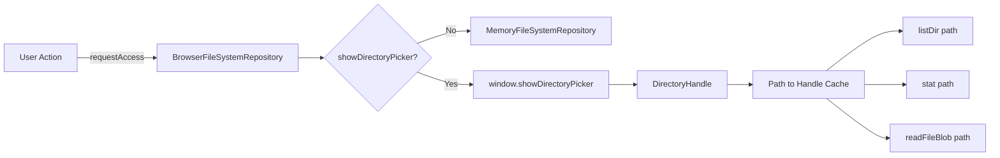

# Browser File System Access

```mermaid
flowchart LR
    UI[User Action] -->|requestAccess| Repo[BrowserFileSystemRepository]
    Repo --> Guard{showDirectoryPicker?}
    Guard -- No --> Fallback[MemoryFileSystemRepository]
    Guard -- Yes --> Picker[window.showDirectoryPicker]
    Picker --> DirHandle[DirectoryHandle]
    DirHandle --> Cache[Path to Handle Cache]
    Cache --> List[listDir path]
    Cache --> Stat[stat path]
    Cache --> Read[readFileBlob path]
```

- Permission denial or missing API routes back to the memory fallback.
