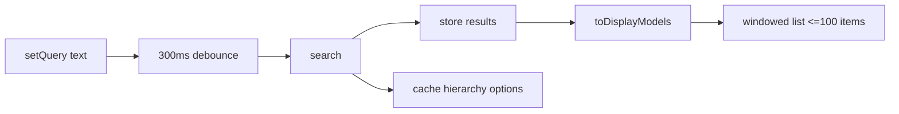

# Browser Performance Optimizations

```mermaid
flowchart LR
    Query[setQuery text] --> Debounce[300ms debounce]
    Debounce --> Search[search]
    Search --> Results[store results]
    Results --> Window[toDisplayModels]
    Window --> View[windowed list <=100 items]
    Search --> Cache[cache hierarchy options]
```

- Debounced search and windowed display keep large lists responsive.
