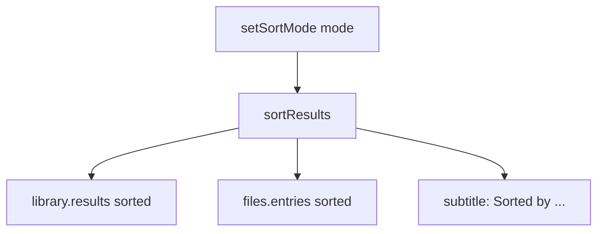

# Browser Sorting

```mermaid
flowchart TD
    Mode[setSortMode mode] --> Sort[sortResults]
    Sort --> Library[library.results sorted]
    Sort --> Files[files.entries sorted]
    Sort --> Display[subtitle: Sorted by ...]
```

- Relevance mode preserves the original search ordering.
