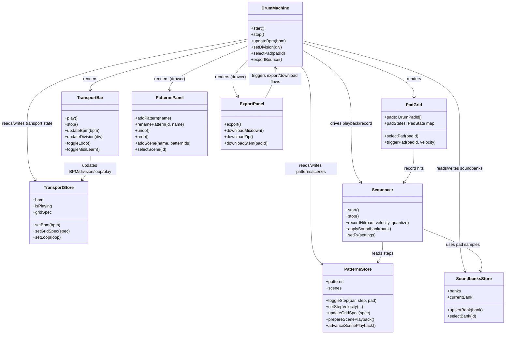

# Core Components Class Diagram



## Maschine MK3 UI placeholders (no-scroll shell)

```mermaid
classDiagram
  class DualDisplayPlaceholder {
    +leftText: string
    +rightText: string
    +softButtonLabels[8]: string
  }

  class SoftButtonStripPlaceholder {
    +buttons[8]: {symbol, hint}
    +onHoverHint()
  }

  class ScreenKnobRingPlaceholder {
    +knobs[8]: {label, value, hint}
    +selectorOverlay()
  }

  class FourDEncoderPlaceholder {
    +navigate(direction)
    +confirm()
    +hoverHint()
  }

  class TransportClusterPlaceholder {
    +playStop()
    +stopReset()
    +record()
    +restart()
    +tapTempo()
    +hoverHint()
  }

  class ModeColumnPlaceholder {
    +scene/pattern/events/variation
    +duplicate/select/mute/solo
    +shift()
    +hoverHint()
  }

  class TouchStripPlaceholder {
    +stripPosition
    +aftertouchMode
    +hoverHint()
  }

  DrumMachine --> DualDisplayPlaceholder : top displays
  DualDisplayPlaceholder --> SoftButtonStripPlaceholder : labels above displays
  DualDisplayPlaceholder --> ScreenKnobRingPlaceholder : knobs below displays
  DrumMachine --> FourDEncoderPlaceholder : nav + confirm
  DrumMachine --> ModeColumnPlaceholder : left cluster
  DrumMachine --> TransportClusterPlaceholder : transport cluster
  DrumMachine --> TouchStripPlaceholder : right/performance column
  DrumMachine --> PadGrid : pad matrix (right)
```

All placeholder components must expose hover hints (tooltips/titles) so every control mirrors the MK3 guidance even before full functionality is wired. Widths/heights should use `clamp()` to keep the entire shell inside 100vh without page scroll.
