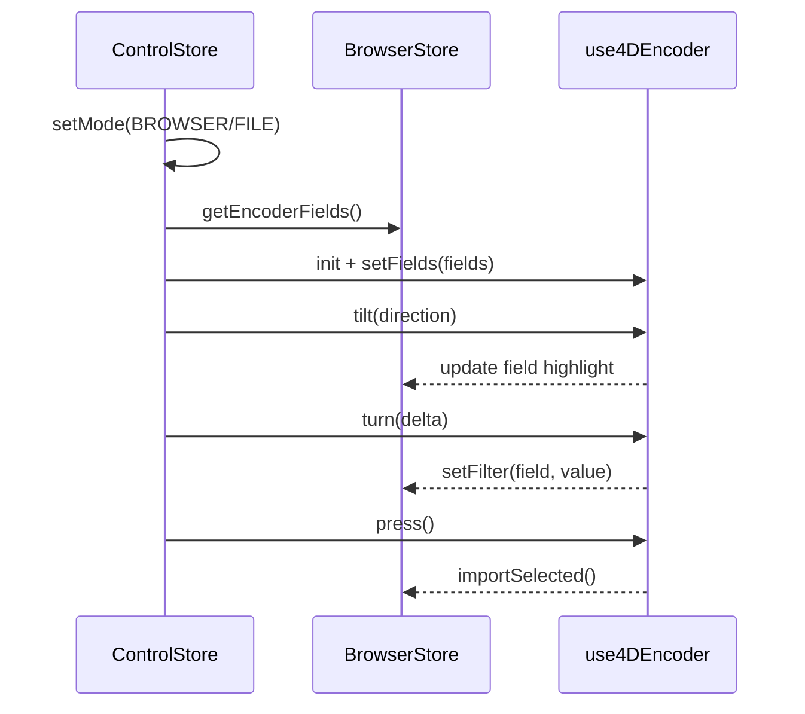

# Browser 4D Encoder Wiring

```mermaid
sequenceDiagram
    participant Control as ControlStore
    participant Browser as BrowserStore
    participant Encoder as use4DEncoder

    Control->>Control: setMode(BROWSER/FILE)
    Control->>Browser: getEncoderFields()
    Control->>Encoder: init + setFields(fields)

    Control->>Encoder: tilt(direction)
    Encoder-->>Browser: update field highlight

    Control->>Encoder: turn(delta)
    Encoder-->>Browser: setFilter(field, value)

    Control->>Encoder: press()
    Encoder-->>Browser: importSelected()
```

- Encoder wiring is active only in BROWSER/FILE modes.
