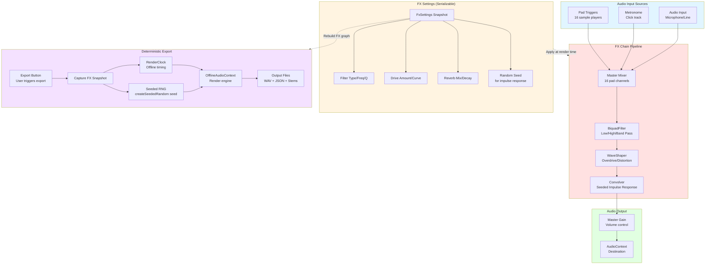
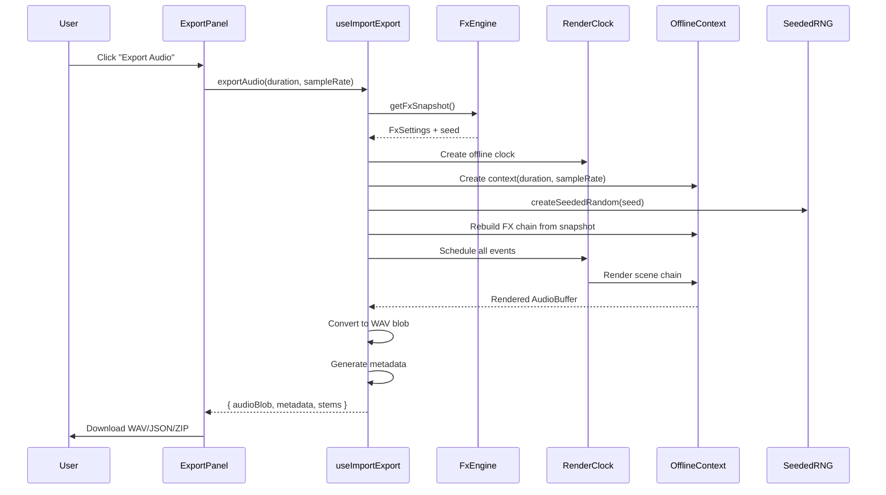

# FX Chain and Deterministic Rendering

This diagram shows the audio FX chain, deterministic export architecture, and seeded RNG for reproducible renders.



## FX Chain Components

### 1. Master Mixer
**Purpose**: Combine all audio sources with per-pad volume control

**Inputs**:
- 16 pad sample players (each with individual gain)
- Metronome click track (when enabled)
- Audio input (microphone/line in, when monitoring)

**Processing**:
```typescript
// Each pad has a gain node
padGainNodes[padIndex].gain.value = padVolume // 0.0-1.0

// Master mixer combines all pad gains
masterMixer.gain.value = masterVolume // 0.0-1.0
```

**Output**: Combined audio signal sent to FX chain

---

### 2. BiquadFilter (Low/High/Band Pass)
**Purpose**: Shape frequency response of the mix

**Parameters**:
- **Type**: `lowpass`, `highpass`, `bandpass`, `lowshelf`, `highshelf`, `peaking`, `notch`, `allpass`
- **Frequency**: Cutoff/center frequency (Hz)
- **Q Factor**: Resonance/bandwidth control
- **Gain**: Boost/cut for shelf/peaking types (dB)

**Implementation**:
```typescript
const filter = audioContext.createBiquadFilter()
filter.type = 'lowpass' // Default
filter.frequency.setValueAtTime(1000, audioContext.currentTime)
filter.Q.setValueAtTime(1.0, audioContext.currentTime)

// Connect to chain
masterMixer.connect(filter)
```

**Deterministic Updates**:
- Use `setValueAtTime()` for all parameter changes
- Avoid `value` setters (not deterministic across renders)
- Snapshot filter state in `FxSettings`

---

### 3. WaveShaper (Overdrive/Distortion)
**Purpose**: Add harmonic distortion and saturation

**Parameters**:
- **Amount**: Drive intensity (0.0-1.0)
- **Curve**: Transfer function for shaping (Float32Array)

**Transfer Function**:
```typescript
function makeDistortionCurve(amount: number): Float32Array {
  const samples = 44100
  const curve = new Float32Array(samples)
  const deg = Math.PI / 180
  
  for (let i = 0; i < samples; i++) {
    const x = (i * 2) / samples - 1
    curve[i] = ((3 + amount) * x * 20 * deg) / (Math.PI + amount * Math.abs(x))
  }
  
  return curve
}

const shaper = audioContext.createWaveShaper()
shaper.curve = makeDistortionCurve(driveAmount)
shaper.oversample = '4x' // Anti-aliasing

// Connect to chain
filter.connect(shaper)
```

**Deterministic Curve**:
- Curve generation is pure function of `amount`
- Same `amount` produces identical curve
- No random components

---

### 4. Convolver (Reverb with Seeded Impulse Response)
**Purpose**: Add reverb/spatial effects with reproducible characteristics

**Parameters**:
- **Mix**: Dry/wet balance (0.0-1.0)
- **Decay**: Impulse response length (seconds)
- **Seed**: Random seed for impulse response generation

**Seeded Impulse Response**:
```typescript
import { createSeededRandom } from '~/utils/seededRandom'

function createImpulseResponse(
  audioContext: AudioContext,
  duration: number,
  decay: number,
  seed: number
): AudioBuffer {
  const sampleRate = audioContext.sampleRate
  const length = sampleRate * duration
  const impulse = audioContext.createBuffer(2, length, sampleRate)
  
  // Seeded random generator
  const random = createSeededRandom(seed)
  
  for (let channel = 0; channel < 2; channel++) {
    const channelData = impulse.getChannelData(channel)
    for (let i = 0; i < length; i++) {
      // Decaying random noise
      const envelope = Math.exp(-i / (sampleRate * decay))
      channelData[i] = (random() * 2 - 1) * envelope
    }
  }
  
  return impulse
}

const convolver = audioContext.createConvolver()
convolver.buffer = createImpulseResponse(audioContext, 2.0, 1.5, seed)

// Dry/wet mix
const dryGain = audioContext.createGain()
const wetGain = audioContext.createGain()
dryGain.gain.value = 1 - reverbMix
wetGain.gain.value = reverbMix

shaper.connect(dryGain)
shaper.connect(convolver)
convolver.connect(wetGain)
```

**Seeded RNG Implementation**:
```typescript
// utils/seededRandom.ts
export function createSeededRandom(seed: number): () => number {
  let state = seed
  
  return function() {
    // Linear Congruential Generator (LCG)
    state = (state * 1664525 + 1013904223) % 0x100000000
    return state / 0x100000000
  }
}
```

**Key Features**:
- Same seed → identical impulse response
- Deterministic across live/offline renders
- Pure function (no external state)

---

## FX Settings Snapshot

**Purpose**: Serialize all FX state for reproducible renders

**Schema**:
```typescript
interface FxSettings {
  // Filter
  filterType: BiquadFilterType
  filterFrequency: number // Hz
  filterQ: number
  filterGain: number // dB
  
  // Drive
  driveAmount: number // 0.0-1.0
  
  // Reverb
  reverbMix: number // 0.0-1.0
  reverbDecay: number // seconds
  reverbSeed: number // random seed
  
  // Master
  masterVolume: number // 0.0-1.0
}
```

**Snapshot Creation**:
```typescript
function getFxSnapshot(): FxSettings {
  return {
    filterType: currentFilter.type,
    filterFrequency: currentFilter.frequency.value,
    filterQ: currentFilter.Q.value,
    filterGain: currentFilter.gain.value,
    driveAmount: currentDriveAmount,
    reverbMix: currentReverbMix,
    reverbDecay: currentReverbDecay,
    reverbSeed: currentReverbSeed,
    masterVolume: masterGain.gain.value
  }
}
```

**Snapshot Application**:
```typescript
function applyFxSnapshot(settings: FxSettings, context: AudioContext) {
  const filter = context.createBiquadFilter()
  filter.type = settings.filterType
  filter.frequency.setValueAtTime(settings.filterFrequency, context.currentTime)
  filter.Q.setValueAtTime(settings.filterQ, context.currentTime)
  filter.gain.setValueAtTime(settings.filterGain, context.currentTime)
  
  const shaper = context.createWaveShaper()
  shaper.curve = makeDistortionCurve(settings.driveAmount)
  
  const convolver = context.createConvolver()
  convolver.buffer = createImpulseResponse(
    context,
    2.0,
    settings.reverbDecay,
    settings.reverbSeed
  )
  
  // Connect chain
  filter.connect(shaper)
  shaper.connect(convolver)
  
  return { filter, shaper, convolver }
}
```

---

## Deterministic Export Architecture

### Export Workflow


### RenderClock
**Purpose**: Provide consistent timing for live and offline renders

```typescript
interface RenderClock {
  currentTime: number
  sampleRate: number
  scheduleAt(time: number, callback: () => void): void
}

// Live clock (uses AudioContext)
function createLiveClock(audioContext: AudioContext): RenderClock {
  return {
    get currentTime() { return audioContext.currentTime },
    sampleRate: audioContext.sampleRate,
    scheduleAt(time, callback) {
      const node = audioContext.createScriptProcessor(256, 1, 1)
      node.onaudioprocess = () => {
        if (audioContext.currentTime >= time) {
          callback()
          node.disconnect()
        }
      }
      node.connect(audioContext.destination)
    }
  }
}

// Offline clock (uses OfflineAudioContext)
function createOfflineClock(offlineContext: OfflineAudioContext): RenderClock {
  return {
    currentTime: 0,
    sampleRate: offlineContext.sampleRate,
    scheduleAt(time, callback) {
      // Schedule immediately in offline mode
      if (time <= 0) callback()
    }
  }
}
```

**Benefits**:
- Same `scheduleStep()` logic for live and offline
- No code duplication
- Deterministic scheduling

### Offline Render Process
```typescript
async function exportAudio(
  duration: number,
  sampleRate: number = 44100,
  options?: { seed?: number }
): Promise<{
  audioBlob: Blob
  metadata: RenderMetadata
  stems?: Map<number, Blob>
  debugTimeline?: Array<{ time: number; event: string }>
}> {
  // 1. Capture FX snapshot
  const fxSnapshot = audioEngine.getFxSnapshot()
  const seed = options?.seed ?? fxSnapshot.reverbSeed
  
  // 2. Create offline context
  const offlineContext = new OfflineAudioContext(2, duration * sampleRate, sampleRate)
  
  // 3. Rebuild FX chain with seeded RNG
  const seededRandom = createSeededRandom(seed)
  const fxChain = applyFxSnapshot(fxSnapshot, offlineContext, seededRandom)
  
  // 4. Create render clock
  const clock = createOfflineClock(offlineContext)
  
  // 5. Schedule all scene events
  const timeline: Array<{ time: number; event: string }> = []
  for (const pattern of sceneChain) {
    for (const step of pattern.steps) {
      const time = calculateStepTime(step, bpm, gridSpec)
      scheduleStep(clock, time, step, fxChain)
      if (import.meta.env.DEV) {
        timeline.push({ time, event: `pad${step.padId}` })
      }
    }
  }
  
  // 6. Render
  const renderedBuffer = await offlineContext.startRendering()
  
  // 7. Convert to WAV
  const audioBlob = bufferToWave(renderedBuffer, sampleRate)
  
  // 8. Generate metadata
  const metadata: RenderMetadata = {
    seed,
    bpm,
    gridSpec,
    sceneChain: sceneIds,
    duration,
    sampleRate,
    timestamp: new Date().toISOString(),
    eventCount: timeline.length
  }
  
  // 9. Optional: Render per-pad stems
  const stems = await renderStems(offlineContext, sceneChain, fxSnapshot, seed)
  
  return {
    audioBlob,
    metadata,
    stems,
    debugTimeline: import.meta.env.DEV ? timeline : undefined
  }
}
```

### Render Metadata
```typescript
interface RenderMetadata {
  seed: number // Random seed for impulse response
  bpm: number // Tempo
  gridSpec: GridSpec // Division, bars, etc.
  sceneChain: string[] // Scene/pattern IDs
  duration: number // Total duration (seconds)
  sampleRate: number // Audio sample rate (Hz)
  timestamp: string // ISO 8601 timestamp
  eventCount: number // Total scheduled events
  fxSettings?: FxSettings // Optional FX snapshot
}
```

**Usage**:
- Download alongside WAV file
- Reproduce render with same seed
- Debug timeline in dev mode
- Document render settings

### Reproducibility
**To reproduce an export**:
```typescript
// 1. Load metadata JSON
const metadata = await fetch('render_20260111.json').then(r => r.json())

// 2. Export with same settings
const reproduced = await exportAudio(metadata.duration, metadata.sampleRate, {
  seed: metadata.seed
})

// Result: Bit-identical WAV file
```

**Guarantees**:
- Same seed → identical impulse response
- Same FX snapshot → identical filter/drive/reverb
- Same scene chain → identical event scheduling
- Same sample rate → identical sample playback

**Limitations**:
- Sample blobs must be identical (checksums match)
- Browser AudioContext implementation differences may cause minor variations
- Floating-point rounding differences across platforms (rare)

---

## Stem Export

**Purpose**: Export individual per-pad audio tracks for DAW mixing

**Process**:
```typescript
async function renderStems(
  offlineContext: OfflineAudioContext,
  sceneChain: Pattern[],
  fxSnapshot: FxSettings,
  seed: number
): Promise<Map<number, Blob>> {
  const stems = new Map<number, Blob>()
  
  for (let padIndex = 0; padIndex < 16; padIndex++) {
    // Create isolated context for this pad
    const padContext = new OfflineAudioContext(2, duration * sampleRate, sampleRate)
    
    // Rebuild FX chain (same seed)
    const fxChain = applyFxSnapshot(fxSnapshot, padContext, createSeededRandom(seed))
    
    // Schedule only events for this pad
    for (const pattern of sceneChain) {
      for (const step of pattern.steps.filter(s => s.padId === padIndex)) {
        const time = calculateStepTime(step, bpm, gridSpec)
        scheduleStep(clock, time, step, fxChain)
      }
    }
    
    // Render
    const buffer = await padContext.startRendering()
    const blob = bufferToWave(buffer, sampleRate)
    
    stems.set(padIndex, blob)
  }
  
  return stems
}
```

**File Naming**:
```
scene_name-mixdown.wav           // Full mix
scene_name-pad01-kick.wav        // Pad 1 stem
scene_name-pad02-snare.wav       // Pad 2 stem
...
scene_name-metadata.json         // Render metadata
```

**ZIP Bundle**:
```typescript
import JSZip from 'jszip'

async function exportZipBundle(
  mixdown: Blob,
  metadata: RenderMetadata,
  stems: Map<number, Blob>
): Promise<Blob> {
  const zip = new JSZip()
  
  zip.file('mixdown.wav', mixdown)
  zip.file('metadata.json', JSON.stringify(metadata, null, 2))
  
  for (const [padIndex, stemBlob] of stems) {
    const padName = getPadName(padIndex) // e.g., "kick", "snare"
    zip.file(`stems/pad${padIndex + 1}-${padName}.wav`, stemBlob)
  }
  
  return await zip.generateAsync({ type: 'blob' })
}
```

---

## Related Components

- **Audio Engine**: `composables/useAudioEngine.client.ts`
- **Import/Export**: `composables/useImportExport.ts`
- **Seeded Random**: `utils/seededRandom.ts`
- **Scheduler**: `composables/useScheduler.client.ts`

## Related Diagrams

- Audio pipeline: `persistence-and-audio.md`
- Export workflow: `use-cases.md` (Export mixes and stems)
- Transport timing: `transport-engine.md`

## Testing

Unit tests verify:
- FX snapshot serialization/deserialization
- Seeded RNG reproducibility
- Offline render determinism
- Stem isolation correctness
- Metadata generation accuracy

See `tests/unitTests/fxChain.spec.ts` for full coverage.
