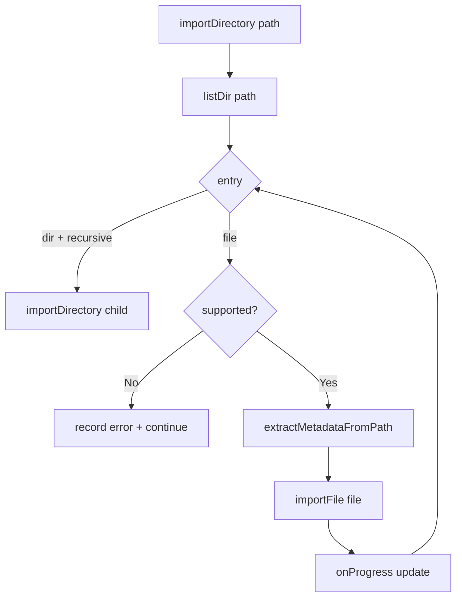

# Library Import Progress

```mermaid
flowchart TD
    Start[importDirectory path] --> List[listDir path]
    List --> Loop{entry}
    Loop -->|dir + recursive| Recurse[importDirectory child]
    Loop -->|file| Format{supported?}
    Format -- No --> Skip[record error + continue]
    Format -- Yes --> Meta[extractMetadataFromPath]
    Meta --> Import[importFile file]
    Import --> Progress[onProgress update]
    Progress --> Loop
```

- Errors are collected and logged after the pass.
