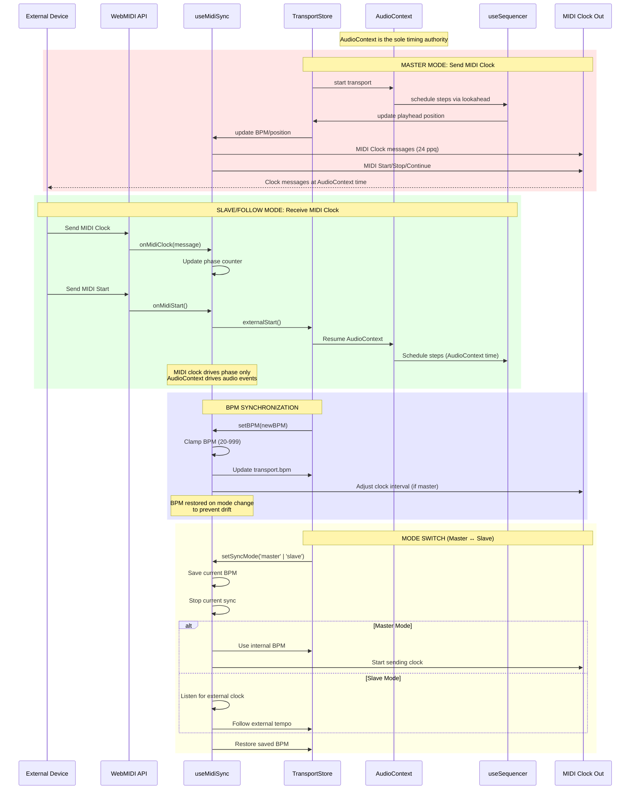

# MIDI Clock Sync and Timing

This diagram shows how MIDI clock synchronization works with the AudioContext-based transport.



## MIDI Clock Architecture

### Timing Authority: AudioContext
- **Single source of truth**: All audio events scheduled via `AudioContext.currentTime`
- **MIDI follows audio**: MIDI clock messages sent based on audio time
- **No MIDI-driven audio**: Incoming MIDI clock only updates phase counters and start/stop state
- **Lookahead scheduler**: Small `RenderClock` wrapper feeds scheduler/sequencer from AudioContext

### Master Mode
In master mode, the drum machine **sends** MIDI clock to external devices:

1. **Transport starts**: User presses Space or transport.start()
2. **AudioContext resumes**: Ensures audio is running
3. **Sequencer starts**: Schedules steps via lookahead (e.g., 100ms ahead)
4. **MIDI clock output**: Sends clock messages at 24 ppq (pulses per quarter note)
5. **Start/Stop/Continue**: Sends MIDI transport messages

**Clock Calculation**:
```typescript
// MIDI clock rate: 24 ppq
const bpm = transport.bpm
const pulsesPerSecond = (bpm / 60) * 24
const pulseInterval = 1 / pulsesPerSecond

// Schedule next pulse
const nextPulseTime = AudioContext.currentTime + pulseInterval
```

**Key Points**:
- Clock messages scheduled relative to `AudioContext.currentTime`
- Lookahead ensures tight timing despite JavaScript thread delays
- External devices slave to drum machine's tempo

### Slave/Follow Mode  
In slave mode, the drum machine **receives** MIDI clock from external devices:

1. **External device sends Start**: Triggers `externalStart()` in transport
2. **AudioContext resumes**: Transport starts in response to MIDI Start
3. **External device sends Clock**: Updates phase counter (24 ppq tracking)
4. **Steps scheduled via AudioContext**: Audio events still use internal AudioContext time
5. **MIDI clock = phase reference**: Used for UI display and sync checks, NOT for audio timing

**Critical Constraint**:
> Incoming MIDI clock **never** retimes audio events. It only:
> - Updates phase counters for display
> - Triggers start/stop/continue
> - Provides sync status checks

**Why Not Use MIDI Clock for Audio?**
- **Jitter**: MIDI clock messages have variable latency (USB, OS, thread delays)
- **Precision**: AudioContext provides microsecond precision
- **Lookahead**: Scheduler can compensate for JavaScript thread delays
- **BFCache**: AudioContext can suspend/resume reliably on page hide/show

**BPM Estimation from MIDI Clock**:
```typescript
// Measure time between clock messages (24 ppq)
const timeBetweenPulses = currentTime - lastPulseTime
const pulsesPerSecond = 1 / timeBetweenPulses
const estimatedBPM = (pulsesPerSecond / 24) * 60

// Smooth BPM estimate over multiple pulses
const smoothedBPM = runningAverage(estimatedBPM, window = 10)
```

### BPM Synchronization
**Problem**: Switching sync modes can cause BPM drift if not handled carefully.

**Solution**: Save and restore BPM on mode change:

```typescript
function setSyncMode(mode: 'master' | 'slave') {
  const savedBPM = transport.bpm // Save current BPM
  
  // Stop current sync
  if (currentMode === 'master') {
    stopSendingClock()
  } else {
    stopListeningForClock()
  }
  
  // Switch mode
  if (mode === 'master') {
    transport.bpm = savedBPM // Restore BPM
    startSendingClock(savedBPM)
  } else {
    listenForExternalClock()
    // BPM will be estimated from incoming clock
  }
}
```

**BPM Clamping**:
- All BPM updates clamped to valid range (20-999)
- Prevents invalid tempos from MIDI clock jitter
- Smooth averaging over multiple clock messages

### MIDI Message Types

#### Clock Messages (0xF8)
- **Frequency**: 24 pulses per quarter note (ppq)
- **Purpose**: Tempo sync between devices
- **Timing**: Sent at precise intervals based on BPM

Example:
```
BPM = 120
Quarter note = 0.5 seconds
24 ppq = 0.5 / 24 = ~20.8ms per pulse
```

#### Transport Messages
- **Start (0xFA)**: Start playback from beginning
- **Stop (0xFC)**: Stop playback
- **Continue (0xFB)**: Resume playback from current position

#### Song Position Pointer (0xF2)
- **Purpose**: Set playhead position (in MIDI beats)
- **Format**: 14-bit value (LSB, MSB)
- **Usage**: Allows jumping to specific bar/beat

### WebMIDI API Integration

#### Device Selection
```typescript
// Get available MIDI inputs/outputs
const inputs = await navigator.requestMIDIAccess()
const midiInputs = Array.from(inputs.inputs.values())
const midiOutputs = Array.from(outputs.outputs.values())

// Select device
const selectedInput = midiInputs[deviceIndex]
const selectedOutput = midiOutputs[deviceIndex]

// Listen for messages
selectedInput.onmidimessage = (event) => {
  handleMidiMessage(event.data)
}
```

#### Clock Sending (Master)
```typescript
function sendClockPulse() {
  if (!midiOutput) return
  
  // MIDI Clock message (0xF8)
  midiOutput.send([0xF8], AudioContext.currentTime * 1000)
  
  // Schedule next pulse
  const nextPulseTime = calculateNextPulseTime()
  setTimeout(sendClockPulse, nextPulseTime * 1000)
}

function sendStart() {
  if (!midiOutput) return
  midiOutput.send([0xFA]) // MIDI Start
}

function sendStop() {
  if (!midiOutput) return
  midiOutput.send([0xFC]) // MIDI Stop
}
```

#### Clock Receiving (Slave)
```typescript
function handleMidiMessage(data: Uint8Array) {
  const status = data[0]
  
  switch (status) {
    case 0xF8: // MIDI Clock
      onMidiClock()
      break
    case 0xFA: // MIDI Start
      onMidiStart()
      break
    case 0xFC: // MIDI Stop
      onMidiStop()
      break
    case 0xFB: // MIDI Continue
      onMidiContinue()
      break
  }
}

function onMidiClock() {
  phaseCounter++
  
  // Update BPM estimate every 24 pulses (1 quarter note)
  if (phaseCounter % 24 === 0) {
    const elapsed = AudioContext.currentTime - lastQuarterNoteTime
    const estimatedBPM = 60 / elapsed
    updateBPMEstimate(estimatedBPM)
    lastQuarterNoteTime = AudioContext.currentTime
  }
}

function onMidiStart() {
  phaseCounter = 0
  transport.externalStart() // Start transport without internal clock
}
```

### BFCache Compatibility

MIDI sync is **BFCache-compatible** with page show/hide handling:

```typescript
// On pagehide
window.addEventListener('pagehide', () => {
  if (isMaster) {
    pauseClockSending() // Stop sending clock pulses
  } else {
    pauseClockListening() // Detach MIDI listeners
  }
})

// On pageshow  
window.addEventListener('pageshow', () => {
  if (wasPlaying) {
    if (isMaster) {
      resumeClockSending() // Resume sending clock
    } else {
      resumeClockListening() // Reattach MIDI listeners
    }
  }
})
```

### Constraints and Limitations

#### WebMIDI Availability
- **Requires**: HTTPS or localhost
- **User Permission**: Browser prompts for MIDI access
- **Fallback**: Device list empty when unsupported or denied

#### Timing Precision
- **MIDI Clock Jitter**: ±1-5ms typical (USB, OS, thread delays)
- **AudioContext**: Microsecond precision
- **Trade-off**: Use MIDI for sync status, AudioContext for audio events

#### Background Tab Throttling
- **Problem**: Browser throttles timers when tab is not focused
- **Impact**: MIDI clock sending may drift or skip pulses
- **Mitigation**: Use `AudioContext.currentTime` for scheduling, not `setTimeout`
- **User Guidance**: Keep tab focused for tight timing

#### Device Compatibility
- **Some devices**: May not support all transport messages (Start/Stop/Continue)
- **Clock rate**: 24 ppq is standard, but some devices use non-standard rates
- **Testing**: Verify with specific hardware/software combinations

### Related Components

- **File**: `composables/useMidiSync.client.ts`
- **Transport**: `stores/transport.ts`
- **MIDI Learn**: `composables/useMidi.client.ts`
- **Audio Engine**: `composables/useAudioEngine.client.ts`
- **Scheduler**: `composables/useScheduler.client.ts`

### Related Diagrams

- Transport timing: `transport-engine.md`
- MIDI hardware workflow: `use-cases.md` (MIDI/hardware integration)
- Audio pipeline: `persistence-and-audio.md`

### Testing

Unit tests verify:
- Clock message scheduling at correct intervals
- BPM estimation from incoming clock
- Mode switching without drift
- Start/Stop/Continue message handling
- Phase counter accuracy

See `tests/unitTests/midiSync.spec.ts` for full test coverage.

### Debugging

Enable MIDI debug logging in dev mode:
```typescript
// In useMidiSync.client.ts
const DEBUG_MIDI = import.meta.env.DEV

if (DEBUG_MIDI) {
  console.log('[MIDI Sync]', { mode, bpm, phaseCounter, message })
}
```

Inspect MIDI messages in browser DevTools:
- Chrome: `chrome://webmidi-internals/`
- Firefox: MIDI Monitor extension

### Future Enhancements

- **Ableton Link**: Network-based sync protocol (mentioned in codebase, not yet implemented)
- **Song Position Pointer**: Jump to specific bar/beat
- **MTC (MIDI Time Code)**: Frame-accurate sync for video/audio production
- **Clock rate config**: Support non-standard clock rates (12 ppq, 48 ppq)
