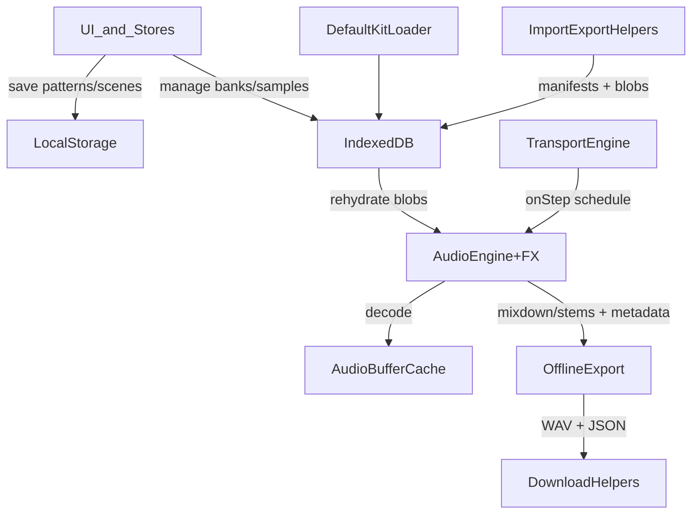
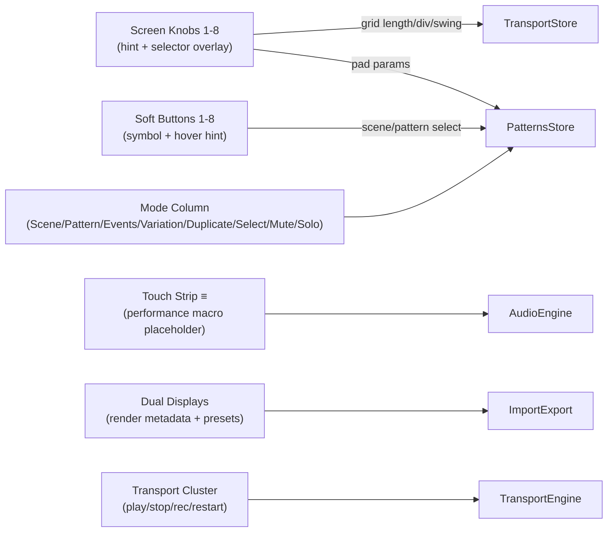

# Persistence and Audio Flow

## MK3 UI overlays hooked to persistence/audio (placeholders)

- All hardware placeholders must show hover hints describing what they write to (transport store, patterns store, audio engine) and list both primary + shift-layer actions.
- Keep overlays lightweight and clipped inside the 100vh hardware shell; any deeper lists (e.g., selector values) should scroll inside the display mock, not the page.
