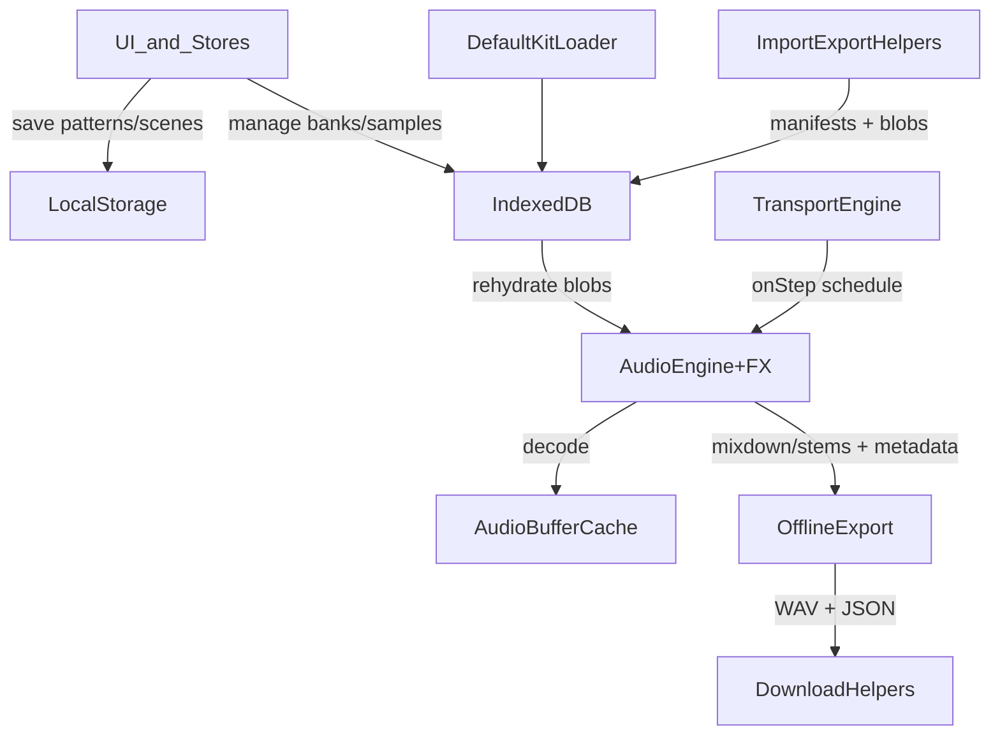

# Persistence and Audio Flow

```mermaid
  flowchart TB
    UI[UI_and_Stores] -->|save patterns/scenes| LocalStorage
    UI -->|manage banks/samples| IndexedDB
    DefaultKit[DefaultKitLoader] --> IndexedDB
    ImportExport[ImportExportHelpers] -->|manifests + blobs| IndexedDB
    IndexedDB -->|rehydrate blobs| AudioEngine[AudioEngine+FX]
    AudioEngine -->|decode| AudioCache[AudioBufferCache]
    TransportEngine -->|onStep schedule| AudioEngine
    AudioEngine -->|mixdown/stems + metadata| Exporter[OfflineExport]
    Exporter -->|WAV + JSON| Downloader[DownloadHelpers]
```
