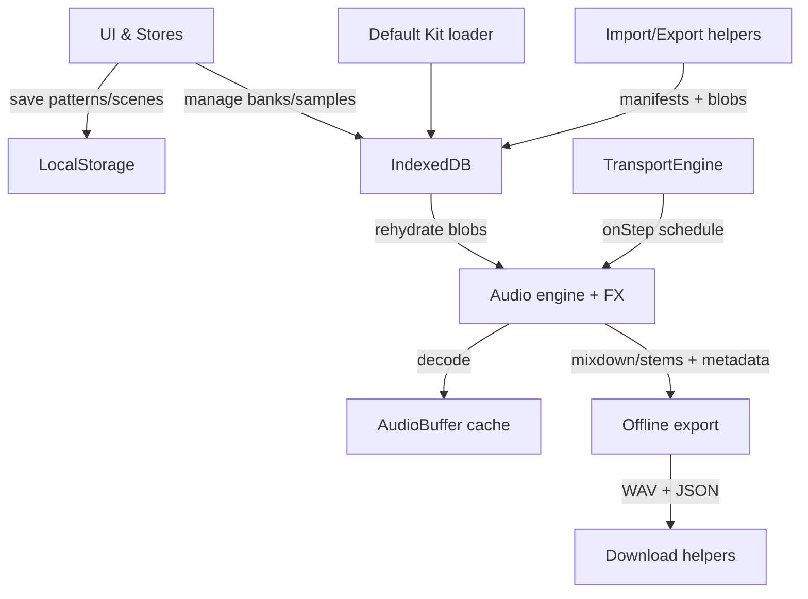

# Persistence and Audio Flow

```mermaid
flowchart TB
    UI[UI & Stores] -->|save patterns/scenes| LocalStorage
    UI -->|manage banks/samples| IndexedDB
    DefaultKit[Default Kit loader] --> IndexedDB
    ImportExport[Import/Export helpers] -->|manifests + blobs| IndexedDB
    IndexedDB -->|rehydrate blobs| AudioEngine[Audio engine + FX]
    AudioEngine -->|decode| AudioCache[AudioBuffer cache]
    TransportEngine -->|onStep schedule| AudioEngine
    AudioEngine -->|mixdown/stems + metadata| Exporter[Offline export]
    Exporter -->|WAV + JSON| Downloader[Download helpers]
```
