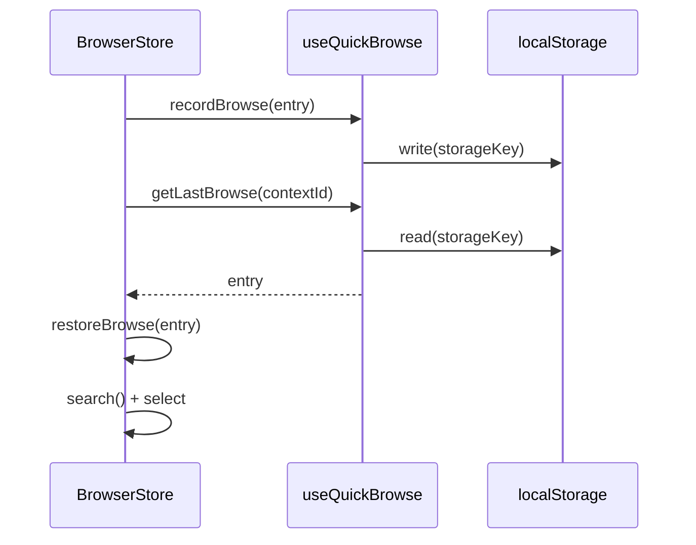

# Quick-Browse Restore

```mermaid
sequenceDiagram
    participant Browser as BrowserStore
    participant Quick as useQuickBrowse
    participant Storage as localStorage

    Browser->>Quick: recordBrowse(entry)
    Quick->>Storage: write(storageKey)

    Browser->>Quick: getLastBrowse(contextId)
    Quick->>Storage: read(storageKey)
    Quick-->>Browser: entry
    Browser->>Browser: restoreBrowse(entry)
    Browser->>Browser: search() + select
```

- Each context id stores a single latest entry.
