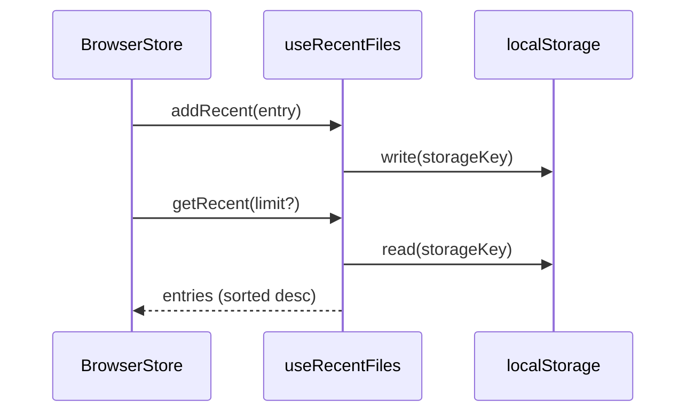

# Recent Files Tracking

```mermaid
sequenceDiagram
    participant Browser as BrowserStore
    participant Recent as useRecentFiles
    participant Storage as localStorage

    Browser->>Recent: addRecent(entry)
    Recent->>Storage: write(storageKey)

    Browser->>Recent: getRecent(limit?)
    Recent->>Storage: read(storageKey)
    Recent-->>Browser: entries (sorted desc)
```

- Recent entries are deduplicated and capped at 50.
