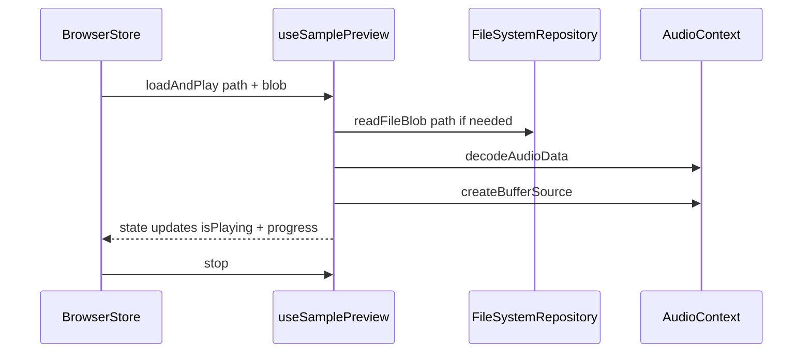

# Sample Preview / Prehear

```mermaid
sequenceDiagram
    participant Browser as BrowserStore
    participant Preview as useSamplePreview
    participant FS as FileSystemRepository
    participant Audio as AudioContext

    Browser->>Preview: loadAndPlay path + blob
    Preview->>FS: readFileBlob path if needed
    Preview->>Audio: decodeAudioData
    Preview->>Audio: createBufferSource
    Preview-->>Browser: state updates isPlaying + progress
    Browser->>Preview: stop
```

- Playback uses the shared AudioContext and stops automatically at end.
