# Keyboard Shortcuts Overview

This diagram shows the main keyboard shortcut groups and their organization.

```mermaid
graph TD
    Shortcuts[Keyboard Shortcuts]
    
    Shortcuts --> Transport[Transport Controls]
    Shortcuts --> Browser[Browser Navigation]
    Shortcuts --> Pads[Pad Selection]
    Shortcuts --> Patterns[Pattern/Scene Management]
    Shortcuts --> Edit[Edit Operations]
    Shortcuts --> Modes[Mode Switching]
    Shortcuts --> Encoder[Encoder/Knobs]
    
    Transport --> Play["Space: Play"]
    Transport --> Stop["Shift+Space: Stop"]
    Transport --> Record["Ctrl+R: Record"]
    Transport --> Tap["T: Tap Tempo"]
    Transport --> Metro["M: Metronome"]
    Transport --> CountIn["C: Count-In"]
    Transport --> Loop["L: Loop"]
    Transport --> Follow["F: Follow"]
    
    Browser --> BrowseToggle["B: Toggle Browser"]
    Browser --> BrowseMode["Ctrl+B: Browser Mode"]
    Browser --> Search["Ctrl+K: Focus Search"]
    Browser --> Load["Ctrl+Enter: Load to Pad"]
    Browser --> Preview["Shift+P: Preview"]
    Browser --> Nav["Arrows: Navigate"]
    Browser --> LibMode["Shift+L: Library Mode"]
    Browser --> FileMode["Shift+B: Files Mode"]
    
    Pads --> Row1["1-4: Pads 1-4"]
    Pads --> Row2["Q-R: Pads 5-8"]
    Pads --> Row3["A-F: Pads 9-12"]
    Pads --> Row4["Z-V: Pads 13-16"]
    
    Patterns --> NewPattern["Ctrl+N: New Pattern"]
    Patterns --> DupPattern["Ctrl+D: Duplicate Pattern"]
    Patterns --> ClearPattern["Ctrl+Delete: Clear Pattern"]
    Patterns --> NewScene["Ctrl+Shift+N: New Scene"]
    Patterns --> PlayScene["Ctrl+Space: Play Scene"]
    
    Edit --> Undo["Ctrl+Z: Undo"]
    Edit --> Redo["Ctrl+Shift+Z: Redo"]
    Edit --> QuickVol["Ctrl+Alt+V: Quick Volume"]
    Edit --> QuickSwing["Ctrl+Alt+S: Quick Swing"]
    Edit --> QuickTempo["Ctrl+Alt+T: Quick Tempo"]
    
    Modes --> Channel["Ctrl+1: Channel"]
    Modes --> Plugin["Ctrl+2: Plugin"]
    Modes --> Arranger["Ctrl+3: Arranger"]
    Modes --> Mixer["Ctrl+4: Mixer"]
    Modes --> Sampling["Ctrl+5: Sampling"]
    
    Encoder --> KnobUp["↑: Increment"]
    Encoder --> KnobDown["↓: Decrement"]
    Encoder --> KnobFineUp["Shift+↑: Fine Inc"]
    Encoder --> KnobFineDown["Shift+↓: Fine Dec"]
    Encoder --> Enc4DUp["PageUp: 4D Turn Up"]
    Encoder --> Enc4DDown["PageDown: 4D Turn Down"]
    Encoder --> Enc4DLeft["←: 4D Tilt Left"]
    Encoder --> Enc4DRight["→: 4D Tilt Right"]
    Encoder --> Enc4DPress["Enter: 4D Press"]
    
    style Shortcuts fill:#e1f5ff
    style Transport fill:#ffe1e1
    style Browser fill:#e1ffe1
    style Pads fill:#fff4e1
    style Patterns fill:#f4e1ff
    style Edit fill:#ffe1f4
    style Modes fill:#e1f4ff
    style Encoder fill:#f4ffe1
```



## Shortcut Categories

### 1. Transport Controls (Red)
Essential playback controls for the drum machine:
- **Play/Stop**: Core transport control with Space bar
- **Recording**: Live input capture with quantization
- **Tempo**: Tap tempo and metronome sync
- **Loop & Follow**: Loop ranges and MIDI clock sync

### 2. Browser Navigation (Green)
Sample and file browsing shortcuts:
- **Open/Close**: Quick toggle with B or Escape
- **Search**: Fast search focus with Ctrl+K
- **Navigation**: Arrow keys for list navigation
- **Load**: Ctrl+Enter to load selected sample
- **Preview**: Shift+P for sample preview/prehear
- **Mode Switch**: Shift+L (Library) or Shift+B (Files)

### 3. Pad Selection (Yellow)
Grid-based pad selection using QWERTY layout:
```
1  2  3  4    (Pads 1-4)
Q  W  E  R    (Pads 5-8)
A  S  D  F    (Pads 9-12)
Z  X  C  V    (Pads 13-16)
```
Mirrors 4×4 hardware pad layout for intuitive control.

### 4. Pattern/Scene Management (Purple)
Pattern editing and scene arrangement:
- **Create**: Ctrl+N for new patterns, Ctrl+Shift+N for scenes
- **Edit**: Ctrl+D to duplicate, Ctrl+Delete to clear
- **Playback**: Ctrl+Space to play scenes

### 5. Edit Operations (Pink)
Undo/redo and quick parameter edits:
- **Undo Stack**: 50-step history for patterns and scenes
- **Quick Edit**: Direct access to volume, swing, and tempo editors

### 6. Mode Switching (Light Blue)
Hardware-inspired mode buttons:
- **Ctrl+1-5**: Quick access to Channel, Plugin, Arranger, Mixer, Sampling modes
- **Ctrl+B**: Browser mode (alternative to B)

### 7. Encoder/Knobs (Light Green)
Fine control for parameters:
- **Arrow Keys**: Standard increment/decrement
- **Shift+Arrows**: Fine adjustment (smaller steps)
- **4D Encoder**: PageUp/Down (turn), Arrows (tilt), Enter (press)
- **Context**: Works with focused knobs and browser fields

## Implementation

All shortcuts are registered via the `useShortcuts()` composable:
- **File**: `composables/useShortcuts.ts`
- **Commands**: `composables/shortcutCommands.ts`
- **Registration**: `components/DrumMachine.vue` (mounted hook)
- **Tooltips**: Components use `shortcutTitle(commandId, label)` to show shortcuts in hover hints

## Coverage

**Registered Commands**: 34/53 (64.2%)
- **Fully Covered**: All mounted UI controls have shortcuts + tooltips
- **Intentionally Not Registered**: Unimplemented features, hardware-only controls (e.g., PAD_MUTE, PAD_SOLO)

See `SHORTCUT_AUDIT_REPORT.md` for detailed coverage analysis.

## Usage Guidelines

1. **Discovery**: Hover over any button to see its keyboard shortcut in the tooltip
2. **Context**: Some shortcuts (like Arrow keys) are context-dependent based on focus
3. **Modifiers**: Shift often provides secondary or fine-tuned actions
4. **Grid Navigation**: Pad selection keys work globally, navigation keys require focus
5. **Browser**: Most browser shortcuts work when browser panel is open
6. **Conflicts**: Command pattern with longest-match-first prevents collisions

## Related Diagrams

- Browser 4D encoder workflow: `control-4d-encoder-browser.md`
- Transport controls: `transport-engine.md`
- Pattern workflow: `use-cases.md`
