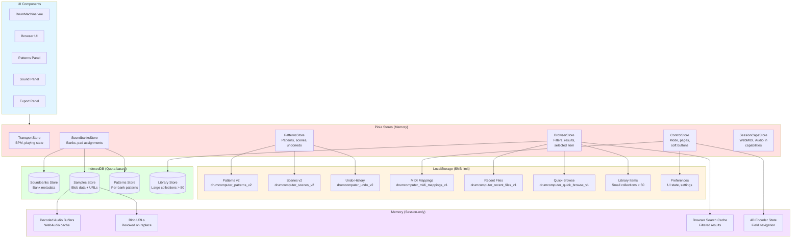
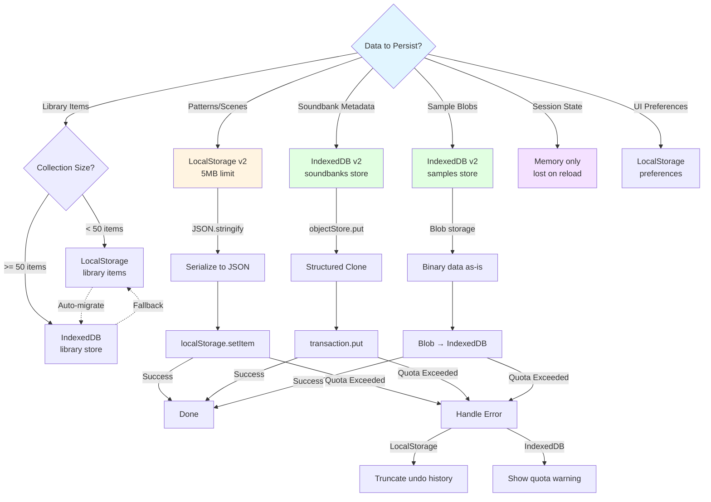

# Storage Architecture and Persistence Strategy

This diagram shows how data is persisted across IndexedDB, LocalStorage, and memory, with migration paths and fallback strategies.



## Storage Decision Tree



## Storage Layers

### 1. LocalStorage (5MB Browser Limit)

#### Patterns v2
**Key**: `drumcomputer_patterns_v2`

**Schema**:
```typescript
interface PatternsStorageV2 {
  patterns: Pattern[] // All patterns
  selectedId: string | null // Currently selected pattern
  activeId: string | null // Currently playing pattern
  version: 2
}

interface Pattern {
  id: string
  name: string
  steps: Step[] // Step data per pad
  bars: number
  division: Division // 1, 2, 4, 8, 16, 32, 64
  soundbankId: string // Reference to soundbank
  createdAt: string // ISO 8601
  updatedAt: string // ISO 8601
}
```

**Operations**:
```typescript
// Save patterns
localStorage.setItem('drumcomputer_patterns_v2', JSON.stringify(data))

// Load patterns
const data = JSON.parse(localStorage.getItem('drumcomputer_patterns_v2') || '{}')

// Migrate from v1
if (data.version === 1) {
  const migrated = migrateV1ToV2(data)
  localStorage.setItem('drumcomputer_patterns_v2', JSON.stringify(migrated))
}
```

**Size Management**:
- Limit: ~5MB total across all keys
- Patterns typically: ~10-50KB per pattern
- Monitor with `try/catch` on `setItem()`

---

#### Scenes v2
**Key**: `drumcomputer_scenes_v2`

**Schema**:
```typescript
interface ScenesStorageV2 {
  scenes: Scene[]
  selectedId: string | null
  version: 2
}

interface Scene {
  id: string
  name: string
  patternChain: string[] // Pattern IDs in order
  createdAt: string
  updatedAt: string
}
```

---

#### Undo/Redo History
**Key**: `drumcomputer_undo_v2`

**Schema**:
```typescript
interface UndoStorage {
  history: Array<{
    type: 'pattern' | 'scene'
    action: string
    before: any
    after: any
    timestamp: string
  }>
  currentIndex: number
  maxSize: 50 // Limit to 50 steps
}
```

**Size Management**:
- Oldest entries dropped when >50
- Large diffs may be truncated

---

#### MIDI Mappings
**Key**: `drumcomputer_midi_mappings_v1`

**Schema**:
```typescript
interface MidiMappings {
  pads: Record<number, number> // note → padIndex
  transport: {
    play?: number
    stop?: number
    record?: number
  }
  deviceId: string | null
}
```

---

#### Recent Files
**Key**: `drumcomputer_recent_files_v1`

**Schema**:
```typescript
interface RecentFiles {
  files: Array<{
    id: string
    name: string
    path: string
    type: 'sample' | 'pattern' | 'soundbank'
    timestamp: string
  }>
  maxSize: 50
}
```

---

#### Quick-Browse History
**Key**: `drumcomputer_quick_browse_v1`

**Schema**:
```typescript
interface QuickBrowseHistory {
  contexts: Record<string, {
    contextId: string // e.g., 'pad-0', 'plugin-0-2'
    query: string
    filters: BrowserFilters
    timestamp: string
  }>
  maxSize: 50
}
```

---

#### Library Items (Small Collections)
**Key**: `drumcomputer_library_items_v1`

**Schema**:
```typescript
interface LibraryItems {
  items: LibraryItem[]
  threshold: 50 // Migrate to IndexedDB if > 50
}

interface LibraryItem {
  id: string
  name: string
  path: string
  type: 'sample' | 'preset' | 'kit'
  category?: string
  product?: string
  bank?: string
  subBank?: string
  tags: string[]
  isFavorite: boolean
  createdAt: string
}
```

**Migration Trigger**:
```typescript
if (items.length >= 50) {
  await migrateToIndexedDB(items)
  localStorage.removeItem('drumcomputer_library_items_v1')
}
```

---

### 2. IndexedDB (Quota-based, typically 50MB-1GB)

#### Database Schema
**Name**: `drumcomputer_v2`

**Object Stores**:
1. **soundbanks**: Soundbank metadata
2. **samples**: Sample blobs + metadata
3. **patterns**: Per-bank pattern snapshots
4. **library**: Large library item collections

---

#### Soundbanks Store
**Key Path**: `id`

**Schema**:
```typescript
interface SoundbankRecord {
  id: string
  name: string
  pads: Array<{
    padIndex: number
    sampleId: string | null // Reference to samples store
    name: string
    volume: number // 0.0-1.0
  }>
  createdAt: string
  updatedAt: string
}
```

**Operations**:
```typescript
// Save soundbank
const tx = db.transaction('soundbanks', 'readwrite')
const store = tx.objectStore('soundbanks')
await store.put(soundbankRecord)

// Load soundbank
const soundbank = await store.get(soundbankId)
```

---

#### Samples Store
**Key Path**: `id`
**Index**: `soundbankId`

**Schema**:
```typescript
interface SampleRecord {
  id: string
  soundbankId: string // Foreign key to soundbanks
  name: string
  blob: Blob // Raw audio file
  blobUrl: string // createObjectURL result
  format: 'wav' | 'mp3' | 'ogg' | 'flac'
  size: number // Bytes
  duration?: number // Seconds (if decoded)
  sampleRate?: number // Hz (if decoded)
  createdAt: string
}
```

**Operations**:
```typescript
// Save sample
const sampleRecord: SampleRecord = {
  id: generateId(),
  soundbankId,
  name: file.name,
  blob: file,
  blobUrl: URL.createObjectURL(file),
  format: inferFormat(file.name),
  size: file.size,
  createdAt: new Date().toISOString()
}
await store.put(sampleRecord)

// Load sample and create blob URL
const sample = await store.get(sampleId)
if (!sample.blobUrl) {
  sample.blobUrl = URL.createObjectURL(sample.blob)
}

// Revoke old URL when replacing
if (oldBlobUrl) {
  URL.revokeObjectURL(oldBlobUrl)
}
```

**Lazy Audio Decoding**:
```typescript
// Decode on-demand via AudioContext
async function decodeAudio(sampleId: string): Promise<AudioBuffer> {
  const sample = await samplesStore.get(sampleId)
  const arrayBuffer = await sample.blob.arrayBuffer()
  return await audioContext.decodeAudioData(arrayBuffer)
}
```

---

#### Patterns Store (Per-Bank)
**Key Path**: `id`
**Index**: `soundbankId`

**Schema**:
```typescript
interface PatternRecord {
  id: string
  soundbankId: string // Which bank this pattern uses
  name: string
  steps: Step[]
  bars: number
  division: Division
  createdAt: string
  updatedAt: string
}
```

**Purpose**: Store pattern snapshots associated with specific soundbanks for quick restore.

---

#### Library Store (Large Collections)
**Key Path**: `id`
**Indexes**: `category`, `product`, `tags`, `isFavorite`

**Schema**: Same as `LibraryItem` above

**Migration**:
```typescript
// Auto-migrate when LocalStorage collection grows
if (localStorageItems.length >= 50) {
  const tx = db.transaction('library', 'readwrite')
  const store = tx.objectStore('library')
  
  for (const item of localStorageItems) {
    await store.put(item)
  }
  
  localStorage.removeItem('drumcomputer_library_items_v1')
}
```

**Fallback**:
```typescript
// If IndexedDB fails, fall back to LocalStorage (truncated)
try {
  await db.transaction('library', 'readwrite')
} catch (error) {
  console.warn('IndexedDB unavailable, using LocalStorage')
  const truncated = items.slice(0, 50) // Keep only first 50
  localStorage.setItem('drumcomputer_library_items_v1', JSON.stringify(truncated))
}
```

---

### 3. Memory (Session-only)

#### Decoded Audio Buffers
**Purpose**: Cache decoded AudioBuffers to avoid re-decoding

**Storage**:
```typescript
const audioBufferCache = new Map<string, AudioBuffer>()

async function getSampleBuffer(sampleId: string): Promise<AudioBuffer> {
  if (audioBufferCache.has(sampleId)) {
    return audioBufferCache.get(sampleId)!
  }
  
  const buffer = await decodeAudio(sampleId)
  audioBufferCache.set(sampleId, buffer)
  return buffer
}
```

**Lifecycle**: Cleared on page reload

---

#### Blob URLs
**Purpose**: Provide URLs for `<audio>` elements and preview playback

**Management**:
```typescript
// Create URL
const blobUrl = URL.createObjectURL(blob)

// Revoke when no longer needed
URL.revokeObjectURL(blobUrl)

// Revoke on sample replacement
function replaceSample(padIndex: number, newBlob: Blob) {
  const oldBlobUrl = currentSample.blobUrl
  if (oldBlobUrl) {
    URL.revokeObjectURL(oldBlobUrl)
  }
  currentSample.blobUrl = URL.createObjectURL(newBlob)
}
```

**Memory Leak Prevention**: Always revoke URLs when samples are replaced or app closes.

---

#### Browser Search Cache
**Purpose**: Cache filtered/sorted results for fast navigation

**Storage**:
```typescript
interface BrowserCache {
  query: string
  filters: BrowserFilters
  results: LibraryItem[]
  sortMode: SortMode
  timestamp: number
}

// Invalidate cache on filter change
function setFilter(key: string, value: any) {
  if (cache && cache.filters[key] !== value) {
    cache = null // Invalidate
  }
}
```

**Lifecycle**: Cleared on query/filter change or page reload

---

#### 4D Encoder State
**Purpose**: Track field navigation, value adjustment, and list position

**Storage**:
```typescript
interface EncoderState {
  mode: 'field-select' | 'value-adjust' | 'list-navigate'
  activeFieldIndex: number
  fields: EncoderField[]
  listPosition: number
}
```

**Lifecycle**: Cleared when browser closes or mode changes

---

## Persistence Patterns

### Pattern: Write-through Cache
```typescript
async function updatePattern(pattern: Pattern) {
  // 1. Update store (memory)
  patternsStore.patterns[index] = pattern
  
  // 2. Persist to LocalStorage (write-through)
  await savePatternsToLocalStorage()
}
```

### Pattern: Lazy Loading
```typescript
async function loadSoundbank(soundbankId: string) {
  // 1. Load metadata from IndexedDB
  const soundbank = await soundbanksStore.get(soundbankId)
  
  // 2. Load samples on-demand (lazy)
  for (const pad of soundbank.pads) {
    if (pad.sampleId) {
      // Don't decode yet, just get blob URL
      const sample = await samplesStore.get(pad.sampleId)
      pad.blobUrl = sample.blobUrl
    }
  }
  
  // 3. Decode audio buffers when needed (even lazier)
  // Happens on first pad trigger or preview
}
```

### Pattern: Optimistic Updates with Rollback
```typescript
async function replaceSample(padIndex: number, file: File) {
  // 1. Optimistic: Update UI immediately
  const oldSample = pads[padIndex].sample
  pads[padIndex].sample = { name: file.name, blobUrl: URL.createObjectURL(file) }
  
  try {
    // 2. Persist to IndexedDB
    await saveSampleToIndexedDB(file)
  } catch (error) {
    // 3. Rollback on error
    pads[padIndex].sample = oldSample
    throw error
  }
}
```

### Pattern: Quota Handling
```typescript
async function saveLargeData(data: any) {
  try {
    await indexedDB.put(data)
  } catch (error) {
    if (error.name === 'QuotaExceededError') {
      // Strategy 1: Delete old samples
      await deleteOldSamples(10)
      
      // Strategy 2: Prompt user
      showQuotaWarning('Storage quota exceeded. Please free up space.')
      
      // Strategy 3: Fallback to LocalStorage (truncated)
      const truncated = truncateData(data, 5 * 1024 * 1024) // 5MB
      localStorage.setItem(key, JSON.stringify(truncated))
    }
  }
}
```

---

## Migration Strategies

### LocalStorage v1 → v2
```typescript
function migrateLocalStorageV1ToV2() {
  const v1Data = localStorage.getItem('drumcomputer_patterns')
  if (!v1Data) return
  
  const parsed = JSON.parse(v1Data)
  
  const v2Data: PatternsStorageV2 = {
    patterns: parsed.patterns.map(normalizePattern),
    selectedId: parsed.selectedPattern || null,
    activeId: null,
    version: 2
  }
  
  localStorage.setItem('drumcomputer_patterns_v2', JSON.stringify(v2Data))
  localStorage.removeItem('drumcomputer_patterns') // Remove v1
}
```

### LocalStorage → IndexedDB (Library)
```typescript
async function migrateLibraryToIndexedDB() {
  const v1Items = JSON.parse(localStorage.getItem('drumcomputer_library_items_v1') || '[]')
  
  if (v1Items.length < 50) return // No need to migrate
  
  const db = await openDB('drumcomputer_v2')
  const tx = db.transaction('library', 'readwrite')
  const store = tx.objectStore('library')
  
  for (const item of v1Items) {
    await store.put(item)
  }
  
  await tx.done
  localStorage.removeItem('drumcomputer_library_items_v1')
  
  console.log(`Migrated ${v1Items.length} library items to IndexedDB`)
}
```

---

## BFCache Compatibility

All storage layers are **BFCache-compatible**:

```typescript
window.addEventListener('pagehide', () => {
  // Save volatile state to LocalStorage
  localStorage.setItem('drumcomputer_session_v1', JSON.stringify({
    transportPlaying: transport.isPlaying,
    currentPattern: patterns.activeId,
    currentScene: scenes.activeId
  }))
})

window.addEventListener('pageshow', (event) => {
  if (event.persisted) {
    // Restored from BFCache
    const session = JSON.parse(localStorage.getItem('drumcomputer_session_v1') || '{}')
    
    // Restore state
    if (session.transportPlaying) {
      transport.start()
    }
    
    // Refresh IndexedDB connections
    await reopenIndexedDB()
  }
})
```

---

## Performance Considerations

### LocalStorage
- **Synchronous**: Blocks main thread on read/write
- **Slow for large data**: JSON.stringify can be expensive
- **Best for**: Small, frequently accessed data (<100KB)

### IndexedDB
- **Asynchronous**: Non-blocking, uses promises
- **Fast for large data**: Structured clone, binary support
- **Best for**: Large collections, blobs (>100KB)

### Memory
- **Fastest**: No I/O overhead
- **Volatile**: Lost on reload
- **Best for**: Caches, temporary state

---

## Related Files

- **LocalStorage Patterns**: `stores/patterns.ts`
- **LocalStorage Scenes**: `stores/patterns.ts` (same file)
- **IndexedDB Soundbanks**: `composables/useSoundbankStorage.client.ts`
- **IndexedDB Samples**: `services/sampleDb.ts`
- **Library Repository**: `services/libraryRepository.ts`
- **Recent Files**: `composables/useRecentFiles.ts`
- **Quick-Browse**: `composables/useQuickBrowse.ts`

## Related Diagrams

- Persistence and audio: `persistence-and-audio.md`
- Soundbank customization: `use-cases.md`
- Import/export: `use-cases.md`
