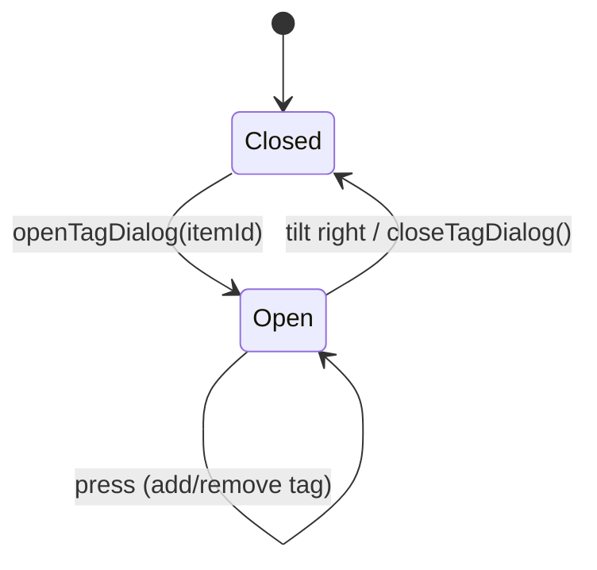

# Tag Dialog Flow



```mermaid
flowchart LR
    Import[importSelected()] --> Scan[scan tags]
    Scan --> Available[availableTags]
    Available --> Display[overlay lists + checkmarks]
```

- Tag overlay uses the existing display model without new UI elements.
