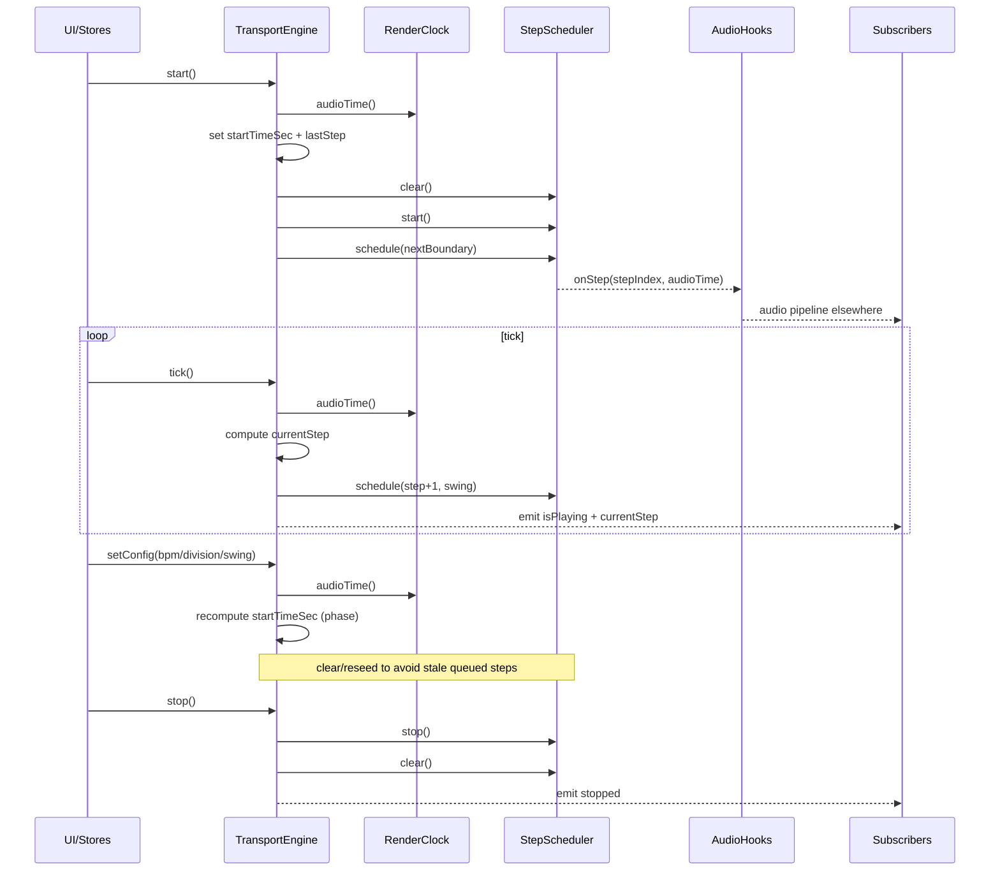

# Transport Engine Timing (English)

```mermaid
sequenceDiagram
    participant UI as UI/Stores
    participant Transport as TransportEngine
    participant Clock as RenderClock
    participant Scheduler as StepScheduler
    participant Hooks as AudioHooks
    participant Subs as Subscribers

    UI->>Transport: start()
    Transport->>Clock: audioTime()
    Transport->>Transport: set startTimeSec + lastStep
    Transport->>Scheduler: clear()
    Transport->>Scheduler: start()
    Transport->>Scheduler: schedule(nextBoundary)
    Scheduler-->>Hooks: onStep(stepIndex, audioTime)
    Hooks-->>Subs: audio pipeline elsewhere

    loop tick
        UI->>Transport: tick()
        Transport->>Clock: audioTime()
        Transport->>Transport: compute currentStep
        Transport->>Scheduler: schedule(step+1, swing)
        Transport-->>Subs: emit isPlaying + currentStep
    end

    UI->>Transport: setConfig(bpm/division/swing)
    Transport->>Clock: audioTime()
    Transport->>Transport: recompute startTimeSec (phase)
    Note over Transport,Scheduler: clear/reseed to avoid stale queued steps

    UI->>Transport: stop()
    Transport->>Scheduler: stop()
    Transport->>Scheduler: clear()
    Transport-->>Subs: emit stopped
```
