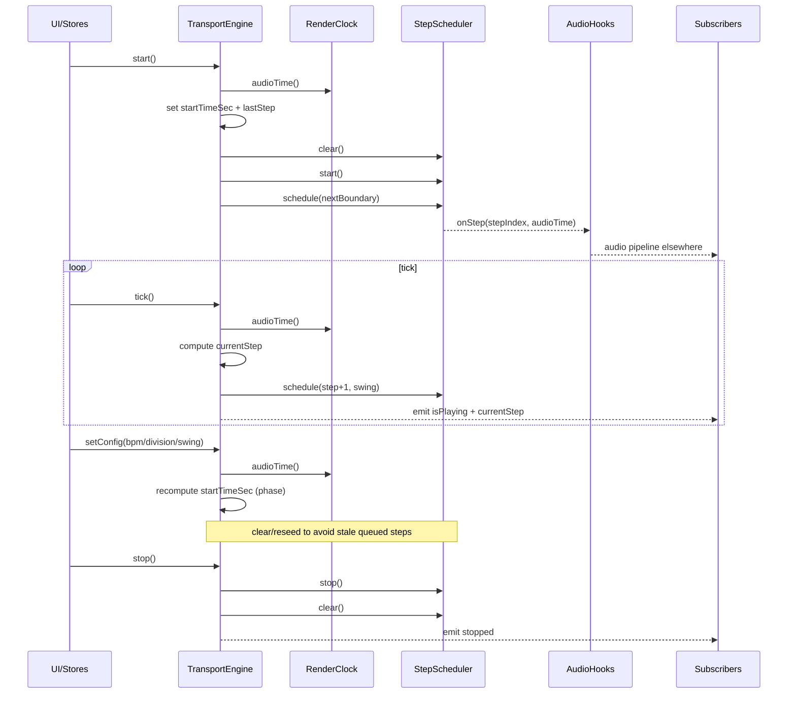
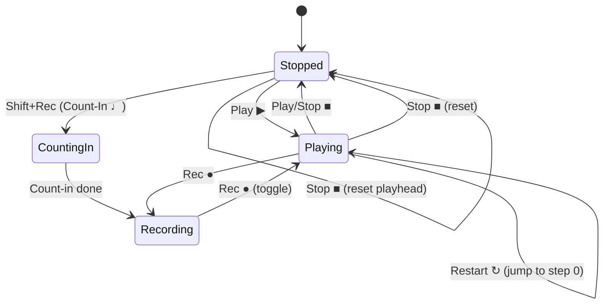

# Transport Engine Timing (English)

## MK3 transport mapping (placeholders + hover hints)

- Transport cluster placeholder should expose hover hints for primary + shift: Play ▶ (toggle), Stop ■ (press twice = reset), Rec ● (hold = Pattern Preset length), Restart ↻ (shift+stop), Tap ☼, Loop ⟳, Metronome ♬, Count-In ♩, Follow ⇥.
- Ensure the transport row stays within the left column and never forces a page scroll; stack controls into two compact rows with icons + labels so it fits under the dual displays.
