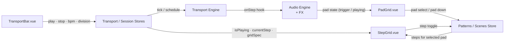

# UI Sequencer Flow

```mermaid
flowchart LR
    TransportBar["TransportBar.vue"]
    TransportStore["Transport / Session Stores"]
    StepGrid["StepGrid.vue"]
    PadGrid["PadGrid.vue"]
    SequencerStore["Patterns / Scenes Store"]
    TransportEngine["Transport Engine"]
    AudioEngine["Audio Engine<br/>+ FX"]

    TransportBar -->|"play · stop · bpm · division"| TransportStore
    TransportStore -->|"isPlaying · currentStep · gridSpec"| StepGrid

    PadGrid -->|"pad select / pad down"| SequencerStore
    SequencerStore -->|"steps for selected pad"| StepGrid
    StepGrid -->|"step toggle"| SequencerStore

    TransportStore -->|"tick / schedule"| TransportEngine
    TransportEngine -->|"onStep hook"| AudioEngine
    AudioEngine -->|"pad state (trigger / playing)"| PadGrid
```