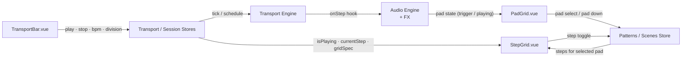
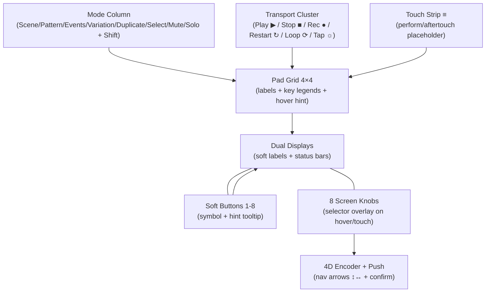

# UI Sequencer Flow

## MK3 surface + hover hints

- Fit everything inside a `100vh` stage: displays + buttons at top, pad square anchored bottom-right, transport + mode columns on the left, touch strip on the right. Only drawers scroll internally.
- Hover hints must show both the primary and shift-layer action (e.g., “MUTE (hold to momentary) / SHIFT: SOLO”), and selector overlays appear when hovering a screen knob to mimic MK3 lists.
