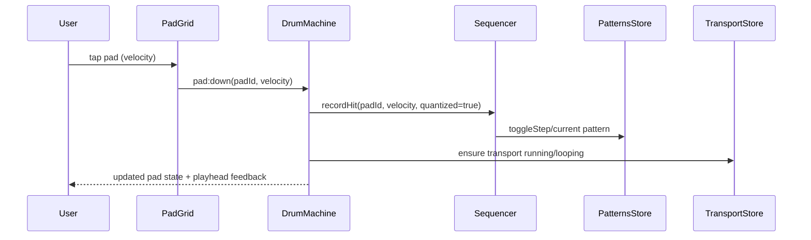
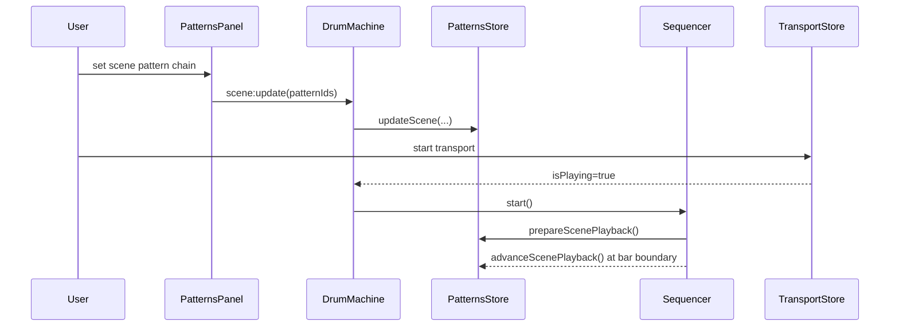
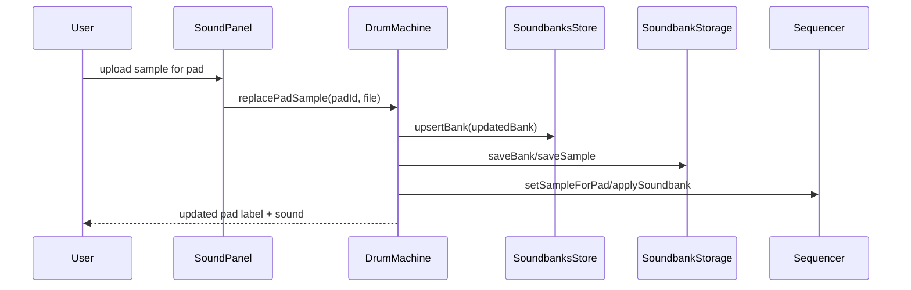
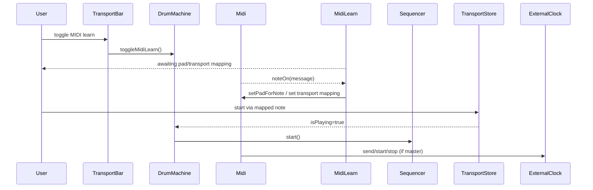
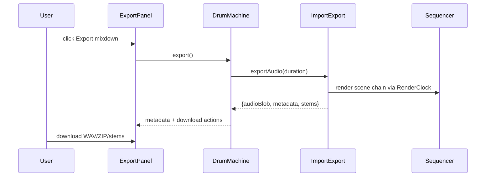
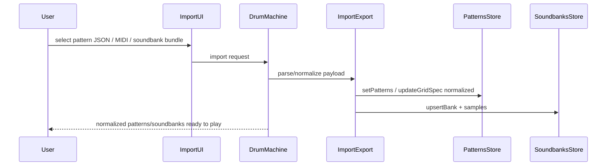
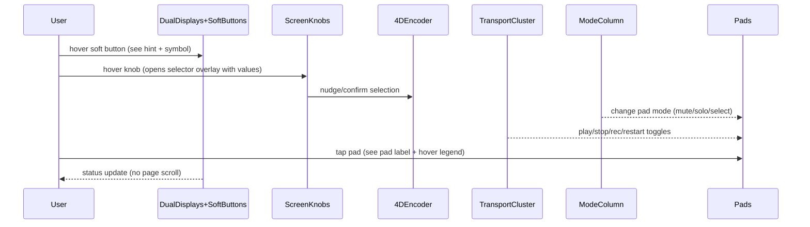

# Sequence Diagrams for the documented Use Cases

## Live pattern building

## Scene and pattern chaining

## Soundbank customization and persistence

## MIDI/hardware integration

## Export mixes and stems

## Import and normalization

## MK3 hardware-style navigation & hover hints

- Keep all interactions inside the hardware viewport; drawers and selector overlays scroll internally while the page remains locked.
- Hover hints should list both primary and shift-layer actions to mirror the MK3 printed labels.

## Browser diagrams

- 4D encoder wiring: `control-4d-encoder-browser.md`
- File system access: `browser-file-system-access.md`
- Import progress: `library-import-progress.md`
- Recent files: `recent-files.md`
- Favorites: `favorites-flow.md`
- Sample preview: `sample-preview.md`
- Sorting: `browser-sorting.md`
- Quick-browse: `quick-browse.md`
- Tag dialog: `tag-dialog.md`
- Hierarchy: `library-hierarchy.md`
- Performance: `browser-performance.md`
