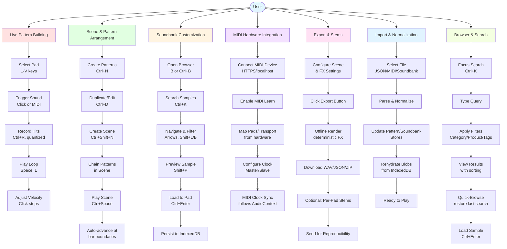

# User Workflows Overview

This diagram shows the main user workflows and how they interconnect in the drum machine application.



## Workflow Details

### 1. Live Pattern Building (Red)
**Purpose**: Create drum patterns in real-time with live input

**Key Steps**:
1. Select a pad using keyboard (1-V grid layout) or mouse
2. Trigger sounds by clicking pads or using MIDI controller
3. Enable recording mode (Ctrl+R) for quantized capture
4. Start transport with loop enabled (Space + L)
5. Adjust velocity by clicking steps (cycles: 0.7 → 1.0 → 1.25 → off)

**Data Flow**:
```
User Input → PadGrid → DrumMachine → Sequencer → PatternsStore
                                   → AudioEngine → WebAudio
```

**Key Components**:
- `PadGrid.vue`: 16-pad interface with velocity display
- `useSequencer.ts`: Quantization and step recording
- `useAudioEngine.ts`: Sound playback via WebAudio

**Persistence**: LocalStorage v2 (patterns) + IndexedDB (soundbanks)

---

### 2. Scene & Pattern Arrangement (Green)
**Purpose**: Build song structures with pattern chains

**Key Steps**:
1. Create multiple patterns (Ctrl+N)
2. Duplicate and edit patterns (Ctrl+D)
3. Create a new scene (Ctrl+Shift+N)
4. Add patterns to scene chain (drag/drop or UI)
5. Play scene (Ctrl+Space) with auto-advance at bar boundaries

**Data Flow**:
```
PatternsPanel → DrumMachine → PatternsStore → Sequencer
                                            → Transport → AudioContext
```

**Key Features**:
- **Bar-boundary switching**: Patterns change at musical boundaries
- **Grid normalization**: Division changes handled smoothly
- **Undo/redo**: 50-step history for pattern/scene edits

**Persistence**: LocalStorage v2 (scenes + selected scene ID)

---

### 3. Soundbank Customization (Yellow)
**Purpose**: Build custom drum kits with personal samples

**Key Steps**:
1. Select a pad (current pad highlighted)
2. Open browser (B or Ctrl+B)
3. Switch to FILES mode (Shift+B) or stay in LIBRARY mode (Shift+L)
4. Navigate folders, search samples, apply filters
5. Preview sample (Shift+P) to audition before loading
6. Load to selected pad (Ctrl+Enter)
7. Sample persists to IndexedDB with blob + metadata

**Data Flow**:
```
Browser → FileSystemRepository → LibraryRepository
       → SoundbanksStore → SoundbankStorage (IndexedDB)
       → AudioEngine (lazy decode)
```

**Key Features**:
- **Blob storage**: Samples stored as blobs in IndexedDB
- **Lazy decoding**: Audio buffers decoded on-demand
- **Manifest export**: Soundbanks export with sample files for portability
- **URL revocation**: Old blob URLs cleaned up on replacement

**Persistence**: IndexedDB v2 (soundbanks + samples stores)

---

### 4. MIDI Hardware Integration (Purple)
**Purpose**: Connect hardware controllers for pads and transport

**Key Steps**:
1. Connect MIDI device (requires HTTPS or localhost)
2. Enable MIDI learn mode (button in transport bar)
3. Trigger pads or transport controls from hardware
4. Mappings saved automatically (persists to LocalStorage)
5. Configure MIDI clock sync mode (master/slave)
6. MIDI clock output follows AudioContext timing

**Data Flow**:
```
MIDI Device → WebMIDI API → useMidi.ts → MidiLearn
           → DrumMachine → Transport/Sequencer
           → MIDI Clock Out (if master)
```

**Key Features**:
- **Device selection**: Choose from available MIDI inputs
- **Pad mapping**: Map MIDI notes to 16 pads
- **Transport mapping**: Map notes to play/stop/record
- **Clock sync**: Send/receive MIDI clock messages
- **Follow mode**: Slave to external MIDI clock (F shortcut)

**Constraints**:
- WebMIDI requires HTTPS/localhost and user permission
- Device list empty when unsupported or permission denied

**Persistence**: LocalStorage (MIDI mappings + device preferences)

---

### 5. Export & Stems (Pink)
**Purpose**: Bounce scenes to audio files with reproducible renders

**Key Steps**:
1. Configure scene chain and FX settings (filter/drive/reverb)
2. Open Export panel (in drawer)
3. Click "Export Audio" button
4. Offline render via OfflineAudioContext (deterministic)
5. Download mixdown WAV, metadata JSON, or ZIP bundle
6. Optional: Export per-pad stems for DAW mixing
7. Seed value in metadata enables reproducible renders

**Data Flow**:
```
Export Panel → useImportExport.ts → exportAudio()
            → RenderClock + scheduleStep (offline)
            → OfflineAudioContext → WAV blob
            → RenderMetadata (seed, BPM, grid, duration)
```

**Key Features**:
- **Deterministic FX**: Seeded RNG for convolution impulse response
- **FX snapshot**: Serializable settings for exact reproduction
- **Debug timeline**: JSON timeline in dev mode (process.dev)
- **Stem export**: Per-pad audio files (ZIP bundle)
- **Metadata**: Seed, BPM, grid spec, pattern chain, event count

**Reproducibility**:
- Supply exported seed to `exportAudio({ seed })` for identical render
- FX settings + seed guarantee bit-identical output

**Persistence**: Downloads to user's filesystem (no persistence)

---

### 6. Import & Normalization (Light Blue)
**Purpose**: Import patterns, MIDI, and soundbanks with validation

**Key Steps**:
1. Select file (pattern JSON, MIDI file, soundbank ZIP)
2. Parse and normalize payload (clamp velocities, validate grid)
3. Update PatternsStore with normalized data
4. Rehydrate sample blobs from IndexedDB (if soundbank)
5. Ready to play with normalized settings

**Data Flow**:
```
File Input → useImportExport.ts → importPattern/importMidi/importSoundbank
          → Normalization (clamp, validate)
          → PatternsStore / SoundbanksStore
          → IndexedDB (soundbanks)
```

**Key Features**:
- **Pattern JSON**: Round-trip with velocity, grid spec, soundbank refs
- **MIDI import**: @tonejs/midi with velocity mapping
- **Soundbank import**: Manifest + sample blobs (ZIP)
- **Normalization**: Handles malformed data (missing fields, invalid values)
- **Grid spec validation**: Ensures valid divisions (1/2/4/8/16/32/64)

**Error Handling**:
- Malformed JSON: Fallback to defaults
- Missing samples: Continue with available data (no missing sample dialog yet)
- Invalid velocities: Clamp to valid range (0.0-2.0)

**Persistence**: LocalStorage v2 (patterns) + IndexedDB (soundbanks)

---

### 7. Browser & Search (Light Green)
**Purpose**: Find and load samples from large libraries quickly

**Key Steps**:
1. Open browser (B)
2. Focus search field (Ctrl+K)
3. Type search query (text + filters)
4. Apply hierarchical filters (Category → Product → Bank → Sub-Bank)
5. Apply tag filters (Type, Character)
6. View sorted results (name/date/relevance)
7. Use Quick-Browse to restore last search per pad context
8. Load selected sample (Ctrl+Enter)

**Data Flow**:
```
Browser UI → BrowserStore → LibraryRepository → IndexedDB/Memory
          → Filter/Sort Pipeline → Display Models
          → 4D Encoder Navigation → Selection
          → importSelected() → SoundbanksStore
```

**Key Features**:
- **Dual mode**: LIBRARY (tagged samples) and FILES (filesystem)
- **Hierarchical filters**: Category/Product/Bank/Sub-Bank
- **Tag system**: Type and Character tags
- **Favorites**: Star favorites, filter by favorites
- **Recent files**: Track last 50 loaded samples
- **Quick-Browse**: Context-based search history (per pad/sound/plugin)
- **Sample preview**: Prehear samples before loading (Shift+P)
- **Sort modes**: Name (asc/desc), Date (asc/desc), Relevance
- **4D Encoder**: Navigate fields/values/results with encoder
- **Debounced search**: 300ms debounce for text queries
- **Windowing**: Max 100 items in display (performance)

**Browser Modes**:
- **LIBRARY**: Search tagged samples with hierarchical filters
- **FILES**: Browse filesystem with File System Access API (or memory fallback)

**Storage**:
- **Library Items**: IndexedDB (large libraries >50 items) or LocalStorage
- **Recent Files**: LocalStorage (max 50 entries)
- **Quick-Browse History**: LocalStorage (max 50 contexts)
- **Favorites**: Stored with library items

**4D Encoder States**:
- **field-select**: Tilt horizontal to choose field
- **value-adjust**: Turn to change field value
- **list-navigate**: Turn to navigate results, Press to load

**Related Diagrams**:
- `control-4d-encoder-browser.md`: Encoder integration
- `browser-file-system-access.md`: File access workflow
- `library-import-progress.md`: Import progress tracking
- `quick-browse.md`: Quick-browse restore flow
- `favorites-flow.md`: Favorites management
- `sample-preview.md`: Preview playback
- `browser-sorting.md`: Sort modes
- `tag-dialog.md`: Tag management

---

## Workflow Interconnections

### Pattern Building → Export
Create patterns live, then export to WAV with deterministic FX.

### Browser → Soundbank → Pattern Building
Find samples in browser, load to pads, build patterns with custom kit.

### MIDI Hardware → Pattern Building
Use hardware controller to trigger pads, record hits in real-time.

### Scene Arrangement → Export
Arrange multi-pattern scenes, export full arrangement with stems.

### Import → Pattern Building
Import MIDI/JSON patterns, edit and enhance, re-export.

### Quick-Browse → Browser
Restore last search context per pad for fast sample swapping.

---

## Persistence Strategy

| Data Type | Storage | Size Limit | Fallback |
|-----------|---------|------------|----------|
| Patterns | LocalStorage v2 | ~5MB | None (browser limit) |
| Scenes | LocalStorage v2 | ~5MB | None (browser limit) |
| Undo/Redo | LocalStorage v2 | 50 steps | None |
| Soundbanks Metadata | IndexedDB v2 | Unlimited | None |
| Sample Blobs | IndexedDB v2 | Quota-based | None |
| Library Items | IndexedDB (>50) / LocalStorage (<50) | Varies | Memory only |
| Recent Files | LocalStorage | 50 entries | None |
| Quick-Browse | LocalStorage | 50 contexts | None |
| MIDI Mappings | LocalStorage | ~1KB | Defaults |
| Browser Filters | Memory (session) | N/A | Reset on reload |

---

## Related Documentation

- **Shortcuts**: See `shortcuts-overview.md` for all keyboard shortcuts
- **Use Cases**: See `use-cases.md` for detailed sequence diagrams
- **Transport**: See `transport-engine.md` for timing and scheduling
- **Persistence**: See `persistence-and-audio.md` for storage architecture
- **Browser**: See browser-*.md files for detailed browser workflows
- **MIDI**: See `use-cases.md` (MIDI/hardware integration section)
- **FX Chain**: See `fx-chain.md` for deterministic FX rendering
